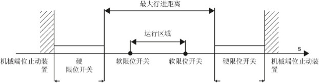
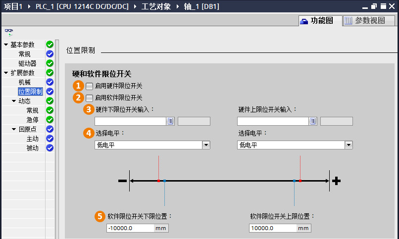
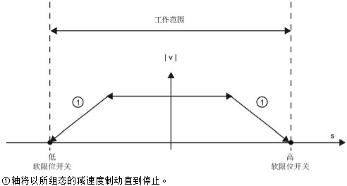

### [功能图\--扩展参数]{#_Toc428444732}\--位置限制

这部分的参数是用来设置软件/硬件限位开关的。\
软件/硬件限位开关是用来保证轴能够在工作台的有效范围内运行，当轴由于故障超过的限位开关，不管轴碰到了是软限位还是硬限位，轴都是停止运行并报错。\
限位开关一般是按照下图的关系进行设置的：

{width="622" height="162"}

软限位的范围小于硬件限位，硬件限位的位置要在工作台机械范围之内。

{width="806" height="483"}

**①启动硬件限位开关**：激活硬件限位功能。\
**②启动软件限位开关**：激活软件限位功能。\
**③硬件上/下限位开关输入**：设置硬件上/下限位开关输入点，可以是S7-1200
CPU本体上的DI点，如果有SB信号板，也可以是SB信号板上的DI点。\
**④选择电平**：设置设置硬件上/下限位开关输入点的有效电平，一般设置成底电平有效。\
**⑤软件上/下限位开关输入**：设置软件位置点，用距离、脉冲或是角度表示。

**『注意』**用户需要根据实际情况来设置该参数，不要盲目使能软件和硬件限位开关。这部分参数不是必须使能的。

下图说明了轴在运行过程中会根据用户设置的软件限位的位置来提前以减速度制动，保证轴停止在软件限位的位置。

{width="492" height="264"}
