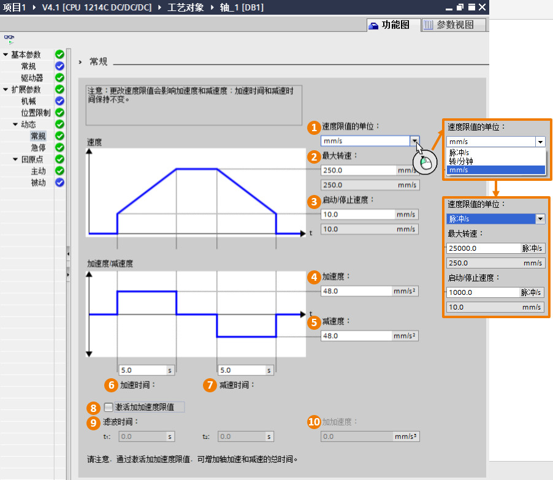
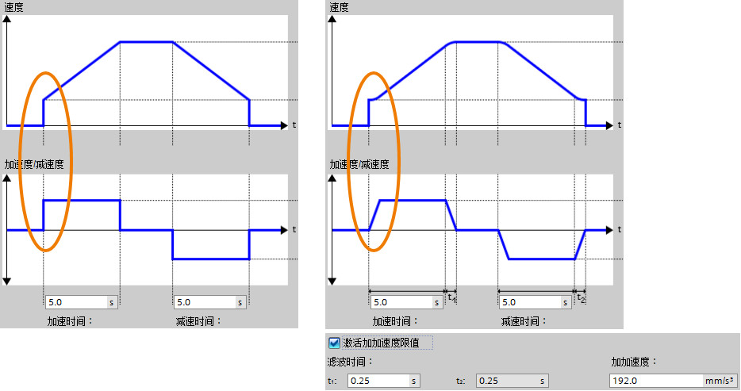
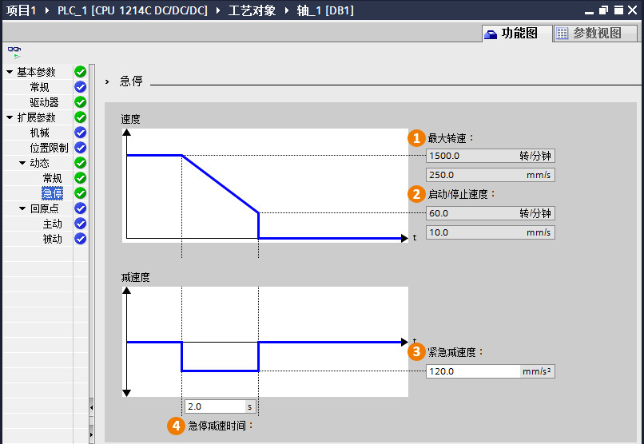
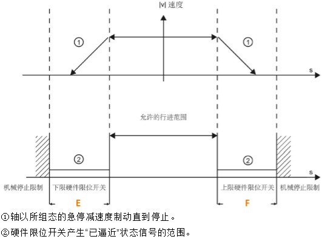

### [功能图\--扩展参数]{#_Toc428444733}\--动态

扩展参数-动态包括"常规"和"急停"两部分。

#### 常规

这部分参数也是轴参数中重要部分。

{width="902" height="783"}

**①速度限制的单位**：设置参数②"最大转速"和③"启动/停止速度"的显示单位。

> 无论"基本参数\--常规"中的"测量单位"组态了怎样的单位，在这里有两种显示单位是默认可以选择的，包括"脉冲/s"和"转/分钟"。
>
> 根据前面"测量单位"的不同，这里可以选择的选项也不用。比如：本例子中在"基本参数\--常规"中的"测量单位"组态了mm，这样除了包括"脉冲/s"和"转/分钟"之外又多了一个mm/s。

**②最大转速**：这也是一个重要参数，用来设定电机最大转速。最大转速由PTO输出最大频率和电机允许的最大速度共同限定。

> 以mm为例进行说明：\
> 在"扩展参数""机械"中，用户定义了参数"电机每转的脉冲数"以及"电机每转的负载位移"，则最大转速为：
>
> {width="587" height="48"}

**③启动/停止速度**：根据电机的启动/停止速度来设定该值。\
**④加速度**：根据电机和实际控制要求设置加速度。\
**⑤减速度**：根据电机和实际控制要求设置减速度。\
**⑥加速时间**：如果用户先设定了加速度，则加速时间由软件自动计算生成。用户也可以先设定加速时间，这样加速度由系统自己计算。\
**⑦减速时间**：如果用户先设定了减速度，则减速时间由软件自动计算生成。用户也可以先设定减速时间，这样减速度由系统自己计算。

> 下面说明了"加速度"，"减速度"，"加速时间"，和"减速时间"之间的数学关系：
>
> {width="267" height="122"}

**⑧激活加加速限值**：激活加加速限值，可以降低在加速和减速斜坡运行期间施加到机械上的应力。如果激活了加加速度限值，则不会突然停止轴加速和轴减速，而是根据设置的步进或平滑时间逐渐调整。

**⑨滤波时间**：如果用户先设定了加加速度，则滤波时间由软件自动计算生成。用户也可以先设定滤波时间，这样加加速度由系统自己计算。

> t1加速斜坡的平滑时间，\
> t2减速斜坡的平滑时间，t2值与t1相同。

**⑩加加速度**：

> 如下图所示，激活了加加速限值后，轴加减速曲线衔接处变平滑。
>
> {width="934" height="493"}
>
> 下图详细显示了在激活和不激活冲击限制的情况下轴的行为：
>
> {width="626" height="844"}

#### 急停

什么情况下会让轴使用"急停"速度/时间这个参数：

1.  轴出现错误时，采用急停速度停止轴。
2.  使用MC_Power指令禁用轴时（StopMode=0或是StopMode=2）。

{width="806" height="556"}

**①最大转速**：与"常规"中的"最大转速"一致。\
**②启动/停止速度**：与"常规"中的"启动/停止速度"一致。\
**③紧急减速度**：设置急停速度。\
**④紧急减速时间**：如果用户先设定了紧急减速度，则紧急减速时间由软件自动计算生成。用户也可以先设定紧急减速时间，这紧急减速度由系统自己计算。

> 下面的公式列出了"急停减速时间"和"急停减速度"之间的关系：
>
> {width="299" height="46"}
>
> 根据实际应用中左右限位开关距离物理停止点的距离（如下图的E和F），以及电机可以达到的最大速度计算出来合适的急停速度，保证电机能够在撞到物理停止点前停止
> 。
>
> {width="531" height="395"}
>
> 硬件限位开关的有效距离除以最大速度和启动速度的差值，就可以得到急停减速时间。
>
> {width="420" height="124"}
