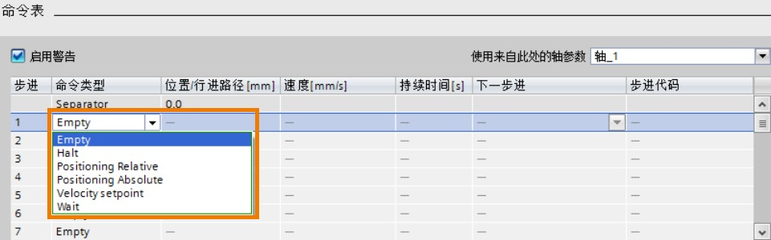

### [S7-1200 PTO控制方式\--工艺对象：]{#_Toc428444757}TO_CommandTable

命令表功能为用户提供了另外一种轴控制的解决方案。
用户不需要组态TO_PositioningAxis对象，而直接使用命令表。

:::{attention}
目前为止，只有S7-1200 PTO 控制方式可以使用命令表功能，PROFIdrive和模拟量控制方式都不支持命令表功能。
:::

最多可以添加**32**条命令条目。

"工艺对象：命令表"和"工艺对象：轴"是同等级别的工艺对象，也就是说，客户可以只插入"工艺对象：命令表"，也可以只插入"工艺对象：轴"，或是同时插入两个工艺对象。

### []{#_Toc6}命令表适用情况

轴有一个或多个固定运行路径的应用情况下可以使用命令表。使用组态命令表，让轴按照设定好的曲线路径运行。

### []{#_Toc4}组态命令表

插入工艺对象TO_CommandTable的过程，如下图所示：

{width="688" height="598"}

插入命令表成功后，可以看到下图的命令表参数配置视图。命令表参数包括：基本参数和扩展参数。
如下图所示，命令表的结构。

{width="734" height="648"}

"基本参数"包括"常规"和"命令表"两部分。"常规"就是命令表的名称，"命令表"是重点配置部分，用来配置命令曲线的。\
"扩展参数"包括"扩展参数"，"动态"和"限制"三部分。如果在"命令表"中选择已组态的轴，如下图所示，则"扩展参数"中的参数都是不能更改的。

{width="974" height="279"}

如下图所示，相关的轴参数都不能进行修改。

{width="790" height="820"}

用户可以在"命令表"页面选择"样轴"，则"扩展参数"中的参数都是可组态的。\
用户可以配置完"样轴"的参数后，把样轴的参数复制到之前配置的轴对象（比例本例子中的轴_1，轴_2，轴_3，或轴_4中的一个，几个或全部）。\
用户也可以把轴_1，轴_2，轴_3，或轴_4中任意一个轴的配置参数复制到"样轴"。

{width="781" height="819"}

选择好轴参数后，用户开始配置需要的命令（也可以叫做曲线）。Portal软件提供了几种命令，如下图所示：

**①Empty**：为要添加的命令进行占位，也就是占位条目。
程序在处理命令表时会忽略空条目。\
**②Halt**：停止轴，只有在执行"Velocity setpoint"命令之后该命令才生效。\
**③Positioning Relative**：轴的相对运动命令\
**④Positioning Absolute：**轴的绝对运动命令 \
**⑤Velocity setpoint**：轴的速度运行命令\
**⑥Wait**：等待条目，作用是让轴等待一段时间。Wait
不会停止激活的行进运动。\
**⑦Separator**：曲线分割命令，不会作用于轴，仅仅用来分割趋势曲线。

{width="961" height="300"}

命令表的使用，可以鼠标右键命令表中的某个步，以进行插入空行Empty或是分隔符线Seperator命令，如下图中的①和②。用户也可以对命令表中的步进条目进行剪切、复制、粘贴，以及删除等操作。

{width="962" height="692"}

对于命令曲线图，用户也可以鼠标右键曲线图来选择趋势曲线的标尺或限制值等选项。\
以"显示测量标尺"为例说明趋势图的功能。如下图所示，可以给趋势曲线添加速度、位置和时间的标尺。

{width="792" height="896"}

还可以用鼠标选中局部趋势曲线来放大查看之。如下图所示。

{width="794" height="598"}
