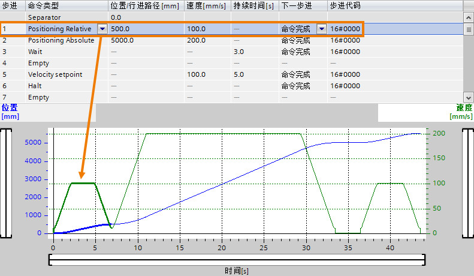
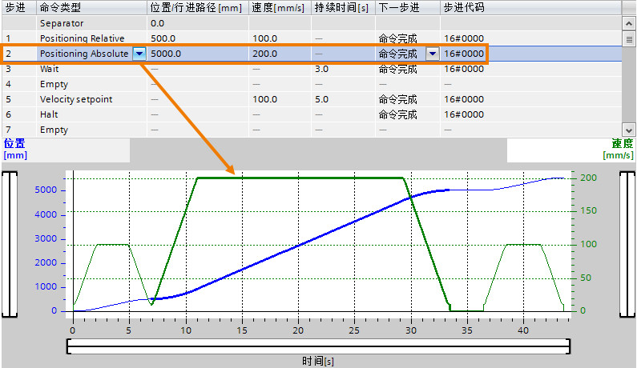
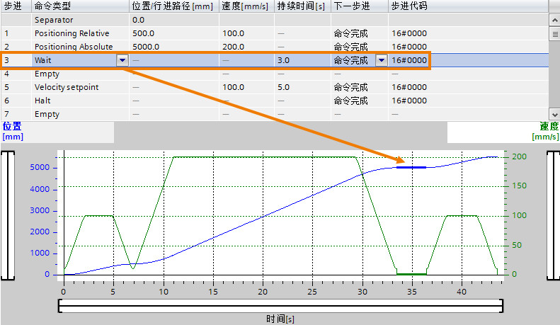
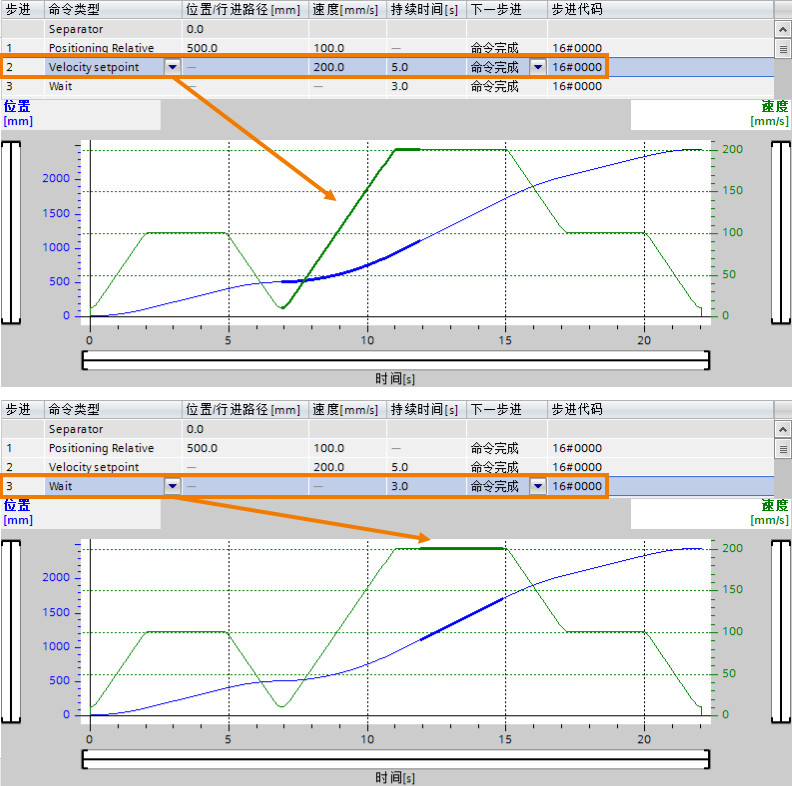
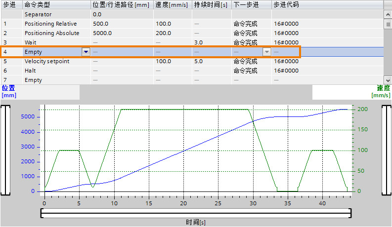
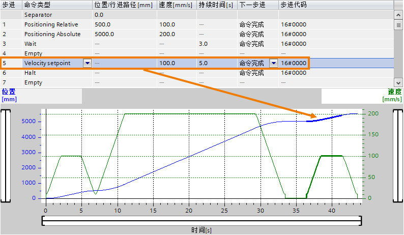
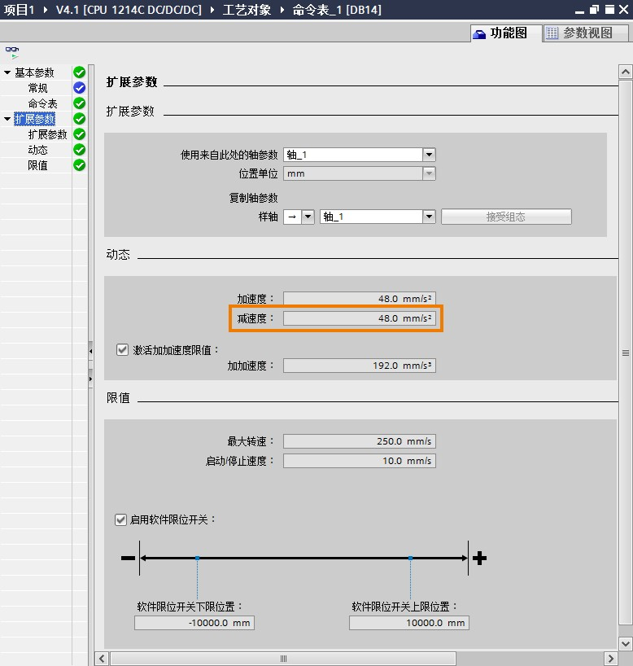
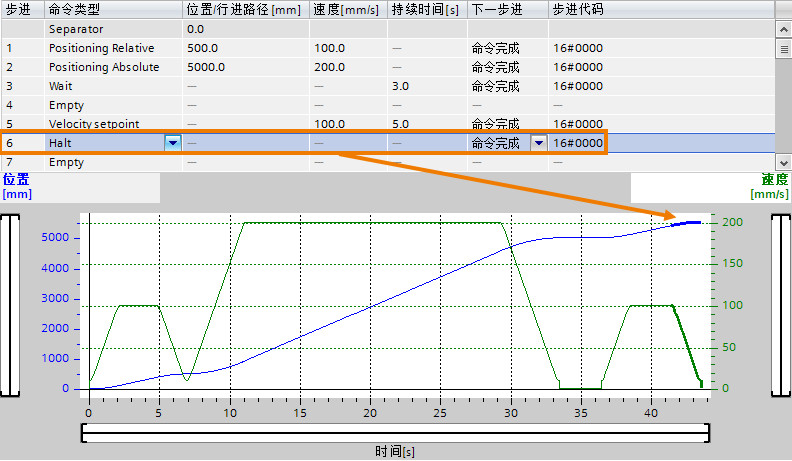
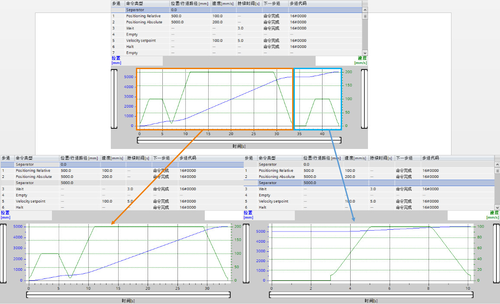

### []{#_Toc3}命令表中的命令介绍

以下图的曲线为例，对各个命令进行详细说明：\
**步进1：命令类型：Positioning Relative：相对运动命令**

> 对于Positioning
> Relative命令，用户需要设定的是相对运动的"行进路径"值和运行"速度"值，在本例子中，相对运动的"行进路径"为500.0mm，"速度"为100.0mm/s，如下图所示，加粗部分对应的是该指令的趋势曲线。绿色表示的是命令的速度，该值从0开始加速达到设定值100.0
> mm/s，匀速运行一段时间后开始减速到轴的停止速度，这时轴的位置为500.0mm，该位置值是由轴的起始位置加上相对运动的"行进路径"值得到的0.0 +
> 500.0 = 500.0 mm。
>
> {width="791" height="460"}

**步进2：命令类型：Positioning Absolute：绝对运动命令**

> 对于Positioning
> Absolute命令，用户需要设定的是绝对运动的目标"位置"值和运行"速度"值，在本例子中，绝对运动的目标"位置""为5000.0mm，"速度"为200.0mm/s。如下图所示，加粗部分对应的是该指令的趋势曲线。绿色表示的是命令的速度，该值从起始速度开始加速达到设定值200.0
> mm/s，匀速运行一段时间后开始减速到轴的停止速度，这时轴的位置为5000.0mm.
>
> {width="795" height="460"}
>
:::{attention}
命令表中没有回原点指令，用户想使用绝对位置命令之前，需要回原点。应此在这种情况下，用户需要借助MC_Home指令来得到回原点完成信号后再使用命令表的绝对定位命令。
:::
**步进3：命令类型：Wait：轴等待指令**

> 对于Wait命令，用户需要设置"持续时间"值。该指令的作用是增加一段时间延时，在这段时间内轴的状态取决于上一个命令。\
> 在该例子中，Wait命令前是绝对定位，轴在进行完绝对定位时是停止的，因此步进3命令的结果是轴停止3.0s的时间，虽然趋势曲线中的速度值不变仍旧为200.0mm/s。
>
> {width="791" height="459"}
>
> 下图是Wait命令添加在Velocity setpoint指令之后的情况：
>
> {width="792" height="786"}
>
> Wait命令会保持Velocity setpoint的速度值让轴继续运行3.0s的时间。

**步进4：命令类型：Empty：该条目用作是添加命令占位符。
处**理命令表时会忽略空条目。

> 如下图所示，Empty命令没有对轴有任何操作。
>
> {width="793" height="460"}

**步进5：命令类型：Velocity
setpoint：轴的速度运行命令，让轴以一定的速度运行。**

> 对于Velocity
> setpoint命令，用户需要设定的是运行"速度"值和"持续时间"，在本例子中，速度运行命令的"速度"值为100.0mm/s，"持续时间"为3.0s。如下图所示，加粗部分对应的是该指令的趋势曲线。
>
> {width="794" height="462"}

**步进6：命令类型：Halt：轴的停止命令。**

> 对于Velocity
> setpoint命令，用户不需要设定参数。轴会按照下图的减速度来减速停止轴。
>
> {width="778" height="818"}
>
> 减速曲线如下图所示：
>
> {width="792" height="461"}

**步进7：命令类型：Separator：趋势曲线显示分割命令。**

> 将 Separator 添加到所选行的上方。 Separator
> 用作趋势图图形显示范围的分割，不对轴做任何操作。如下图所示，原有的趋势图分成了两个部分。
>
> {width="1155" height="704"}
