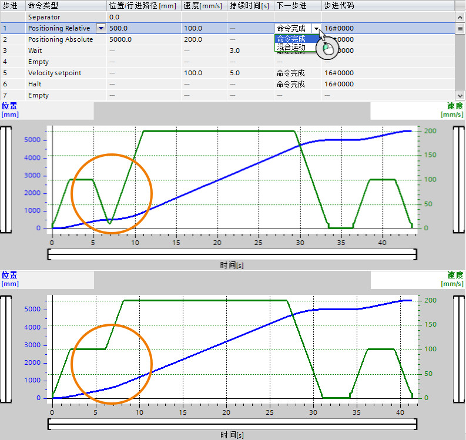
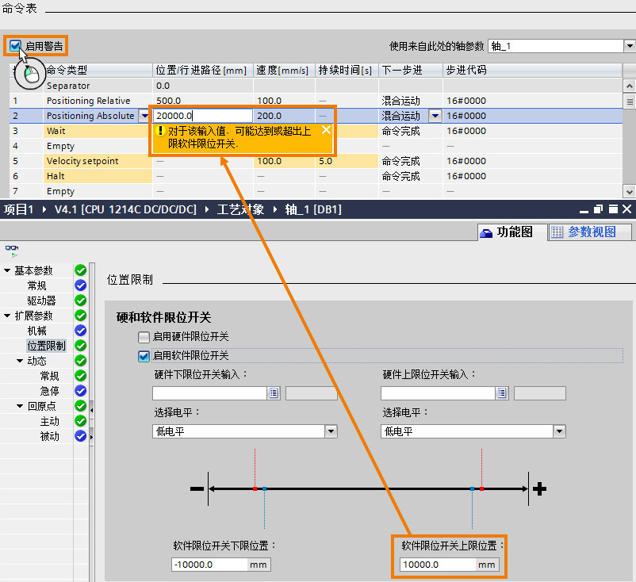

### []{#_Toc}命令表其他属性

1\. "命令完成"和"混合运动"

> 在命令表中，可以为步进条目设置前后命令之间的衔接模式，分成"命令完成"和"混合运动"。

-   "命令完成"：两个指令之间衔接时，会出现轴停止的现象。

-   "混合运动"：两个命令之间衔接时，软件会结合前后指令的速度进行计算，使得到新的曲线路径，使轴的速度变化平滑过渡，轴不会停止。\

    前后两种模式的效果如下图所示：

> {width="793" height="749"}

2\. "启用警告"

> 命令表中还有"启用警告"的一个选项，该选项的功能是对命令表中步进条目的参数值进行检验。如下图所示，在"轴_1"的参数中使能了软限位，限位值为10000.0mm，当用户在命令表中的命令条目中设置位置为20000.0mm时，软件报警提示用户不能输入这样的位置值，原因是该位置值超过了轴的限位位置。
>
> {width="802" height="734"}
