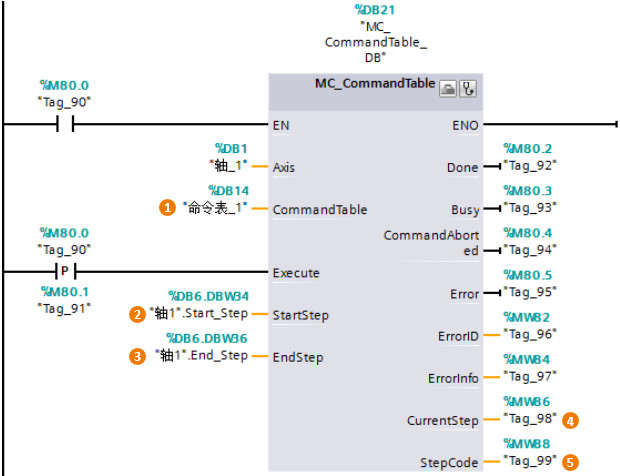
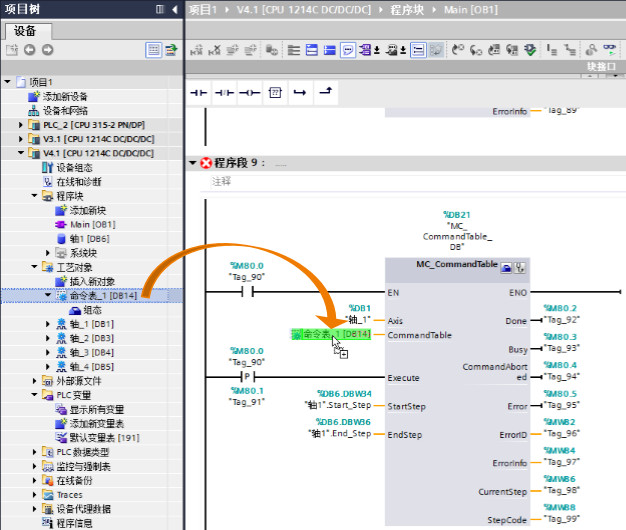

### []{#_Toc5}命令表指令\--MC_CommandTable

**指令名称**：命令表指令

**功能**：根据用户定义的命令表，使轴顺序指令命令表中的命令。

**使用技巧**：使用该指令的前提是用户已经组态了命令表工艺对象TO_CommandTable。

:::{attention}
部分输入/输出管脚没有具体介绍，请用户参考MC_Power指令中的说明。
:::
{width="620" height="476"}

**①CommandTable**：命令表工艺对象。

> 为"CommandTable"管脚插入命令表对象，如下图所示，可以采用鼠标拖拽的方式。
>
> {width="626" height="530"}

**②StartStep**：输入起始步号码数值，该值表示用户选择命令表中的某个步作为起始步。

**③EndStep**：输入终止步号码数值，该值表示用户选择命令表中的某个步作为停止步。

:::{attention}
起始步号和停止步号不能超过TO_CommandTable中组态的命令条目数。
:::
>
> 1 ≤ StartStep ≤ EndStep\
> StartStep ≤ EndStep ≤ 32
