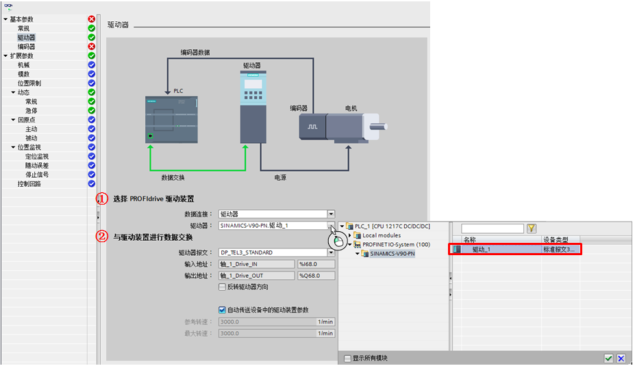
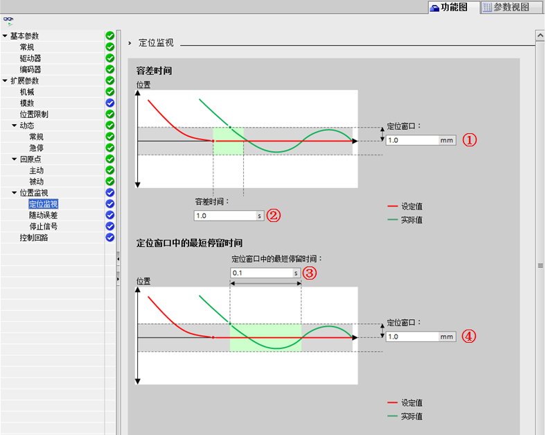

#### 闭环运动控制参数介绍 {#闭环运动控制参数介绍 .STYLE3}

S7-1200 支持通过 PROFIdrive
或者模拟量输出（AQ）方式控制伺服驱动器实现闭环控制。与开环运动控制相比以下新元素将添加到组态导航中：编码器、模数、位置监控（定位监控、跟随误差和静止信号）、控制回路等。

下面介绍闭环控制新增的组态选项。

其余部分可参考开环组态，[链接](../03-Basic_Config.html#a)。

#### 基本参数-常规 {#基本参数-常规 .STYLE3}

{width="991" height="590"}

图 1 基本参数

①"驱动器"

"模拟驱动装置接口"：通过模拟量输出连接驱动装置；例如通过 CPU 本体 AQ
通道控制驱动器。

"PROFIdrive"：通过 PROFINET/PROFIBUS
连接驱动装置。控制器和驱动器之间通过 PROFIdrive 报文进行通信。例如，通过
PROFINET 连接 V90，或者通过 PROFINET 连接 ET200SP 接口模块，使用该站点的
PTO 2 模块发脉冲控制驱动器。

图 1 中示例选择 "PROFIdrive" 连接驱动装置。

②"仿真"：在下拉列表中，选择是否仿真驱动器和编码器。模拟量驱动接口或
PROFIdrive
驱动装置均可仿真。在仿真模式下，不需要对驱动装置和编码器进行硬件配置。在仿真模式下，设定值不会输出到驱动器，也不从驱动器/编码器读取实际值。硬件限位开关和原点开关不产生任何影响。

注意：该仿真模式是用在装载到真实 CPU 的，而并非装载到 PLCSIM 的，PLCSIM
不支持仿真 S7-1200 运动控制。

#### 基本参数-驱动器 {#基本参数-驱动器 .STYLE3}

{width="927" height="535"}

图 2 驱动器

①选择 PROFIdrive 驱动装置：

"数据连接"：在下拉列表中，选择连接接口为"驱动器"；

"驱动器"：在"驱动器"域中，选择一个已经组态的 PROFIdrive 驱动器。

注意：
如果为"数据连接"选择了"数据块"，"驱动器"选项将变为"数据块"，选择一个之前创建的数据块，数据块包含数据类型为"PD_TELx"的变量结构（"x"为所用的报文编号）。具体可参考[链接](../08-FAQ/01-FAQ.html#_Toc6)。

②"与驱动装置进行数据交换"
"驱动器报文"：在下拉列表中，选择该驱动器的报文，必须与驱动器的设备组态相一致。图
2 中示例选择标准报文 3；

"输入/输出地址"：显示报文的符号名称及输入/输出地址；

"反转驱动器方向"：如果要反向驱动器的旋转方向，则可选择该复选框；

"自动传送设备中的驱动装置参数"：如果要将驱动器参数"参考速度"和"最大速度"以数值形式从驱动器组态自动传送到
CPU 中，可选择该复选框。工艺对象进行初始化并启动驱动器和 CPU
后，将通过总线传送驱动器参数。图 2
中示例选择"自动传送设备中的驱动装置参数"，也可以选择手动同步以下参数：

"参考速度"：组态参考速度，与驱动器组态中的值相匹配。

"最大速度"：在该域中，将组态驱动装置的最大速度。从驱动装置的组态中获取最大速度。通过总线可传送的参考速度范围为
-200% 到 +200% ，最大速度最多为参考速度的两倍。

#### 基本参数-编码器 {#基本参数-编码器 .STYLE3}

{width="710" height="691"}

图 3 编码器

①"编码器连接"

"PROFINET/PROFIBUS上的编码器"：选择 PROFINET 上的 PROFIdrive 编码器；

"高速计数器(HSC)上的编码器"：选择 S7-1200
本体上的高速计数器，编码器的实际值将传输至高速计数器。检查高速计数器数字量输入的滤波时间。滤波时间应足够短，以确保可靠记录脉冲；

②"编码器选择"

"数据连接"：选择"编码器"；

"PROFIdrive 编码器"：选择一个事先组态的 PROFIdrive 编码器。图中示例选择
V90 PN 驱动器上的编码器；

注意： 如果为"数据连接"选择了"数据块"，"PROFIdrive
编码器"选项将变为"数据块"，选择一个之前用户创建的数据块，数据块包含数据类型为"PD_TELx"的变量结构（"x"为所用的报文编号）。具体可参考[链接](../08-FAQ.html#_Toc13)。

③"与编码器之间的数据交换"

"编码器报文"：在下拉列表中，选择编码器的报文。其技术数据必须与设备组态相一致。图
3 中示例选择标准报文3；

"输入/输出地址"：显示报文的符号名称及绝对输入/输出地址；

"反转编码器方向"：要反转编码器的实际值，选中此复选框；

"自动传送设备中的编码器参数"：如果要从编码器组态传输编码器参数到 CPU
，则选中该复选框。初始化工艺对象、启动 CPU
后，将从总线传送编码器参数。编码器的类型必须与轴组态以及驱动器组态中的类型相同。

④"编码器类型"：在"编码器类型"对话框中选择使用的编码器类型。可选择以下编码器类型：线性增量、线性绝对值、旋转增量、旋转绝对值。图
3
中示例选择"旋转增量"。如果未选中"自动传送设备中的编码器参数"复选框，需根据所选编码器类型，手动组态参数，组态参考表
1 。

表 1 编码器类型与说明

  ----------------------- ------------------------------- -----------------------------------------------
  [编码器类型]{.STYLE3}   [参数]{.STYLE3}                 [说明]{.STYLE3}

  [线性增量]{.STYLE3}     [两个增量之间的距离]{.STYLE3}   [组态编码器两步之间的距离]{.STYLE3}

                          [高精度-增量实际值中的位        [组态增量实际值高精度的位数]{.STYLE3}
                          (GN_XIST1) ]{.STYLE3}           

  [\                      [两个增量之间的距离]{.STYLE3}   [组态编码器两步之间的距离]{.STYLE3}
  线性绝对值]{.STYLE3}                                    

                          [高精度-增量实际值中的位        [组态增量实际值高精度的位数]{.STYLE3}
                          (GN_XIST1) ]{.STYLE3}           

                          [高精度-递增实际值中的位        [组态高精度绝对值倍增系数的预留位数]{.STYLE3}
                          (Gn_XIST2) ]{.STYLE3}           

  [旋转增量]{.STYLE3}     [每转步数]{.STYLE3}             [组态编码器每一转可以解析出的步数]{.STYLE3}

                          [高精度-增量实际值中的位        [组态增量实际值高精度的位数]{.STYLE3}
                          (GN_XIST1) ]{.STYLE3}           

  [旋转绝对值]{.STYLE3}   [每转步数]{.STYLE3}             [组态编码器每一转可以解析出的步数]{.STYLE3}

                          [转数]{.STYLE3}                 [组态绝对值编码器可以检测出的转数]{.STYLE3}

                          [高精度-增量实际值中的位        [组态增量实际值高精度的位数]{.STYLE3}
                          (GN_XIST1) ]{.STYLE3}           

                          [高精度-递增实际值中的位        [组态高精度绝对值倍增系数的预留位数]{.STYLE3}
                          (Gn_XIST2)]{.STYLE3}            
  ----------------------- ------------------------------- -----------------------------------------------

注意：

1\.
如果使用编码器为绝对值编码器，并且组态为绝对值编码器，则无法使用主动回原点和被动回原点功能。

2\.
如果使用编码器为[绝对值编码器]{.STYLE3}，但是组态为增量编码器，此时可以使用[主动回原点和被动回原点，但是无法使用
MC_HOME 指令的模式 6 和模式
7，也就是无法实现位置值的断电保持。]{.STYLE3}

#### 扩展参数-机械 {#扩展参数-机械 .STYLE3}

{width="804" height="467"}

图 4 机械参数

①"编码器安装类型"：在下拉列表中，选择如何将编码器安装在机械机构上。支持下列编码器安装类型：在电机轴上；外部测量系统。图
4 中示例选择"在电机轴上"；

②"位置参数"：参考表 2，根据所选编码器安装类型，组态以下位置参数。

表 2 编码器位置参数

+-----------------------+-----------------------+-----------------------+
| ::: {align="center"}  | [位置参数]{.STYLE3}   | [说明]{.STYLE3}       |
| [编码                 |                       |                       |
| 器安装类型]{.STYLE3}  |                       |                       |
| :::                   |                       |                       |
+-----------------------+-----------------------+-----------------------+
| [在电机轴上\          | [电机每转             | [组态电机每转         |
| ]{.STYLE3}            | 的负载位移]{.STYLE3}  | 的负载距离]{.STYLE3}  |
+-----------------------+-----------------------+-----------------------+
| [外                   | [电机每转的负载位移   | [组态电机每转         |
| 部测量系统]{.STYLE3}  | ]{.STYLE3}            | 的负载距离]{.STYLE3}  |
+-----------------------+-----------------------+-----------------------+
|                       | [编码器               | [组态编码器每旋       |
|                       | 每转的距离]{.STYLE3}  | 转一圈外部测量系统所  |
|                       |                       | 记录的距离]{.STYLE3}  |
+-----------------------+-----------------------+-----------------------+

#### 扩展参数-模数 {#扩展参数-模数 .STYLE3}

{width="803" height="381"}

图 5 模数

①"启用模数"：激活"模数"设置时，会将工艺对象的位置值映射到由"模数起始值"和"模数长度"定义的递归数值区间内；

②"模数长度"：定义模数范围的长度；

③"模数起始值"：定义模数运算范围的起始位置；

例如，为将旋转轴的位置值限制为一整圈，将"模数起始值"定义为
0°、"模数长度"定义为 360°。这时，位置值将映射到 0° 到 359.999°
模数范围内，如果轴目标位置为 400°，则到达的实际位置为 40°。图 5
中示例中，不启用模数，此时如果轴只沿一个方向移动，则位置值将持续增大。

#### 回原点-主动 {#回原点-主动 .STYLE3}

与开环运动控制相比，增加了"选择归位模式"设置。

{width="653" height="641"}

图 6 主动回原点

可选择的归位模式如下：

①"通过PROFIdrive报文和接近开关使用零位标记"：主动回原点开始后，在指定的回原点方向上轴加速到组态的"逼近速度"并以该速度搜索原点开关。检测到原点开关后，轴以组态的"参考速度"逼近零位标记。到达零位标记后，轴将以"逼近速度"移动到"起始位置偏移量"位置，将当前的轴位置设置为起始位置。起始位置由运动控制指令"MC_Home"的
Position 参数指定；

②
"通过PROFIdrive报文使用零位标记"：在指定的回原点方向上以组态的"参考速度"到达零位标记后，轴将以"逼近速度"移动到"起始位置偏移量"位置，将当前的轴位置设置为起始位置。起始位置由运动控制指令"MC_Home"的
Position 参数指定；

③"通过数字量输入使用原点开关"：在指定的回原点方向上轴加速到组态的"逼近速度"并以该速度搜索原点开关。检测到原点开关后，轴以组态的"参考速度"逼近组态的参考点开关侧。到达组态的参考点开关侧后，轴以"逼近速度"移动到起始位置偏移量指定的位置，并将当前的轴位置设置为起始位置。起始位置由运动控制指令"MC_Home"的
Position 参数中指定。其他参数设置参考开环运动控制设置。

注意：对于闭环控制，原点开关数字量输入可以使用本体及信号板以外的 DI 点。

#### 位置监视-定位监视 {#位置监视-定位监视 .STYLE3}

用于在设定值计算结束时对实际位置的状态进行监控。当实际位置在容差时间内到达定位窗口，且在最短停留时间内停留在该窗口，则置位状态位
\<轴名称\>.StatusBits.Done，这样就完成了一个运动命令。

{width="788" height="627"}

图 7 定位监视

①、④"定位窗口"：组态定位窗口的大小；

②"容差时间"：组态容差时间。一旦速度设定值达到零值，则实际位置值必须在"容差时间"范围内到达"定位窗口"；

③"在定位窗口中的最短停留时间"：组态最短停留时间。实际位置值在"定位窗口"范围内的持续时间必须大于"在定位窗口中的最短停留时间"。

#### 位置监视-随动误差 {#位置监视-随动误差 .STYLE3}

组态轴的实际位置与位置设定值之间的容许偏差。

{width="930" height="609"}

图 8 随动误差

①"启用随动误差监控"：勾选此选项时，轴在错误范围内停止；

②"最大随动误差"：组态最大速度时容许的随动误差；

③"随动误差"： 小于"启动动态调整"速度时的容许随动误差（无动态调整）；

④"启动动态调整"：超过该组态速度时，将会动态调整随动误差。

随动误差是轴的位置设定值与实际位置值之间的差值。计算随动误差时，会将设定值到驱动器的传输时间、实际位置值到控制器的传输时间计算在内。允许随动误差取决于速度设定值。当速度设定值小于"启动动态调整"时，随动误差的容许范围为常数；而当速度设定值高于"启动动态调整"时，随动误差则随速度设定值按比例增长。当设定位置值与实际位置值之间超出允许随动误差容许偏差范围时，轴将停止运行。在运动轴调试初期，可以将"随动误差"设置为较大值以避免运动轴频繁出现随动误差错误。

#### 位置监视-停止信号 {#位置监视-停止信号 .STYLE3}

组态停止检测标准。

{width="932" height="490"}

图 9 停止信号

①"停止窗口"：组态停止窗口的大小；

②"停止窗口停留的最短时间"：组态停止窗口中的最短停留时间。轴的实际速度必须在"停止窗口"内保持"停止窗口停留的最短时间"，轴显示停止。

#### 控制回路 {#控制回路 .STYLE3}

用于组态位置控制回路的"预控制"和"增益"。

{width="928" height="478"}

图 10 控制回路

①"预控制"：修改控制回路的速度预控制百分比；

②"增益"：组态控制回路的增益系数。

"预控制"可提高系统的动态响应特性，但过大的设置值会使位置控制系统超调。

轴的机械硬度越高，设置的"增益"就越大；较大的"增益"可以减少随动误差，实现更快的动态响应，但过大的"增益"将会使位置控制系统振荡。
