# V90 运动控制

## S7-1200 通过工艺对象控制 V90PN 运动控制

S7-1200 通过工艺对象控制 V90PN 运动控制，架构如图 1 所示。

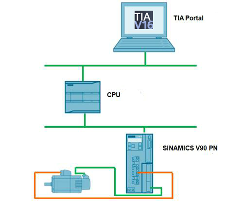

图 1\. 自动化任务概述

所需的硬件和软件：

硬件：

* CPU1215C，订货号 6ES7 215-1AG40-0XB0，版本 V4.4
* SINAMICS V90PN 200V，订货号 6SL3210-5FB10-1UF0
* SIMOTICS S-1FL6 motor，订货号 1FL6024-2AF21-1AA1

软件：

* TIA Portal V16
* SINAMICS V-ASSISTANT V1.06

## 1\. V-ASSISTANT端 V90PN 参数配置

## 1.1 配置报文

选择报文列表如图 2 所示。本例中选择标准报文 3。

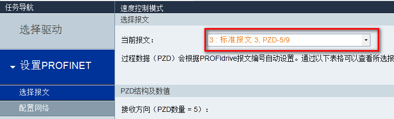 

图 2\. 选择报文

## 1.2 IP 地址和设备名称（可选）

IP 地址和设备名称配置，如图 3 所示。

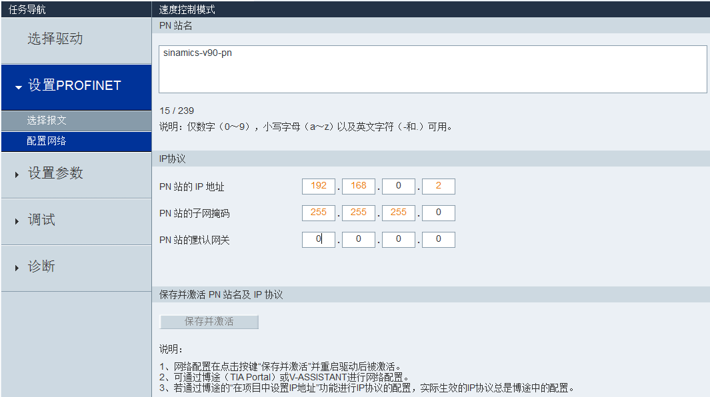

图 3\. 配置 IP 地址和设备名称

1.配置设备名称：在本例中，设备名称为 sinamics-v90-pn。

2.配置 IP 地址：在本例中，IP 地址为192.168.0.2。

3.在配置完设备名称以及 IP 地址之后，必须保存参数并重启驱动来激活配置。

4.配置完的信息可以在右侧栏中查看。

注：配备名称和 IP 地址也可以在 TIA Portal 中进行配置。

## 1.3 配置斜坡函数发生器

斜坡函数发生器配置，如图 4 所示。

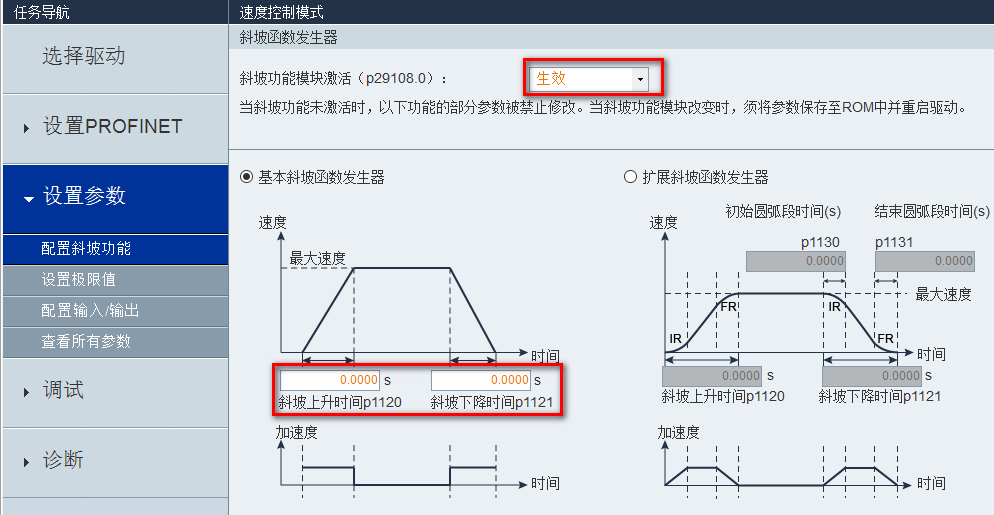

图 4\. 配置斜坡函数发生器

注：由于 S7-1200 轴工艺对象中已经组态了轴运行的加减速时间，所以在 V-ASSISTANT 侧需要激活斜坡功能模块并将斜坡上升时间和斜坡下降时间设置为 0.0000s 即可。

## 2\. 项目配置

## 2.1 新建项目并添加 S7-1200 CPU

1\. 打开 TIA Portal 软件并创建新项目，如图 5 所示。

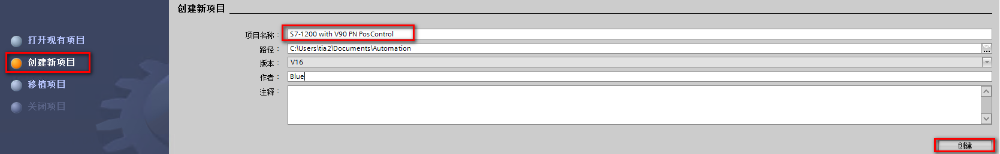

图 5\. 创建新项目 

2\. 进入到项目视图添加 S7-1200 CPU 到项目，如图 6 所示。

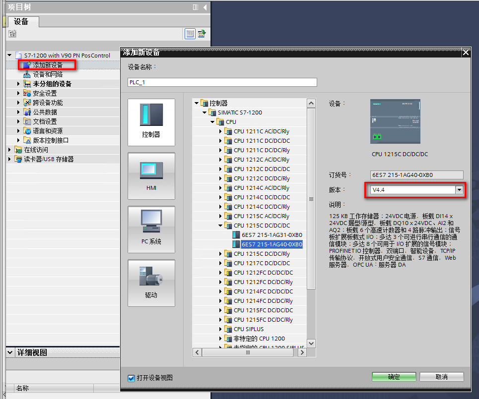

图 6\. 添加 S7-1200 CPU 到项目

3\. 进入到网络视图并打开硬件目录，如图 7 所示

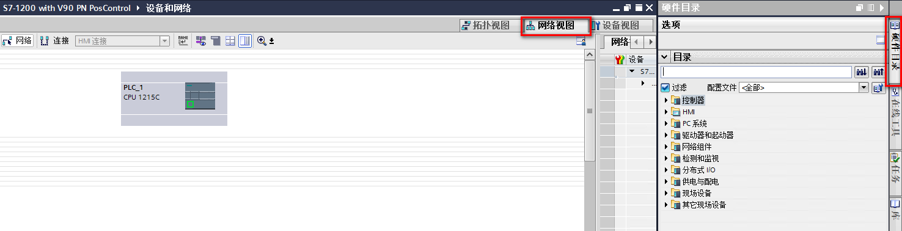

图 7\. 网络视图

4\. 右侧硬件目录树中“其他现场设备”中选择 V90PN，如图 8、9 所示。

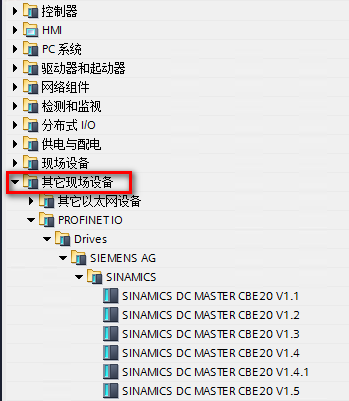

图 8\. 选择其他现场设备

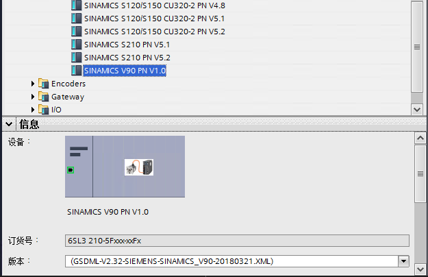

图 9\. 选择 V90PN

5.双击 V90PN 或拖拽 V90PN 到网络视图，如图 10 所示。

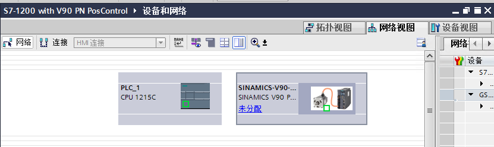

图 10\. 网络视图  

## 2.2 S7-1200 CPU 设备组态

双击 S7-1200 CPU 进入CPU 属性，在"PROFINET接口（X1）"中可以设置 IP 地址，设备名称等信息，如图 11 所示。

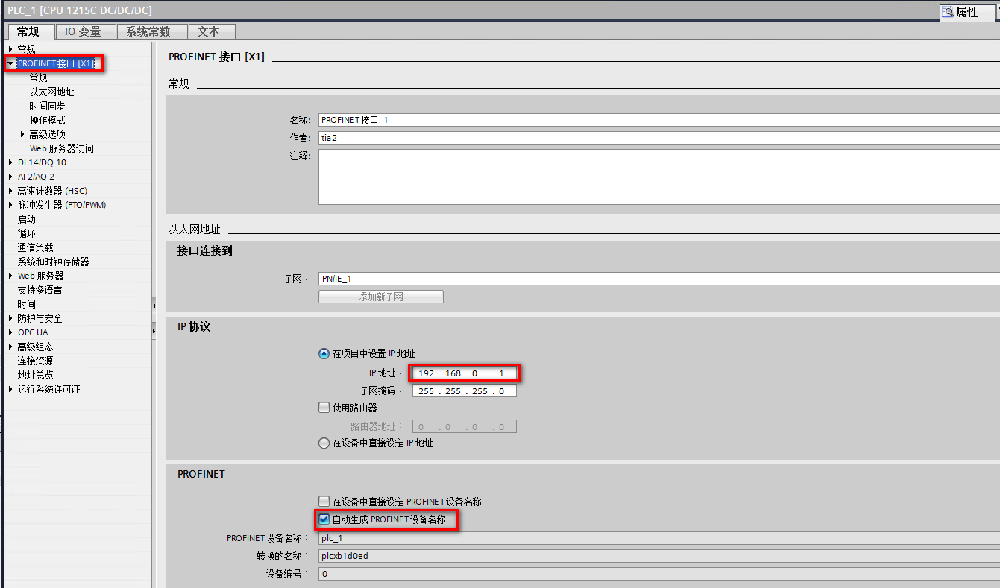

图 11\. 设置 IP 地址，设备名称等信息 

## 2.3 V90PN 设备组态

1\. 网络视图中双击 V90PN 进入属性区域。在“PROFINET 接口（X1）”中可以设置 IP 地址，设备名称等信息，如图 12 所示。

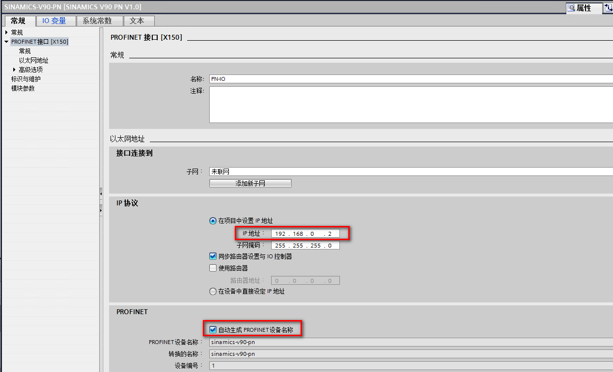

图 12\. 设置 IP 地址，设备名称等信息

2\. 硬件目录下，在子模块中选择标准报文 3，如图 13 所示。

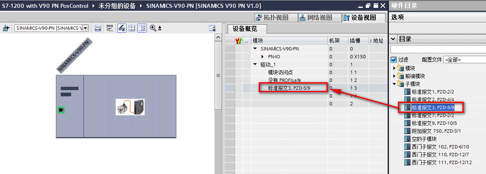

图 13\. 选择标准报文 3

## 2.4 连接 V90PN 和 S7-1200 CPU

组态完 V90PN 和 S7-1200 CPU 后，需要连接 V90PN 和 S7-1200 CPU。

1\. 在网络视图单击“未分配”，选择 PLC\_1.PROFINET 接口\_1，如图 14 所示。

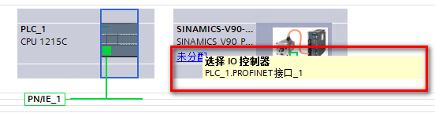

图 14\. 选择 PLC\_1.PROFINET接口\_1

2\. 连接后网络视图如图 15 所示：

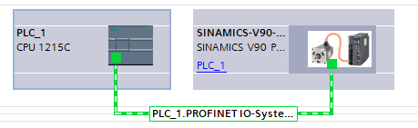

图 15\. 网络视图

3\. 然后在网络视图中右键单击 PROFINET 网络为 V90PN “分配设备名称”，如图 16、17 所示。

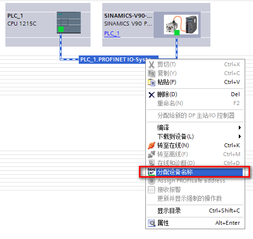

图 16\. 分配设备名称 1

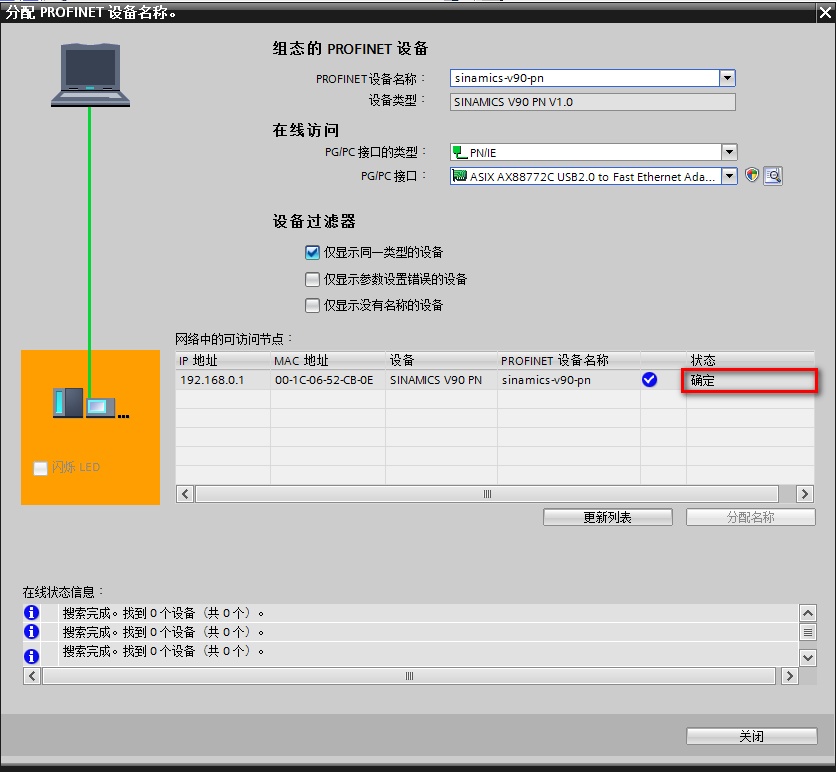

图 17\. 分配设备名称 2

注：PROFINET 设备名称非常重要，一定要确保设备名称的正确。

## 3\. 位置控制

## 3.1 插入工艺对象（TO）

在左侧“工艺对象”列表下双击“插入新对象”。在弹出的“新增对象”对话框中选择“TO_PositioningAxis”，并为新增对象命名，然后点击“确定”按钮插入一个新的工艺对象，如图 18 所示。

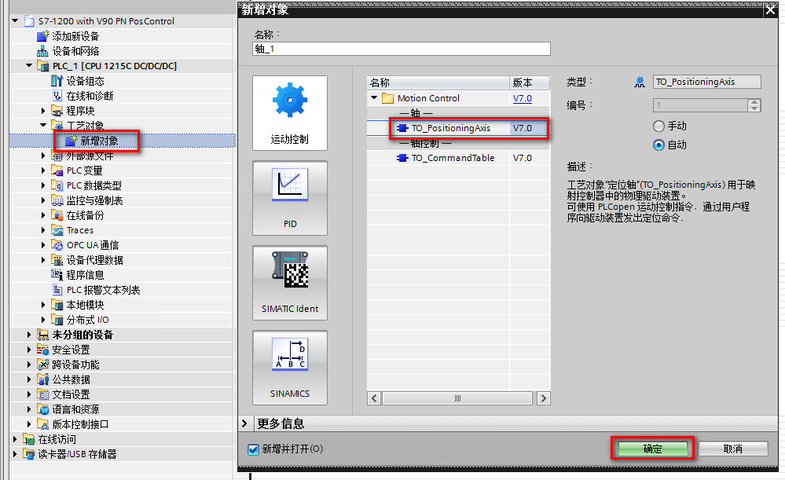

图 18\. 插入新对象

## 3.2 工艺对象配置 – 基本参数（常规）

在“基本参数”的“常规”页面下，对添加的工艺对象轴的名称进行配置，如图 19 所示。驱动器类型选择“PROFIdrive”。测量单位默认为 mm，可以从下拉列表中选择其它单位，如 m、in、ft、脉冲以及度等。

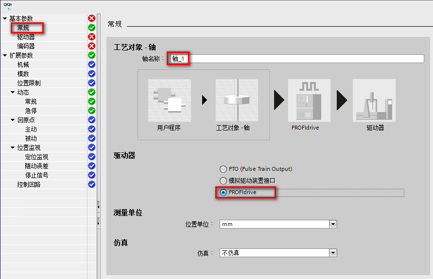

图 19\. 基本参数配置

## 3.3 工艺对象配置 – 基本参数（驱动器）

1\. 在“基本参数”的“驱动器”页面下，需要选择驱动器，如图 20 所示。

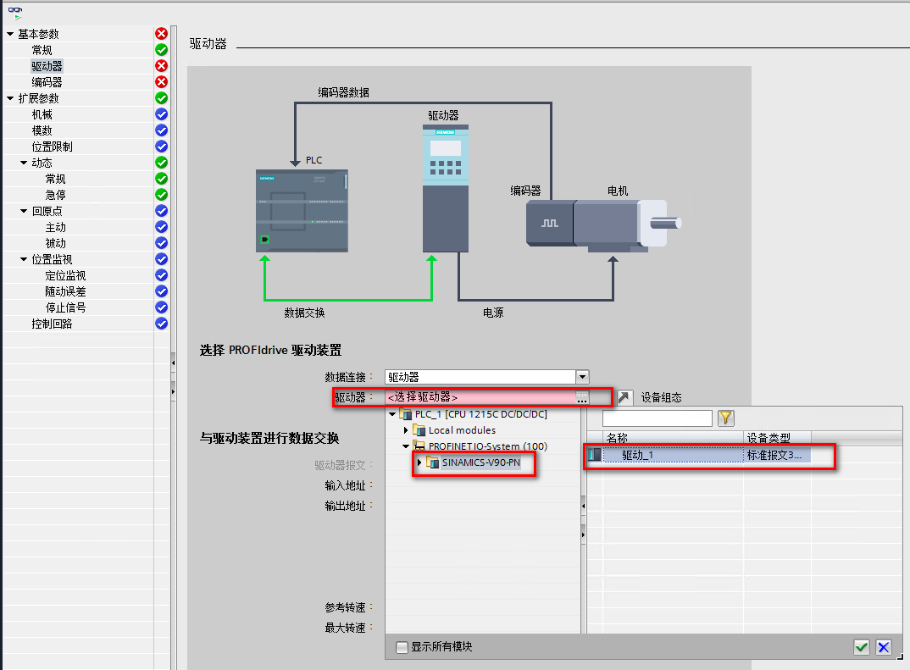

图 20\. 选择驱动器

2\. 在选择好驱动器后，对数据交换的参数进行配置。**勾选“运行时自动应用驱动值（在线）”**后，驱动装置参数“参考速度”和“最大速度”在工艺对象进行（重新）初始化并（重新）启动驱动装置和 CPU 后，将通过总线传送驱动装置参数到 CPU， 也可以选择手动设置以下参数，如图 21 所示。

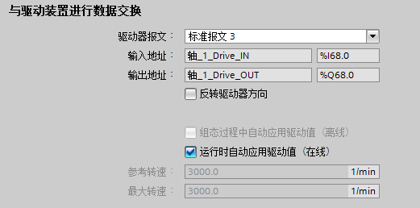

图 21\. 驱动器参数配置  

## 3.4 工艺对象配置 – 基本参数（编码器）

1\. 在基本参数的“编码器”页面中，编码器的连接方式选择“PROFINET/PROFIBUS 上的编码器”。并在编码器选择界面选择标准报文 3，如图 22 所示。

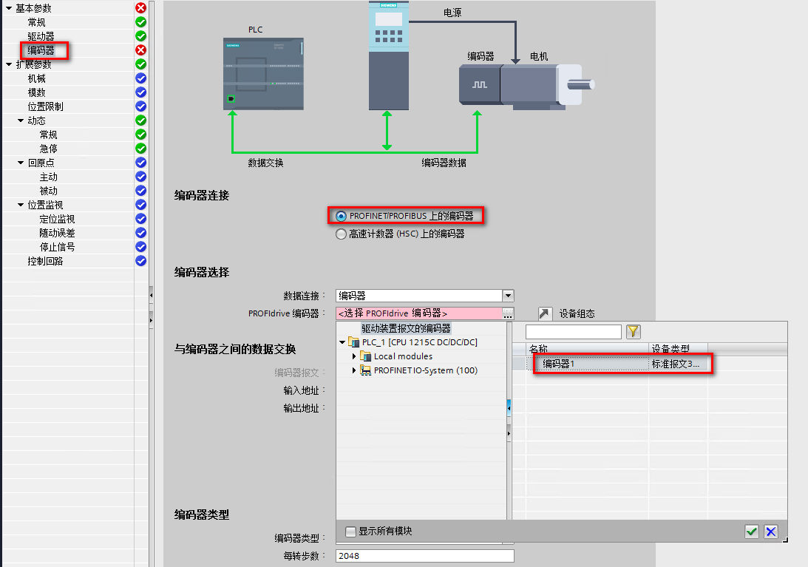

图 22\. 编码器连接与选择

2.**勾选“运行时自动应用编码器值（在线）”，**（重新）初始化工艺对象和（重新）启动编码器和 CPU 后，将从总线传送编码器参数到CPU。编码器的类型必须与轴组态以及驱动装置组态中的类型相同。本例的编码器类型为“旋转增量”，如图 23 所示。

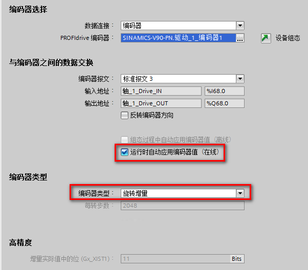

图 23\. 选择编码器类型

V90PN 目前自带有三种类型编码器，每种编码器参数如下：

* 增量编码器 TTL 2500 ppr：
    * 编码器类型：旋转增量
    * 每转步数：2500
    * 增量实际值中的位（Gx_XIST1）：2
* 20 位 + 12 位多圈绝对值编码器：
    * 编码器类型：旋转绝对值
    * 每转步数：2048
    * 转数：4096

* 增量实际值中的位（Gx_XIST1）：11
* 递增实际值中的位（Gx_XIST2）：9

* 21 位单圈绝对值编码器：
    * 编码器类型：旋转绝对值
    * 每转步数：2048
    * 转数：1
    * 增量实际值中的位（Gx_XIST1）：12
    * 递增实际值中的位（Gx_XIST2）：10

## 3.5 工艺对象配置 – 扩展参数

在扩展参数下，可以配置如下参数：

| 参数  | 说明  |
| --- | --- |
| 机械  | * 编码器安装类型      * 位置参数，即电机每转对应的负载位移 |
| 模数  | * 启用模态轴      * 配置模态轴参数 |
| 位置限制 | * 设置位置限制相关的参数 |
| 动态  | * 设置速度限幅      * 设置加减速时间      * 设置加速度      * 设置急停参数，如加减速时间等 |
| 回原点 | * 设置回零模式      * 设置各种回零模式下的回零参数等 |
| 位置监视 | * 设置定位监控参数      * 设置跟随误差      * 设置停止信号相关的参数 |
| 控制回路 | * 设置位置环的增益和前馈时间 |

表 1\. 扩展参数

工艺对象的扩展参数，具体介绍请参考：

闭环轴参数，[链接](01-Close_Loop_Param.html)。

S7-1200 连接 SINAMICS V90 实现位置闭环控制

 按住 Shift 键时用鼠标点击下列链接，打开新浏览器窗口。

[https://support.industry.siemens.com/cs/cn/zh/view/109477411](https://support.industry.siemens.com/cs/cn/zh/view/109477411)

工艺对象一般的组态方法请参考：

S7-1200 运动控制功能手册，[链接](../../../01-resource/03-online_doc.htm#d)

## 3.6 组态应用循环时间

S7-1200 CPU 在创建闭环运动控制工艺对象时，会自动地创建用于执行工艺对象的组织块，其中 MC-Servo\[OB91\] 用于位置控制器的计算，MC-Interpolator\[OB92\] 用于生成设定值、评估运动控制指令和位置监控功能。这两个组织块彼此之间出现的频率关系始终为 1:1，MC-Servo\[OB91\] 总是在 MC-Interpolator\[OB92\] 之前执行。可以根据控制质量和系统负载需求，指定 MC-Servo\[OB91\] 的应用循环周期性调用时间，如果循环时间过短，则可能造成 CPU 发生溢出，造成 CPU 停机。鼠标右键 OB91 组织块，在弹出的 OB91 属性对话框中可以修改其循环时间。可根据所使用的轴数量设置运动控制应用循环，运动控制应用循环时间 = 2 ms +（位置控制轴的数量 × 2 ms）。

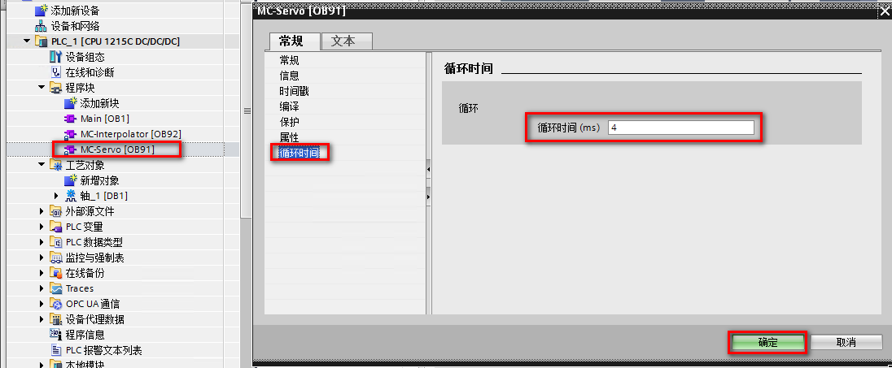

图 24\. 组态循环时间

## 3.7 设备调试

编译并将项目下载到 S7-1200 CPU 后，即可进行调试。

至此 S7-1200 与 V90 的组态配置已经初步完成，可以打开工艺对象的调试界面进行调试，然后就可以编写运动控制程序了。运动控制程序的介绍可参考[链接](../06-Instruction/01-Intro.html)。

另外，轴控制面板还提供调节功能，可用于调整 CPU 位置控制器的增益和预控制值，并可以监视轴的运行轨迹。

当 CPU 位置控制器的预控制值保持不变的情况下，修改“增益”参数可用于组态控制回路的增益系数，轴的机械硬度越高，可设置的增益系数就越大；较大的增益系数可以减少随动误差，实现更快的动态响应；但是过大的增益系数将会使位置控制系统振荡。

当 CPU 位置控制器的增益保持不变的情况下，修改“预控制”参数可用于修改控制回路的速度预控制百分比。 

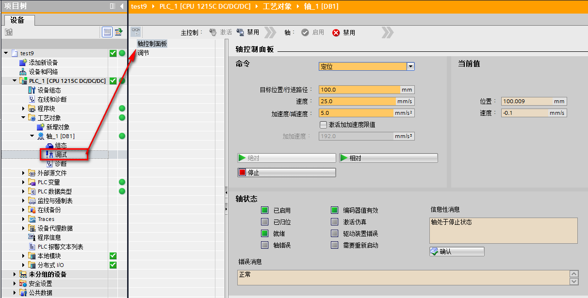

图 25\. 轴控制面板