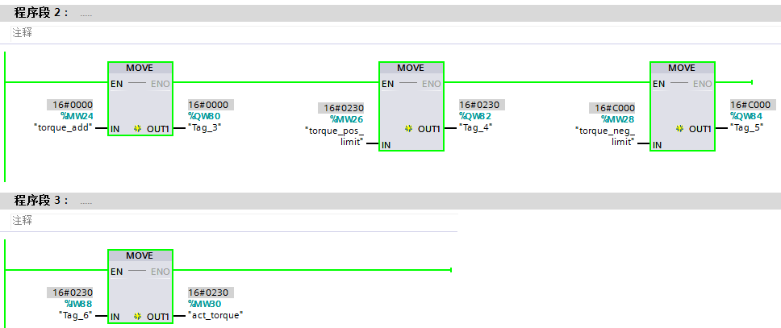

### S7-1200+V90 PN 驱动器转矩限幅及附加转矩给定功能的实现（不组态工艺对象）

可以直接通过标准报文加附加报文 750
实现发送驱动报文的控制字、速度给定、转矩限幅及附加转矩给定的功能。

#### 要求

1\. 对驱动的要求

V90 PN 伺服驱动器固件版本 FW V1.3，速度控制模式，3 号报文或 102 报文+
750 附加报文，本文以 102 报文+ 750 附加报文为例。

2\. 调试软件要求

\(1\) V90 HSP 0185 硬件支持包或 GSD 文件

 点击下列链接，打开新浏览器窗口。

硬件支持包

<https://support.industry.siemens.com/cs/cn/en/view/72341852>

GSD 文件

<https://support.industry.siemens.com/cs/ww/en/view/109737269>

\(2\) V-assistant v1.05.05 及以上

 点击下列链接，打开新浏览器窗口。

<https://support.industry.siemens.com/cs/ww/en/view/109738387>

#### 组态方法

1\. 如果使用 HSP 组态 V90 PN，在网络视图中为 V90 PN
驱动配置控制报文，在\"报文\"处选择\"西门子报文
102，PZD-6/10\"用于轴的速度控制，在\"附加报文\"处选择\"附加报文 750，PZD
3/1\"用于附加转矩及转矩限幅控制，如图 1 所示：

{width="766" height="453"}

图 1 组态 V90

2\. 如果使用 GSD 文件组态 V90 PN，在设备视图中为 V90 PN
驱动配置控制报文，分别添加\"西门子报文102，PZD-6/10\"用于轴的速度控制及\"附加报文750，PZD
3/1\"用于附加转矩及转矩限幅控制，如图 2 所示：

{width="1139" height="399"}

图 2 组态 V90

#### 转矩限幅的实现方法

1\. 数值对应关系：

正反转矩限幅值设定时，标定依据如图 3 所示

{width="760" height="473"}

图 3 数值对应关系

2\. 轴的控制编程(程序仅用于测试功能)：

注意：正向限幅值是正数，负向限幅值是负数。编程时如果没有给正反向限幅组态的地址设置限幅值，则这两个地址的数值默认是
0， 代表限幅值为
0，此时电机无法旋转。如果正向限幅值给了负数或反向限幅值给了正数，则电机运转异常。地址如图
4 所示，程序如图 5 所示。

{width="721" height="204"}

750 报文包含：

3 个控制字：分别为附加转矩给定(地址 QW80) 转矩正向限制值(地址 QW82
)，转矩负向限制值(地址 QW84
)，本例仅测试正反限幅功能，并未用到转矩设定功能，因此转矩设定地址 QW80
无效，在此将其设置为 0。控制字地址见图 4 红框所示。

1 个状态字：实际转矩(地址 IW88 )

{width="968" height="407"}

图 5 编程

3.转矩计算：

步骤 2 例程运行时用 V-ASSISTANT 软件读取的实际转矩值如图 6 所示。

{width="721" height="77"}

图 6 转矩值

P2003 参数的实际值，如图 7 所示。

{width="1353" height="70"}

图 7 P2003

计算结果：

公式：转矩实际值=转矩设定值÷(16#4000)×P2003

为了方便计算，将十六进制转换成十进制进行运算，16#0230 转换到十进制是
560，16#4000 转换成十进制是 16384，P2003=6.3270 Nm。

560÷16384x6.3270=0.216255，和 V-ASSISTANT 软件监控的 0.2166 相符。

注意：计算值和监控值有差异是由于没有同时采集，大致相符即可。

#### 附加转矩给定的实现方法

1\. 要实现转矩模式控制，需要激活 102 报文控制字 STW 1.14，然后通过 750
报文的附加转矩给定发送设定值。如图 8 所示。

{width="1019" height="107"}

图 8 报文控制字

 注意：：报文 3 的 STW1.14 不是闭环扭矩控制，所以无法使用报文 3 + 750
来实现附加转矩给定。而 102
报文不支持工艺对象，所以工艺对象和附加转矩给定无法同时使用。**

2\. 数值对应关系：

附加转矩设定值标定依据如图 9 所示

{width="685" height="448"}

图 9 数值对应关系

3.程序编写(程序仅用于测试功能)：

控制字 STW1 设置为 16#447F，代表激活转矩控制模式，转矩给定值设置为
16#0250 ，转矩反馈值是
16#024E，本例介绍转矩控制功能，因此将正反向转矩限幅值都设置为最大值，QW82=16#4000，QW84=16#C000。程序如图
10 所示。

{width="979" height="663"}

图 10 程序

4.转矩计算

步骤 3 例程运行时用 V-ASSISTANT 软件读取的实际转矩值，如图 11 所示。

{width="726" height="84"}

图 11 实际转矩

计算结果：

公式：转矩实际值=转矩设定值÷(16#4000)×P2003

为了方便计算，将十六进制转换成十进制进行运算，16#024E 转换到十进制是
590，16#4000 转换成十进制是 16384，P2003=6.3270 Nm 。

590÷16384×6.3270=0.22783，和 V-ASSISTANT 软件监控的 0.2290 相符。

注意：计算值和监控值有差异是由于没有同时采集，大致相符即可。

#### 常问问题

#### 1. V90 PN可以不创建轴工艺对象进行直接转矩控制吗？

可以，V90 PN 需使用新固件 FW V1.3，在标准报文 102 上增加 750 附加报文。

V90 PN 可以编写程序激活控制字 STW 1.14 使其进行转矩控制模式，通过 750
报文的附加转矩给定发送转矩设定值。

#### 2. 轴工艺对象可以进行转矩限幅控制吗？

S7-1200 工艺对象不支持类似 S7-1500
工艺对象的转矩限幅控制功能，不支持\"MC_TorqueRange\"
命令以及\"MC_TorqueLimiting\"命令。

但可以利用报文 3 组态工艺对象，附加报文 750
通过程序实现转矩限幅功能并读取实际转矩。

#### 3. 750报文包括哪些控制字及状态字？

附加报文750，PZD 3/1包含：

-   3个控制字：分别为附加转矩给定、转矩正向幅及转矩反向限幅
-   1个状态字：实际转矩
