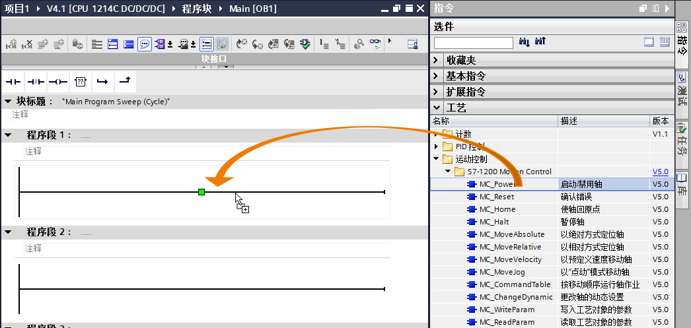
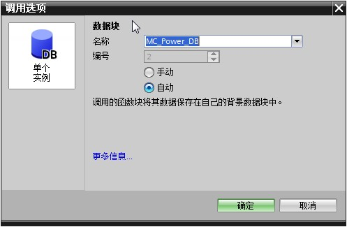
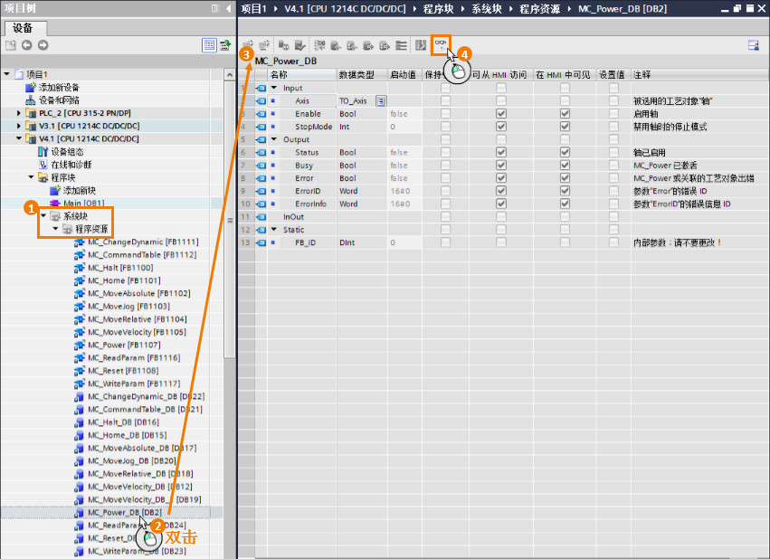
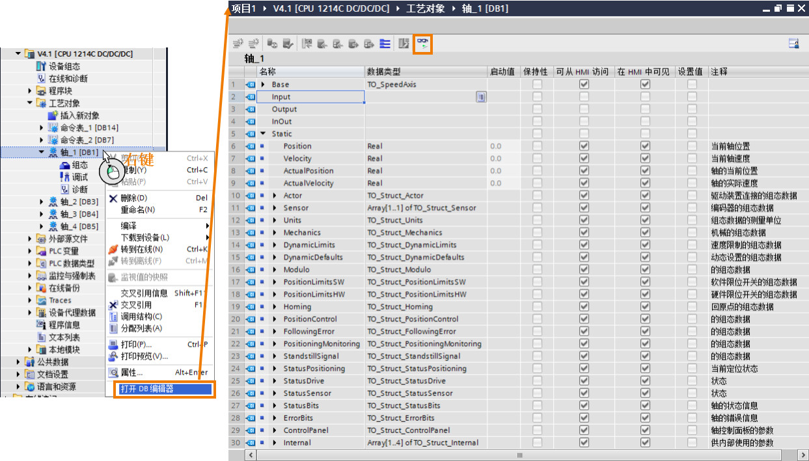
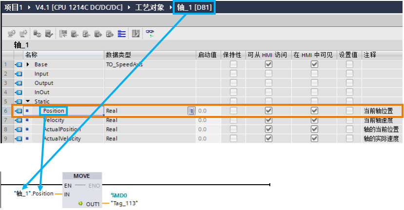
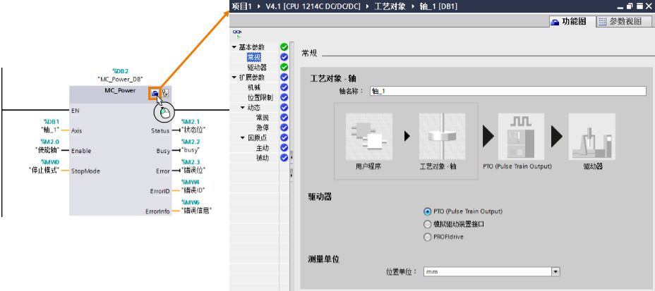
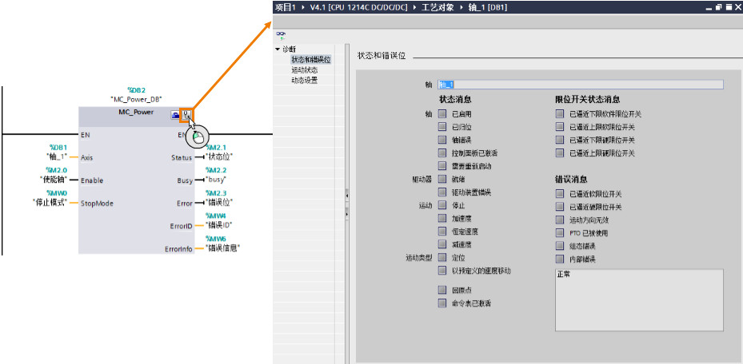

## 指令介绍

用户组态轴的参数，通过控制面板调试成功后，就可以开始根据工艺要求编写控制程序了。

### 指令文档

- [MC_Power](02-MC_Power.md)
- [MC_Reset](03-MC_Reset.md)
- [MC_Home](04-MC_Home.md)
- [MC_Halt](05-MC_Halt.md)
- [MC_MoveAbsolute](06-MC_MoveAbsolute.md)
- [MC_MoveRelative](07-MC_MoveRelative.md)
- [MC_MoveVelocity](08-MC_MoveVelocity.md)
- [MC_MoveJog](09-MC_MoveJog.md)
- [MC_ChangeDynamic](10-MC_ChangeDynamic.md)
- [MC_WriteParam](11-MC_WriteParam.md)
- [MC_ReadParam](12-MC_ReadParam.md)
- [超驰功能](13-Override.md)
- [常用指令组合](14-Program.md)

### 运动控制指令的几点说明

链接指引

- [操作流程](01-Intro.md#a)
- [运动控制指令的背景数据块](01-Intro.md#b)
- [轴工艺对象数据块及变量读写](01-Intro.md#c)
- [指令扩展](01-Intro.md#d)
- [指令快捷按钮](01-Intro.md#e)
- [指令触发](01-Intro.md#f)
- [常见问题](01-Intro.md#g)

#### 1. 操作流程

打开 OB1 块，在 TIA Portal
软件右侧"指令"中的"工艺"中找到"运动控制"指令文件夹，展开"S7-1200 Motion
Control"可以看到所有的 S7-1200
运动控制指令。可以使用拖拽或是双击的方式在程序段中插入运动指令，如图 1
所示，以 MC_Power 指令为例，用拖拽方式说明如何添加运动控制指令。

{width="1046" height="497"}

图 1. 添加指令

这些运动控制指令插入到程序中时需要背景数据块，如图 2
所示，可以选择手动或是自动生成 DB 块的编号。

{width="497" height="325"}

图 2. 生成背景数据块

添加好背景数据块后的 MC_Power 指令如图 3 所示。

{width="557" height="198"}

图 3. 指令显示

:::{attention}
运动控制指令之间一般不能使用相同的背景数据块，最方便的操作方式就是在插入指令时让软件自动分配背景数据块。
:::
#### 2. 运动控制指令的背景数据块

在"项目树"\--\>"程序块" \--\>
"系统块"\--\>"程序资源"中可以找到运动控制指令的背景数据块。用户在调试时可以直接监控该
DB 块中的数值，如图 4 所示。

{width="851" height="618"}

图 4. 背景数据块打开

#### 3. 轴工艺对象数据块及变量读写

每个轴的工艺对象都是一个数据块，用户可以如图 5 的方式打开这个数据块：

{width="1243" height="709"}

图 5. 工艺对象数据块

可以对数据块中的变量进行监控和读取，部分变量可以写入。以实时读取"轴_1"的当前位置为例，如图
6 所示，轴_1 的数据块号为 DB1，用户可以在 OB1 调用 MOVE 指令，在 MOVE
指令的 IN 端输入：DB1.Position，则软件会自动把 DB1.Position 更新成
"轴_1".Position。用户可以在人机界面上实时显示该轴的实际位置。

{width="828" height="431"}

图 6. 读取变量

其他关于读写变量的方式可以参考常见问题：[在运行期间如何对工艺对象的变量进行读写访问](../08-FAQ/01-FAQ.md#_Toc9)。

#### 4. 指令扩展

每个运动控制指令下方都有一个黑色三角，展开后可以显示该指令的所有输入/输出管脚。
展开后的指令管脚有灰色的，表示该管脚是不经常用到的指令管脚，如图 7
所示。

{width="619" height="455"}

图 7. 展开指令

#### 5. 指令快捷按钮

指令右上角有两个快捷按钮，可以快速切换到轴的工艺对象参数配置界面和轴的诊断界面，如图
8、9 所示。

{width="928" height="413"}

图 8. 切换到轴的工艺对象参数配置界面

{width="929" height="456"}

图 9. 切换到轴的诊断界面

#### 6. 指令触发

S7-1200 有部分运动控制指令有一个 Execute
触发管脚，该管脚需要用上升沿触发。上升沿可以有两种方式：

①用上升沿指令\|P\|。

②使用常开点指令，但是该点的实际应用中使其成为一个上升沿信号，例如用户通过触摸屏的按钮来操作控制，该按钮的有效动作为上升沿触发。

#### 7. 常见问题

{width="15"
height="15"}为什么有时用户在监控程序的时候看不到指令的完成位 Done 的为
1？

参考常见问题：[为什么有时用户在监控程序的时候看不到指令的完成位 Done
的为 1？](../08-FAQ/01-FAQ.md#_Toc3)

 如何对运动控制指令使用 FB
进行封装？

参考常见问题：[如何对运动控制指令使用 FB进行封装？](../08-FAQ/01-FAQ.md#_Toc11)
