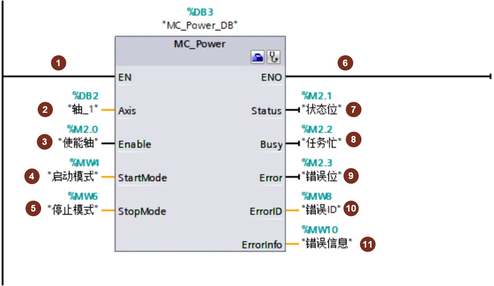
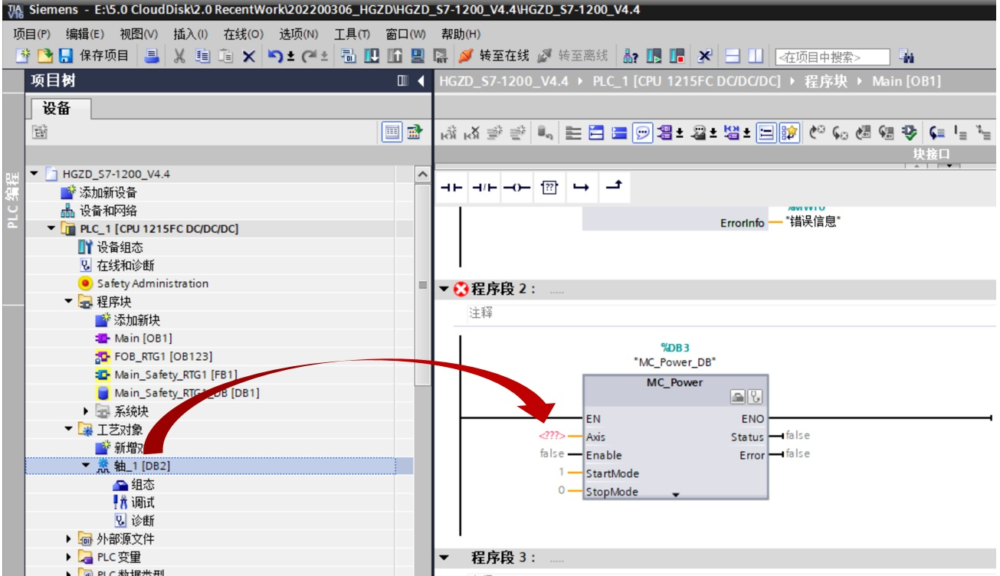
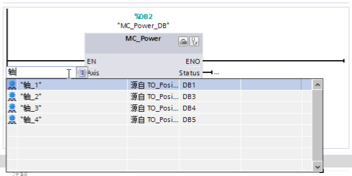
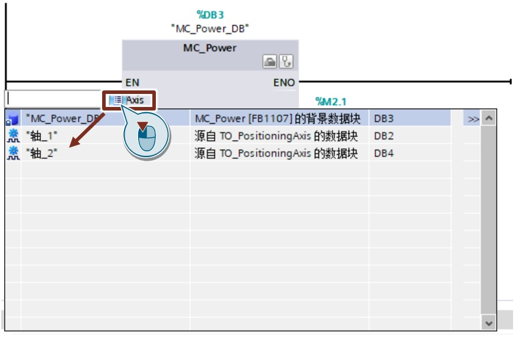

### MC_Power

**指令名称**：启动/禁用轴。

**功能**：使能轴或禁用轴。

**使用要点**：在程序里一直调用，并且在其他运动控制指令之前调用并使能。

**输入端**：  
**①****EN**：该输入端是MC_Power指令的使能端，不是轴的使能端。

> MC\_Power 指令必须在程序里一直调用，并保证MC\_Power指令在其他Motion Control指令的前面调用。

**②****Axis**：轴名称

> 可以有几种方式输入轴名称：
> 
> a. 用鼠标直接从Portal软件左侧项目树中拖拽轴的工艺对象，如下图所示：
> 
> > 
> 
> b. 用键盘输入字符，则Portal软件会自动显示出可以添加的轴对象，如下图所示：
> 
> > 
> 
> c. 用拷贝的方式把轴的名称拷贝到指令上，如下图所示：
> 
> > 
> 
> d. 还可以用鼠标左键点击“Aixs”，系统会出现带可选按钮的白色长条框，这时用鼠标点击“选择按钮”，就会出现下图中的列表。
> 
> > 

**③****Enable**：轴使能端

* Enable = 0： 根据组态的“StopMode”中断当前所有作业。停止并禁用轴。
* Enable = 1：如果组态了轴的驱动信号，则Enable=1时将接通驱动器的电源。

**④****StartMode**：轴启动模式

* Enable = 0： 启用位置不受控的定位轴即速度控制模式。
* Enable = 1：启用位置受控的定位轴即位置控制（默认）

注意： 1.使用带 PTO (Pulse Train Output) 驱动器的定位轴时忽略该参数。 2. 只有在信号检测（False 变为 True）期间才会评估 StartMode 参数。

**⑤****StopMode**：轴停止模式

* StopMode= 0：紧急停止

如果禁用轴的请求处于待决状态,则轴将以组态的急停减速度进行制动。轴在变为静止状态后被禁用。

* StopMode=1：立即停止

如果禁用轴的请求处于待决状态，则会输出该设定值 0，并禁用轴。轴将根据驱动器中的组态进行制动，并转入停止状态。 对 对于通过 PTO (Pulse Train Output) 的驱动器连接：  
禁用轴时，将根据基于频率的减速度，停止脉冲输出：  
•  输出频率 ≥ 100 Hz  
减速度：最长 30 ms  
•  输出频率 < 100 Hz  
减速度：30 ms；2 Hz 时，最长 1.5 s

* StopMode=2：带有加速度变化率控制的紧急停止：

> 如果禁用轴的请求处于待决状态，则轴将以组态的急停减速度进行制动。如果激活了加速度变化率控制，会将已组态的加速度变化率考虑在内。轴在变为静止状态后被禁用。

**输出端**：  
**⑥****ENO**：使能输出  
**⑦****Status**：轴的使能状态  
**⑧****Busy**：标记MC_Power指令是否处于活动状态  
**⑨****Error**：标记MC_Power指令是否产生错误  
**⑩****ErrorID**：当MC_Power指令产生错误时，用ErrorID表示错误号。  
**⑪ErrorInfo**：当MC_Power指令产生错误时，用ErrorInfo表示错误信息 。

结合ErrorID和ErrorInfo数值，查看手册或是Portal 软件的帮助信息中的说明，来得到错误原因。