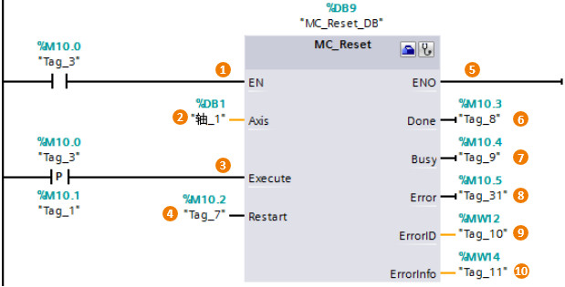

### [MC_Reset]{#_Toc428444762}

**指令名称**：确认故障

**功能**：用来确认"伴随轴停止出现的**运行错误**"和"**组态错误**"。

**使用要点**：Execute用上升沿触发。

:::{attention}
部分输入/输出管脚没有具体介绍，请用户参考MC_Power指令中的说明。
:::
{width="619" height="315"}

**输入端**：\
**①EN**：该输入端是MC_Reset指令的使能端。\
**②Axis**：轴名称。\
**③Execute**：MC_Reset指令的启动位，用上升沿触发。\
**④Restart**：

-   Restart = 0：用来确认错误。
-   Restart =
    1：将轴的组态从装载存储器下载到工作存储器（只有在禁用轴的时候才能执行该命令）。\

**输出端**：除了Done指令，其他输出管脚同MC_Power指令，这里不再赘述。\
**⑥Done**：表示轴的错误已确认。
