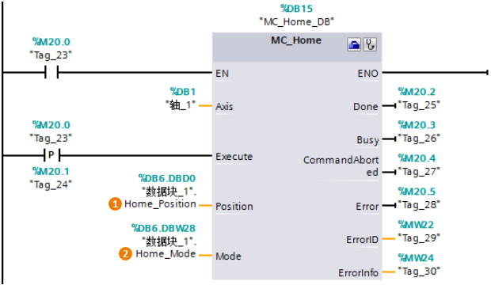
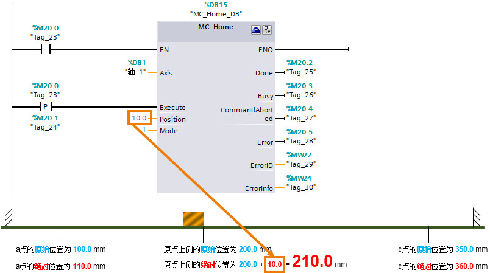

### MC_Home

**指令名称**：回原点指令

**功能**：使轴归位，设置参考点，用来将轴坐标与实际的物理驱动器位置进行匹配。

**使用要点**：轴做绝对位置定位前一定要触发 MC_Home 指令。

:::{attention}
部分输入/输出管脚没有具体介绍，请用户参考 MC_Power指令中的说明。
:::

{width="620" height="360"}

**①Position**： 位置值

-   Mode = 1时：对当前轴位置的修正值
-   Mode = 0,2,3时：轴的绝对位置值

**②Mode**： 回原点模式值

-   Mode = 0： **绝对式直接**回零点，轴的位置值为参数"Position"的值
-   Mode = 1： **相对式直接**回零点，轴的位置值等于当前轴位置 +
    参数"Position"的值
-   Mode = 2： **被动**回零点，轴的位置值为参数"Position"的值
-   Mode = 3： **主动**回零点，轴的位置值为参数"Position"的值
-   Mode =
    6：绝对编码器相对调节，将当前的轴位置设定为当前位置+参数"Position"的值
-   Mode = 7：绝对编码器绝对调节
    ，将当前的轴位置设置为参数"Position"的值

Mode 6 和 7 仅用于带模拟驱动接口的驱动器和 PROFIdrive 驱动器

Mode = 2 和 Mode = 3
参见[回原点](../04-Open_Loop/01-Position_TO/06-home.html)。

#### Mode = 0 绝对式直接回原点

以下图为例进行说明。该模式下的 MC_Home
指令触发后轴并**不运行**，也不会去寻找原点开关。指令执行后的结果是：轴的坐标值更直接新成新的坐标，新的坐标值就是
MC \_Home
指令的"Position"管脚的数值。例子中，"Position"=0.0mm，则轴的当前坐标值也就更新成了
0.0mm。该坐标值属于"绝对"坐标值，也就是相当于轴已经建立了绝对坐标系，可以进行绝对运动。

**『优点』**MC_Home的该模式可以让用户在没有原点开关的情况下，进行绝对运动操作。

{width="806" height="453"}

#### Mode = 1 相对式直接回原点

与Mode = 0 相同，以该模式触发 MC_Home
指令后轴并不运行，只是更新轴的当前位置值。更新的方式与 Mode = 0
不同，而是在轴原来坐标值的基础上加上"Position"数值后得到的坐标值作为轴当前位置的新值。如下图所示，指令
MC_Home 指令后，轴的位置值变成了
210mm.，相应的a和c点的坐标位置值也相应更新成新值。

{width="804" height="449"}

:::{attention}
用户可以通过对变量 \<轴名称\>.StatusBits.HomingDone = TRUE
与运动控制指令"MC_Home"的输出参数 Done = TRUE 进行与运算，来检查轴是否已回原点。
:::
#### Mode = 6 绝对编码器相对调节

此模式只针对连接的编码器类型为绝对值编码器，该模式下的 MC_Home
指令触发后轴并**不运行**，也不会去寻找原点开关，会将当前位置值设为"当前位置值 +
参数 \"Position\"的值"，绝对值偏移值保持性地保存在 CPU 内，CPU
断电再上电后轴的位置值不会丢失。

#### Mode = 7 绝对编码器绝对调节

此模式只针对连接的编码器类型为绝对值编码器，该模式下的 MC_Home
指令触发后轴并**不运行**，也不会去寻找原点开关，会将当前位置值设为"参数\"Position\"的值"，绝对值偏移值保持性地保存在
CPU 内，CPU 断电再上电后轴的位置值不会丢失。
