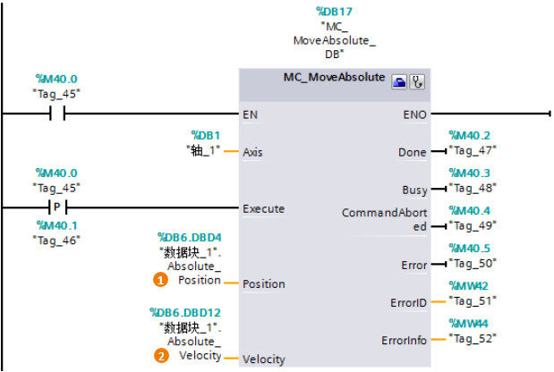

### [MC_MoveAbsolute]{#_Toc428444765}

**指令名称**：绝对位置指令

**功能**：使轴以某一速度进行绝对位置定位。

**使用技巧**：在使能绝对位置指令之前，轴必须回原点。因此MC_MoveAbsolute指令之前必须有MC_Home指令。

:::{attention}
部分输入/输出管脚没有具体介绍，请用户参考MC_Power指令中的说明。
:::
{width="619" height="416"}

**指令输入端：** \
**①Position**：绝对目标位置值。\
**②Velocity**：绝对运动的速度。
