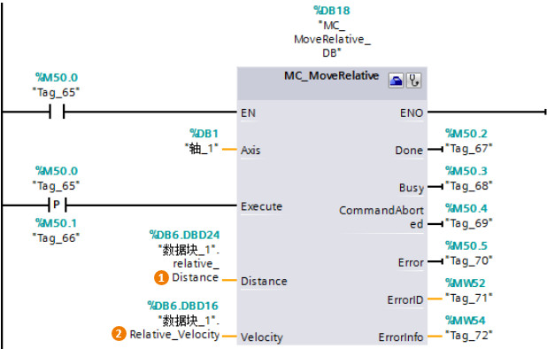

### [MC_MoveRelative]{#_Toc428444766}

**指令名称**：相对距离指令

**功能**：使轴以某一速度在轴当前位置的基础上移动一个相对距离。

**使用技巧**：不需要轴执行回原点命令。

**『注意』**部分输入/输出管脚没有具体介绍，请用户参考MC_Power指令中的说明。

{width="618" height="394"}

**指令输入端：** \
**①Distance**：相对对轴当前位置移动的距离，该值通过**正/负**数值来表示距离和方向。\
**②Velocity**：相对运动的速度。
