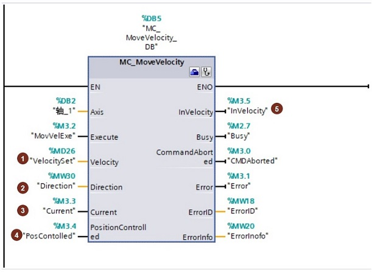

### MC_MoveVelocity

**指令名称**：速度运行指令

**功能**：使轴以预设的速度运行

:::{attention}
部分输入/输出管脚没有具体介绍，请用户参考MC_Power指令中的说明。
:::
{width="611" height="447"}

**指令输入端：** \
**①Velocity**：轴的速度。\
**②Direction**：方向数值

-   Direction = 0：旋转方向取决于参数"Velocity"值的符号
-   Direction = 1：正方向旋转，忽略参数"Velocity"值的符号
-   Direction = 2：负方向旋转，忽略参数"Velocity"值的符号\

**③Current**：

-   Current = 0：轴按照参数"Velocity"和"Direction"值运行
-   Current = 1：轴忽略参数"Velocity"和"Direction"值，轴以当前速度运行。

**④PositionControlled**：

-   PositionControlled= 0：非位置控制即运行在速度控制模式
-   PositionControlled= 1： 位置控制操作即运行在位置控制模式

:::{attention}
只要执行指令 MC_MoveVelocity 即应用该参数。之后，MC_Powe的设置再次适用。使用 PTO 轴时忽略该参数。
:::
**⑤InVelocity** ：

-   InVelocity= 0：输出未达到速度设定值
-   InVelocity= 1： 输出已达到速度设定值

:::{attention}
可以设定"Velocity"数值为0.0，触发指令后轴会以组态的减速度停止运行。相当于MC_Halt指令。
:::