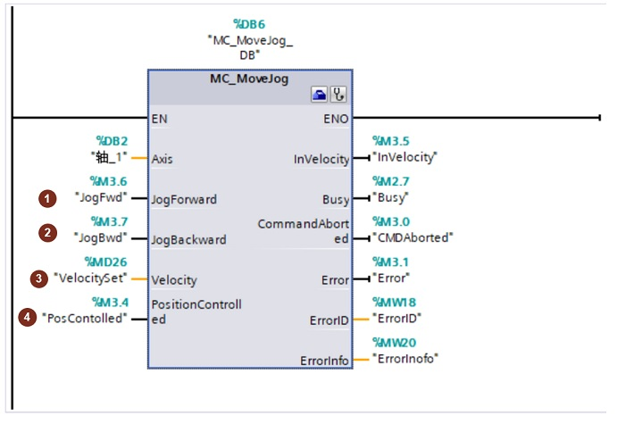

### [MC_MoveJog]{#_Toc428444768}

**指令名称**：点动指令

**功能**：在点动模式下以指定的速度连续移动轴。

**使用技巧**：正向点动和反向点动不能同时触发。

**『注意』**部分输入/输出管脚没有具体介绍，请用户参考MC_Power指令中的说明。

{width="700" height="475"}

**①JogForward**：正向点动，不是用上升沿触发，JogForward为1时，轴运行；JogForward为0时，轴停止。类似于按钮功能，按下按钮，轴就运行，松开按钮，轴停止运行。\
**②JogBackward**：反向电动，使用方法参考JogForward。

> **『注意』**在执行点动指令时，保证JogForward和JogBackward不会同时触发，可以用逻辑进行互锁。

**③Velocity**：点动速度设定。

> **『注意』**Velocity数值可以实时修改，实时生效。

**④PositionControlled**：

-   PositionControlled= 0：非位置控制即运行在速度控制模式
-   PositionControlled= 1： 位置控制操作即运行在位置控制模式

> **『注意』** 只要执行指令 MC_MoveJog 即应用该参数。之后，MC_Power
> 的设置再次适用。使用 PTO 轴时忽略该参数。
