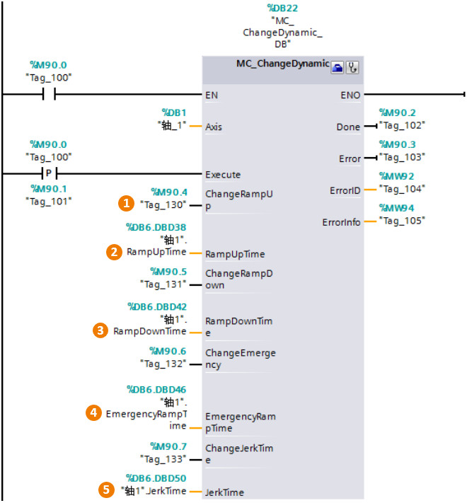

### [MC_ChangeDynamic]{#_Toc428444770}

**指令名称**：更改动态参数指令

**功能**：更改轴的动态设置参数，包括：

-   加速时间（加速度）值
-   减速时间（减速度）值
-   急停减速时间（急停减速度）值
-   平滑时间（冲击）值

:::{attention}
部分输入/输出管脚没有具体介绍，请用户参考MC_Power指令中的说明。
:::
{width="660" height="711"}

**指令输入端：** \
**①ChangeRampUp**：更改"RampUpTime"参数值的使能端。当该值为0时，表示不进行"RampUpTime"参数的修改；该值为1时，进行"RampUpTime"参数的修改。每个可修改的参数都有相应的使能设置位，这里只介绍一个。当触发MC_ChangeDynamic指令的Execute管脚时，使能修改的参数值将被修改，不使能的不会被更新。\
**②RampUpTime**：轴参数中的"加速时间"。\
**③RampDownTime**：轴参数中的"减速时间"。

> {width="800" height="778"}

**④EmergencyRampTime**：轴参数中的"急停减速时间"。

> {width="802" height="554"}

**⑥JerkTime**：轴参数中的"平滑时间"

> {width="803" height="780"}
