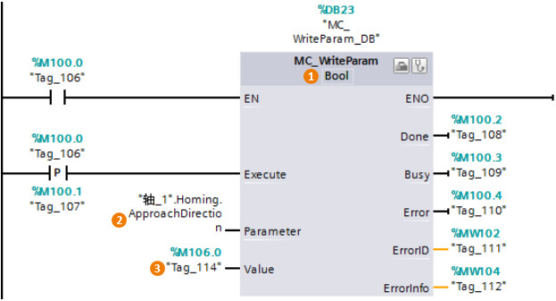
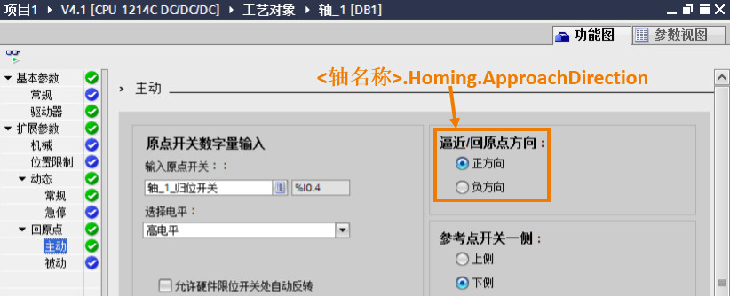

### [MC_WriteParam]{#_Toc428444771}

**指令名称**：写参数指令

**功能**：可在用户程序中写入或是更改轴工艺对象和命令表对象中的变量。

:::{attention}
部分输入/输出管脚没有具体介绍，请用户参考MC_Power指令中的说明。
:::

:::{attention}
可写入或是更改的变量包括务必参考《STEP 7 TIA PORTAL V15 中的S7-1200 Motion Control V6.0》中的12.9和12.10章节。该文档的下载链接：<https://support.industry.siemens.com/cs/cn/zh/view/109754206>

:::

{width="623" height="337"}

**①参数类型**：与"Parameter"数据类型一致\
**②Parameter**：输入需要修改的轴的工艺对象的参数，数据类型为VARIANT指针。\
**③Value**：根据"Parameter"数据类型，输入新参数值所在的变量地址。

> 上图以回原点方向为例，"Parameter"管脚输入：\<轴名称\>.Homing.ApproachDirection，由于该轴的名称为"轴_1"，所以例子中的地址就是："轴_1".Homing.ApproachDirection。该变量是Bool类型的变量，因此在"Value"管脚中输入一个Bool类型的变量地址，同时指令的参数类型也是Bool。
>
> {width="822" height="334"}
