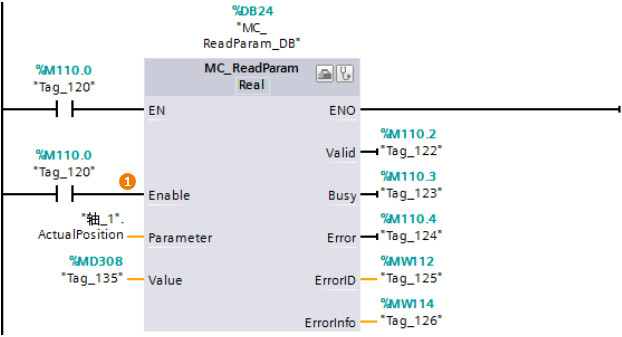

### MC_ReadParam

**指令名称**：读参数指令

**功能**：可在用户程序中读取轴工艺对象和命令表对象中的变量。

:::{attention}
部分输入/输出管脚没有具体介绍，请用户参考MC_Power指令中的说明。
:::

{width="622" height="337"}

**指令输入端：** \
**①Enable**：可以一直使能读取指令 。\
该例子读取的是轴的实际位置值，读到的数值放在"Value"中。

 

下面列出了常用的轴工艺对象中部分参数：

**1. 轴的位置和速度变量**

-   \<轴名称\>.Position：轴的位置设定值
-   \<轴名称\>.ActualPosition：轴的实际位置
-   \<轴名称\>.Velocity：轴的速度设定值
-   \<轴名称\>.ActualVelocity：轴的实际速度

**2. 回原点变量**\

-   \<轴名称\>.Homing.AutoReversal：主动归位期间激活硬限位开关处的自动反向\
-   \<轴名称\>.Homing.ApproachDirection：主动归位期间的逼近方向和归位方向\
-   \<轴名称\>.Homing.ApproachVelocity：主动归位期间轴的逼近速度
-   \<轴名称\>.Homing.ReferencingVelocity：主动归位期间轴的归位速度

**3. 单位变量**\

-   \<轴名称\>.Units.LengthUnit：参数的已组态测量单位

4\. **机械变量**

-   \<轴名称\>.Mechanics.LeadScrew：每转的距离

5\. **轴StatusPositioning变量**

-   \<轴名称\>.StatusPositioning.Distance：轴距目标位置的当前距离\
-   \<轴名称\>.StatusPositioning.TargetPosition：轴的目标位置

6\. **轴的DynamicDefaults变量**

-   \<轴名称\>.DynamicDefaults.Acceleration：轴的加速度\
-   \<轴名称\>.DynamicDefaults.Deceleration：轴的减速度\
-   \<轴名称\>.DynamicDefaults.EmergencyDeceleration：轴的急停减速度
-   \<轴名称\>.DynamicDefaults.Jerk：轴加速斜坡和减速斜坡期间的冲击\

7\. **PositionLimitesSW变量**

-   \<轴名称\>.PositionLimitsSW.Active：软限位开关激活\
-   \<轴名称\>.PositionLimitsSW.MinPosition：软限位开关下限位\
-   \<轴名称\>.PositionLimitsSW.MaxPosition：软限位开关上限位

8\. **PositionLimitesHW变量**

-   \<轴名称\>.PositionLimitsHW.Active：硬限位开关激活\
-   \<轴名称\>.
    PositionLimitsHW.MinSwitchLevel：选择到达下限硬限位开关时 CPU
    输入端存在的信号电平\
-   \<轴名称\>.
    PositionLimitsHW.MinSwitchAddress：下限硬限位开关的符号输入地址（内部参数）
-   \<轴名称\>.PositionLimitsHW.MaxSwitchLevel：选择到达上限硬限位开关时
    CPU 输入端存在的信号电平
-   \<轴名称\>.PositionLimitsHW.MaxSwitchAddress：上限硬限位开关的输入地址（内部参数）
