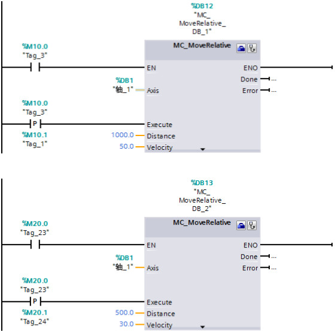
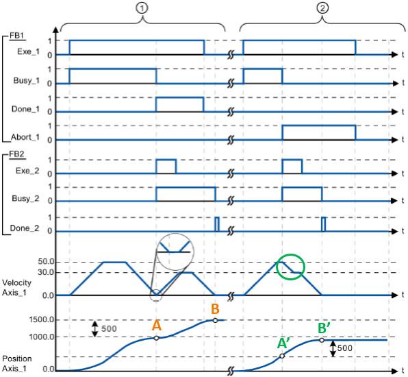

### S7-1200 运动控制指令之间Override（超驰）功能说明

S7-1200 运动控制指令之间存在相互覆盖和中止的情况。在S7-1200
PLC中这种特性叫做Override，中文叫做"超驰"。

基本上除了MC_Power指令，每种指令都有被Override的情况，就是说用户可以用新的指令覆盖正在执行的命令以中止当前动作切换到新的命令的执行。

用两个MC_MoveRelative为例进行说明，如下图所示，除了在程序里调用了MC_Power指令和MC_Reset之外，还调用了两个MC_MoveRelative指令。第一个MC_MoveRelative指令的Distance
= 1000.0mm，Velocity = 50.0mm/s；第二个MC_MoveRelative指令的Distance =
500.0mm，Velocity = 30.0mm/s。

{width="560" height="554"}

情况①，当第一个MC_MoveRelative指令执行完时触发第二个MC_MoveRelative指令；

情况②，在第一个MC_MoveRelative指令执行过程中触发第二个MC_MoveRelative指令。

如下图所示，情况①时，第一个MC_MoveRelative指令让轴移动到了A点，触发第二个MC_MoveRelative指令后，轴在A点的基础上以30.0mm/s的速度移动了500.0mm的距离。情况②，在第一个MC_MoveRelative指令执行过程中立即触发了第二个MC_MoveRelative指令，轴从A\'点的位置立即以二个MC_MoveRelative指令的参数运行，轴从当前的50.0mm/s的速度以减速度降到30.0mm/s，在A\'的基础上运行了500.0mm的距离达到B\'点。

{width="596" height="550"}

:::{important}
 **『结论』** 以MC_MoveRelative指令为例说明Override的特点

-   可以用第二个MC_MoveRelative指令覆盖第一个MC_MoveRelative指令
-   可以用其他的指令，比如MC_MoveJog、MC_Home，MC_MoveAbsolute，MC_MoveVelocity等来覆盖旧的MC_MoveRelative指令
-   也可以在当前MC_MoveRelative指令执行过程中，更新该指令的Distance和Velocity数值后，再次触发该MC_MoveRelative指令的Execute管脚，也可以实现实时Override的功能

 **『优点』** 轴不用停止，可以平滑过渡到新的指令或是同一指令的新参数。
:::

:::{attention}
具体细节务必参考《STEP 7 TIA PORTAL V15 中的 S7-1200 Motion Control V6.0》中的第11章指令说明部分，该文档的下载链接：<https://support.industry.siemens.com/cs/cn/zh/view/109754206>
:::