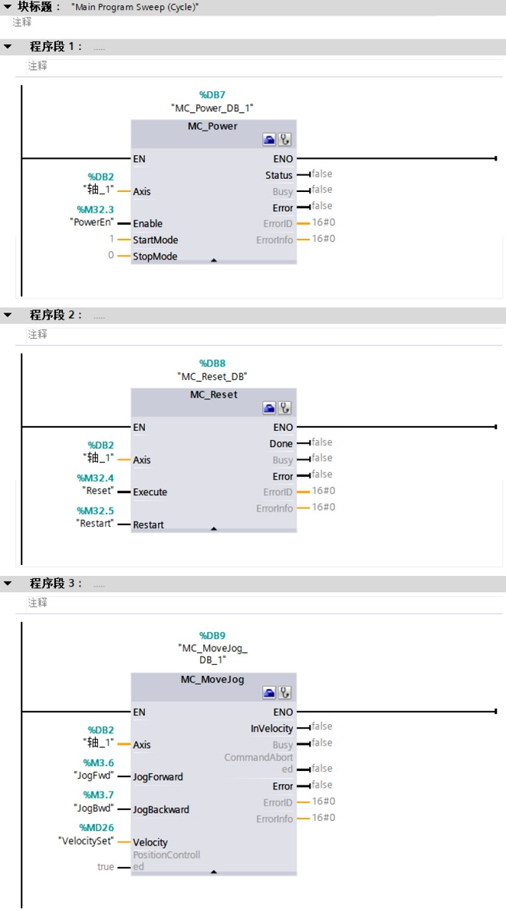
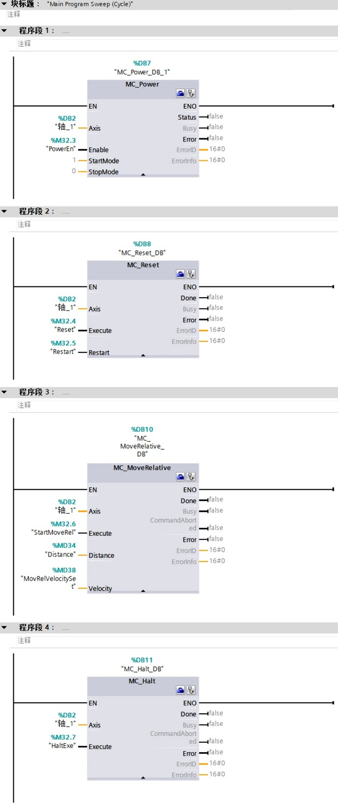
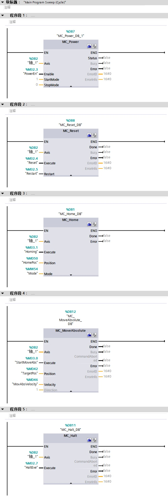
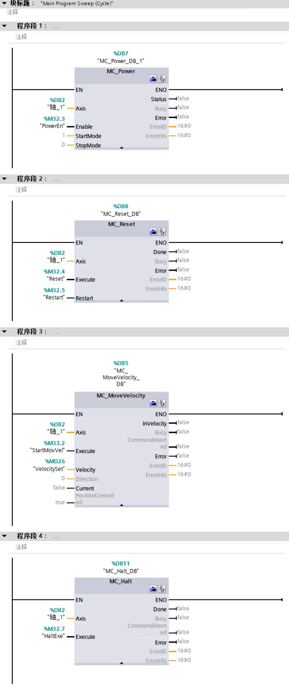

### 常见功能所用编程指令

#### 点动功能

点动功能至少需要MC_Power，MC_Reset，和MC_Jog指令。

{width="660" height="1189"}

#### 相对距离运行

相对速度控制功能，需要MC_Power，MC_Reset，MC_MoveRelative和MC_Halt指令。

{width="660" height="1575"}

#### 绝对运动

绝对运动功能需要MC_Power，MC_Reset，MC_Home，MC_MoveAbsolute和MC_Halt指令。

在触发MC_MoveAbsolute指令前需要轴有回原点完成信号才能执行。

{width="660" height="1954"}

#### 以速度连续运行

相对速度控制功能，需要MC_Power，MC_Reset，和MC_MoveVolcity，以及MC_Halt指令。

{width="660" height="1569"}
