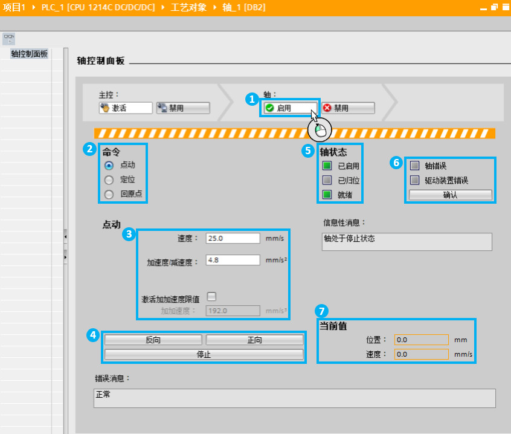
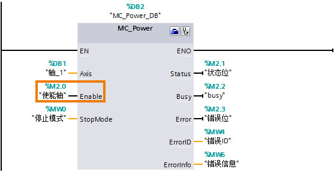
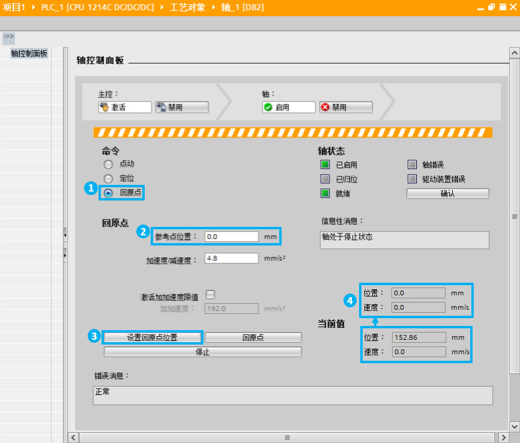

### [S7-1200 PTO控制方式\--调试面板]{#_Toc428444757}

调试面板是S7-1200 运控控制中一个很重要的工具，用户在组态了S7-1200
运动控制并把实际的机械硬件设备搭建好之后，先不要着急调用运动控制指令编写程序，而是先用"轴控制面板"来测试Portal软件中关于轴的参数和实际硬件设备接线等安装是否正确。

如下图所示，每个TO_PositioningAsix工艺对象都有一个"调试"选项，点击后可以打开"轴控制面板"。

{width="1090" height="718"}

当用户准备激活控制面板时，Portal
软件会提示用户：使能该功能会让实际设备运行，务必注意人员及设备安全。如下图如示：

{width="847" height="720"}

当激活了"轴控制面板"后，并且正确连接到S7-1200
CPU后用户就可以用控制面板对轴进行测试，如下图所示，控制面板的主要区域。

{width="846" height="718"}

> ①轴的启用和禁用：相当于MC_Power指令的"Enable"端。
>
> > {width="557" height="287"}
>
> ②命令：在这里分成三大类：点动，定位和回原点。
>
> > 定位包括绝对定位和相对移动功能。
> >
> > 回原点可以实现Mode 0（绝对式回原点）和Mode 3（主动回原点）功能。
>
> ③根据不同运动命令，设置运行速度，加/减速度，距离等参数
>
> ④每种运动命令的正/反方向设置、停止等操作。
>
> ⑤轴的状态位，包括了是否有回原点完成位。
>
> ⑥错误确认按钮，相当于MC_Reset指令的功能。
>
> ⑦轴的当前值，包括轴的实时位置和速度值。

以Mode 0（绝对式回原点）为例进行说明控制面板的使用。如下图所示。

{width="866" height="738"}

①选择命令模式为回原点；

②设置轴的当前位置值；

③点击"设置回原点位置"按钮；

④则轴的实际位置直接更新成参考点位置。

相当于下图的功能：

{width="806" height="453"}
