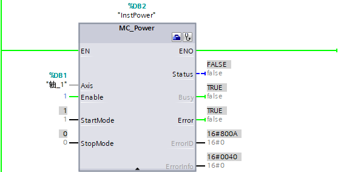

 ### FAQ 常见问题

本页面仅针对除回原点、轴位置以外的常见问题，回原点、轴位置常见问题参见[链接](02-HOME_FAQ.md)。

- [FAQ 常见问题](#faq-常见问题)
  - [ 1. 绝对定位和相对定位区别？](#-1-绝对定位和相对定位区别)
  - [ 2. 如何设置 MC\_MoveRelative 方向运行？](#-2-如何设置-mc_moverelative-方向运行)
  - [3 . 为什么有时用户在监控程序的时候看不到指令的完成位 Done 的为 1？](#3--为什么有时用户在监控程序的时候看不到指令的完成位-done-的为-1)
  - [ 4. 开环运动控制怎样计算运动任务？](#-4-开环运动控制怎样计算运动任务)
  - [ 5. 为何通过 S7-1200 PTO 方式控制 V90 PTI 定位换向时有时会有丢失脉冲的情况?](#-5-为何通过-s7-1200-pto-方式控制-v90-pti-定位换向时有时会有丢失脉冲的情况)
  - [ 6. 如何通过数据块实现驱动装置/编码器的数据连接？](#-6-如何通过数据块实现驱动装置编码器的数据连接)
  - [ 7. S7-1200 工艺对象能否控制由硬件支持包（HSP）方式组态的 V90 PN?](#-7-s7-1200-工艺对象能否控制由硬件支持包hsp方式组态的-v90-pn)
  - [ 8. 如何在轴运动过程中修改目标速度与目标位置？](#-8-如何在轴运动过程中修改目标速度与目标位置)
  - [ 9. 在运行期间如何对工艺对象的变量进行读写访问](#-9-在运行期间如何对工艺对象的变量进行读写访问)
  - [变量访问举例](#变量访问举例)
  - [变量更改有效性举例](#变量更改有效性举例)
  - [ 10. 如何在闭环控制时正确使能 MC\_POWER ？](#-10-如何在闭环控制时正确使能-mc_power-)
  - [ 11. 如何对运动控制指令使用 FB 进行封装？](#-11-如何对运动控制指令使用-fb-进行封装)

####   1\. 绝对定位和相对定位区别？

答：

相对定位是指在轴当前位置的基础上正方向或负方向移动一段距离；

绝对定位指的是当轴建立了绝对坐标系后，轴的每个位置都有固定的坐标，无论轴的当前位置值是多少，当轴指令了绝对运行指令后相同的坐标值，轴最终都定位到同一个位置。

####   2\. 如何设置 MC_MoveRelative 方向运行？

答：

将 MC_MoveRelative 指令中的“Distance”设置成负值就可以让轴向负方向运行了。如图 1 所示。

图 1\. 相对运动

####  3 \. 为什么有时用户在监控程序的时候看不到指令的完成位 Done 的为 1？

答：

带有 Execute 管脚的指令，例如 MC_MoveRelative 等指令的 Done 和 Execute 之间有下如图 2 所示描述的关系：

图 2\. 引脚说明

如果"Execute"在命令执行完成之前设置为 FALSE，则"Done"的值仅在一个执行周期内为 TRUE。因此，如果用户用|P|指令触发带有“Execute”管脚的指令，则该指令的“Done”只在一个扫描周期内为 1，因此在监控程序时看不到 Done 位为 1。用户可以通过在程序中添加指令用 Done 置位一个位来判断，如图 3 所示，用 MC_MoveRelative 为例进行说明。

图 3\. 例程

####   4\. 开环运动控制怎样计算运动任务？

答：

S7-1200 默认以 10ms 为“时间片”计算运动任务，如图 4 所示，执行一个时间片时，下一时间片会在队列中等待执行。如果执行轴的新运动任务（例如通过“MC\_MoveVelocity“实现速度控制时，更新速度值），新运动任务可能最多等待 20ms（当前时间片的剩余时间加上排队的时间片）后才执行生效。使用“MC\_Halt”运动控制指令停止轴以及利用“MC_Power”指令的“Enable”输入引脚停止轴时，也要遵循时间片机制，轴停止也会延时 1-2 时间片（10-20ms）才生效。

图 4\. 时间片

从 V4.4 固件版本以后，工艺对象 V7.0开始，如图 5 所示，可以在工艺对象对应的 DB 中修改时间片时间"Static->Actor->PTOSliceTime"，修改范围为 2- 20ms。在一些需要快速响应的应用可以考虑减小时间片，例如：贴标机。如果希望降低 CPU 的运算负荷，可以考虑增大时间片时间。

图 5\. 参数

####   5\. 为何通过 S7-1200 PTO 方式控制 V90 PTI 定位换向时有时会有丢失脉冲的情况?

答：

S7-1200 PTO 方式控制 V90 PTI 定位换向时，换向信号由高电平转换为低电平状态的时间取决于外围电路的输入电阻和电容，如果方向输出点的负载电流过小（应不小于 10%），在高速时输出信号波形会发生畸变，换向切换时间过长，导致换向过程中的脉冲丢失。为确保换向时不丢失脉冲，同时保证脉冲输出信号波形不发生畸变，建议在 V90 PTI 的方向控制信号 38、39 和脉冲信号 36、37 的端子间连接阻值为 200Ω 至 500Ω;，最小功率为 5W 的下拉电阻，接线如图 6 所示。

图 6\. 接线图

####   6\. 如何通过数据块实现驱动装置/编码器的数据连接？

答：PROFIdrive 驱动装置和 PROFIdrive 编码器可通过 PROFIdrive 报文或数据块建立数据连接。出于控制过程特定的原因（例如非线性的液压轴的控制），如果要修改或评估用户程序中的报文内容时，则需通过数据块建立连接。组态如图 7、图 8 所示

图 7\. 驱动器数据块连接

图 8\. 编码器数据块连接

通过数据块建立数据连接的操作原理如下：

通常，轴闭环位置控制开始时，将通过 MC-Servo\[OB91\] 读取驱动装置或编码器的输入报文。闭环位置控制结束时，将输出报文写入驱动装置或编码器中。由于过程特定的原因要修改或评估报文内容时，必须在闭环位置控制前后通过数据块在驱动装置和编码器之间连接数据接口。

* 通过 MC-PreServo\[OB67\] 组织块，可编辑报文的输入区域。在 MC-Servo 前调用 MC-PreServo；
* 通过 MC-PostServo\[OB95\] 组织块，可编辑报文的输出区域，在 MC-Servo 后调用 MC-PostServo。

用户可对 MC-PreServo 和 MC-PostServo 组织块进行编程，通过 PROFIdrive 报文以及数据块建立数据连接的操作原理如图 9 所示。

图 9\. 操作原理

数据块由用户创建，其中需包含数据类型为"PD_TELx"的数据结构，以进行数据连接，"x"表示在设备组态中组态的驱动装置或编码器的报文编号。如图 10 所示。

图 10\. 数据块

在数据块"属性"选项中，需**禁用**以下属性，如图 11 所示：

* "仅存储在装载存储器中"(Only store in load memory)
* "设备中的写保护数据块"(Data block write-protected in the device)
* "优化块访问"(Optimized block access)*

*：从 V4.4 固件版本以后，工艺对象 V7.0 开始，可以使用优化块

图 11\. 块设置

具体应用请参考以下链接：

**使用 MC-PreServo 和 MC-PostServo 组织块**

[**https://support.industry.siemens.com/cs/cn/zh/view/109741575**](https://support.industry.siemens.com/cs/cn/zh/view/109741575)

####   7\. S7-1200 工艺对象能否控制由硬件支持包（HSP）方式组态的 V90 PN?

答：

从 TIA Portal V16 开始 S7-1200 工艺对象可以控制由硬件支持包（HSP）方式组态的驱动器，以前版本只能控制由 GSD 文件组态的 V90 PN 驱动器。使用硬件支持包组态的 V90 PN 驱动装置，可实现下述功能：

* 驱动器诊断、参数保存/复位相关功能
* 电机和编码器配置、极限值、抱闸等基本配置
* 驱动器控制面板测试运行、驱动器优化

####   8\. 如何在轴运动过程中修改目标速度与目标位置？

答：

可以利用轴控制指令的超驰功能实现，用新的指令覆盖正在执行的命令以中止当前动作切换到新的命令，详见[链接](../06-Instruction/13-Override.html)。

####   9\. 在运行期间如何对工艺对象的变量进行读写访问

答：

在程序中对工艺对象的变量进行读写访问的方法见表 1：

表 1\. 访问缩写

|     |     |     |
| --- | --- | --- |
| 访问  | R   | 在用户程序和 HMI 中，可读取该变量 |
| |RCCP | 该变量可在用户程序和 HMI 中读取，并在每个周期控制点处进行更新 |
| |RP  | 该变量可通过运动控制指令“MC_ReadParam”进行读取，相应变量的当前值将在命令启动时确定 |
| |RW  | 在用户程序和 HMI 中，可读写该变量，该变量可通过运动控制指令 “MC_WriteParam”进行写入 |
| |WP  | 与驱动装置连接无关：如果该轴已禁用 (MC\_Power.Status = FALSE)，则可使用运动控制指令“MC\_WriteParam”对该变量进行写入操作 |
| |WP_PD | 通过 PROFIdrive/模拟量输出进行驱动装置连接：如果该轴已禁用 (MC\_Power.Status = FALSE)，则可使用运动控制指令“MC\_WriteParam”对该变量进行写入操作 |
| |WP_PTO | 通过 PTO 进行驱动装置连接：如果该轴已禁用 (MC\_Power.Status = FALSE)，则可使用运动控制指令“MC\_WriteParam”对该变量进行写入操作 |
| |-   | 变量不能在程序中使用 |

工艺对象更改后的生效方式见表 2：

表 2\. 更改有效性

|     |     |     |
| --- | --- |----|
| W   | |工艺数据块中更改的有效性 |     
| |1   | 通过 PTO 进行驱动装置连接：在轴激活、禁用或已启用时 |
| |2   | 通过 PTO 进行驱动装置连接：轴启用时 |
| |5   | 通过 PTO 进行驱动装置连接：下一次启动 MC\_MoveAbsolute、 MC\_MoveRelative、MC\_MoveVelocity、MC\_MoveJog、MC\_Halt、 MC\_CommandTable 或激活的 MC_Home 命令时 (Mode = 3) |
| |6   | 通过 PTO 进行驱动装置连接：MC_MoveJog 命令停止时 |
| |7   | 通过 PTO 进行驱动装置连接：启动被动回原地命令时 |
| |8   | 通过 PTO 进行驱动装置连接：启动主动回原地命令时 |
| |9   | 重新启动工艺对象时 |
| |10  | 通过 PROFIdrive/模拟量输出进行驱动装置连接：下一次调用 MC-Interpolator \[OB92\] 时 |

变量支持的访问及更改后的生效方式详见“S7-1200 运动控制使用手册”附录中“定位轴工艺对象的变量”章节的描述，手册可以去以下页面下载：[链接](../../../01-resource/03-online_doc.htm#d)。

**注意： 如果想要在 CPU 掉电、STOP 到 RUN 或者工艺对象重启之后，对工艺数据块所做的更改仍然保留，则必须使用扩展指令“WRIT_DBL”将这些更改写入装载存储器的起始值中。**

#### 变量访问举例

* &lt;轴名称&gt;.Positon
* &lt;轴名称&gt;.Velocity
* &lt;轴名称&gt;.ActualPosition
* &lt;轴名称&gt;.ActualVelocity

以上变量支持的访问方式见表 3，有 2 种访问方式：RCCP、RP。

表 3\. 位置速度说明

|     |     |     |     |
| --- | --- | --- | --- |
| 变量  | 数据类型 | 访问  | 说明  |
| Position | REAL | RCCP、 PR | 轴的位置设定值 |
| Velocity | REAL | RCCP、 PR | 轴的速度设定值 |
| ActualPosition | REAL | RCCP、 PR | 轴的实际位置 |
| ActualVelocity | REAL | RCCP、 PR | 轴的实际速度 |

如果应用中需要更实时的变量值，可以使用“MC\_ReadParam”读取变量（RP 方式），此时获得的变量数值为“MC\_ReadParam”命令启动时的数值。

直接读取变量时（RCCP 方式），变量的值在每个周期控制更新点更新，值在控制更新点更新前不会变化，数据实时性较RP方式差。

#### 变量更改有效性举例

&lt;轴名称&gt;.DynamicDefaults.&lt;变量名称&gt; 中包含有动态默认值的组态，更改变量时的具体信息见表 4 ：

表 4\. 动态默认值

|     |     |     |     |     |     |
| --- | --- | --- | --- | --- | --- |
| 变量  |     | 数据类型 | 访问  | W   | 说明  |
| DynamicDefaults. |     | STRUCT |     |     | TO\_Struct\_DynamicDefaults |
|     | Acceleration | REAL | RW、 WP | 5、6、10 | 轴的加速度 |
|     | Deceleration | REAL | RW、 WP | 5、6、10 | 轴的减速度 |
|     | Jerk | REAL | RW、 WP | 5、10 | 轴斜坡加速和减速过程中的加加速度 |
|     | EmergencyDeceleration | REAL | RW、 WP | 1、5、6、10 | 轴的急停减速度 |

1.通过“访问”信息可知 Acceleration、Deceleration、Jerk、EmergencyDeceleration 变量可以在用户程序和 HMI 中直接修改，如轴已禁用，还可通过运动控制命令“MC_WriteParam”修改。

2.通过“W”信息可知：

（1）开环 PTO 控制时

Jerk 变量在下一次启动(W=5 时) MC\_MoveAbsolute、 MC\_MoveRelative、MC\_MoveVelocity、MC\_MoveJog、MC\_Halt、 MC\_CommandTable 或激活的 MC_Home 命令时 (Mode = 3)生效。

Acceleration、Deceleration 变量除了在上述命令启动后生效(W=5)，MC_MoveJog 命令停止时也会生效(W=6 时)。

EmergencyDeceleration 变量除了在 W=5 或 6 外，在轴激活、禁用或已启用时生效（W=1 时）。

（2）通过 PROFIdrive/模拟量输出闭环控制时

下一次调用 MC-Interpolator \[OB92\] 时(W= 10时)，以上变量生效。

####   10\. 如何在闭环控制时正确使能 MC_POWER ？

答：

在做 S7-1200 开环运动控制时，如果不需要运行时断开使能，例如急停，通常使用常 1 控制 MC_POWER 的 Enable，这样 CPU 运行即使能，然后就可以执行各种动作。

但是如果是闭环运动控制，MC\_POWER 使能的过程是需要和驱动器进行数据交换的，如果还使用常 1 控制 MC\_POWER 的 Enable，就可能会出现类似如图 12 所示的故障，然后需要在合适的时间使用 MC_RESET 对每个轴进行复位才可以。

图 12\. 使能报警

原因是因为 CPU 和 驱动器同时上电，但是通常 CPU 启动的比驱动器要快，这样会造成没有通信建立但 CPU 已经启动并执行相应的使能程序，然后造成这样的错误。

为了使 CPU 正常使能驱动器，而无需复位，建议使用以下方法。

首先对轴工艺对象右键选择“打开 DB 编辑器”，如图 13 所示。

图 13\. 打开 DB 编辑器

打开后，能够看到轴工艺对象以 DB 块的形式展现，然后找到如图 14 红框标识的变量，这些是后面编程需要使用的变量，这些变量在 CPU 与驱动器通信交互数据时会自动更新。

图 14\. 打开 DB 编辑器

之后在程序中编写 MC_POWER 使能程序，使用上述变量，如图 15 所示。

图 15\. 使能程序

①判断驱动是否通信正常，正常为 True

②判断驱动参数是否传递正常或无需传递，传递正常值为 2，无需传递值为 3

③判断编码器状态是否有效，有效值为 2

④判断编码器是否通信正常，正常为 True

⑤判断编码器参数是否传递正常或无需传递，传递正常值为 2，无需传递值为 3

上述 ② 驱动与 ⑤ 编码器参数传递，取决于轴工艺对象组态“运行时自动应用驱动/编码器值（在线）”，如图 16 所示红框。如果需要在线传递驱动/编码器参数则激活该选项，如果无需传递则不激活。

图 16\. 运行时自动应用

考虑到可能会在运行时取消驱动器使能，这样可以在使能条件前加用户条件，当条件满足时再使能，可以参考如图 17 的程序。

图 17\. 使能程序

####  11\. 如何对运动控制指令使用 FB 进行封装？

答：

如果在有多个轴，并且每个轴都使用很多 MC 的指令时，通常会考虑对使用的 MC 指令使用 FB 进行封装，以多重背景的方式调用，而非产生很多的背景数据块。对于一些设定控制位、设定值，例如使能、触发或者速度、位置等可以很方便的在 FB 的输入上定义，除此以外，对于轴参数也需要定义在接口参数中，否则该 FB 就无法实现多次调用。

轴参数的类型是 TO_PositioningAxis，可以在 FB 输入或者输入输出参数予以使用，如图 18 所示。

图 18\. 定义接口

如果参数类型太长记不住，可以按照如图 19 所示的方法找到该类型，复制到块接口即可。

图 19\. 接口参数

这样就可以在调用 FB 时，方便的把轴工艺 DB 作为 FB 的实参使用了，如图 20 所示。

图 20\. 调用 FB

除此以外，命令表参数的类型是 TO_CommandTable，同样也可以使用图 19 的方式在命令表工艺对象 DB 处获取。

此外，DB_ANY 也可以应用在运动控制指令封装 FB 中，可以参考[链接](../../../07-Program/02-basic/01-Data_Type/08-DB_ANY.md#motion)。