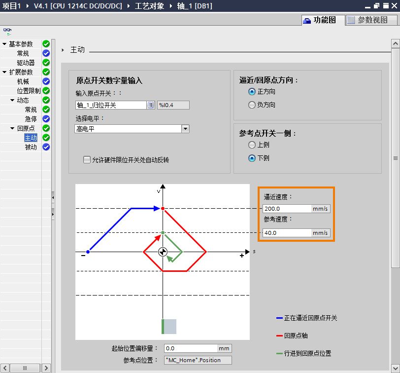
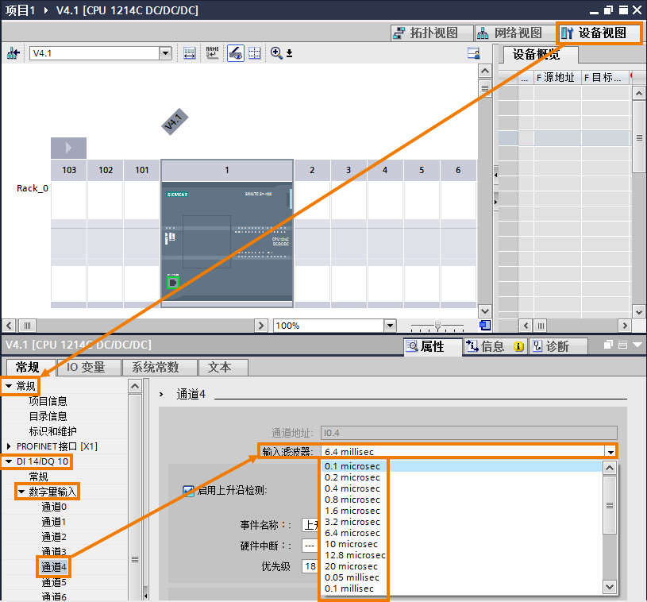
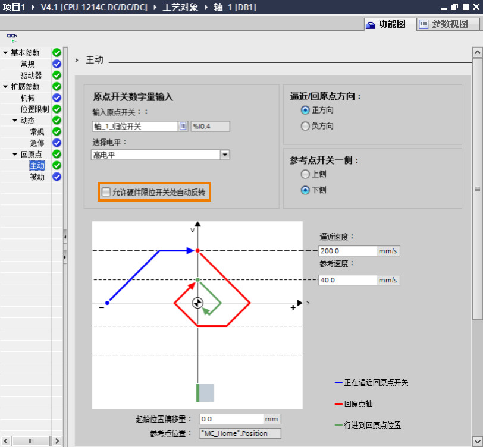
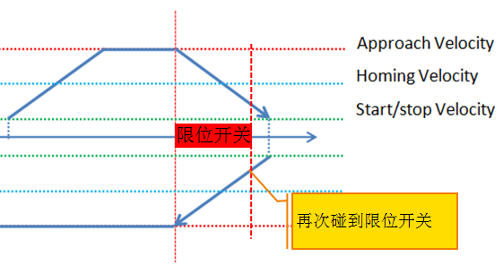
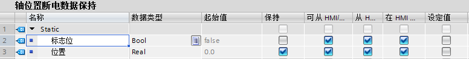
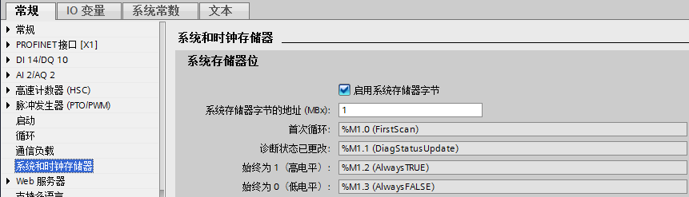
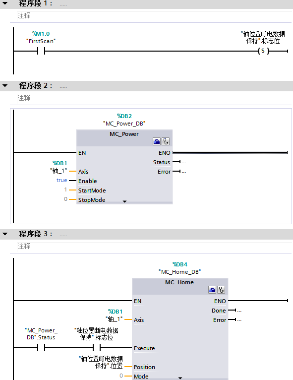
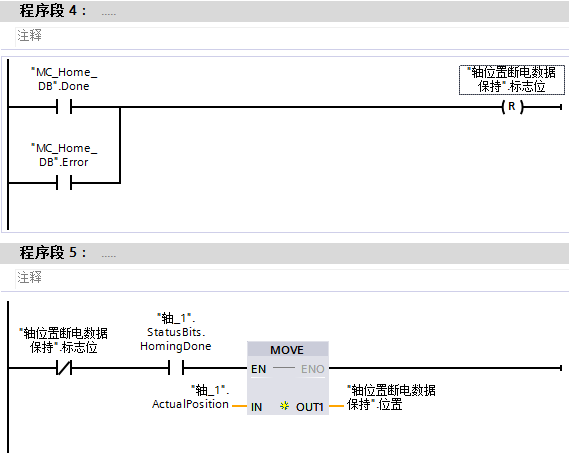

### [S7-1200 运动控制回原点与轴位置相关的常见问题]{#_Toc428444757} {#s7-1200-运动控制回原点与轴位置相关的常见问题 .STYLE1}

本页面仅针对回原点、轴位置的常见问题，其余运动控制常见问题参见[链接](01-FAQ.html)。

1.  [什么时候需要执行回原点命令？](#_Toc5)
2.  [回原点已完成信号什么时候会丢失？](#_Toc2)
3.  [如果实际没有原点开关和限位开关，可以使用绝对定位指令MC_MoveAbsolute吗？](#_Toc3)
4.  [闭环控制带有绝对值编码器的驱动器（例如：V90
    PN）时，通过"MC_Home"指令是否可以执行Mode=2或3的回原点操作？](#_Toc4)
5.  [为什么用户在实际执行回原点指令时，轴遇到原点开关没有变化，直到运行到硬件限位开关停止报错？](#_Toc5)
6.  [为什么轴在执行主动回原点命令时，初始方向没有找到原点，当需要碰到限位开关掉头继续寻找原点开关时并没有掉头，而是直接报错停止轴，报错原因是由于轴碰到了限位开关？](#_Toc6)
7.  [S7-1200 CPU上电后轴的位置是多少？](#_Toc7)
8.  [如何保持断电前的绝对位置？](#_Toc8)
9.  [如何修改轴当前的位置？\
    ](#_Toc9)

#### []{#_Toc}1.什么时候需要执行回原点命令？ {#什么时候需要执行回原点命令 .STYLE1}

答：用户需要使用MC_MoveAbsolute指令之前执行回原点指令。

#### []{#_Toc2}2.回原点已完成信号什么时候会丢失？ {#回原点已完成信号什么时候会丢失 .STYLE1}

答：请参见表 1 。

表 1 回原点比较

                                          PTO轴   闭环轴使用增量编码器   闭环轴使用绝对值编码器
  --------------------------------------- ------- ---------------------- ------------------------
  启动MC_Home命令进行主动回原点\*         √       √                      \-
  通过\"MC_Power\"运动控制指令，禁用轴    √                               
  通过调试面板回原点后取消调试功能        √                               
  CPU 断电 -\> 上电后                     √       √                       
  CPU 重新启动后 (RUN -\> STOP -\> RUN)   √                               
  编码器系统出错或编码器故障              \-      √                      √
  重新启动工艺对象                        √       √                       
  存储器复位                              √       √                       
  修改编码器组态                          \-      √                      √
  更换 CPU                                √       √                      √
  将 CPU 恢复为出厂设置                   √       √                      √
  将其它项目传送到控制器                  √       √                      √

\*：成功完成回原点操作之后，\"已回原点\"状态将再次置位。

#### []{#_Toc3}3.如果实际没有原点开关和限位开关，可以使用绝对定位指令MC_MoveAbsolute吗？ {#如果实际没有原点开关和限位开关可以使用绝对定位指令mc_moveabsolute吗 .STYLE1}

答： 可以。

对于PTO轴或使用增量编码器的闭环轴，使用MC_Home指令的Mode=0和Mode=1方式，让轴完成绝对坐标定位。然后就可以调用MC_MoveAbsolute指令进行绝对运动了。

对于使用绝对值编码器的闭环轴，使用MC_Home指令的Mode=6和Mode=7方式，让轴完成绝对坐标定位。然后就可以调用MC_MoveAbsolute指令进行绝对运动了。

MC_Home指令的Mode
0、1、6、7参见[链接](../06-Instruction/04-MC_Home.html)。

#### []{#_Toc4}4.闭环控制带有绝对值编码器的驱动器（例如：V90 PN）时，通过"MC_Home"指令是否可以执行Mode=2或3的回原点操作？ {#闭环控制带有绝对值编码器的驱动器例如v90-pn时通过mc_home指令是否可以执行mode2或3的回原点操作 .STYLE1}

答：
不可以，"MC_Home"指令会报错:ErrorID="16#8404"，ErrorInfo="16#0055"（增量编码器的模式无效）。可通过"MC_Home"指令Mode=6或7进行绝对值编码器的调节。

#### []{#_Toc5}5.为什么用户在实际执行回原点指令时，轴遇到原点开关没有变化，直到运行到硬件限位开关停止报错？ {#为什么用户在实际执行回原点指令时轴遇到原点开关没有变化直到运行到硬件限位开关停止报错 .STYLE1}

答：首先要测试原点开关是否起作用，也就是说当轴碰到原点开关时，原点开关的DI点的指示灯是否点亮。

> 可能的原因如下：
>
> ①寻找原点开关的速度过快，可以减小"逼近速度"和"参考速度"，如图 1 所示。
>
> > {width="812" height="756"}
> >
> > 图 1 速度设置
>
> ②原点开关有效时间过短，可以设置DI点滤波时间，例如图 1
> 原点开关是I0.4，则在"设备视图"中减小I0.4的滤波时间，默认情况下DI的滤波时间是6.4millisec，用户根据DI点有效时间选择合适的滤波时间。如图
> 2 所示。
>
> > {width="815" height="758"}
> >
> > 图 2 滤波时间

#### []{#_Toc6}6.为什么轴在执行主动回原点命令时，初始方向没有找到原点，当需要碰到限位开关掉头继续寻找原点开关时并没有掉头，而是直接报错停止轴，报错原因是由于轴碰到了限位开关？ {#为什么轴在执行主动回原点命令时初始方向没有找到原点当需要碰到限位开关掉头继续寻找原点开关时并没有掉头而是直接报错停止轴报错原因是由于轴碰到了限位开关 .STYLE1}

答：有几种可能：

> ①用户没有使能"**允许硬件限位开关处自动反转**"的选项。 如图 3 所示。
>
> > {width="812" height="752"}
> >
> > 图 3 允许反转
>
> ②工艺对象组态的硬件开关上/下限位输入点与实际的输入点不符。例：上限位组态为I0.0，下限位组态为I0.1，但实际I0.1为上限位，I0.0为下限位。
>
> ③轴在主动回原点期间到达硬件限位开关，轴将以组态的减速度减速，减速到启动/停止速度后反向运行寻找原点开关。如果限位开关行程过短，减速到启动/停止速度时轴运行超出了限位行程，在反向过程中会再次碰到限位开关，如下图所示，轴此时直接停止。如图
> 4 所示。
>
> 这种情况可以通过增加限位开关行程、增大组态的加速度/减速度或降低寻找原点时的逼近速度解决。
>
> > {width="561" height="296"}
> >
> > 图 4 流程

#### []{#_Toc7}7.S7-1200 CPU上电后轴的位置是多少？ {#s7-1200-cpu上电后轴的位置是多少 .STYLE1}

答：对于PTO轴或使用增量编码器的闭环轴，S7-1200
CPU每次上电后轴的位置都是0，不会保留断电前的位置值。

如何保持断电前的位置，请参考[常见问题 8](#_Toc8)。

对于使用绝对值编码器的闭环轴，如果使用 Mode 6 或 7
进行了设置原点操作，那么 CPU 上电后将保持断电前的位置。

#### []{#_Toc8}8.如何保持断电前的绝对位置？ {#如何保持断电前的绝对位置 .STYLE1}

答：使用绝对位置编码器的闭环轴使用MC_HOME指令的模式6，7可以实现位置的断电保持；\
对于PTO或者使用增量型编码器的闭环轴是不能断电保持的，CPU断电重新上电后，轴的绝对位置会重新变成0，要实现位置保持，可按照下面的步骤操作。

1\.
在全局DB块里分别建立一个Bool和Real类型变量，勾选Real变量的保持性，如图5
所示：

{width="776" height="99"}

图 5 设置变量

2.进入设备组态界面，在\"系统和时钟存储器\"页面启用系统存储器字节，分配系统存储器参数时，需要指定用作系统存储器字节的
CPU 存储器字节。 首次循环对应的位启动后的第一个程序循环中为 1 ，否则为
0。如图 6 所示

{width="861" height="247"}

图 6 激活系统和时钟存储器

3.在 Main
\[OB1\]中，先使用M1.0置位标志位，然后使用"MC_Power"指令启动轴后调用"MC_Home"指令的
Mode 0
，重新装载断电前绝对位置，然后复位标志位，最后当前位置"ActualPosition"传送到第一步建立的变量中。如图
7、 图 8 所示。

注：如果存在多个运动控制指令，如"MC_Home"指令，每个指令的背景 DB
块需要单独创建，以免产生冲突。可以根据实际工艺情况，在合适的时间点执行"MC_Power"指令和"MC_Home"指令装载新的断电前的绝对位置。

{width="591" height="766"}

图 7 程序 1

{width="569" height="455"}

图 8 程序 2

#### []{#_Toc9}9.如何修改轴当前的位置？ {#如何修改轴当前的位置 .STYLE1}

对于 PTO 轴或使用增量编码器的闭环轴，使用 MC_Home 指令的 Mode=0
方式，修改当前轴的位置。

对于使用绝对值编码器的闭环轴，使用 MC_Home 指令的 Mode=7
方式，修改当前轴的位置。
