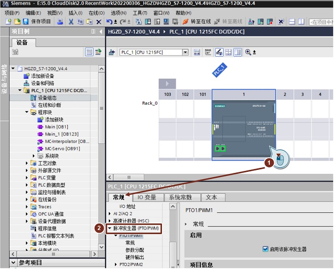
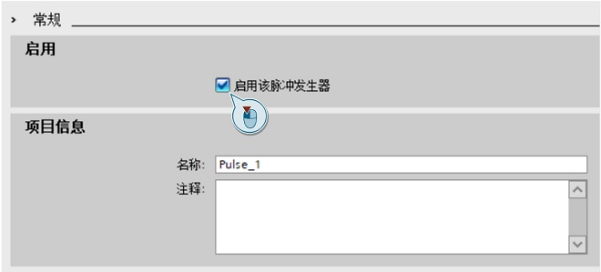
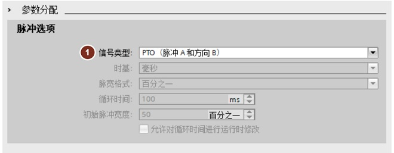
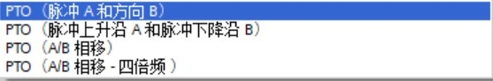
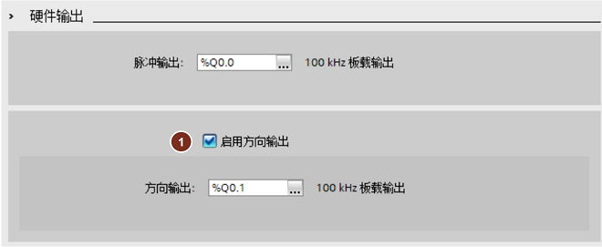
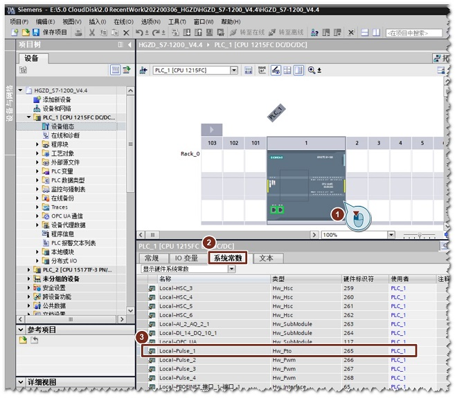
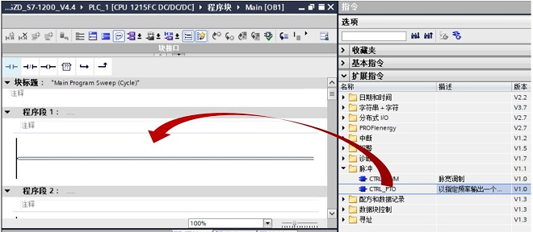
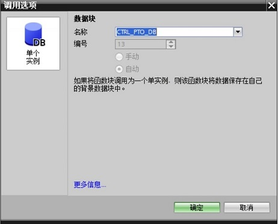
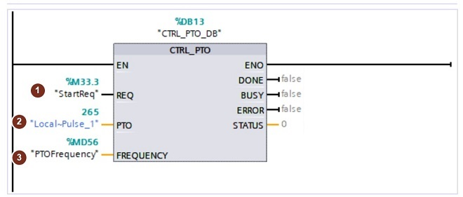
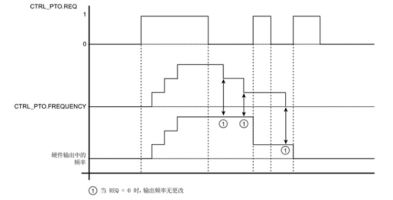

### Ctrl_PTO使用

CTRL_PTO 指令以指定频率提供 50%
占空比输出的方波，此时，无需使用工艺对象的轴数据块。

### 硬件组态

本文档以DC/DC/DC类型的S7-1200 CPU为例进行说明。在Portal
软件中插入S7-1200 CPU（DC输出类型），在"设备视图"中配置PTO。

1\. 进入CPU"常规"属性，设置"脉冲发生器"。如下图所示：

{width="660" height="532"}

2\.
**启用脉冲发生器**：可以给该脉冲发生器起一个名字，也可以不做修改使用软件默认设置值；可还以对该PTO脉冲发生器添加注释说明。如下图所示：

{width="660" height="299"}

**3. 参数分配**：组态脉冲参数，如下图所示，PTO输出模式仅需定义信号类型。

{width="660" height="257"}

**① 信号类型**：PTO又分成4种，每种类型的具体含义在运动控制部分进行介绍。

{width="557" height="92"}

**4. 硬件输出**：根据需要选择S7-1200
PLC对应的PTO硬件输出点。如下图所示：

{width="660" height="271"}

**① 启用方向输出**：可以选择使能方向输出或取消方向输出点。

**5. 硬件标识符**：PTO通道的硬件标识符是软件自动生成的，不能修改。
可以在系统常数里获得对应通道的硬件标识符。如下图所示：

{width="660" height="576"}

### 软件编程

1\.
在Portal软件中打开程序块，进行PTO的编程。在指令选件中的"扩展指令"中的"脉冲"文件夹中可以找到CTRL_PTO令。可以通过双击指令或是拖拽的方式把CTRL_PTO指令放到程序编辑区。如下图所示：

{width="660" height="288"}

2\.
在插入CTRL_PTO指令时会提示关联背景数据块，如下图所示，该数据块的名称和编号可以由用户手动设置，也可以选择系统默认值。

{width="462" height="373"}

3\. 配置CTRL_PTO指令参数。

{width="660" height="281"}

**①REQ**：

-   REQ=1：将脉冲发生器的频率设置为 FREQUENCY 的值
    REQ=1 和 FREQUENCY=0：禁用脉冲发生器
-   REQ=0：脉冲发生器无变化

**②PTO**：PTO 标识符,脉冲发生器的硬件 ID\
**③FREQUENCY**：PTO 所需频率（Hz）。

4.REQ与FREQUENCY的时序关系

如下图所示：当将 REQ 输入设置为 TRUE 时，FREQUENCY 值生效。如果 REQ 为
FALSE，则无法修改 PTO 的输出频率，且 PTO 继续输出脉冲。\

{width="660" height="337"}\
