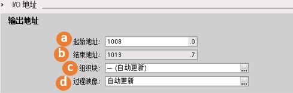
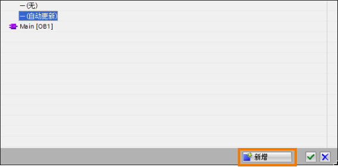
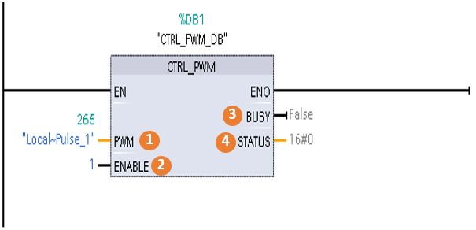
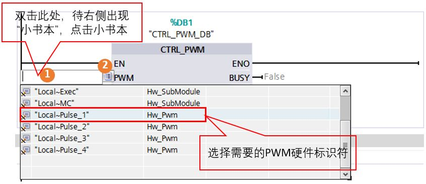
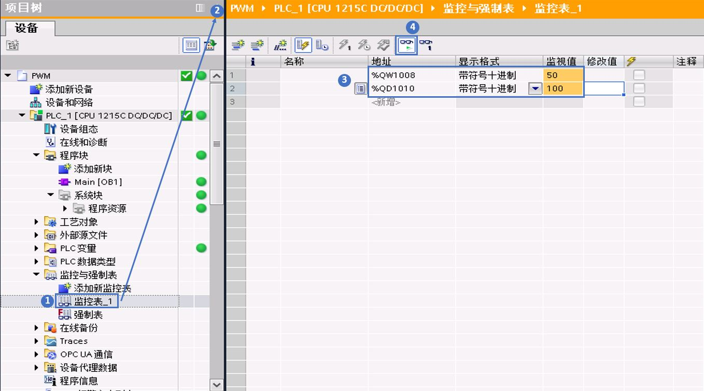

### S7-1200 PWM 功能组态及编程方法

本文档以DC/DC/DC类型的S7-1200 CPU为例进行说明。在Portal
软件中插入S7-1200 CPU（DC输出类型），在"设备视图"中配置PWM。

硬件：\
① S7-1200 CPU （文档中使用V4.4版本 S7-1215C DC/DC/DC）\
② PC（带以太网卡）\
③ TP电缆(以太网电缆）

软件：\
①STEP7 V11 或更高版本 （文档中使用V16版本）\

#### 硬件组态

1\. 进入CPU"常规"属性，设置"脉冲发生器"。如下图1.1所示：

> {width="1255" height="708"}

> 图1.1 CPU常规属性

2\.
启用脉冲发生器，可以给该脉冲发生器起一个名字，也可以不做修改使用软件默认设置值；可还以对该PWM脉冲发生器添加注释说明。如下图1.2所示：

> {width="655" height="206"}
>
> 图1.2 启用脉冲发生器

**3.**
参数分配：组态脉冲参数，如下图1.3所示，"参数分配"部分对PWM脉冲的周期单位、脉冲宽度做了定义。

> {width="594" height="200"}
>
> 图1.3 参数分配设置
>
> **a.
> 信号类型**：选择脉冲类型。如下图1.4所示，有PWM和PTO两种，其中PTO又分成4种，每种类型的具体含义在运动控制部分进行介绍。这在里选择PWM。
>
> {width="141" height="73"}
>
> 图1.4 脉冲信号类型
>
> **b.
> 时基**：用来设定PWM脉冲周期的时间单位。在PWM模式下，时基单位分成：毫秒和微秒。
>
> **c. 脉宽格式**：用来定义PWM脉冲的占空比档次，如下图1.5所示，分成4种：
>
> {width="84" height="59"}
>
> 图1.5 脉宽格式设置
>
> -   以其中的"百分之一"举例，表示把PWM脉冲周期分成100等分，以1/100为单位来表示一个脉冲周期中脉冲的高电平，也可以理解成1/100是PWM脉冲周期中高电平的分辨率。"千分之一"和"万分之一"相应地把PWM的周期分成更小的等分，分辨率更高。
> -   "S7模拟量格式"表示的是把PWM的周期划分成27648等分，以1/27648为单位来表示一个脉冲周期中脉冲的高电平。
>     因为S7-1200 PLC的模拟量量程范围为0～27648或-27648～27648。
>
> **d. 循环时间（仅适用于 PWM）**：表示PWM脉冲的周期时间，Portal
> 软件中对"循环时间"限定的范围值：1～16777215。可以通过选中复选框\"允许在运行时修改循环时间\"，在运行时更改循环时间。
>
> **e. 初始脉冲宽度（仅适用于
> PWM）**：表示PWM脉冲周期中的高电平的脉冲宽度，可以设定的范围值由"脉宽格式"确定。例如，如果"脉宽格式"选择了"万分之一"，则"初始脉冲宽度"值可以设定的范围值从0～10000，同理，如果"脉宽格式"选择了"S7模拟量格式"，则"初始脉冲宽度"值可以设定的范围值从0-27648。可通过使用
> I/O 地址中组态的 Q 字地址，在运行系统中更改初始脉冲持续时间值。
>
> **f. 允许在运行时更改循环时间（仅适用于
> PWM）**：如果选择该选项，则PLC在I/O地址处额外分配 Q 存储器的 4
> 个字节。用户可在程序处于运行状态时，修改 PWM 信号的循环时间。

**4. 硬件输出**：根据需要选择S7-1200
PLC上的某个DO点作为PWM输出。如下图1.6所示：

> {width="473" height="226"}
>
> 图1.6 硬件输出设置
>
:::{attention}
该点只能是CPU上的DO点，或是SB信号板上的DO点。S7-1200 **SM**扩展模块上的DO点不支持PWM功能。
:::
**5. I/O地址**：用来设置PWM的地址和周期更新方式，如下图1.7所示：

> {width="489" height="156"}
>
> 图1.7 输出地址设置
>
> **a. 起始地址**：用来设定该PWM通道地址。
>
> **b.
> 结束地址：**由\"起始地址\"决定，默认情况下，每个PWM通道仅占用一个Word的长度，用于输出脉冲的持续时间。如果选中\"允许在运行时修改循环时间\"
> 复选框后，CPU会分配6个输出字节，其中前2个字节用于输出\"脉冲持续时间\"值，后4个字节用于输出\"循环时间\"值。
>
> **c. 组织块**：用来设置PWM
> I/O地址的更新方式是基于哪个OB块的。用户可以根据需要通过"新增"按钮来添加相应的OB块，如下图1.8所示，本例中用户可以选择默认选项"自动更新"。
>
> {width="567" height="278"}
>
> 图1.8 组织块设置
>
> **d.
> 过程映像**：设置PWM的I/O地址的过程映像的更新情况，这里的"PWM的I/O地址"指的是PWM周期脉冲宽度数值存放的地址。该选项用来设置脉冲宽度地址的更新情况。如下图1.9所示：
>
> {width="567" height="278"}
>
> 图1.9 过程映像设置
>
> -   S7-1200提供了6个过程映像分区。第一个过程映像分区"自动更新"指定用于每个扫描周期都自动更新的I/O，此为默认分配；接下来的4个分区PIP1、PIP2、PIP3和PIP4可用于将I/O过程映像更新分配给不同的中断事件。"PIP
>     OB伺服"是给S7-1200运动控制的等时同步模式使用的。
> -   默认情况下，Portal 软件会将其I/O过程映像更新为"自动更新"
>     (Automatic update)。对于组态为"自动更新"(Automatic
>     update)的I/O，CPU将在每个扫描周期自动处理模块和过程映像之间的数据交换。
> -   如果将I/O分配给过程映像分区PIP1～PIP4中的其中一个，但未将OB分配给该分区，那么CPU决不会将I/O更新至过程映像，也不会通过过程映像更新I/O。将I/O分配给未分配相应OB的PIP，相当于将过程映像指定为"无"(None)。在设备组态中将
>     I/O 分配给过程映像分区，并在创建中断 OB 或是编辑 OB
>     属性时将过程映像分区分配给中断事件。
> -   用户可以在指令执行时立即读取物理输入值和立即写入物理输出值。无论
>     I/O点是否被组态为存储到过程映像中，立即读取功能都将访问物理输入的当前状态而不更新过程映像输入区。
>     立即写入物理输出功能将同时更新过程映像输出区（如果相应
>     I/O点组态为存储到过程映像中）和物理输出点。如果想要程序不使用过程映像，直接从物理点立即访问
>     I/O 数据，则在 I/O地址后加后缀\":P\"。
>
> 根据上面的说明，本例中用户可以直接选择"自动更新"。由于PWM的I/O地址是Q（输出区），因此用户可以使用QWx/QDx，也可以直接更新外设地址QWx:P/QDx:P。

#### 软件编程

1\.
在Portal软件中打开程序块，进行PWM的编程。在指令选件中的"扩展指令"中的"脉冲"文件夹中可以找到CTRL_PWM指令。可以通过双击指令或是拖拽的方式把CTRL_PWM指令放到程序编辑区。如下图2.1所示：

> {width="1316" height="483"}
>
> 图2.1 调用CTRL_PWM指令

2\.
在插入CTRL_PWM指令时会提示关联背景数据块，如下图2.2所示，该数据块的名称和编号可以由用户手动设置，也可以选择系统默认值。

> {width="495" height="400"}
>
> 图2.2 CTRL_PWM指令关联背景数据块

3\. 配置CTRL_PWM指令参数。

> {width="605" height="292"}
>
> 图2.3 CTRL_PWM指令管脚配置
>
> **①PWM**：脉冲发生器的硬件ID号，就是"硬件标识符"，在上面的例子中硬件标识符为265。硬件标识符的选择，如下图2.4所示。\
> **②ENABLE**：PWM脉冲的使能端，为TURE时CPU发PWM脉冲，为False时，不发脉冲。\
> **③BUSY**：标识CPU是否正在发PWM脉冲。\
> **④STATUS**：PWM指令的状态值，当STATUS=0时表示无错误，STATUS非0时表示PWM指令错误，具体的错误值查看帮助或是系统手册。
>
> {width="846" height="366"}
>
> 图2.4 选择CTRL_PWM指令硬件标识符

4\.
监控程序，并在线修改PWM的脉冲宽度和循环周期。如下图2.5所示，用M0.0使能CTRL_PWM指令。

> {width="600" height="287"}
>
> 图2.5 使能CTRL_PWM指令
>
> 实时修改PWM的脉冲宽度：需要修改QWx的数值，"x"就是用户配置PWM硬件组态时的"I/O地址\--输出地址"。
>
> 实时修改PWM的循环周期：首先硬件组态内选中\"允许在运行时修改循环时间\"复选框，然后修改QD(x+2)的数值。
>
> 例如，启用该选项后，CPU 会为 PWM1 分配六个字节，并由您确定使用 QB1008
> 到 QB1013。下载程序并启动 PWM 后，可以使用 QW1008
> 修改\"脉冲持续时间\"，以及使用 QD1010 修改\"循环时间\"。
>
> 如下图2.6所示，①
> 在Portal软件左侧项目树中的"监控与强制表"中插入一个新的监控表，②在打开的空白监控表中的"地址"列手动输入QW1008和QD1010，如然后在"显示格式"一列选择"带符号十进制"，如下图步骤③所示。点击监控按钮，如图中④
> 所示，可以看到QW1008的监控值为50和QD1010的监控值为100，该值分别是组态PWM时设置的初始脉冲宽度值和循环时间值。
>
> {width="1358" height="756"}
>
> 图2.6 监控PWM的脉冲宽度和循环时间
>
> 用户可以在监控表中直接修改QW1008和QD1010的数值，来实时更改PWM的脉冲宽度和PWM的循环周期，如下图2.7所示。
>
> {width="591" height="629"}
>
> 图2.7 实时修改PWM的脉冲宽度和循环时间
>
> 用户可以根据需要进行测试实验。

### 常见问题

 问题1：如何更改PWM的脉冲宽度？\
答：通过设置PWM的I/O地址。以上面的组态为例子，通过修改QW1008的数值来实时修改PWM的脉冲宽度。

 问题2：如何修改PWM的循环周期？\
答：首先硬件组态内选中\"允许在运行时修改循环时间\"复选框，然后修改对应I/Q地址内的QD的数值。以上面的组态为例子，通过修改QD1010的数值来实时修改PWM的循环周期。

{width="15"
height="15"}问题3：PWM脉冲输出的最小持续时间？\
答：当您设置 PWM
信号的脉宽时，如果时基为\"毫秒\"，实际脉宽（脉冲为高电平的时间）必须大于或等于
1 毫秒。如果时基为\"微秒\"，实际脉宽必须大于或等于 1 微秒。如果脉宽小于
1 倍\"时基\"，输出将关断。\
例如，周期时间为 10 微秒时，百分之 5 的脉冲持续时间可得到 0.5
微秒的脉宽。因为该值小于 1 微秒，PWM 信号关闭。
