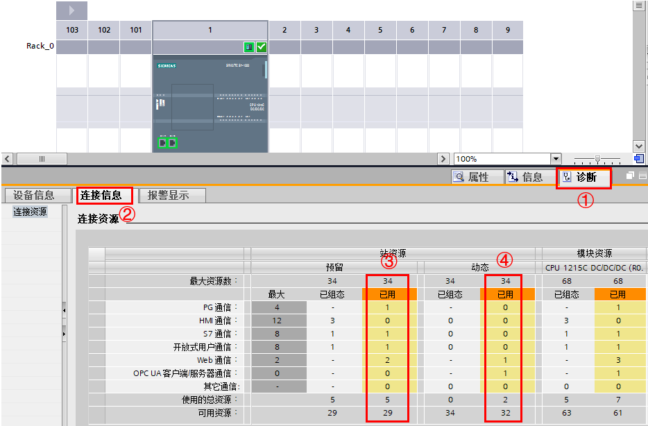
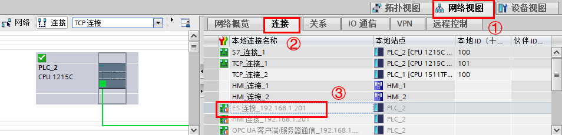

## 通信协议与资源

### PROFINET 通信口

S7-1200 CPU 本体上集成了一个 PROFINET 通信口（CPU 1211C - CPU 1214C）或者两个 PROFINET 通信口（CPU 1215C - CPU 1217C），支持以太网和基于 TCP/IP 和 UDP 的通信标准。这个 PROFINET 物理接口是支持 10/100Mb/s 的 RJ45 口，支持电缆交叉自适应，因此标准的或是交叉的以太网线都可以用于这个接口。使用这个通信口可以实现 S7-1200 CPU 与编程设备的通信，与 HMI 触摸屏的通信，以及与其它 CPU 之间的通信。

以下内容为最新版固件支持的协议和连接资源，对于低版本固件的协议和连接资源，请查看[链接](03-Intro_Archive.htm)。

### 固件版本 V4.6 本体以太网网口支持的协议

S7-1200 CPU 的 PROFINET 通信口主要支持以下通信协议及服务：

* Profinet IO
    * IO控制器
    * 智能设备
    * 共享设备
* PG 通信（编程调试）
* HMI 通信
* S7 通信
* 开放式用户通信
    * TCP
    * ISO on TCP
    * UDP  
        
    * Modbus TCP
    * Email
    * 安全开放式用户通信
* Web 服务器
* OPC UA 服务器

### 固件版本 V4.6 支持的最大的连接资源

#### S7-1200 的连接资源

如表 1 所示，分配给每个类别的预留连接资源数为固定值，无法更改这些值。 但可组态 34 个"动态连接"以按照应用要求增加任意类别的连接数。

|     | 编程 PG 通信 | HMI 通信 | S7 通信 | 开放式用户通信 | Web 服务器 | 动态资源 |
| --- | --- | --- | --- | --- | --- | --- |
| 预留连接资源数量 | 4（保证支持 1 个 PG） | 12（保证支持 4 个 HMI） | 8   | 8   | 2   | 34  |

表 1 连接资源预留

通过动态资源可以增加每类通信资源个数，但是每类通信有最大资源占用数，如表 2 所示。

|     | 编程 PG 通信 | HMI 通信 | S7 通信 | 开放式用户通信 | Web 服务器 | OPC UA |
| --- | --- | --- | --- | --- | --- | --- |
| 可以使用的最大连接资源数量 | 4（保证支持 1 个 PG） | 18  | 14  | 14  | 30  | 10  |
| 可以使用的动态资源数量（最大-预留） | 0   | 6   | 6   | 6   | 28  | 10  |

表 2 最大连接资源使用

连接会先使用预留资源，当预留资源占用完以后才会使用动态资源。每个预留资源只能留给自身连接使用。

动态资源本着"先到先得"的原则，先建立的连接先占用，如果动态资源已经全部被占用，即使某类连接已经使用的资源数超过了预留资源数量但没有达到最大连接资源数，也无法再继续增加该类连接。

例如：通过 S7 通信占用 6 个动态资源， HMI 占用 6 个动态资源，OPC UA 占用 10 个动态资源，开放式通信占用 6 个动态资源，这样只剩余 6 个动态资源可以用于 Web ，加上 2 个预留 Web 资源，这样无法保证可以支持 1 个 Web 浏览器客户端的正常使用，因为 1 个 Web 浏览器客户端最多使用 10 个连接资源。

除以上连接资源，S7-1200 可以作为 IO 控制器通过 Profinet IO 连接最多 16 个 IO 设备，最多 256 个子模块。此外还可以同时作为 I Device（智能设备）连接 IO 控制器。如果使用共享设备功能，可以最多同时连接两个 IO 控制器。这些资源与上述连接资源数据无关。

Profinet IO 功能与 S7 连接、开放式通信、HMI 等连接资源中提到的通信可以同时存在。

通过 CM/CP 不能扩展最大通信资源。

S7 自由连接使用动态资源而非 S7 通信资源。S7 自由连接是指当某 S7 CPU （或者 SIMATIC NET ）建立未指定 S7 连接，指向一个 S7-1200，该 S7-1200 使用 1 个动态资源。

在 TIA PORTAL 软件的设备视图的 CPU 属性中的连接资源，可以看到如图 1 所示的已组态资源情况。

其中项目中已组态的 S7 通信、HMI 通信（集成连接）、开放式用户通信（网络视图组态）可以在已组态列看到通信使用情况，而其他通信资源占用情况在离线项目无法得知。如图1中所示目前该 CPU 通过组态占用 1 个 S7 通信资源，3 个 HMI 资源 ，1 个开放式用户通信。

图 1 CPU 连接资源

在 CPU 转到在线时可以看到所有通信资源的使用情况。通过在网络视图或者设备视图，将 CPU 转至在线后可以得知实际占用资源情况，如图 2 所示。

图 2 实际使用资源

图 2 中实际使用资源如下：

③预留列已用 PG 资源 1， S7 通信资源 1，开放式用户通信资源 1， Web 通信资源 2，总共使用资源 5

④动态列已用 Web 通信资源 1， OPC UA 通信资源 1，总共使用资源 2

合计使用资源 7，剩余资源 61

#### PG 连接资源

在表 1 可以得知，PG 资源有 4 个，但注意实际上 1 台 S7-1200 同时只能连接 1 个 PG ，也就是对于 1 台 S7-1200 同时只有 1 台电脑能够通过 TIA PORTAL 进行在线连接调试。

在图 3 的网络视图的连接表格的 ES 连接即使用 PG 连接资源。

图 3 连接表格

#### HMI 连接资源

S7-1200 的预留 HMI 资源有 12 个。根据 HMI 类型或型号以及使用的 HMI 功能，每个 HMI 实际可能占用 S7-1200 连接资源中的 1 个、2 个或 3 个。对于12 个预留 HMI 资源，可以同时使用至少 4 个 HMI（如果考虑到动态资源，则可以连接更多的 HMI）。HMI 可利用其可用连接资源（每个 1 个，共 3 个）实现下列功能：

* 读取
* 写入
* 报警和诊断

表 3 示例共有 5 个 HMI 设备访问 S7-1200，占用了 S7-1200 的 12 个 HMI 连接资源。

|     |     |     |     |     |     |     |
| --- | --- | --- | --- | --- | --- | --- |
|     | HMI 1 | HMI 2 | HMI 3 | HMI 4 | HMI 5 | HMI |
| 使用的连接资源 | 2   | 2   | 2   | 3   | 3   | 12  |

表 3 HMI 资源占用

#### HMI 设备占 S7-1200 的 HMI 连接资源个数

* 基于 WinCC TIA Portal 的组态：

|     |     |     |     |     |
| --- | --- | --- | --- | --- |
|     | 资源数（默认） | 简单通讯 | 系统诊断 | 运行系统报警记录 |
| 基本面板 | 1   | 1   | 1   | -   |
| 多功能面板 | 2   | 1   | -   | -   |
| 精智面板 | 2   | 1   | 2   | -   |
| WinCC RT Advanced | 2   | 1   | 2   | -   |
| WinCC RT Professional | 3   | 2   | 2   | 3   |

表 4 不同 HMI 资源占用情况

注："资源数（默认）"是当 HMI 与 S7-1200 在一个项目中组态 HMI 连接时，会占用 S7-1200 的组态的 HMI 连接个数。

如图 4 所示：示例中 HMI_1 为精智面板。

图 4 精智面板连接 S7-1200

图 5 HMI 占用资源

如图 5 所示，1 个精智面板的连接占用 S7-1200 2 个 HMI 资源。

这个连接个数是这个 HMI 设备所能占用 S7-1200 的最大 HMI 连接个数，可以作为选型参考。

 Smart 触摸屏不支持 S7-1200

可以访问 S7-1200 的 HMI 面板的其他信息

请参考：[https://support.industry.siemens.com/cs/cn/zh/view/109475049](https://support.industry.siemens.com/cs/cn/zh/view/109475049)

### 物理网络连接

S7-1200 CPU 的 PROFINET 口有两种网络连接方法：

* 直接连接：当一个 S7-1200 CPU 与一个编程设备，或是 HMI ，或是另一个 PLC 通信时，也就是说只有两个通信设备时，实现的是直接通信。直接连接不需要使用交换机，用网线直接连接两个设备即可。

图 6 直接连接

* 网络连接：当多个通信设备进行通信时，也就是说通信设备为两个以上时，实现的是网络连接。

多个通信设备的网络连接需要使用以太网交换机来实现。可以使用导轨安装的西门子 CSM1277 的 4 口交换机连接其它 CPU 及 HMI 设备。

CSM1277 交换机是即插即用的，使用前不用做任何设置。

图 7 网络连接

① CSM1277 以太网交换机