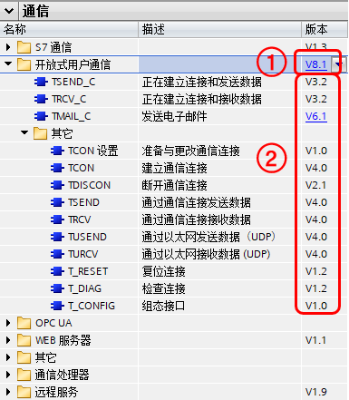

### 开放式用户通信分类

TIA PORTAL 软件内提供了以下指令：

-   不带连接管理的通信指令
    -   "TCON " ：建立以太网连接
    -   "TDISCON" ：断开以太网连接
    -   "TSEND" ：TCP 和 ISO ON TCP 使用的发送数据
    -   "TRCV"： TCP 和 ISO ON TCP 使用的接收数据
    -   "TUSEND"：UDP 使用的发送数据
    -   "TURCV"： UDP 使用的接收数据\
-   带连接管理的通信指令
    -   "TSEND_C " ：建立以太网连接并发送数据
    -   "TRCV_C " ：建立以太网连接并接收数据
-   修改 TCP 连接的终止方式：TCONSettings
-   发送邮件：TMAIL_C
-   复位连接：T_RESET
-   诊断连接：T_DIAG
-   修改以太网口组态：T_CONFIG

### 开放式用户通信指令版本

开放式用户通信如图1所示。

{width="385" height="441"}

图1 开放式用户通信指令

①指令集版本

②指令版本

开放式用户通信指令集由以上指令组成。每个版本 CPU
都可以支持多个版本的开放式用户通信指令集，见表1，**[建议使用默认的指令集版本也就是最高的版本]{.underline}**，低版本指令集一般是用来低版本
CPU 程序移植到高版本 CPU 时用的。

  CPU 版本    支持的开放式用户通信指令集版本
  ----------- --------------------------------
  V1.0-V4.0   V2.x-V3.x
  V4.1        V2.x-V4.x
  V4.2-V4.3   V2.x-V6.x
  V4.4-V4.6   V2.x-V8.x

对于基本的 TCP、ISO ON TCP 以及 UDP 来说，指令集总体分为 V4.x 以下与
V4.x 及以上。

V4.x 以下所有指令集版本功能基本一致，只是内部微调；

V4.x 及以上所有指令集版本基本功能一致，变化较大是 V6.x 支持安全 TCP
通信，V8.x支持 TCONSettings 指令。此外 Tmail_C 这个发邮件指令在 V4.x
及以上所有指令集版本中变化很大。

### V4.x 以下和 V4.x 及以上指令集主要区别

#### V4.x 以下指令集使用组合

对于 TCP、ISO ON TCP 通信

TSEND_C = TCON + TSEND + TDISCON

TRCV_C = TCON + TRCV + TDISCON

一般使用组合是：

-   TCON + TSEND + TRCV + TDISCON
-   TSEND_C + TRCV
-   TSEND + TRCV_C
-   TSEND_C + TRCV_C

对于 UDP 通信

一般使用组合是：

-   TCON + TUSEND + TURCV + TDISCON

#### V4.x 及以上指令集使用组合

对于 TCP、ISO ON TCP 通信

TSEND_C = TCON + TSEND + TDISCON

TRCV_C = TCON + TRCV + TDISCON

对于 UDP 通信

TSEND_C = TCON + TUSEND + TDISCON

TRCV_C = TCON + TURCV + TDISCON

对于 TCP、ISO ON TCP 一般使用组合是：

-   TCON + TSEND + TRCV + TDISCON
-   TSEND_C + TRCV
-   TSEND + TRCV_C
-   TSEND_C + TRCV_C

对于 UDP 一般使用组合是：

-   TCON + TUSEND + TURCV + TDISCON
-   TSEND_C + TRCV
-   TSEND + TRCV_C
-   TSEND_C + TRCV_C

#### V4.x 以下和 V4.x 及以上指令集主要区别列表

+-----------------------+-----------------------+-----------------------+
|                       | V4.x 以下指令集       | V4.x 及以上指令集     |
+=======================+=======================+=======================+
| **连接管理的指令      |                       |                       |
| TSEND_C 和 TRCV_C**   |                       |                       |
+-----------------------+-----------------------+-----------------------+
| 对 UDP 的支持         | 不支持                | 支持                  |
+-----------------------+-----------------------+-----------------------+
| 连接建立              | 一个扫描周期 DONE=1   | 一个扫描周期 DONE=0   |
|                       | STATUS=0              | STATUS=1              |
+-----------------------+-----------------------+-----------------------+
| 作业中                | STATUS=7002           | -   **T               |
|                       |                       | SEND_C**：STATUS=7005 |
|                       |                       | -   **                |
|                       |                       | TRCV_C**：STATUS=7006 |
+-----------------------+-----------------------+-----------------------+
| **TCON**              |                       |                       |
+-----------------------+-----------------------+-----------------------+
| 客                    | BUSY=1                | ERROR=1，             |
| 户端无法访问到服务器  | 不报错                | 重新连接需要重新触发  |
|                       | 误，一直等待连接伙伴  |                       |
+-----------------------+-----------------------+-----------------------+
| **接收指令            |                       |                       |
| TRCV_C、TRCV**        |                       |                       |
+-----------------------+-----------------------+-----------------------+
| TCP 变长接收          | LEN=65535             | ADHOC = True          |
+-----------------------+-----------------------+-----------------------+
| **连接指令            |                       |                       |
| TSEND_C、TRCV_C       |                       |                       |
| 、TCON**              |                       |                       |
+-----------------------+-----------------------+-----------------------+
| 连接参数              | TCON_Param            | -                     |
|                       |                       |  TCP、UDP：TCON_IP_V4 |
|                       |                       | -   ISO ON            |
|                       |                       |     TCP：TCON_IP_RFC  |
|                       |                       | -   （也兼容支持      |
|                       |                       |     TCON_Param）\*    |
+-----------------------+-----------------------+-----------------------+
| **CP1243-1**          |                       |                       |
+-----------------------+-----------------------+-----------------------+
| CP1243-1 使用 OUC     | 不支持                | 支持                  |
| 指令                  |                       |                       |
+-----------------------+-----------------------+-----------------------+

\*V6.x 开始支持 TCON_IP_V4_SEC、V7.x 使用 V3.2 版本 CP1243-1 支持
TCON_QDN 和 TCON_QDN_SEC，其中"SEC"为安全 TCP
通信使用，"QDN"为域名访问。
