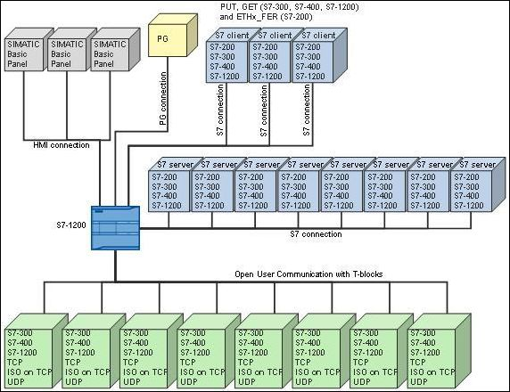
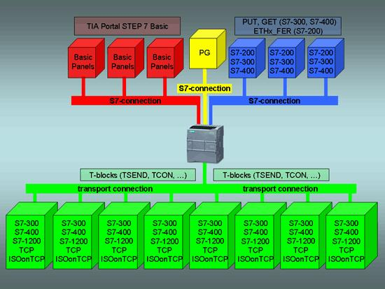

## 资源

### S7-1200 V4.5 版本支持的协议以及最大连接资源

S7-1200 CPU （V4.5 版本） 的 PROFINET 通信口主要支持以下通信协议及服务：

* Profinet IO
    * IO控制器
    * 智能设备
    * 共享设备
* PG 通信（编程调试）
* HMI 通信
* S7 通信
* 开放式用户通信
    * TCP
    * ISO on TCP
    * UDP  
        
    * Modbus TCP
    * Email
    * 安全开放式用户通信
* Web 服务器
* OPC UA服务器

如表1所示，分配给每个类别的预留连接资源数为固定值，无法更改这些值。

|     | 编程PG通信 | HMI通信 | S7通信 | 开放式用户通信 | Web服务器 | 动态资源 |
| --- | --- | --- | --- | --- | --- | --- |
| 预留连接资源数量 | 4（保证支持1个PG） | 12（保证支持4个HMI） | 8   | 8   | 2   | 34  |

表 1 连接资源

通过动态资源可以增加每类通信资源个数，但是每类通信有最大资源占用数，如表 2 所示。

|     | 编程 PG 通信 | HMI 通信 | S7 通信 | 开放式用户通信 | Web 服务器 | OPC UA |
| --- | --- | --- | --- | --- | --- | --- |
| 可以使用的最大连接资源数量 | 4（保证支持 1 个 PG） | 18  | 14  | 14  | 30  | 10  |
| 可以使用的动态资源数量（最大-预留） | 0   | 6   | 6   | 6   | 28  | 10  |

表 2 最大连接资源使用

### S7-1200 V4.0-V4.4 版本支持的协议以及最大连接资源

S7-1200 CPU （V4.0-V4.4版本） 的PROFINET 通信口主要支持以下通信协议及服务：

* Profinet IO
    * IO控制器
    * 智能设备
    * 共享设备（V4.1开始）
* PG 通信（编程调试）
* HMI 通信
* S7 通信
* 开放式用户通信
    * TCP
    * ISO on TCP
    * UDP  
        
    * Modbus TCP
    * Email
    * 安全开放式用户通信（V4.3开始）
* Web 服务器
* OPC UA服务器（V4.4开始）

如表 3 所示，分配给每个类别的预留连接资源数为固定值，无法更改这些值。 通过动态资源可以增加每类通信资源个数。

|     | 编程PG通信 | HMI通信 | S7通信 | 开放式用户通信 | Web服务器 | 动态资源 |
| --- | --- | --- | --- | --- | --- | --- |
| 预留连接资源数量 | 4（保证支持1个PG） | 12（保证支持4个HMI） | 8   | 8   | 30（保证支持3个浏览器客户端） | 6   |

表 3 连接资源

注意：OPC UA通信使用动态资源，最多建立5个连接使用5个动态资源。

### S7-1200 V4版本以下支持的协议以及最大连接资源

### 支持的协议和最大的连接资源

S7-1200 CPU （V4版本以下）的PROFINET 通信口主要支持以下通信协议及服务

* Profinet IO 控制器 （V2.0开始）
* PG 通信（编程调试）
* HMI 通信
* S7 通信
    * 客户端 （V2.0开始）
    * 服务器
* 开放式用户通信
    * TCP
    * ISO on TCP
    * UDP（V2.0开始）  
        
    * Modbus TCP
    * Email
* Web 服务器（V2.0开始）  
    

### 固件版本 V3 支持的协议和最大的连接资源：

* 3个连接用于触摸屏（其中最多2个精智面板）
* 1个连接用于编程设备（PG）与 CPU 的通信
* 8个连接用于Open IE （TCP, ISO on TCP, UDP）的编程通信，使用T-block 指令来实现
* 3个连接用于S7 通信的服务器端连接，可以实现与其他S7客户端的S7 通信
* 8个连接用于S7 通信的客户端连接，可以实现与其他S7服务器的S7 通信

连接数是固定不变的，不能自定义。

作为Profinet IO控制器，最多与16个IO设备通信，最多具有256个子模块。

注意：建立被动的TCP 、ISO on TCP 和UDP的连接时，建议使用端口范围: 2000~5000。一些端口号和TSAP 号是受到限制不能被使用的。 下列端口号和TSAP号不能使用：

* ISO TSAP (passive): 01.00, 01.01, 02.00, 02.01, 03.00, 03.01
* TCP/UDP port (passive): 20, 21, 25, 80, 102, 135, 161, 34962 … 34964, 53, 80, 162, 443, 520, 9001

### 固件版本 V2 支持的协议和最大的连接资源：

* 3个连接用于触摸屏（其中最多2个精智面板）
* 1个连接用于编程设备（PG）与 CPU 的通信
* 8个连接用于Open IE ( TCP, ISO on TCP, UDP) 的编程通信，使用T-block 指令来实现
* 3个连接用于S7 通信的服务器端连接，可以实现与其他S7客户端的S7 通信
* 8个连接用于S7 通信的客户端连接，可以实现与其他S7服务器的S7 通信

连接数是固定不变的，不能自定义。

作为Profinet IO控制器，最多与8个IO设备通信，最多具有128个子模块（如果通过Profibus DP配置了不超过8个DP从站）。

图1 V2连接资源

### 固件版本 V1 支持的协议和最大的连接资源：

* 3个连接用于触摸屏
* 1个连接用于编程设备（PG）与 CPU 的通信
* 8个连接用于Open IE ( TCP, ISO on TCP) 的编程通信，使用T-block 指令来实现
* 3个连接用于S7 通信的服务器端连接，可以实现与与其他S7客户端的S7 通信

V1 连接资源