### S7-1200 CPU 与 S7-200 CPU S7 通信（S7-1200 作为客户端）

S7-1200 CPU 与 S7-200 CPU 之间的以太网通信只能通过 S7 通信来实现，因为 S7-200 的以太网模块只支持S7 通信。当S7-1200作为客户端，S7-200作为服务器，需在客户端单边组态连接和编程，而作为服务器端的S7-200只需设置为服务器准备好通信的数据就行。

#### 硬件和软件需求及所完成的通信任务

**硬件：**  
① S7-1200 CPU 硬件版本V2.0或更高  
② S7-200 CPU + CP243-1  
③ PC （带以太网卡）  
④ PC/PPI 电缆  
⑤ TP以太网电缆

**软件：**  
① STEP 7 Professional V16  
② STEP 7 Micro/WIN V4.0 SP9

**所完成的通信任务：**  

| 硬件/角色 | CPU1215（客户端） | 方向  | CP243-1（服务器） |
| --- | --- | --- | --- |
| IP地址 | 192.168.0.125 | 192.168.0.101 |
| 数据  | "PUT_DATA".A（DB1，2字节数组） | --> | VB100-VB101 |
| "GET_DATA".A（DB4，2字节数组） | <-- | MB10-MB11 |

#### S7-200 Server 端的组态

**1\. 打开 STEP 7 Micro/WIN 软件，创建一个新项目，在“PLC”>“TYPE”选择所使用 CPU 的型号，如图1. 所示。**

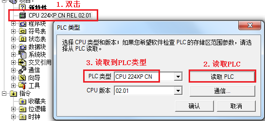

图1\. 选择S7-200 CPU 类型

**2\. 选择“工具”>“以太网向导” 进入 CP243-1 的向导配置，如图2. 所示。**

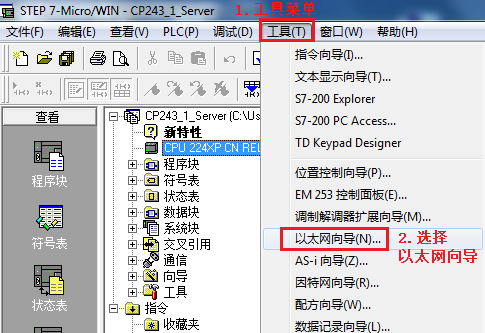

图2\. 使用以太网向导

**3\. 选择CP243-1 模板的位置。**

CP243-1 紧邻 CPU 安装，所以模板位置为0 ，也可以通过“读取模块”读出模板位置，如图3. 所示。

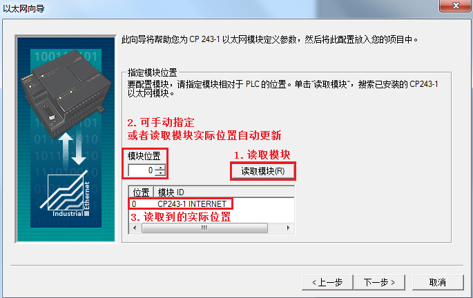

图3\. 选择模板位置

**4\. 设置 CP243-1 模板的 IP 地址**

IP 地址：192. 168. 0. 101 ，子网掩码：255. 255. 255. 0，如图4.所示。

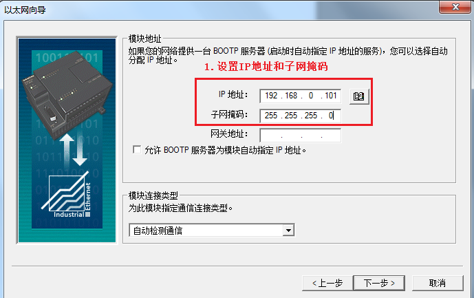

图4\. 设置网络地址

**5\. 设置模块所占用输出地址字节和连接数，如图5. 所示。**

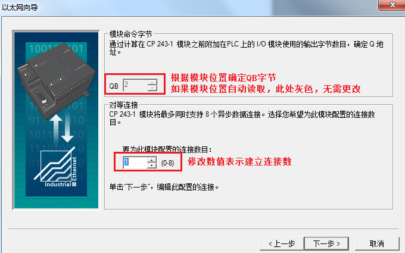

图5\. 设置占用输出地址及网络连接数

**6\. 将CP243-1 定义为 Server 端，如图6. 所示。**

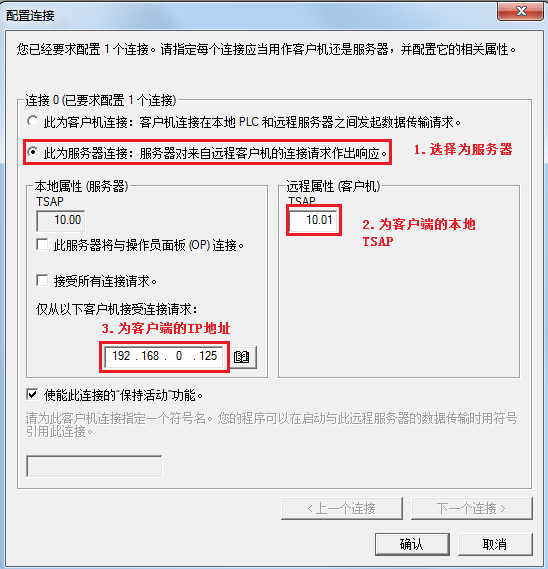

图 6\. 定义为 Server 端

**注意：**本例S7-200中安装的CP243-1紧邻CPU，位置为0，故TSAP地址为10.00；若CP243-1在位置为1，则TSAP地址为10.01。

**7\. 选择CRC校验，如图7. 所示。**

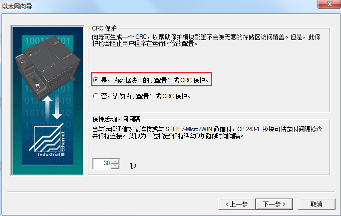

图7\. 选择CRC 较验

**8\. 为配置分配存储区**

根据以态网的配置，需要一个V存储区，用户可以指定一个未用过的V存储区的起始地址，也可以点击“建议地址”按钮使用建议地址。如图8. 所示。

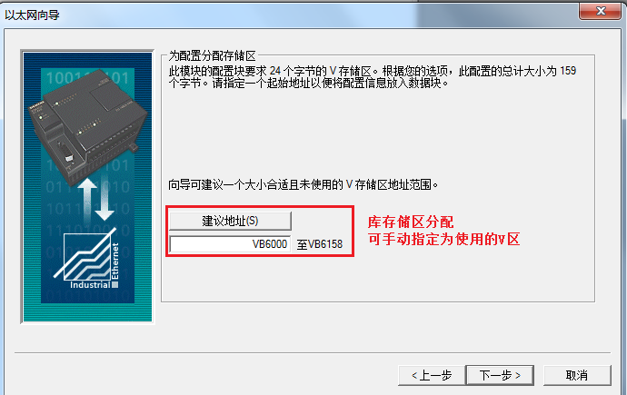

图8\. 为配置分配存储区

**9\. 生成以太网用户子程序。如图9. 所示。**

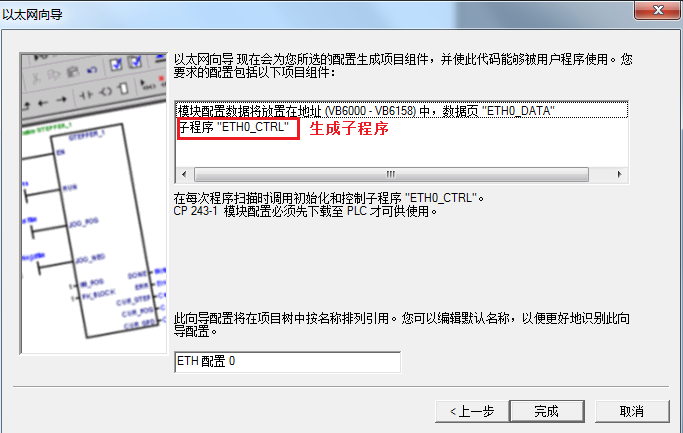

图9\. 生成子程序

**10\. 调用向导中生成的子程序，并将程序下载到CPU中。如图10. 所示。**

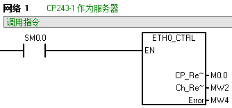

图10\. 调用子程序

#### S7-1200 Client 端的配置编程

**1\. 使用 STEP7 V16软件新建一个项目并完成硬件配置，网络组态**

1.1 在“项目树”>“设备组态”>“网络视图”下，按如下图片中1~4的步骤添加新连接，如图11. 所示。

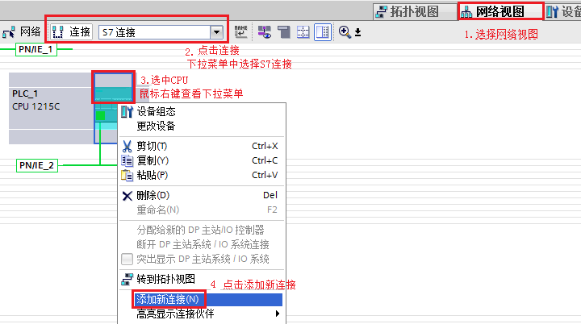

图11\. 添加S7连接

1.2 在弹出的“添加新连接”对话框中，按照步骤1~3，添加伙伴为未指定的S7连接，如图12.所示。

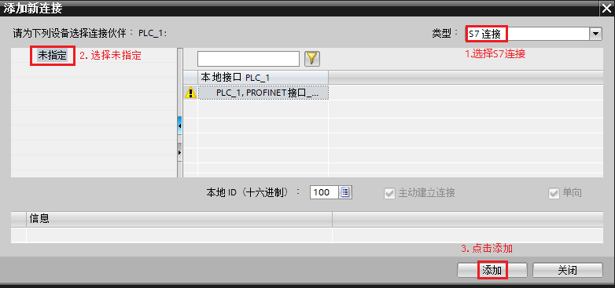

图12\. 添加伙伴为未指定的S7连接

1.3 按如下图片中1~6的步骤填写S7连接参数，填写CP243-1的IP地址，如图13. 所示。

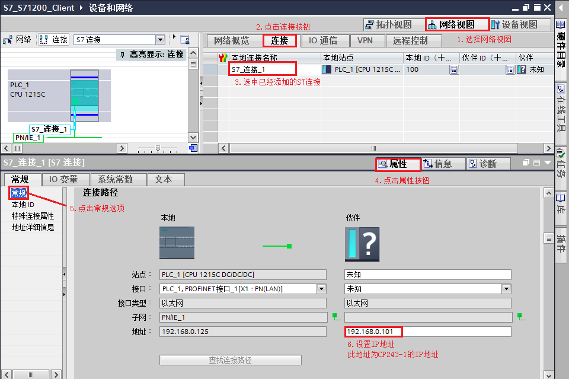

图13\. 填写通信伙伴IP地址

1.4 在“地址详细信息”中设置通信伙伴的TSAP号，如图14. 所示。

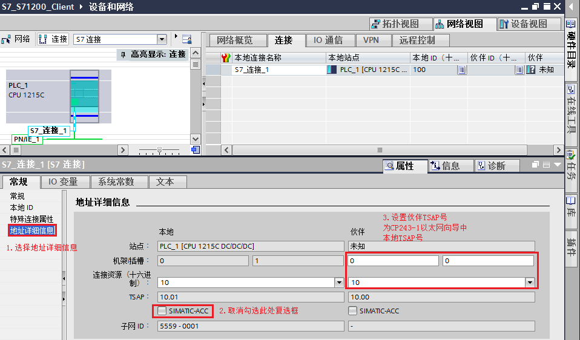

图14\. 定义通信双方TSAP号

**注意：**图14.中填写的伙伴TSAP号，应该与S7-200程序中对CP243-1以太网向导组态的本地TSAP号保持一致，如图6所示。

**2\. 软件编程**

2.1 创建DB块用来接收/发送数据，用来和S7-200 CP243-1交换数据，如图15. 所示。

> DB1数据块名为“PUT_DATA”，定义2个字节的数组，变量名称为“A”，向CP243-1发送2字节数据；
> 
> DB4数据块名为“GET_DATA”，，定义2个字节的数组，变量名称为“A”，从CP243-1读取2字节数据；
> 
> DB4中创建的S7\_Comm\_Status的结构体变量，用于程序中捕捉错误代码和接收指令的完成位。

注意：此处创建的DB块，可以是优化/非优化的数据块。创建的数据块为S7-1200用于发送/接收的数据区，填写在GET指令的RD\_x及PUT指令的SD\_x中。

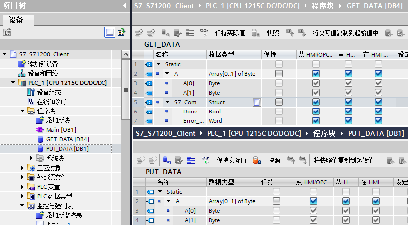

图15\. 创建DB块

2.2 在OB1中，从“指令”-->"通信指令"-->“S7 通信”下，调用PUT、GET通信指令，程序见图16。

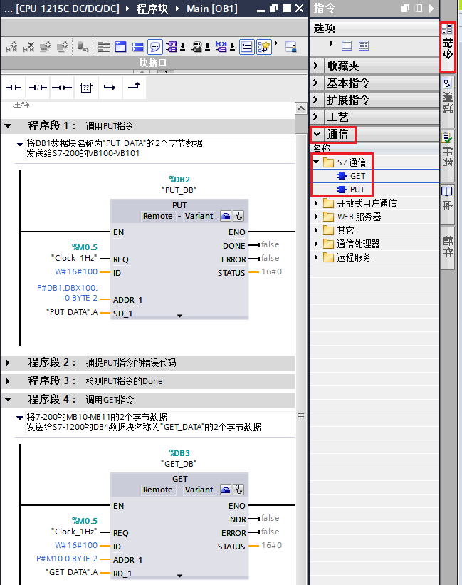

图16\. 程序调用功能

|     |     |     |
| --- | --- | --- |
| CALL “PUT” | %DB2 | //调用 PUT，使用背景DB块：DB2 |
| REQ | ：=%M0.5 | //系统时钟 1秒脉冲 |
| ID  | ：=W#16#0100 | //连接号，要与连接配置中一致，创建连接时的连接号 |
| DONE | 可连接变量 | // bool，为1时，写完成 |
| ERROR | 可连接变量 | //bool， 为1时，有故障发生 |
| STATUS | 可连接变量 | //word类型， 状态代码 |
| ADDR_1 | ：=P#DB1.DBX100.0 BYTE 2 | // 此处填写发送到通信伙伴数据区的地址  表示将数据写入CP243-1的VB100-VB101  由于S7-200没有DB区，所以使用DB1对应S7-200的V区 |
| SD_1 | ：=“PUT_DATA”.A | // 此处填写本地发送数据地址区  表示S7-1200要将数据块名为“PUT_DATA"的数据块的变量名为”A“的变量发送给CP243-1  如果“PUT_DATA”为非优化的数据块，还可以使用P#指针填写P#DB1.DBX0.0 BYTE 2 |

  

|     |     |     |
| --- | --- | --- |
| CALL “GET” | %DB3 | //调用 GET，使用背景DB块：DB3 |
| REQ | ：=%M0.5 | //系统时钟 1秒脉冲 |
| ID  | ：=W#16#0100 | //连接号，要与连接配置中一致，创建连接时的连接号 |
| NDR | 可连接变量 | //bool，为1时，接收到新数据 |
| ERROR | 可连接变量 | //bool，为1时，有故障发生 |
| STATUS | 可连接变量 | //word，状态代码 |
| ADDR_1 | ：=P#M10.0 BYTE 2 | //此处填写从通信伙伴数据区读取数据的地址  表示从CP243-1的MB10-MB11读取数据 |
| RD_1 | ：=“GET_DATA”.A | //此处填写本地接收数据地址区  表示S7-1200要将从CP243-1中读取的数据存放在数据块名为“PUT_DATA"中变量名为”A“的数组中  如果“GET_DATA”为非优化的数据块，还可以使用P#指针填写P#DB4.DBX0.0 BYTE 2 |

2.3 如果通信时发现数据没有正常交换，可以增加程序段，用来捕捉判断指令块的Done是否置位过，或者捕捉判断指令块是否有错误，错误代码是什么，如图17.所示。

图17中所示为捕捉PUT指令的完成位及错误代码。

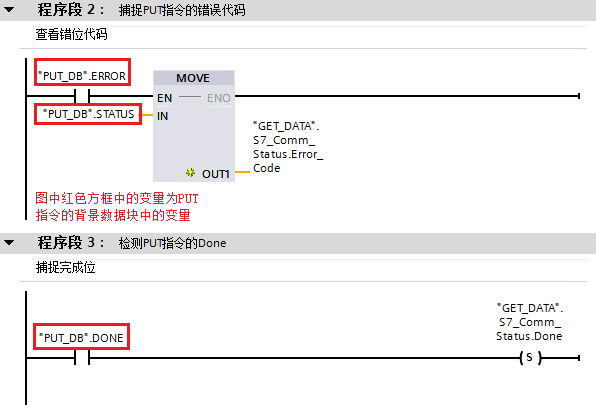

图17.捕捉错误代码及完成位

**3\. 监控结果**

S7-1200和S7-200分别下载程序，将通信数据区域分别在监控表（S7-1200）和状态表（S7-200）中赋值及监控，监控结果如图18。

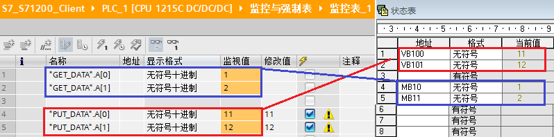

图18\. S71200和S7200监控数据