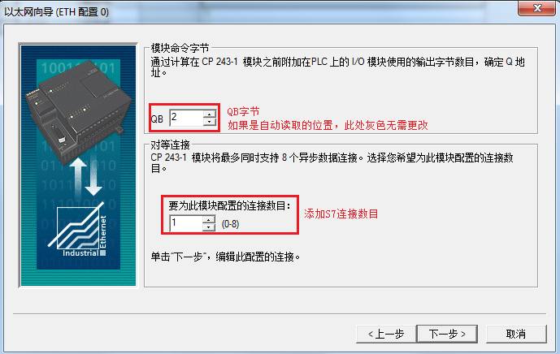
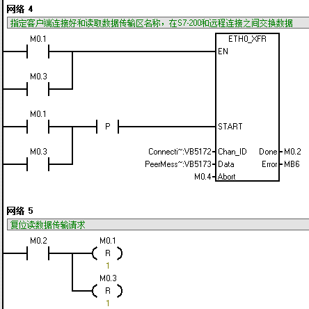

 S7-200_Client 

### S7-1200 CPU 与 S7-200 CPU S7通信（S7-1200 作为服务器）

S7-1200 CPU 与 S7-200 CPU 之间的通信只能通过 S7 通信来实现，因为 S7-200 的以太网模块只支持S7 通信。当S7-200作为客户端，S7-1200作为服务器，需在客户端单边组态连接和编程，而作为服务器端的S7-1200只需准备好通信的数据以及V4.0版本以上CPU需要激活[连接机制](../03-S7-1200/01-S7-1200.html#conn_mech)。

#### 硬件和软件需求及所完成的通信任务

**硬件：**  
① S7-1200 CPU  
② S7-200 CPU + CP243-1  
③ PC （带以太网卡）  
④ PC/PPI 电缆  
⑤ TP以太网电缆

**软件：**  
① STEP 7 Professional V16  
② STEP 7 Micro/WIN V4.0 SP9

**所完成的通信任务：**  

| 硬件/角色 | CP243-1（客户端） | 方向  | CPU1215（服务器） |
| --- | --- | --- | --- |
| IP地址 | 192.168.0.101 | 192.168.0.125 |
| 数据  | VB100-VB101 | <-- | DB2.DBB0-DB2.DBB1 |
| VB200-VB201 | --> | DB3.DBB0-DB3.DBB1 |

#### 1\. S7-200 客户端的组态

**1\. 打开 STEP 7 Micro/WIN 软件，创建一个新项目，在“PLC”>“TYPE”选择所使用 CPU 的型号。**

**2\. 选择“工具”>“以太网向导” 进入 CP243-1 的向导配置，如图1. 所示。**

图1\. 使用以太网向导

**3\. 选择CP243-1 模板的位置。**

CP243-1 紧临 CPU 安装，所以模板位置为0 ，也可以通过“读取模块”读出模板位置，如图2. 所示。

图2\. 选择模板位置

**4\. 设置 CP243-1 模板的 IP 地址**

**I**P 地址：192. 168. 0. 101 ，子网掩码：255. 255. 255. 0，如图3.所示。

图3\. 设置网络地址

**5\. 设置连接数，如图4. 所示。**

设置模板所占用输出地址字节和连接数，如图4\. 所示。

图4\. 设置占用输出地址及网络连接数

**6\. 将CP243-1 定义为 Client 端，如图5. 所示。**

图 5\. 定义为 Client 端

**7\. 定义读数据传输，如图6. 所示。**

图6\. 定义读数据传输

**注意：**如果使用的是S7 单方通信，只需在S7-200一侧编程配置。在 S7-1200 中建立通信数据区 DB2时，需要创建非优化的数据块，即：在DB2的属性中，取消勾“选优化的块访问”， 否则会导致通信失败。

**8\. 定义写数据传输，如图7. 所示。**

图7\. 定义写数据传输

注意：如果使用的是S7 单方通信，只需在S7-200一侧编程配置。在S7-1200 CPU 中建立通信数据区DB3 时，需要创建非优化的数据块，即：在DB3的属性中，取消勾“选优化的块访问”， 否则会导致通信失败。

**9\. 选择CRC 校验，如图8. 所示。**

图8\. 选择CRC 较验

**10\. 为配置分配存储区**

根据以态网的配置，需要一个V存储区，用户可以指定一个未用过的V存储区的起始地址。如图9. 所示。

图9\. 为配置分配存储区

**11\. 生成以太网用户子程序，如图10. 所示。**

图10\. 生成子程序

#### 2\. S7-200 CPU 编程通信

**1\. 调用向导生成的子程序，实现数据传输**

对于S7-200的同一个连接的多个数据传输，不能同时激活，必须分时调用。下面的程序就是用前一个数据传输的完成位去激活下一个数据传输，如图11.图12.图13. 所示。

图11\. S7-200程序段1

图12\. S7-200程序段2

图13\. S7-200程序段3

**2\. 监控通信数据结果**

配置S7-1200的硬件组态，创建通信数据区DB2、DB3（必须选择绝对寻址）。然后下载S7-200 CPU及S7-1200 CPU的所有组态及程序，并监控通信结果，如图14.所示。  
在S7-1200 CPU中向DB2中写入数据：“3”、“4”，则在S7-200中的VB100、VB101中读取到的数据也为“3”、“4”。  
在S7-200 CPU中，将“5”、“6”写入VB200、VB201，则在S7-1200 CPU中的DB3中收到的数据也为“5”、“6”。  
注意：使用单边的S7 通信，S7-1200不需要做任何组态编程，但在创建通信数据区DB块时，一定要选择绝对寻址，才能保证通信成功。

图14\. 监控结果