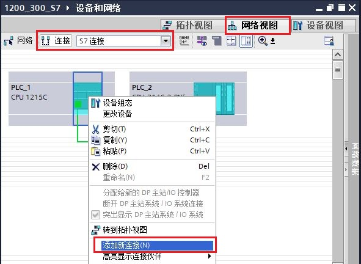
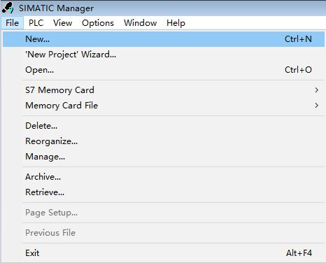

## S7-300 PN/S7-400 S7 为服务器

### S7-1200 CPU 与 S7-300 PN/S7-400 S7 通信（S7-1200 作为客户端）

S7-1200 CPU 与 S7-300 PN CPU 之间的以太网通信通过 S7 通信来实现。当
S7-1200 作为客户端，S7-300 PN
作为服务器，需在客户端单边组态连接和编程，而作为服务器端的 S7-300 PN
只需准备好通信的数据就行。

此外本文也可以作为 S7-1200 与 S7-400 PN/CP 之间的 S7 通信文档。

### 硬件和软件需求及所完成的通信任务

所需条件：

① S7-1215 DC/DC/DC V4.4 / CPU 314C-2 PN/DP，V3.3\
② TIA STEP7 V17 Professional / STEP7 V5.6 SP2 HF7

所完成的通信任务：

① S7-1200 CPU 读取 S7-300 CPU中 DB1 的 10 个字节数据到 S7-1200 的 DB3
中。\
② S7-1200 CPU 将本地 DB4 中 10 个字节的数据写到 S7-300 CPU 的 DB2 中。

S7-1200 与 S7-300 PN 之间 S7 通讯，可以分 3 种情况来操作，具体如下：

1.  [第一种情况：S7-1200 与 S7-300 PN
    在同一项目中操作](01-S7-1200_Client.html#a)
2.  [第二种情况：S7-1200 与 S7-300 PN 不在一个项目中的操作(两个
    TIA](01-S7-1200_Client.html#b) [Portal](01-S7-1200_Client.html#c)
    [项目)](01-S7-1200_Client.html#b)
3.  [第三种情况：S7-1200 与 S7-300 PN 不在一个项目中的操作(S7-1200 在
    TIA Portal 项目，S7-300 PN 在 STEP7 项目)](01-S7-1200_Client.html#c)

### []{#a}一. 第一种情况（S7-1200 与 S7-300 在同一项目中操作）

使用 TIA Portal 在同一个项目中，新建一个 S7-1200 站点，一个 S7-300
站点，然后做 S7 通讯。

### 1.1 S7-1200 侧和 S7-300 侧通信的编程，连接参数及通信参数的配置

**1. 使用 TIA Portal 软件新建一个项目并完成硬件配置**

在 TIA Portal 的 "Portal 视图" 中选择 "创建新项目" 创建一个新项目。

**2.添加硬件并命名PLC**

然后进入 "项目视图"，在"项目树" 下双击
"添加新设备"，在对话框中选择所使用的 S7-1200 CPU 添加到机架上，命名为
PLC_1，如图 1 所示。

{width="711" height="698"}

图 1. 添加新设备

为了编程方便，使用 CPU 属性中定义的时钟位，定义方法如下：

在 "项目树" \> "PLC_1" \> "设备组态" 中，选中 CPU
，然后在下面的属性窗口中，"属性" \> "系统和时钟存储器"
下，将时钟位定义在 MB0，如图 2 所示。时钟位程序主要使用 M0.3，它是以 2Hz
的速率在 0 和 1 之间切换的一个位，可以使用它去自动激活发送任务。

{width="611" height="570"}

图 2. 时钟位

**3. 为 PROFINET 通信口分配以太网地址**

在 "设备视图"中点击 CPU 上代表 PROFINET 通信口的绿色小方块，在下方会出现
PROFINET 接口的属性，在 "以太网地址" 下分配 IP 地址为 192.168.0.1
，子网掩码为255.255.255.0，如图 3 所示。

{width="714" height="377"}

图 3. 分配 IP 地址

**4．使用 TIA Portal 软件添加新设备并命名 PLC_2**

与 PLC_1 在同一个项目中，在"项目树" 下双击
"添加新设备"，在对话框中选择所使用的 S7-300 CPU 添加到机架上，命名为
PLC_2，如图 4 所示。

{width="709" height="695"}

图 4. 添加新设备

**5. 为 PROFINET 通信口分配以太网地址**

在 "设备视图"中点击 CPU 上代表 PROFINET 通信口的绿色小方块，在下方会出现
PROFINET 接口的属性，在 "以太网地址" 下分配 IP 地址为 192.168.0.2
，子网掩码为255.255.255.0，如图 5 所示。

{width="742" height="381"}

图 5. 分配 IP 地址

**6. 创建 CPU 的逻辑网络连接**

在网络视图下，用鼠标点中 S7-1200 上的 PROFINET
通信口的绿色小方框，然后拖拽出一条线，到另外一个 S7-300 上的 PROFINET
通信口上，松开鼠标，PN/IE_1的子网连接就建立起来了，如图 6 所示。

{width="460" height="201"}

图 6. 网络视图

### 1.2 S7-1200 侧组态S7连接，连接参数说明

**1. 网络组态**

（1）打开 "网络视图" 配置网络，首先点中左上角的"连接"图标，选择"S7
连接"，然后选中 S7-1200 CPU，右键选择"添加新连接"添加新的连接，如图 7
所示。

{width="591" height="432"}

图 7. 添加连接

（2） 然后在"添加新连接"窗口中，选择"PLC_2\[CPU314C-2
PN/DP\]"，然后点击"添加"建立 S7 连接，如图 8 所示。

{width="901" height="576"}

图 8. 选择连接伙伴

（3）在信息栏里显示连接已添加，如图 9 所示，点击\"关闭\"即可。

{width="901" height="576"}

图 9. 创建新连接

（4）在"网络视图"中，鼠标选中刚刚生成的\"S7_连接_1\"，在属性的常规选项卡中的\"常规\"栏，可查看创建的连接名称和连接路径，如图
10 所示。

{width="833" height="763"}

图 10. S7 连接常规信息

（5）在属性的常规选项卡中的\"本地 ID\"栏，可查看连接的 ID 号，如图 11
所示。

{width="831" height="534"}

图 11. 连接 ID 号

（6）在属性的常规选项卡中的\"特殊连接属性\"栏，可查看连特殊接的性，如图
12 所示。

{width="833" height="508"}

图 12. 连接属性

（7）在属性的常规选项卡中的\"地址详细信息\"栏，可查看连接的 TSAP
号，如图 13 所示。

{width="833" height="577"}

图 13. 查看通讯双方的 TSAP 号

**2. 检查连接状态**

（1）配置完网络连接，分别对 S7-1200 和 S7-300
编译保存并下载。下载完成后，可点击\"转至在线\"按钮，在"网络视图"的"连接"选项卡中查看连接状态，如图
14
所示，本地连接名称"S7_连接_1"左侧有绿色标志，则表示组态的连接已经成功建立。

{width="932" height="304"}

图 14. 通讯连接已建立

（2）如果出现如图 15
所示的情况，本地连接名称"S7_连接_1"左侧有红色标志，则说明连接没有建立，请检查网线的连接、IP
地址等。

{width="931" height="251"}

图 15. 通讯连接未建立

### 1.3 S7-1200 侧和 S7-300 侧软件编程

**1. S7-1200 侧软件编程**

（1）创建并定义 S7-1200 的接收数据区 DB 块。

通过"项目树"\>"PLC_1"\>"程序块"\>"添加新块"，选择"数据块" 创建 DB 块，在
DB
块的"属性-\>常规-\>属性"中，取消勾选"优化的块访问"，点击"确定"键，定义接收数据区为
10个字节的数组，如图 16，17，18 所示。

{width="690" height="598"}

图 16. 创建接收数据区 DB 块

{width="377" height="241"}

图 17. 设置接收数据区 DB 块属性

{width="419" height="82"}

图 18. 定义接收数据区为字节类型的数组

（2）创建并定义 S7-1200 的发送数据区 DB 块。

通过"项目树"\>"PLC_1"\>"程序块"\>"添加新块"，选择"数据块" 创建 DB 块，在
DB
块的"属性-\>常规-\>属性"中，取消勾选"优化的块访问"，点击"确定"键，定义发送数据区为
10个字节的数组，如图 19，20，21 所示。

{width="691" height="595"}

图 19. 创建发送数据区 DB 块

{width="372" height="241"}

图20. 设置发送数据区 DB 块属性

{width="415" height="79"}

图 21. 定义发送数据区为字节类型的数组

（3）在 OB1 中，从"指令" \>"通信" \>"S7 通信"下，调用 GET、PUT
通信指令，程序调用如图 22 所示。

{width="743" height="860"}

图 22. 程序调用功能

（4）GET 功能块使用背景数据块 DB1，管脚说明如下：

**参数说明：**

**输入接口参数：**

+-----------------------------------+-----------------------------------+
| ::: {align="left"}                | ::: {align="left"}                |
| REQ　　                           | ： 系统时钟 2Hz                   |
| :::                               | 的脉冲，在上升沿启动发送作业      |
|                                   | :::                               |
+-----------------------------------+-----------------------------------+
| ::: {align="left"}                | ::: {align="left"}                |
| ID　                              | ：                                |
| :::                               | 连接号，要与连接配置              |
|                                   | 中一致，创建连接时的连接号，如图  |
|                                   | 11 所示                           |
|                                   | :::                               |
+-----------------------------------+-----------------------------------+
| ::: {align="left"}                | ::: {align="left"}                |
| ADDR_1                            | ：指向伙伴 CPU 发送地址区域       |
| :::                               | :::                               |
+-----------------------------------+-----------------------------------+
| ::: {align="left"}                | ::: {align="left"}                |
| SD_1　                            | ：指向本地 CPU 接收地址区域       |
| :::                               | :::                               |
+-----------------------------------+-----------------------------------+

**输出接口参数：**

+-----------------------------------+-----------------------------------+
| ::: {align="left"}                | ::: {align="left"}                |
| NDR                               | ：接收到新数据时，该位置 1        |
| :::                               | :::                               |
+-----------------------------------+-----------------------------------+
| ::: {align="left"}                | ::: {align="left"}                |
| ERROR　　　                       | ：通信过程中有错误发生，该位置 1  |
| :::                               | :::                               |
+-----------------------------------+-----------------------------------+
| ::: {align="left"}                | ::: {align="left"}                |
| STATUS                            | ：有错误发生时，会显示错误代码    |
| :::                               | :::                               |
+-----------------------------------+-----------------------------------+

（5）PUT 功能块使用背景数据块 DB2，管脚说明如下：

**参数说明：**

**输入接口参数：**

+-----------------------------------+-----------------------------------+
| ::: {align="left"}                | ::: {align="left"}                |
| REQ　　                           | ： 系统时钟 2Hz                   |
| :::                               | 的脉冲，在上升沿启动发送作业      |
|                                   | :::                               |
+-----------------------------------+-----------------------------------+
| ::: {align="left"}                | ::: {align="left"}                |
| ID　                              | ：                                |
| :::                               | 连接号，要与连接配置              |
|                                   | 中一致，创建连接时的连接号，如图  |
|                                   | 11 所示                           |
|                                   | :::                               |
+-----------------------------------+-----------------------------------+
| ::: {align="left"}                | ::: {align="left"}                |
| ADDR_1                            | ：指向伙伴 CPU 接收地址区域       |
| :::                               | :::                               |
+-----------------------------------+-----------------------------------+
| ::: {align="left"}                | ::: {align="left"}                |
| SD_1　                            | ：指向本地 CPU 发送地址区域       |
| :::                               | :::                               |
+-----------------------------------+-----------------------------------+

**输出接口参数：**

+-----------------------------------+-----------------------------------+
| ::: {align="left"}                | ::: {align="left"}                |
| DONE                              | ：发送数据完成时，该位置 1        |
| :::                               | :::                               |
+-----------------------------------+-----------------------------------+
| ::: {align="left"}                | ::: {align="left"}                |
| ERROR　　　                       | ：通信过程中有错误发生，该位置 1  |
| :::                               | :::                               |
+-----------------------------------+-----------------------------------+
| ::: {align="left"}                | ::: {align="left"}                |
| STATUS                            | ：有错误发生时，会显示错误代码    |
| :::                               | :::                               |
+-----------------------------------+-----------------------------------+

**2. S7-300 侧软件编程**

（1）创建并定义 S7-300 的发送数据区 DB 块。

通过"项目树"\>"PLC_2"\>"程序块"\>"添加新块"，选择"数据块" 创建 DB
块，点击"确定"键，定义发送数据区为 10 个字节的数组，如图 23，24 所示。

{width="690" height="597"}

图 23. 创建发送数据区 DB 块

{width="416" height="81"}

图 24. 定义发送数据区为字节类型的数组

（2）创建并定义 S7-300 的接收数据区 DB 块。

通过"项目树"\>"PLC_2"\>"程序块"\>"添加新块"，选择"数据块" 创建 DB
块，点击"确定"键，定义接收数据区为 10 个字节的数组，如图 25，26 所示。

{width="690" height="594"}

图 25. 创建接收数据区 DB 块

{width="413" height="80"}

图 26. 定义接收数据区为字节类型的数组

### 1.4 下载程序并监控通信结果

下载两个 CPU 中的所有程序，实现两个 CPU 之间数据交换，监控结果如图 27
所示。

{width="822" height="517"}

图 27. 监控结果

### []{#b}二. 第二种情况（S7-1200 与 S7-300 不在同一个 TIA Portal 项目）

使用 TIA Portal 在一个项目中，新建一个 S7-1200
站点，在另一个项目中，新建一个 S7-300 站点，然后做 S7 通讯。

### 2.1 S7-1200 侧通信的编程，连接参数及通信参数的配置

**1. 使用 TIA Portal 软件新建一个项目并完成硬件配置**

在 TIA Portal 的 "Portal 视图" 中选择 "创建新项目" 创建一个新项目。

**2.** **添加硬件并命名PLC**

然后进入 "项目视图"，在"项目树" 下双击
"添加新设备"，在对话框中选择所使用的 S7-1200 CPU 添加到机架上，命名为
PLC_1，如图 28 所示。

{width="711" height="698"}

图 28. 添加新设备

为了编程方便，使用 CPU 属性中定义的时钟位，定义方法如下：

在 "项目树" \> "PLC_1" \> "设备组态" 中，选中 CPU
，然后在下面的属性窗口中，"属性" \> "系统和时钟存储器"
下，将时钟位定义在 MB0，如图 29 所示。时钟位程序主要使用 M0.3，它是以
2Hz 的速率在 0 和 1 之间切换的一个位，可以使用它去自动激活发送任务。

{width="611" height="570"}

图 29. 时钟位

**3. 为 PROFINET 通信口分配以太网地址**

在 "设备视图"中点击 CPU 上代表 PROFINET 通信口的绿色小方块，在下方会出现
PROFINET 接口的属性，在 "以太网地址" 下分配 IP 地址为 192.168.0.1
，子网掩码为 255.255.255.0，点击"添加新子网"，增加子网"PN/IE_1"，如图 30
所示。

{width="634" height="377"}

图 30. 分配 IP 地址

### 2.2 S7-300 侧通信的编程，连接参数及通信参数的配置

**1．使用 TIA Portal 软件新建项目，添加新设备并命名 PLC_2**

打开 TIA Portal ，在 "Portal 视图" 中选择 "创建新项目"
创建一个新项目。然后进入 "项目视图"，在"项目树" 下双击
"添加新设备"，在对话框中选择所使用的 S7-300 CPU 添加到机架上，命名为
PLC_2，如图 31 所示。

{width="709" height="695"}

图 31. 添加新设备

**2. 为 PROFINET 通信口分配以太网地址**

在 "设备视图"中点击 CPU 上代表 PROFINET 通信口的绿色小方块，在下方会出现
PROFINET 接口的属性，在 "以太网地址" 下分配 IP 地址为 192.168.0.2
，子网掩码为 255.255.255.0，选择子网"PN/IE_1"，如图 32 所示。

{width="629" height="377"}

图 32. 分配IP 地址

### 2.3 S7-1200 侧组态 S7 连接，连接参数说明

**1. 网络组态**

（1）打开 "网络视图" 配置网络，首先点中左上角的"连接"图标，选择"S7
连接"，然后选中 S7-1200 CPU，右键选择"添加新连接"，如图 33 所示。

{width="517" height="430"}

图 33. 添加新连接

（2） 然后在"添加新连接"窗口中，选择"未指定"，然后点击"添加"建立 S7
连接，如图 34 所示。

{width="902" height="573"}

图 34. 选择连接伙伴

（3）在信息栏里显示连接已添加，如图 35 所示，点击\"关闭\"即可。

{width="901" height="573"}

图 35. 创建新连接

（4）在"网络视图"中，鼠标选中刚刚生成的\"S7_连接_1\"，在属性的常规选项卡中的\"常规\"栏，设置伙伴方的
IP地址，如本例中的 192.168.0.2，如图 36 所示。

{width="796" height="760"}

图 36. S7 连接常规信息

（5）在属性的常规选项卡中的\"本地 ID\"栏，可查看连接的 ID 号，如图 37
所示。

{width="806" height="524"}

图 37. 连接 ID 号

（6）在属性的常规选项卡中的\"特殊连接属性\"栏，可查看连特殊接属性，如图
38 所示。

{width="806" height="498"}

图 38. 连接属性

（7）在属性的常规选项卡中的\"地址详细信息\"栏，可定义伙伴方的 TSAP
号，如图 39 所示。

{width="820" height="568"}

图 39. 定义伙伴方的 TSAP 号

**{width="15" height="15"}注意：**S7-300 预留给 S7 连接
TSAP 地址：03.02；如果通信伙伴是 S7-400，TSAP 地址：03.0x（x
是十六进制），x 要根据用于通信的 CPU 槽位（即使通信使用
CP，也是看其所属的 CPU 的槽位）来决定 TSAP 地址，例如：通信的 CPU 在 3
号槽，则 TSAP 地址为 03.03。

**2. 检查连接状态**

（1）配置完网络连接，分别对 S7-1200 和 S7-300
编译保存并下载。下载完成后，可点击\"转至在线\"按钮，在"网络视图"的"连接"选项卡中查看连接状态，如图
40
所示，本地连接名称"S7_连接_1"左侧有绿色标志，则表示组态的连接已经成功建立。

{width="801" height="296"}

图 40. 通讯连接已建立

（2）如果出现如图 41
所示的情况，本地连接名称"S7_连接_1"左侧有红色标志，则说明连接没有建立，请检查网线的连接、IP
地址等。

{width="799" height="295"}

图 41. 通讯连接未建立

### 2.4 S7-1200 侧和 S7-300 侧软件编程

**1. S7-1200 侧软件编程**

（1）创建并定义 S7-1200 的接收数据区 DB 块。

通过"项目树"\>"PLC_1"\>"程序块"\>"添加新块"，选择"数据块" 创建 DB 块，在
DB
块的"属性-\>常规-\>属性"中，取消勾选"优化的块访问"，点击"确定"键，定义接收数据区为
10 个字节的数组，如图 42，43，44 所示。

{width="690" height="598"}

图 42. 创建接收数据区 DB 块

{width="377" height="241"}

图 43. 设置接收数据区 DB 块属性

{width="419" height="82"}

图 44. 定义接收数据区为字节类型的数组

（2）创建并定义 S7-1200 的发送数据区 DB 块。

通过"项目树"\>"PLC_1"\>"程序块"\>"添加新块"，选择"数据块" 创建 DB 块，在
DB
块的"属性-\>常规-\>属性"中，取消勾选"优化的块访问"，点击"确定"键，定义发送数据区为
10 个字节的数组，如图 45，46，47 所示。

{width="691" height="595"}

图 45. 创建发送数据区 DB 块

{width="372" height="241"}

图 46. 设置发送数据区 DB 块属性

{width="415" height="79"}

图 47. 定义发送数据区为字节类型的数组

（3）在 OB1 中，从"指令" \>"通信" \>"S7 通信"下，调用 GET、PUT
通信指令，程序调用如图 48 所示。

{width="764" height="861"}

图 48. 程序调用功能

（4）GET 功能块使用背景数据块 DB1，管脚说明如下：

**参数说明：**

**输入接口参数：**

+-----------------------------------+-----------------------------------+
| ::: {align="left"}                | ::: {align="left"}                |
| REQ　　                           | ： 系统时钟 2Hz                   |
| :::                               | 的脉冲，在上升沿启动发送作业      |
|                                   | :::                               |
+-----------------------------------+-----------------------------------+
| ::: {align="left"}                | ::: {align="left"}                |
| ID　                              | ：                                |
| :::                               | 连接号，要与连接配置              |
|                                   | 中一致，创建连接时的连接号，如图  |
|                                   | 37 所示                           |
|                                   | :::                               |
+-----------------------------------+-----------------------------------+
| ::: {align="left"}                | ::: {align="left"}                |
| ADDR_1                            | ：指向伙伴 CPU 发送地址区域       |
| :::                               | :::                               |
+-----------------------------------+-----------------------------------+
| ::: {align="left"}                | ::: {align="left"}                |
| SD_1　                            | ：指向本地 CPU 接收地址区域       |
| :::                               | :::                               |
+-----------------------------------+-----------------------------------+

**输出接口参数：**

+-----------------------------------+-----------------------------------+
| ::: {align="left"}                | ::: {align="left"}                |
| NDR                               | ：接收到新数据时，该位置 1        |
| :::                               | :::                               |
+-----------------------------------+-----------------------------------+
| ::: {align="left"}                | ::: {align="left"}                |
| ERROR　　　                       | ：通信过程中有错误发生，该位置 1  |
| :::                               | :::                               |
+-----------------------------------+-----------------------------------+
| ::: {align="left"}                | ::: {align="left"}                |
| STATUS                            | ：有错误发生时，会显示错误代码    |
| :::                               | :::                               |
+-----------------------------------+-----------------------------------+

（5）PUT 功能块使用背景数据块 DB2，管脚说明如下：

**参数说明：**

**输入接口参数：**

+-----------------------------------+-----------------------------------+
| ::: {align="left"}                | ::: {align="left"}                |
| REQ　　                           | ： 系统时钟 2Hz                   |
| :::                               | 的脉冲，在上升沿启动发送作业      |
|                                   | :::                               |
+-----------------------------------+-----------------------------------+
| ::: {align="left"}                | ::: {align="left"}                |
| ID　                              | ：                                |
| :::                               | 连接号，要与连接配置              |
|                                   | 中一致，创建连接时的连接号，如图  |
|                                   | 37 所示                           |
|                                   | :::                               |
+-----------------------------------+-----------------------------------+
| ::: {align="left"}                | ::: {align="left"}                |
| ADDR_1                            | ：指向伙伴 CPU 接收地址区域       |
| :::                               | :::                               |
+-----------------------------------+-----------------------------------+
| ::: {align="left"}                | ::: {align="left"}                |
| SD_1　                            | ：指向本地 CPU 发送地址区域       |
| :::                               | :::                               |
+-----------------------------------+-----------------------------------+

**输出接口参数：**

+-----------------------------------+-----------------------------------+
| ::: {align="left"}                | ::: {align="left"}                |
| DONE                              | ：发送数据完成时，该位置 1        |
| :::                               | :::                               |
+-----------------------------------+-----------------------------------+
| ::: {align="left"}                | ::: {align="left"}                |
| ERROR　　　                       | ：通信过程中有错误发生，该位置 1  |
| :::                               | :::                               |
+-----------------------------------+-----------------------------------+
| ::: {align="left"}                | ::: {align="left"}                |
| STATUS                            | ：有错误发生时，会显示错误代码    |
| :::                               | :::                               |
+-----------------------------------+-----------------------------------+

**2. S7-300 侧软件编程**

（1）创建并定义 S7-300 的发送数据区 DB 块。

通过"项目树"\>"PLC_2"\>"程序块"\>"添加新块"，选择"数据块" 创建 DB
块，点击"确定"键，定义发送数据区为 10 个字节的数组，如图 49，50 所示。

{width="690" height="597"}

图 49. 创建发送数据区 DB 块

{width="416" height="81"}

图 50. 定义发送数据区为字节类型的数组

（2）创建并定义 S7-300 的接收数据区 DB 块。

通过"项目树"\>"PLC_2"\>"程序块"\>"添加新块"，选择"数据块" 创建 DB
块，点击"确定"键，定义接收数据区为 10 个字节的数组，如图 51，52 所示。

{width="690" height="594"}

图 51. 创建接收数据区 DB 块

{width="413" height="80"}

图 52. 定义接收数据区为字节类型的数组

### 2.5 下载程序并监控通信结果

下载两个 CPU 中的所有程序，实现两个 CPU 之间数据交换，监控结果如图 53
所示。

{width="822" height="515"}

图 53. 监控结果

### []{#c}三. 第三种情况（S7-1200 在 TIA Portal 项目中，S7-300 在 STEP7 项目中）

使用 TIA Portal ，新建一个 S7-1200 站点，使用
STEP7，新建一个S7-300站点，然后做S7通讯。

### 3.1 S7-1200 侧通信的编程，连接参数及通信参数的配置

**1. 使用 TIA Portal 软件新建一个项目并完成硬件配置**

在 TIA Portal 的 "Portal 视图" 中选择 "创建新项目"。

**2.** **添加硬件并命名 PLC**

然后进入 "项目视图"，在"项目树" 下双击
"添加新设备"，在对话框中选择所使用的 S7-1200 CPU 添加到机架上，命名为
PLC_1，如图 54 所示。

{width="711" height="698"}

图 54. 添加新设备

为了编程方便，使用 CPU 属性中定义的时钟位，定义方法如下：

在 "项目树" \> "PLC_1" \> "设备组态" 中，选中 CPU
，然后在下面的属性窗口中，"属性" \> "系统和时钟存储器"
下，将时钟位定义在 MB0，如图 55 所示。时钟位程序主要使用 M0.3，它是以
2Hz 的速率在 0 和 1 之间切换的一个位，可以使用它去自动激活发送任务。

{width="611" height="570"}

图 55. 时钟位

**3. 为 PROFINET 通信口分配以太网地址**

在 "设备视图"中点击 CPU 上代表 PROFINET 通信口的绿色小方块，在下方会出现
PROFINET 接口的属性，在 "以太网地址" 下分配IP 地址为 192.168.0.1
，子网掩码为 255.255.255.0，点击"添加新子网"，增加子网 "PN/IE_1"，如图
56 所示。

{width="634" height="377"}

图 56. 分配 IP 地址

### 3.2 S7-300 侧通信的编程，连接参数及通信参数的配置

**1. 创建PLC项目**

在 STEP7 创建一个项目并插入 CPU314C-2PN/DP 站。操作步骤如下：

\(1\) 打开 STEP7， 在 "File" 菜单中选择 "New..." 选项，如图 57 所示。

{width="466" height="376"}

图 57. 新建项目

\(2\) 在弹出的创建新项目窗口里输入项目名为" 300S7Server "，然后点击" OK
"按钮，如图 58 所示。

{width="394" height="387"}

图 58. 输入项目名称

\(3\) 在 300S7Server 下点击右键" Insert New Object "，选择" SIMATIC 300
Station "，如图 59 所示。

{width="551" height="500"}

图 59. 插入 S7-300 站点

\(4\) 双击" Hardware "打开硬件组态，如图 60 所示。

{width="610" height="116"}

图 60. 硬件组态

\(5\) 插入 S7-300 导轨，如图 61 所示。

{width="744" height="570"}

图 61. 插入 S7-300 导轨

\(6\) 插入 S7-300 CPU ，与实际 CPU 一致： 6ES7 314-6EH04-0AB0 V3.3
，如图 62 所示。

{width="718" height="563"}

图 62. 插入 S7-300 CPU

\(7\) 在弹出的" Properties-Ethernet interface PN-IO "对话框的" Parmeters
"选项卡中为以太网接口设置 IP 地址 192.168.0.2 和子网掩码
255.255.255.0，如图 63 所示 。

{width="1030" height="722"}

图 63. 设置 IP 地址和子网掩码

\(8\) 点击" New\... "新建子网，如图 64 所示。

{width="598" height="532"}

图 64. 新建子网

\(9\) " New subnet Industrial Ethernet "对话框下 Name ： Ethernet(1)
，如图 65 所示。

{width="599" height="496"}

图 65. 子网名称

\(10\) 新建 子网 后，点击" OK "，如图 66 所示。

{width="597" height="531"}

图 66. 确认子网

\(11\) 点击" Save and Compile "按钮。编译保存硬件组态信息，如图 67
所示。

{width="712" height="555"}

图 67. 保存并编译硬件组态

### 3.3 S7-1200 侧组态 S7 连接，连接参数说明

**1. 网络组态**

（1）打开 "网络视图" 配置网络，首先点中左上角的"连接"图标，选择"S7
连接"，然后选中 S7-1200 CPU，右键选择"添加新连接"，如图 68 所示。

{width="517" height="430"}

图 68. 添加连接

（2） 然后在"添加新连接"窗口中，选择"未指定"，然后点击"添加"建立 S7
连接，如图 69 所示。

{width="902" height="573"}

图 69. 选择连接伙伴

（3）在信息栏里显示连接已添加，如图 70 所示，点击\"关闭\"即可。

{width="901" height="573"}

图 70. 创建新连接

（4）在"网络视图"中，鼠标选中刚刚生成的\"S7_连接_1\"，在属性的常规选项卡中的\"常规\"栏，设置伙伴方的
IP 地址，如本例中的 192.168.0.2，如图 71 所示。

{width="796" height="760"}

图 71. S7 连接常规信息

（5）在属性的常规选项卡中的\"本地 ID\"栏，可查看连接的 ID 号，如图 72
所示。

{width="806" height="524"}

图 72. 连接 ID 号

（6）在属性的常规选项卡中的\"特殊连接属性\"栏，可查看连特殊连接属性，如图
73 所示。

{width="806" height="498"}

图 73. 连接属性

（7）在属性的常规选项卡中的\"地址详细信息\"栏，可定义伙伴方的 TSAP
号，如图 74 所示。

{width="820" height="568"}

图 74. 定义伙伴方的 TSAP 号

**{width="15" height="15"}注意：**S7-300 预留给 S7 连接
TSAP 地址：03.02；如果通信伙伴是 S7-400，TSAP 地址：03.0x（x
是十六进制），x 要根据用于通信的 CPU 槽位（即使通信使用
CP，也是看其所属的 CPU 的槽位）来决定 TSAP 地址，例如：通信的 CPU 在 3
号槽，则 TSAP 地址为 03.03。

**2. 检查连接状态**

（1）配置完网络连接，分别对 S7-1200 和 S7-300
编译保存并下载。下载完成后，可点击\"转至在线\"按钮，在"网络视图"的"连接"选项卡中查看连接状态，如图
75
所示，本地连接名称"S7_连接_1"左侧有绿色标志，则表示组态的连接已经成功建立。

{width="801" height="296"}

图 75. 通讯连接已建立

（2）如果出现如图 76
所示的情况，本地连接名称"S7_连接_1"左侧有红色标志，则说明连接没有建立，请检查网线的连接、IP
地址等。

{width="799" height="295"}

图 76. 通讯连接未建立

### 3.4 S7-1200 侧和 S7-300 侧软件编程

**1. S7-1200 侧软件编程**

（1）创建并定义 S7-1200 的接收数据区 DB 块。

通过"项目树"\>"PLC_1"\>"程序块"\>"添加新块"，选择"数据块" 创建 DB 块，在
DB
块的"属性-\>常规-\>属性"中，取消勾选"优化的块访问"，点击"确定"键，定义接收数据区为
10 个字节的数组，如图 77，78，79 所示。

{width="690" height="598"}

图 77. 创建接收数据区 DB 块

{width="377" height="241"}

图 78. 设置接收数据区 DB 块属性

{width="419" height="82"}

图 79. 定义接收数据区为字节类型的数组

（2）创建并定义 S7-1200 的发送数据区 DB 块。

通过"项目树"\>"PLC_1"\>"程序块"\>"添加新块"，选择"数据块" 创建 DB 块，在
DB
块的"属性-\>常规-\>属性"中，取消勾选"优化的块访问"，点击"确定"键，定义发送数据区为
10 个字节的数组，如图 80，81，82 所示。

{width="691" height="595"}

图 80. 创建发送数据区 DB 块

{width="372" height="241"}

图 81. 设置发送数据区 DB 块属性

{width="415" height="79"}

图 82. 定义发送数据区为字节类型的数组

（3）在 OB1 中，从"指令" \>"通信" \>"S7 通信"下，调用 GET、PUT
通信指令，程序调用如图 83 所示。

{width="764" height="861"}

图 83. 程序调用功能

（4）GET 功能块使用背景数据块 DB1，管脚说明如下：

**参数说明：**

**输入接口参数：**

+-----------------------------------+-----------------------------------+
| ::: {align="left"}                | ::: {align="left"}                |
| REQ　　                           | ： 系统时钟 2Hz                   |
| :::                               | 的脉冲，在上升沿启动发送作业      |
|                                   | :::                               |
+-----------------------------------+-----------------------------------+
| ::: {align="left"}                | ::: {align="left"}                |
| ID　                              | ：                                |
| :::                               | 连接号，要与连接配置              |
|                                   | 中一致，创建连接时的连接号，如图  |
|                                   | 72 所示                           |
|                                   | :::                               |
+-----------------------------------+-----------------------------------+
| ::: {align="left"}                | ::: {align="left"}                |
| ADDR_1                            | ：指向伙伴 CPU 发送地址区域       |
| :::                               | :::                               |
+-----------------------------------+-----------------------------------+
| ::: {align="left"}                | ::: {align="left"}                |
| SD_1　                            | ：指向本地 CPU 接收地址区域       |
| :::                               | :::                               |
+-----------------------------------+-----------------------------------+

**输出接口参数：**

+-----------------------------------+-----------------------------------+
| ::: {align="left"}                | ::: {align="left"}                |
| NDR                               | ：接收到新数据时，该位置 1        |
| :::                               | :::                               |
+-----------------------------------+-----------------------------------+
| ::: {align="left"}                | ::: {align="left"}                |
| ERROR　　　                       | ：通信过程中有错误发生，该位置 1  |
| :::                               | :::                               |
+-----------------------------------+-----------------------------------+
| ::: {align="left"}                | ::: {align="left"}                |
| STATUS                            | ：有错误发生时，会显示错误代码    |
| :::                               | :::                               |
+-----------------------------------+-----------------------------------+

（5）PUT 功能块使用背景数据块 DB2，管脚说明如下：

**参数说明：**

**输入接口参数：**

+-----------------------------------+-----------------------------------+
| ::: {align="left"}                | ::: {align="left"}                |
| REQ　　                           | ： 系统时钟 2Hz                   |
| :::                               | 的脉冲，在上升沿启动发送作业      |
|                                   | :::                               |
+-----------------------------------+-----------------------------------+
| ::: {align="left"}                | ::: {align="left"}                |
| ID　                              | ：                                |
| :::                               | 连接号，要与连接配置              |
|                                   | 中一致，创建连接时的连接号，如图  |
|                                   | 72 所示                           |
|                                   | :::                               |
+-----------------------------------+-----------------------------------+
| ::: {align="left"}                | ::: {align="left"}                |
| ADDR_1                            | ：指向伙伴 CPU 接收地址区域       |
| :::                               | :::                               |
+-----------------------------------+-----------------------------------+
| ::: {align="left"}                | ::: {align="left"}                |
| SD_1　                            | ：指向本地 CPU 发送地址区域       |
| :::                               | :::                               |
+-----------------------------------+-----------------------------------+

**输出接口参数：**

+-----------------------------------+-----------------------------------+
| ::: {align="left"}                | ::: {align="left"}                |
| DONE                              | ：发送数据完成时，该位置 1        |
| :::                               | :::                               |
+-----------------------------------+-----------------------------------+
| ::: {align="left"}                | ::: {align="left"}                |
| ERROR　　　                       | ：通信过程中有错误发生，该位置 1  |
| :::                               | :::                               |
+-----------------------------------+-----------------------------------+
| ::: {align="left"}                | ::: {align="left"}                |
| STATUS                            | ：有错误发生时，会显示错误代码    |
| :::                               | :::                               |
+-----------------------------------+-----------------------------------+

**2. S7-300 侧软件编程**

2.1 创建并定义 S7-300 的发送数据区 DB 块。

（1）添加 Data Block ，如图 84 所示。

{width="832" height="516"}

图 84. 添加数据块

\(2\) 添加共享 DB1 ，作为发送数据区，如图 85 所示。

{width="581" height="497"}

图 85. 定义发送数据块

\(3\) 添加变量，类型为数组，如图 86 所示。

{width="752" height="275"}

图 86. 修改数据类型

\(4\) 添加 10 个 BYTE 的数组变量，如图 87 所示。

{width="455" height="107"}

图 87. 定义变量

2.2 创建并定义 S7-300 的接收数据区 DB 块。

（1）添加 Data Block ，如图 88 所示。

{width="832" height="516"}

图 88. 添加数据块

\(2\) 添加共享 DB2 ，作为接收数据区，如图 89 所示。

{width="579" height="496"}

图 89. 定义接收数据块

\(3\) 添加变量，类型为数组，如图 90 所示。

{width="752" height="275"}

图 90. 修改数据类型

\(4\) 添加 10 个 BYTE 的数组变量，如图 91 所示。

{width="457" height="105"}

图 91. 定义变量

### 3.5 下载程序并监控通信结果

下载两个 CPU 中的所有程序，实现两个 CPU 之间数据交换：

\(1\) 写入 16 进制数据" 01 02 03 04 05 06 07 08 09 10 "，如图 92 所示。

{width="624" height="590"}

图 92. CPU314C-2PN/DP 写入数据

（2）监控结果如图 93 所示。

{width="1042" height="589"}

图93. 监控结果
