## S7-1200 CPU 与 S7-300 PN/S7-400 S7 通信（S7-1200 作为服务器）

S7-1200 CPU 与 S7-300 CPU 之间的以太网通信通过 S7 通信来实现。当 S7-300 作为客户端，S7-1200 作为服务器，需在客户端单边组态连接和编程，而作为服务器端的 S7-1200 只需准备好通信的数据以及V4.0 版本以上CPU需要激活[连接机制](02-S7-300_Client.html#d)。

**注意：**如果在 S7-1200 一侧使用 DB 块作为通信数据区，必须将 DB 块定义成非优化块，否则会造成通信失败。

此外本文也可以作为 S7-1200 与 S7-400 PN/CP 之间的 S7 通信文档。

### 硬件和软件需求及所完成的通信任务

所需条件：

① S7-1215 DC/DC/DC V4.4 / CPU 314C-2 PN/DP，V3.3  
② TIA Portal V17 Professional / STEP7 V5.6 SP2 HF7

所完成的通信任务：

① S7-300 CPU 读取 S7-1200 CPU中 DB1 的 10 个字节数据到 S7-300 的 DB3 中。  
② S7-300 CPU 将本地 DB4 中 10 个字节的数据写到 S7-1200 CPU 的 DB2 中。

S7-1200 与 S7-300 PN 之间 S7 通讯，可以分 3 种情况来操作，具体如下：

1.  [第一种情况：](02-S7-300_Client.html#a)[S7-1200 与 S7-300 PN 在同一项目中操作](01-S7-1200_Client.html#a)
2.  [第二种情况：](02-S7-300_Client.html#b)[S7-1200 与 S7-300 PN 不在一个项目中的操作(两个 TIA](01-S7-1200_Client.html#b) [Portal](01-S7-1200_Client.html#c) [项目)](01-S7-1200_Client.html#b)
3.  [第三种情况：](02-S7-300_Client.html#c)[S7-1200 与 S7-300 PN 不在一个项目中的操作(S7-1200 在 TIA Portal 项目，S7-300 PN 在 STEP7 项目)](01-S7-1200_Client.html#c)

### 一. 第一种情况（S7-1200 与 S7-300 在同一项目中操作）

使用 TIA Portal 在同一个项目中，新建一个 S7-300 站点，一个 S7-1200 站点，然后做 S7 通讯。

### 1.1 S7-300 侧和S7-1200 侧通信的编程，连接参数及通信参数的配置

**1\. 使用 TIA Portal 软件新建一个项目并完成硬件配置**

在 TIA Portal 的 “Portal 视图” 中选择 “创建新项目” 创建一个新项目。

**2.** **添加硬件并命名PLC**

然后进入 “项目视图”，在“项目树” 下双击 “添加新设备”，在对话框中选择所使用的 S7-300 CPU 添加到机架上，命名为 PLC_1，如图 1 所示。

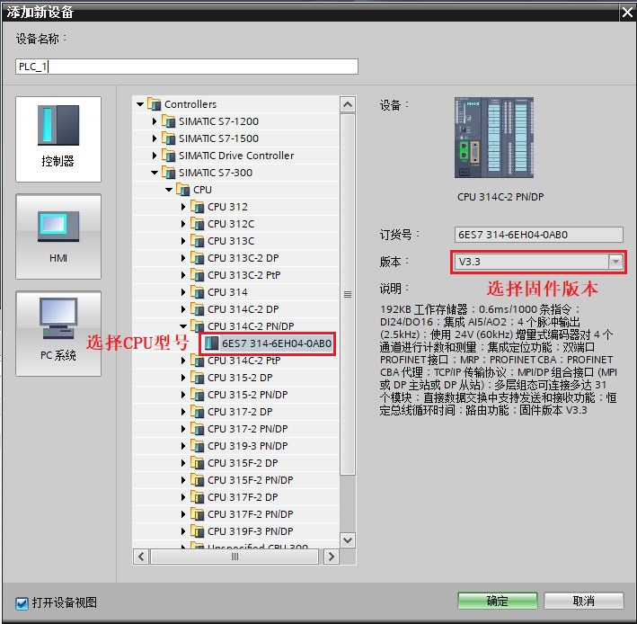

图 1\. 添加新设备

为了编程方便，使用 CPU 属性中定义的时钟位，定义方法如下：

在 “项目树” \> “PLC_1” > “设备组态” 中，选中 CPU ，然后在下面的属性窗口中，“属性” > “时钟存储器” 下，将时钟位定义在 MB0，如图2所示。时钟位程序主要使用 M0.3，它是以 2Hz 的速率在 0 和 1 之间切换的一个位，可以使用它去自动激活发送任务。

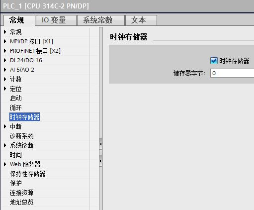

图 2\. 时钟位

**3\. 为 PROFINET 通信口分配以太网地址**

在 “设备视图”中点击 CPU 上代表 PROFINET 通信口的绿色小方块，在下方会出现 PROFINET 接口的属性，在 “以太网地址” 下分配 IP 地址为 192.168.0.2 ，子网掩码为 255.255.255.0，如图 3 所示。

图 3\. 分配 IP 地址

**4．使用 TIA Portal 软件添加新设备****并命名 PLC_2**

与 PLC\_1 在同一个项目中，在“项目树” 下双击 “添加新设备”，在对话框中选择所使用的 S7-1200 CPU 添加到机架上，命名为 PLC\_2，如图 4 所示。

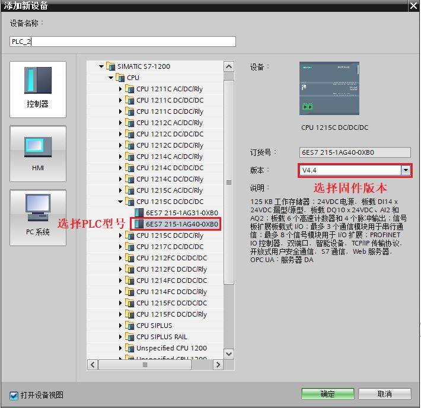

图 4\. 添加新设备

**5\. 为 PROFINET 通信口分配以太网地址**

在 “设备视图”中点击 CPU 上代表 PROFINET 通信口的绿色小方块，在下方会出现 PROFINET 接口的属性，在 “以太网地址” 下分配 IP 地址为 192.168.0.1 ，子网掩码为 255.255.255.0，如图 5 所示。

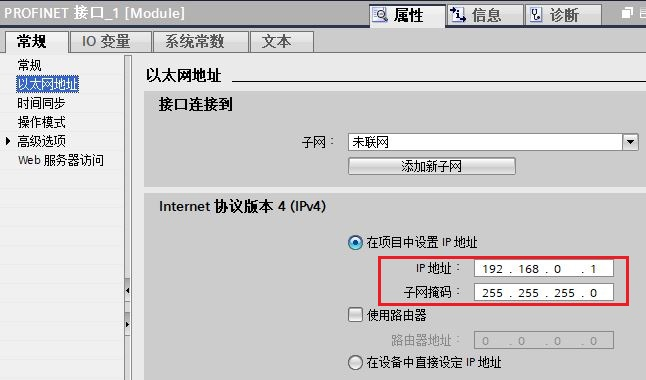

图 5\. 分配 IP 地址

**6\. 激活 CPU 连接机制属性**

激活允许来自远程对象的 PUT/GET 通信访问，参见[连接机制](02-S7-300_Client.html#d)。

**7\. 创建 CPU 的逻辑网络连接**

在网络视图下，用鼠标点中 S7-300 上的 PROFINET 通信口的绿色小方框，然后拖拽出一条线，到另外一个 S7-1200 上的 PROFINET 通信口上，松开鼠标，PN/IE_1的子网连接就建立起来了，如图 6 所示。

图 6\. 网络视图

### 1.2 S7-300 侧组态 S7 连接，连接参数说明

**1\. 网络组态**

（1）打开 “网络视图” 配置网络，首先点中左上角的“连接”图标，选择“S7 连接”，然后选中 S7-300 CPU，右键选择“添加新连接”添加新的连接，如图 7 所示。

图 7\. 添加连接

（2） 然后在“添加新连接”窗口中，选择“PLC_2\[CPU1215C DC/DC/DC\]”，然后点击“添加”建立 S7 连接，如图 8 所示。

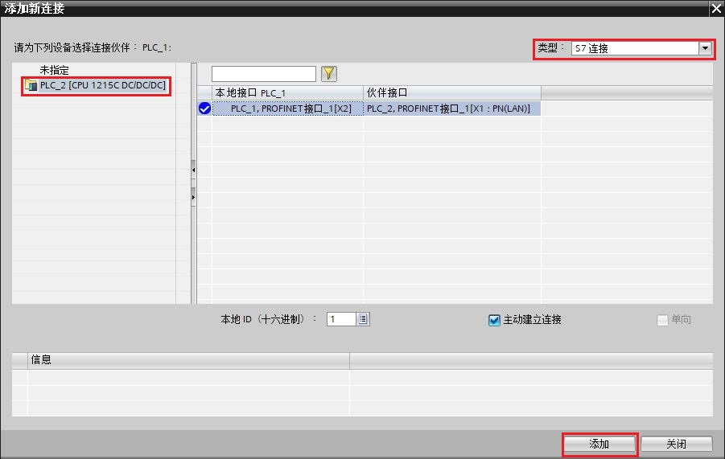

图 8\. 选择连接伙伴

（3）在信息栏里显示连接已添加，如图 9 所示，点击"关闭"即可。

图 9\. 创建新连接

（4）在“网络视图”中，鼠标选中刚刚生成的"S7_连接_1"，在属性的常规选项卡中的"常规"栏，可查看创建的连接名称和连接路径，如图 10 所示。

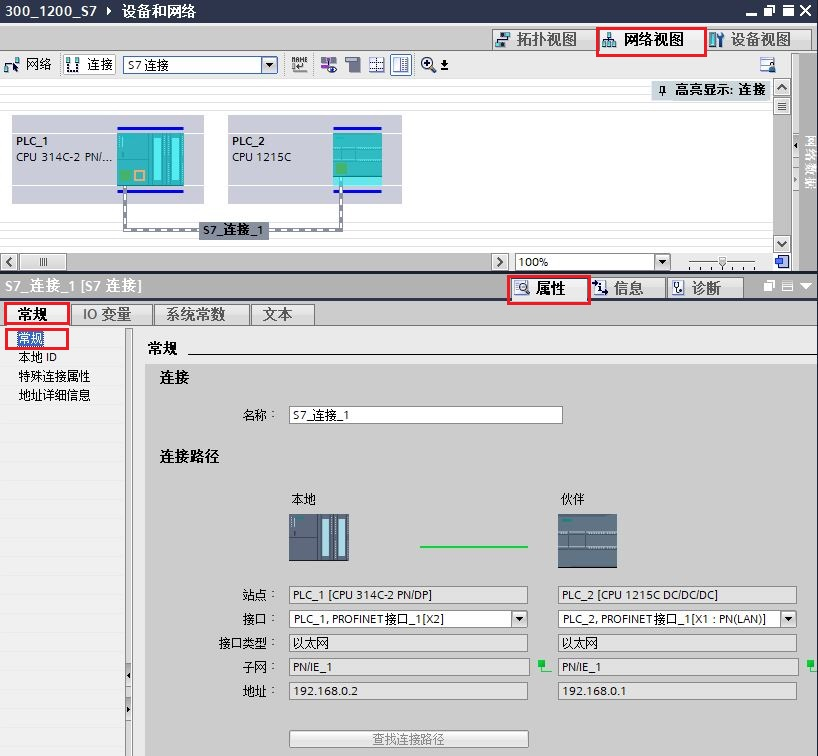

图 10\. S7 连接常规信息

（5）在属性的常规选项卡中的"本地 ID"栏，可查看连接的 ID 号，如图 11 所示。

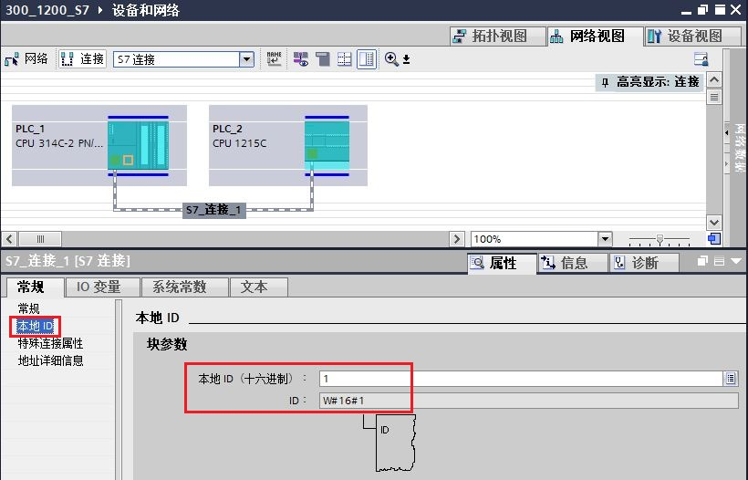

图 11\. 连接 ID 号

（6）在属性的常规选项卡中的"特殊连接属性"栏，可查看特殊连接属性，如图 12 所示。

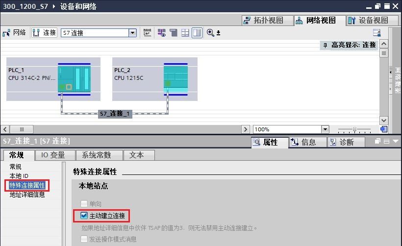

图 12\. 连接属性

（7）在属性的常规选项卡中的"地址详细信息"栏，可查看连接的 TSAP 号，如图 13 所示。

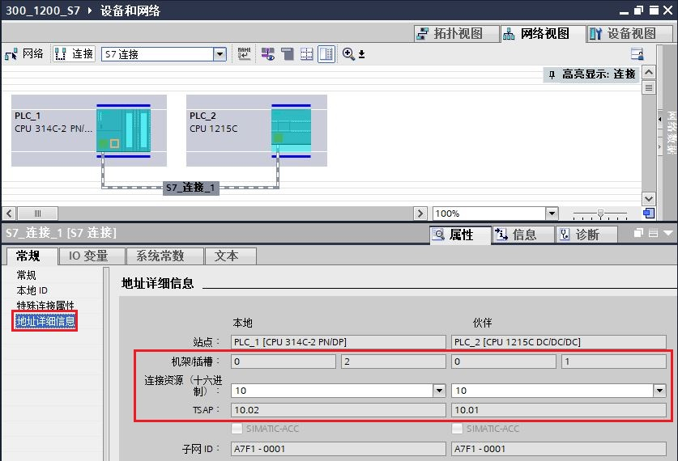

图 13\. 查看通讯双方的 TSAP 号

**2\. 检查连接状态**

（1）配置完网络连接，分别对 S7-300 和 S7-1200 编译保存并下载。下载完成后，可点击"转至在线"按钮，在“网络视图”的“连接”选项卡中查看连接状态，如图 14 所示，本地连接名称“S7_连接_1”左侧有绿色标志，则表示组态的连接已经成功建立。

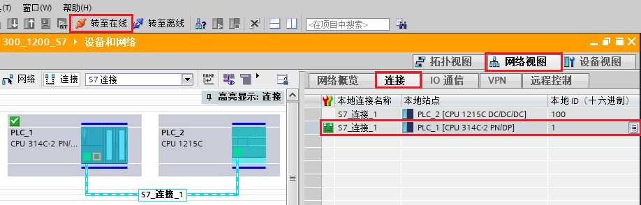

图 14\. 通讯连接已建立

（2）如果出现如图 15 所示的情况，本地连接名称“S7_连接_1”左侧有红色标志，则说明连接没有建立，请检查网线的连接、IP 地址等。

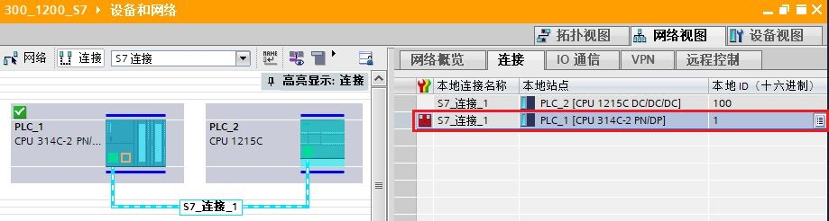

图 15\. 通讯连接未建立

### 1.3 S7-300 侧和 S7-1200 侧软件编程

**1\. S7-300 侧软件编程**

（1）创建并定义 S7-300 的接收数据区 DB 块。

通过“项目树”>“PLC_1”>“程序块”>“添加新块”，选择“数据块” 创建 DB 块，点击“确定”键，定义接收数据区为 10 个字节的数组，如图 16，17 所示。

图 16\. 创建接收数据区 DB 块

图 17\. 定义接收数据区为字节类型的数组

（2）创建并定义 S7-300 的发送数据区 DB 块。

通过“项目树”>“PLC_1”>“程序块”>“添加新块”，选择“数据块” 创建 DB 块，点击“确定”键，定义发送数据区为 10 个字节的数组，如图 18，19 所示。

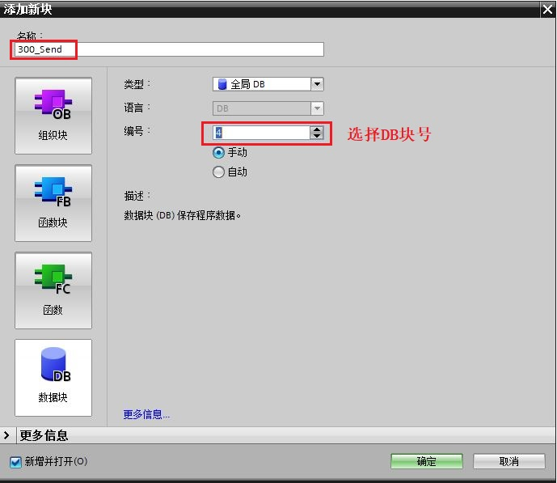

图 18\. 创建发送数据区 DB 块

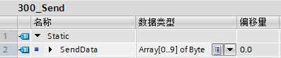

图 19\. 定义发送数据区为字节类型的数组

（3）在 OB1 中，从“指令” >“通信” >“S7 通信”下，调用 GET、PUT 通信指令，程序调用如图 20 所示。

图 20\. 程序调用功能

（4）GET 功能块使用背景数据块 DB1，管脚说明如下：

**参数说明：**

**输入接口参数：**

|     |     |
| --- | --- |
| REQ | ： 系统时钟 2Hz 的脉冲，在上升沿启动发送作业 |
| ID  | ： 连接号，要与连接配置中一致，创建连接时的连接号，如图 11 所示 |
| ADDR_1 | ：指向伙伴 CPU 发送地址区域 |
| SD_1 | ：指向本地 CPU 接收地址区域 |

**输出接口参数：**

|     |     |
| --- | --- |
| NDR | ：接收到新数据时，该位置 1 |
| ERROR | ：通信过程中有错误发生，该位置 1 |
| STATUS | ：有错误发生时，会显示错误代码 |

（5）PUT功能块使用背景数据块 DB2，管脚说明如下：

**参数说明：**

**输入接口参数：**

|     |     |
| --- | --- |
| REQ | ： 系统时钟 2Hz 的脉冲，在上升沿启动发送作业 |
| ID  | ： 连接号，要与连接配置中一致，创建连接时的连接号，如图 11 所示 |
| ADDR_1 | ：指向伙伴 CPU 接收地址区域 |
| SD_1 | ：指向本地 CPU 发送地址区域 |

**输出接口参数：**

|     |     |
| --- | --- |
| DONE | ：发送数据完成时，该位置 1 |
| ERROR | ：通信过程中有错误发生，该位置 1 |
| STATUS | ：有错误发生时，会显示错误代码 |

**2\. S7-1200 侧软件编程**

（1）创建并定义 S7-1200 的发送数据区 DB 块。

通过“项目树”>“PLC_2”>“程序块”>“添加新块”，选择“数据块” 创建 DB 块，在 DB 块的“属性->常规->属性”中，取消勾选“优化的块访问”，点击“确定”键，定义发送数据区为 10 个字节的数组，如图 21，22，23 所示。

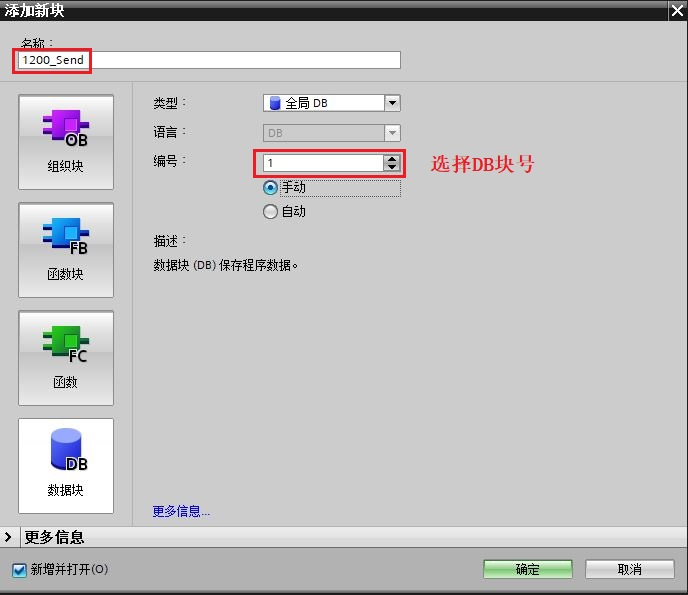

图 21\. 创建接收数据区 DB 块

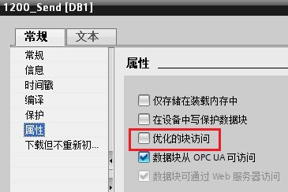

图 22\. 设置发送数据区 DB 块属性

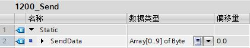

图 23\. 定义发送数据区为字节类型的数组

（2）创建并定义 S7-1200 的接收数据区 DB 块。

通过“项目树”>“PLC_2”>“程序块”>“添加新块”，选择“数据块” 创建 DB 块，在 DB 块的“属性->常规->属性”中，取消勾选“优化的块访问”，点击“确定”键，定义接收数据区为 10 个字节的数组，如图 24，25，26 所示。

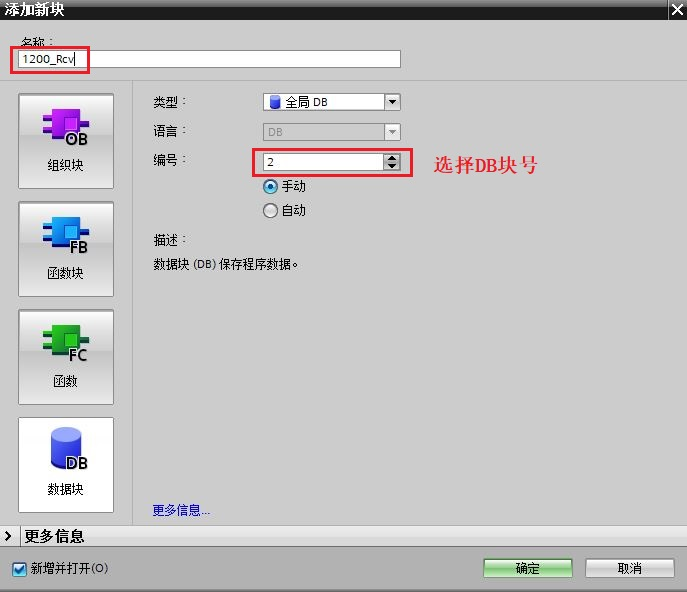

图 24\. 创建接收数据区 DB 块

图 25\. 设置接收数据区 DB 块属性

图 26\. 定义接收数据区为字节类型的数组

### 1.4 下载程序并监控通信结果

下载两个 CPU 中的程序，实现两个 CPU 之间数据交换，监控结果如图 27 所示。

图 27\. 监控结果

### 二. 第二种情况（S7-1200 与 S7-300 不在同一个 TIA Portal 项目）

使用 TIA Portal 在一个项目中，新建一个 S7-300 站点，在另一个项目中，新建一个 S7-1200 站点，然后做 S7 通讯。

### 2.1 S7-300 侧通信的编程，连接参数及通信参数的配置

**1\. 使用 TIA Portal 软件新建一个项目并完成硬件配置**

在 TIA Portal 的 “Portal 视图” 中选择 “创建新项目” 创建一个新项目。

**2.** **添加硬件并命名 PLC**

然后进入 “项目视图”，在“项目树” 下双击 “添加新设备”，在对话框中选择所使用的 S7-300 CPU 添加到机架上，命名为 PLC_1，如图 28 所示。

图 28\. 添加新设备

为了编程方便，使用 CPU 属性中定义的时钟位，定义方法如下：

在 “项目树” \> “PLC_1” > “设备组态” 中，选中 CPU ，然后在下面的属性窗口中，“属性” > “时钟存储器” 下，将时钟位定义在 MB0，如图 29 所示。时钟位程序主要使用 M0.3，它是以 2Hz 的速率在 0 和 1 之间切换的一个位，可以使用它去自动激活发送任务。

图 29\. 时钟位

**3\. 为 PROFINET 通信口分配以太网地址**

在 “设备视图”中点击 CPU 上代表 PROFINET 通信口的绿色小方块，在下方会出现 PROFINET 接口的属性，在 “以太网地址” 下分配IP 地址为 192.168.0.2 ，子网掩码为 255.255.255.0，选择子网“PN/IE_1”，如图 30 所示。

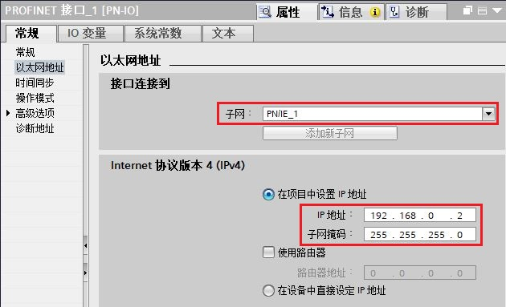

图 30\. 分配 IP 地址

### 2.2 S7-1200 侧通信的编程，连接参数及通信参数的配置

**1．使用 TIA Portal 软件新建项目，添加新设备****并命名 PLC_2**

在 TIA Portal 的 “Portal 视图” 中选择 “创建新项目” 创建一个新项目。然后进入 “项目视图”，在“项目树” 下双击 “添加新设备”，在对话框中选择所使用的 S7-1200 CPU 添加到机架上，命名为 PLC_2，如图 31 所示。

图 31\. 添加新设备

**2\. 为 PROFINET 通信口分配以太网地址**

在 “设备视图”中点击 CPU 上代表 PROFINET 通信口的绿色小方块，在下方会出现 PROFINET 接口的属性，在 “以太网地址” 下分配 IP 地址为 192.168.0.1 ，子网掩码为 255.255.255.0，选择子网“PN/IE_1”，如图 32 所示。

图 32\. 分配 IP 地址

**3\. 激活 CPU 连接机制属性**

激活允许来自远程对象的 PUT/GET 通信访问，参见[连接机制](02-S7-300_Client.html#d)。

### 2.3 S7-300 侧通信的编程，连接参数及通信参数的配置

**1\. 网络组态**

（1）打开 “网络视图” 配置网络，首先点中左上角的“连接”图标，选择“S7 连接”，然后选中 S7-300 CPU，右键选择“添加新连接”添加新的连接，如图 33 所示。

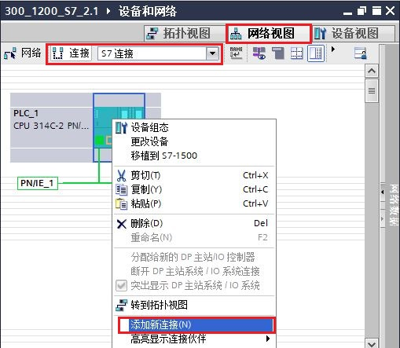

图 33\. 添加连接

（2） 然后在“添加新连接”窗口中，选择“未指定”，然后点击“添加”建立 S7 连接，如图 34 所示。

图 34\. 选择连接伙伴

（3）在信息栏里显示连接已添加，如图 35 所示，点击"关闭"即可。

图 35\. 创建新连接

（4）在“网络视图”中，鼠标选中刚刚生成的"S7_连接_1"，在属性的常规选项卡中的"常规"栏，设置伙伴方的 IP 地址，如本例中的 192.168.0.1，如图 36 所示。

图 36\. S7 连接常规信息

（5）在属性的常规选项卡中的"本地 ID "栏，可查看连接的 ID 号，如图 37 所示。

图 37\. 连接 ID 号

（6）在属性的常规选项卡中的"特殊连接属性"栏，可查看特殊连接属性，如图 38 所示。

图 38\. 连接属性

（7）在属性的常规选项卡中的"地址详细信息"栏，可定义伙伴方的 TSAP 号，如图 39 所示。

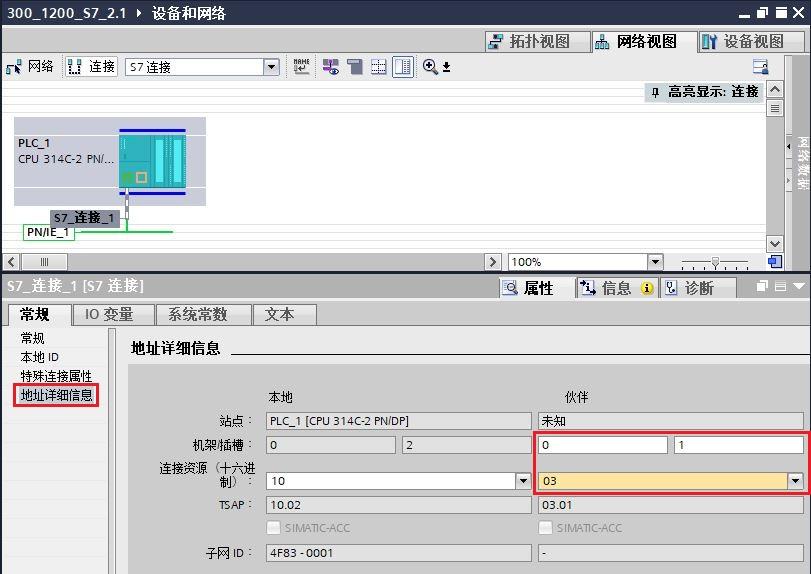

图 39\. 定义伙伴方的 TSAP 号

**注意：**S7-1200 预留给 S7 连接两个 TSAP 地址：03.01 和 03.00

**2\. 检查连接状态**

（1）配置完网络连接，分别对 S7-300 和 S7-1200 编译保存并下载。下载完成后，可点击"转至在线"按钮，在“网络视图”的“连接”选项卡中查看连接状态，如图 40 所示，本地连接名称“S7_连接_1”左侧有绿色标志，则表示组态的连接已经成功建立。

图 40\. 通讯连接已建立

（2）如果出现如图 41 所示的情况，本地连接名称“S7_连接_1”左侧有红色标志，则说明连接没有建立，请检查网线的连接、IP 地址等。

图 41\. 通讯连接未建立

### 2.4 S7-300 侧和 S7-1200 侧软件编程

**1\. S7-300 侧软件编程**

（1）创建并定义 S7-300 的接收数据区 DB 块。

通过“项目树”>“PLC_1”>“程序块”>“添加新块”，选择“数据块” 创建 DB 块，点击“确定”键，定义接收数据区为 10 个字节的数组，如图 42，43 所示。

图 42\. 创建接收数据区 DB 块

图 43\. 定义接收数据区为字节类型的数组

（2）创建并定义 S7-300 的发送数据区 DB 块。

通过“项目树”>“PLC_1”>“程序块”>“添加新块”，选择“数据块” 创建 DB 块，点击“确定”键，定义发送数据区为 10 个字节的数组，如图 44，45 所示。

图 44\. 创建发送数据区 DB 块

图 45\. 定义发送数据区为字节类型的数组

（3）在 OB1 中，从“指令” >“通信” >“S7 通信”下，调用 GET、PUT 通信指令，程序调用如图 46 所示。

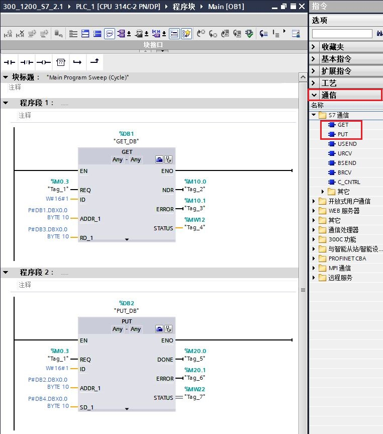

图 46\. 程序调用功能

（4）GET 功能块使用背景数据块 DB1，管脚说明如下：

**参数说明：**

**输入接口参数：**

|     |     |
| --- | --- |
| REQ | ： 系统时钟 2Hz 的脉冲，在上升沿启动发送作业 |
| ID  | ： 连接号，要与连接配置中一致，创建连接时的连接号，如图 37 所示 |
| ADDR_1 | ：指向伙伴 CPU 发送地址区域 |
| SD_1 | ：指向本地 CPU 接收地址区域 |

**输出接口参数：**

|     |     |
| --- | --- |
| NDR | ：接收到新数据时，该位置 1 |
| ERROR | ：通信过程中有错误发生，该位置 1 |
| STATUS | ：有错误发生时，会显示错误代码 |

（5）PUT 功能块使用背景数据块 DB2，管脚说明如下：

**参数说明：**

**输入接口参数：**

|     |     |
| --- | --- |
| REQ | ： 系统时钟 2Hz 的脉冲，在上升沿启动发送作业 |
| ID  | ： 连接号，要与连接配置中一致，创建连接时的连接号，如图 37 所示 |
| ADDR_1 | ：指向伙伴 CPU 接收地址区域 |
| SD_1 | ：指向本地 CPU 发送地址区域 |

**输出接口参数：**

|     |     |
| --- | --- |
| DONE | ：发送数据完成时，该位置 1 |
| ERROR | ：通信过程中有错误发生，该位置 1 |
| STATUS | ：有错误发生时，会显示错误代码 |

**2\. S7-1200 侧软件编程**

（1）创建并定义 S7-1200 的发送数据区 DB 块。

通过“项目树”>“PLC_2”>“程序块”>“添加新块”，选择“数据块” 创建 DB 块，在 DB 块的“属性->常规->属性”中，取消勾选“优化的块访问”，点击“确定”键，定义发送数据区为 10 个字节的数组，如图 47，48，49 所示。

图 47\. 创建接收数据区 DB 块

图 48\. 设置发送数据区 DB 块属性

图 49\. 定义发送数据区为字节类型的数组

（2）创建并定义 S7-1200 的接收数据区 DB 块。

通过“项目树”>“PLC_2”>“程序块”>“添加新块”，选择“数据块” 创建 DB 块，在 DB 块的“属性->常规->属性”中，取消勾选“优化的块访问”，点击“确定”键，定义接收数据区为 10 个字节的数组，如图 50，51，52 所示。

图 50\. 创建接收数据区 DB 块

图 51\. 设置接收数据区 DB 块属性

图 52\. 定义接收数据区为字节类型的数组

### 2.5 下载程序并监控通信结果

下载两个 CPU 中的程序，实现两个 CPU 之间数据交换，监控结果如图 53 所示。

图 53\. 监控结果

### 三. 第三种情况（S7-1200 在TIA Portal 项目中，S7-300 在 STEP7 项目中）

使用 STEP7，新建一个 S7-300 站点，使用 TIA Portal，新建一个 S7-1200 站点，然后做 S7 通讯。

### 3.1 S7-300 侧通信的编程，连接参数及通信参数的配置

**1\. 创建 PLC 项目**

在STEP7 中创建一个项目并插入 CPU314C-2PN/DP 站。操作步骤如下：

(1) 打开 STEP7，在“File” 菜单中选择“New…” 选项，如图 54 所示。

图 54\. 新建项目

(2) 在弹出的创建新项目窗口里输入项目名为“ 300S7Client”，然后点击“ OK”按钮，如图 55 所示。

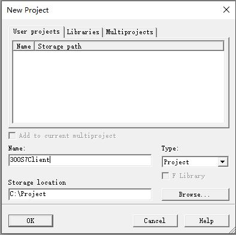

图 55\. 输入项目名称

(3) 在 300S7Client 下点击右键“ Insert New Object”，选择“ SIMATIC 300 Station”，如图 56 所示。

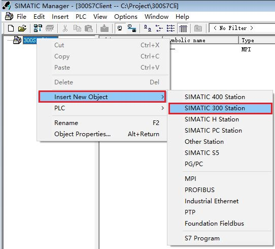

图 56\. 插入 S7-300 站点

(4) 双击“ Hardware”打开硬件组态，如图 57 所示。

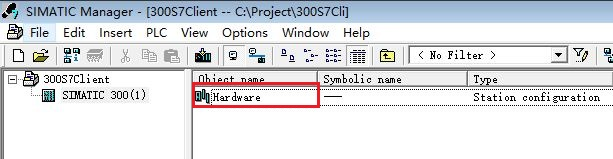

图 57\. 硬件组态

(5) 插入S7-300 导轨，如图 58 所示。

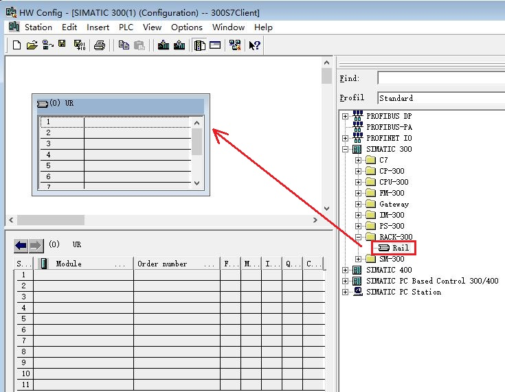

图 58\. 插入S7-300 导轨

(6) 插入S7-300 CPU，与实际CPU 一致：6ES7 314-6EH04-0AB0 V3.3，如图 59 所示。

图 59\. 插入S7-300 CPU

(7) 在弹出的“ Properties-Ethernet interface PN-IO”对话框的“ Parmeters”选项卡中为以太网接口设置 IP 地址192.168.0.2 和子网掩码 255.255.255.0，如图 60 所示。

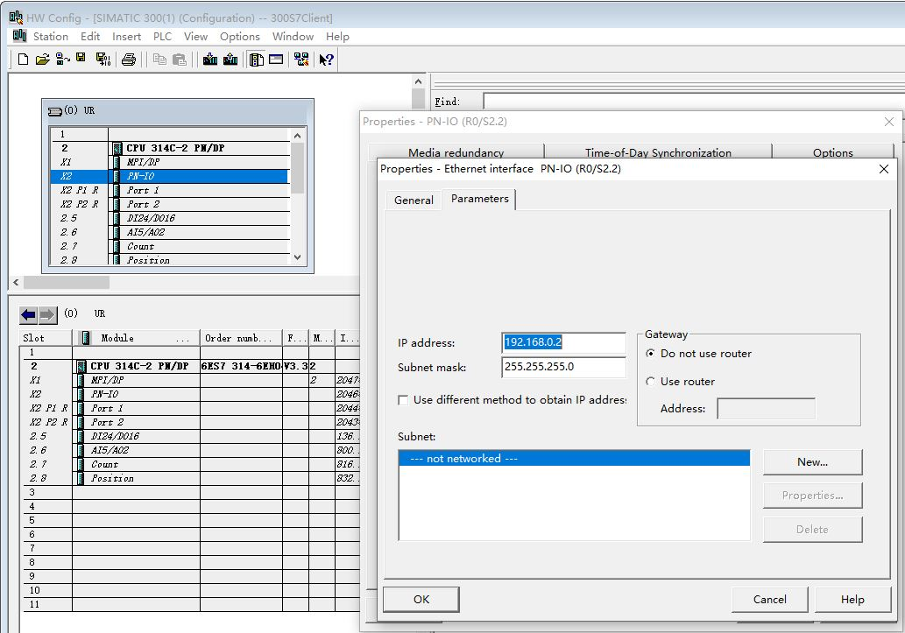

图 60\. 设置IP地址和子网掩码

(8) 点击“ New...”新建子网，如图 61 所示。

图 61\. 新建子网

(9) “ New subnet Industrial Ethernet”对话框下Name： Ethernet(1)，如图 62 所示。

图 62\. 子网名称

(10) 新建 子网后，点击“ OK”，如图 63 所示。

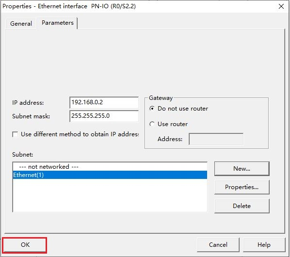

图 63\. 确认子网

(11) 点击“ Save and Compile”按钮。编译保存硬件组态信息，如图 64 所示。

图 64\. 保存并编译硬件组态

### 3.2 S7-1200 侧通信的编程，连接参数及通信参数的配置

**1\. 使用 TIA Portal 软件新建一个项目并完成硬件配置**

在 TIA Portal 的 “Portal 视图” 中选择 “创建新项目”。

**2.** **添加硬件并命名 PLC**

然后进入 “项目视图”，在“项目树” 下双击 “添加新设备”，在对话框中选择所使用的 S7-1200 CPU 添加到机架上，命名为 PLC_2，如图 65 所示。

图 65\. 添加新设备

**3\. 为 PROFINET 通信口分配以太网地址**

在 “设备视图”中点击 CPU 上代表 PROFINET 通信口的绿色小方块，在下方会出现 PROFINET 接口的属性，在 “以太网地址” 下分配 IP 地址为 192.168.0.1 ，子网掩码为 255.255.255.0，选择子网“PN/IE_1”，如图 66 所示。

图 66\. 分配 IP 地址

**4\. 激活 CPU 连接机制属性**

激活允许来自远程对象的 PUT/GET 通信访问，参见[连接机制](02-S7-300_Client.html#d)。

**5\. 下载组态**

对 CPU 硬件组态进行保存编译下载。

### 3.3 S7-300 侧通信的编程，连接参数及通信参数的配置

**1\. 网络组态**

（1）点击快捷菜单中的 Configure Network 按钮进入 Netpro 视图，如图 67 所示。

图 67\. 点击 Configure Network 按钮

（2）在 Netpro 视图的 CPU 上点右键选择 Insert New Connection 添加新连接，如图 68 所示。

图 68\. 添加新连接

（3）通讯伙伴选择非指定（Unspecified），通讯类型选择 S7 connection，如图 69 所示。

图 69\. 选择通信伙伴和通信类型

（4）点击“OK”按钮后，在弹出的属性窗口中勾选单端组态（Establish an active connection），并填写通信伙伴的 IP 地址，注意 Local ID 编号，本例保持默认值 1，如图 70 所示。之后点击地址详细按钮（Address Details...）。

图 70\. S7 连接属性

（5）在地址详细信息对话框中填写通信伙伴 CPU 的机架号和槽号，槽号设置为 0 或 1。点击“OK”按钮，如图 71 所示。

图 71\. S7 地址详细信息

（6）选中 CPU，先编译再下载，如图 72 所示。

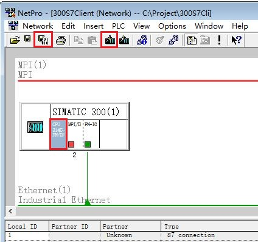

图 72\. 编译下载

**2\. 检查连接状态**

（1）下载完成后，可点击"激活连接状态"按钮，查看连接状态，如图 73 所示，则表示组态的连接已经成功建立。

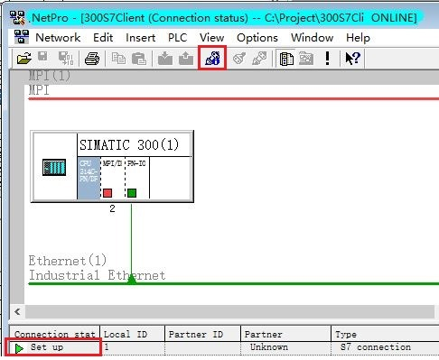

图 73\. 连接已建立

（2）如果出现如图 74 所示的情况，则说明连接没有建立，请检查网线的连接、IP 地址等。

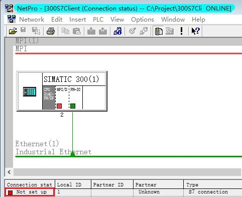

图 74\. 连接未建立

### 3.4 S7-300 侧和 S7-1200 侧软件编程

**1\. S7-300 侧软件编程**

1.1 添加指令块

（1）查看SIMATIC Manager> Blocks，生成了 OB1，如图 75 所示。

图 75\. 查看 Blocks

(2) 双击OB1 进入，如图 76 所示。

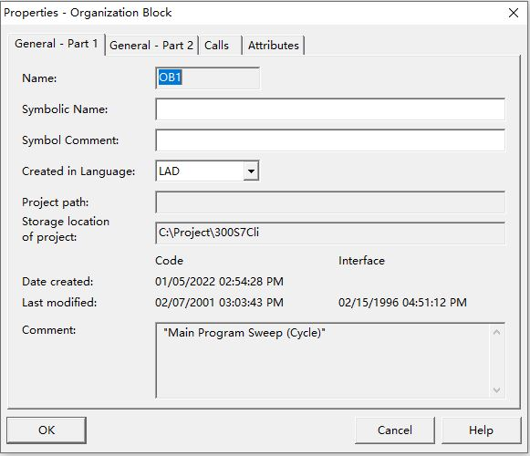

图 76\. 点击 OB1

(3) 需要的功能块，如图 77 所示。

图 77\. 查找功能块

(4) 插入FB14 GET，如图 78 所示

图 78\. 插入FB14

(5) 添加背景 DB，如图 79 所示。

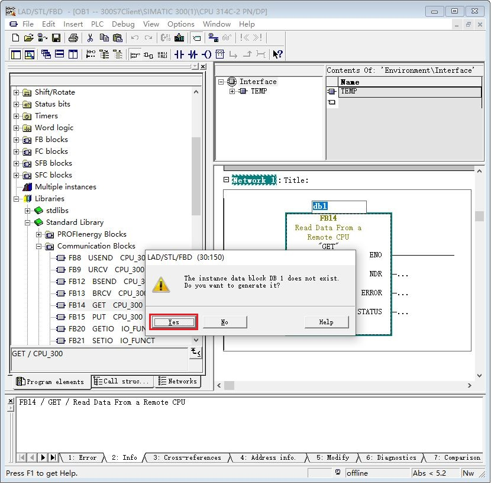

图 79\. 添加背景 DB

****注意：

功能块 FB15 PUT 的插入方法和 FB14 GET 相同。

如果是 S7-400 PN/CP，需要插入 SFB 14 GET 与 SFB 15 PUT，位置如图 80 所示。

图 80\. SFB 14/SFB 15

1.2 创建并定义 S7-300 的接收数据区 DB 块。

（1）添加Data Block，如图 81 所示。

图 81\. 添加数据块

(2) 添加共享DB3，作为接收数据区，如图 82 所示。

图 82\. 定义接收数据块

(3) 添加变量，类型为数组，如图 83 所示。

图 83\. 修改数据类型

(4) 添加10个BYTE 的数组变量，如图 84 所示。

图 84\. 定义变量

1.3 创建并定义 S7-300 的发送数据区 DB 块。

（1）添加Data Block，如图 85 所示。

图 85\. 添加数据块

(2) 添加共享DB4，作为发送数据区，如图 86 所示。

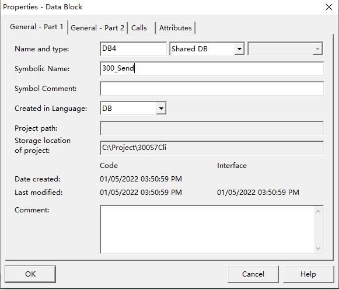

图 86\. 定义发送数据块

(3) 添加变量，类型为数组，如图 87 所示。

图 87\. 修改数据类型

(4) 添加 10个BYTE 的数组变量，如图 88 所示。

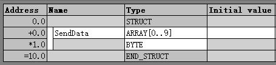

图 88\. 定义变量

1.4 定义时钟存储器

（1）在 S7-300 项目的 Hardware 中，右键点击 CPU，选择 Object Properties>Cycle/Clock Memory，勾选“Clock memory”，输入Memory byte，如图 89 所示。

图 89\. 使用时钟存储器

1.5 填写 GET 和 PUT 指令的引脚，程序调用如图 90 所示.

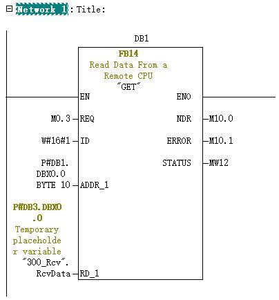

图 90\. 程序调用功能

（1）GET 功能块使用背景数据块 DB1，管脚说明如下：

**参数说明：**

**输入接口参数：**

|     |     |
| --- | --- |
| REQ | ： 系统时钟 2Hz 的脉冲，在上升沿启动发送作业 |
| ID  | ： 连接号，要与连接配置中一致，创建连接时的连接号，如图 70 所示 Local ID |
| ADDR_1 | ：指向伙伴 CPU 发送地址区域 |
| SD_1 | ：指向本地 CPU 接收地址区域 |

**输出接口参数：**

|     |     |
| --- | --- |
| NDR | ：接收到新数据时，该位置 1 |
| ERROR | ：通信过程中有错误发生，该位置 1 |
| STATUS | ：有错误发生时，会显示错误代码 |

（2）PUT 功能块使用背景数据块 DB2，管脚说明如下：

**参数说明：**

**输入接口参数：**

|     |     |
| --- | --- |
| REQ | ： 系统时钟 2Hz 的脉冲，在上升沿启动发送作业 |
| ID  | ： 连接号，要与连接配置中一致，创建连接时的连接号，如图 70 所示 Local ID |
| ADDR_1 | ：指向伙伴 CPU 接收地址区域 |
| SD_1 | ：指向本地 CPU 发送地址区域 |

**输出接口参数：**

|     |     |
| --- | --- |
| DONE | ：发送数据完成时，该位置 1 |
| ERROR | ：通信过程中有错误发生，该位置 1 |
| STATUS | ：有错误发生时，会显示错误代码 |

**2\. S7-1200 侧软件编程**

（1）创建并定义 S7-1200 的发送数据区 DB 块。

通过“项目树”>“PLC_2”>“程序块”>“添加新块”，选择“数据块” 创建 DB 块，在 DB 块的“属性->常规->属性”中，取消勾选“优化的块访问”，点击“确定”键，定义发送数据区为 10 个字节的数组，如图 91，92，93 所示。

图 91\. 创建接收数据区 DB 块

图 92\. 设置发送数据区 DB 块属性

图 93\. 定义发送数据区为字节类型的数组

（2）创建并定义 S7-1200 的接收数据区 DB 块。

通过“项目树”>“PLC_2”>“程序块”>“添加新块”，选择“数据块” 创建 DB 块，在 DB 块的“属性->常规->属性”中，取消勾选“优化的块访问”，点击“确定”键，定义接收数据区为 10 个字节的数组，如图 94，95，96 所示。

图 94\. 创建接收数据区 DB 块

图 95\. 设置接收数据区 DB 块属性

图 96\. 定义接收数据区为字节类型的数组

### 3.5 下载程序并监控通信结果

下载两个 CPU 中的程序，实现两个 CPU 之间数据交换：

(1) 写入 16进制数据“ 01 02 03 04 05 06 07 08 09 10”，如图 97 所示。

图 97.CPU314C-2PN/DP 写入数据

（2）监控结果如图 98 所示。

图 98\. 监控结果

### 四. 附加说明

请注意，如果使用固件版本为 V4.0 以上的 S7-1200 CPU 作为服务器，则需要如下额外设置，才能保证 S7 通信正常。

点开作为 S7 服务器的 S7-1200 CPU 的设备组态，“属性->常规->防护与安全”（V14 及以前是“属性->常规->保护”）里“连接机制”一项需要勾选“允许来自远程对象的 PUT/GET 通信访问”（V14 及以前是“允许从远程伙伴（PLC\\HMI\\OPC\\...)使用 PUT/GET 通信访问”），如图 99 所示：

图 99\. 通信保护设置