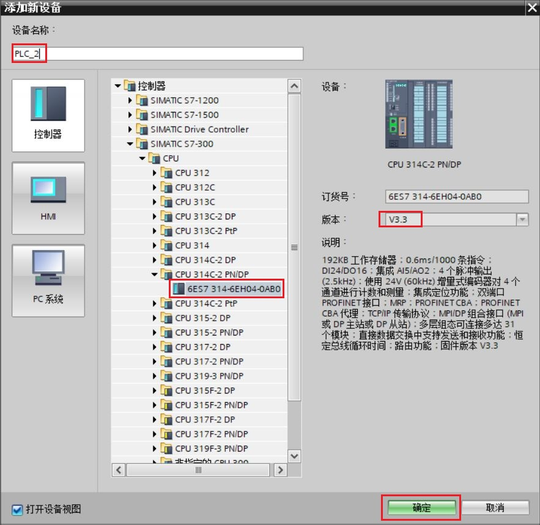
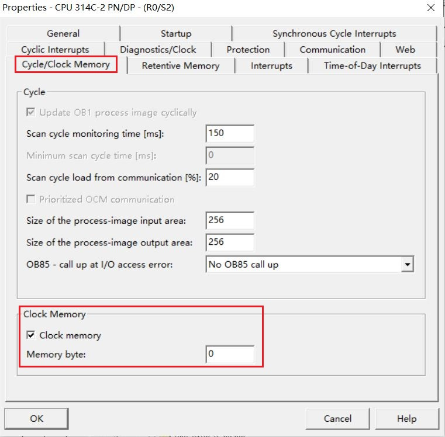

 ## S7-1200 CPU 与 CP343-1 S7 通信（S7-1200 作为服务器）

S7-1200 CPU 与 CP343-1 之间的以太网通信通过 S7 通信来实现。当 CP343-1（至少标准版）作为客户端，S7-1200 作为服务器，需在客户端单边组态连接和编程，而作为服务器端的 S7-1200 只需准备好通信的数据（非优化的 DB 块，或者 PLC 变量）以及 V4.0 版本以上 CPU 需要激活连接机制。

### 硬件和软件需求及所完成的通信任务

所需条件：

① S7-1215 DC/DC/DC V4.5 / CPU 314C-2 PN/DP，V3.3 + CP343-1（6GK7 343-1EX30-0XE0），V3.0

② TIA Portal Step7 Professional V17/ Step7 V5.6 SP2

所完成的通信任务：

① S7-300 CPU 将本地 DB3 中的数据通过 CP 卡写到 S7-1200 CPU 中 DB4 中。

② S7-300 CPU 通过 CP 卡将 S7-1200 CPU 中 DB3 的数据读取到本地 DB4 中。

S7-1200 与 CP343-1 之间 S7 通讯，可以分 2 种情况来操作，具体如下：

1.  [第一种情况：S7-1200 与 CP343-1 都在 TIA Portal 中操作](04-S7-300CP_Client.htm#a)
2.  [第二种情况：S7-1200 在 TIA Portal 项目中，CP343-1 在 Step7 项目中](04-S7-300CP_Client.htm#b)

### 一. 第一种情况（S7-1200 与 CP343-1 都在 TIA Portal 中操作）

在 TIA Portal 中，新建一个 S7-1200 站点和一个 S7-300 站点，然后做 S7 通信。

**注意：本情况是适用于“S7-1200 与 CP343-1 在同一 TIA Portal 项目中” 和 “S7-1200 与 CP343-1 在不同 TIA Portal 项目中”两种情况。**

### 1.1 S7-1200 侧和 S7-300CP 侧硬件组态配置

**1\. 使用 TIA Portal 软件新建一个项目并完成硬件配置**

在 TIA Portal 的 “Portal 视图” 中选择 “创建新项目” 创建一个新项目。

**2\.** **添加 S7-1200 CPU 硬件并为命名 PLC**

然后进入 “项目视图”，在“项目树” 下双击 “添加新设备”，在对话框中选择所使用的 S7-1200 CPU 添加到机架上，命名为 PLC_1，如图 1 所示。

图 1\. 添加 S7-1200 CPU 设备

S7-1200 CPU 作为服务器，对于 V4.0 及其以上固件版本，必须勾选连接机制选项，否则会导致 S7 通信异常。在 CPU 常规属性-防护与安全-连接机制内勾选参数设置，如图 2 所示。

图 2\. 设置连接机制属性

**3\. 为 PROFINET 通信口分配以太网地址**

在 “设备视图”中点击 CPU 上代表 PROFINET 通信口的绿色小方块，在下方会出现 PROFINET 接口的属性，在 “以太网地址” 下分配 IP 地址为 192.168.0.15 ，子网掩码为 255.255.255.0，如图 3 所示。

图 3\. 分配 S7-1200 CPU IP 地址

**4．添加 S7-300 CPU 和 CP343-1 硬件并命名 PLC**

然后进入 “项目视图”，在“项目树” 下双击 “添加新设备”，在对话框中选择所使用的 S7-300 CPU 添加到机架上，命名为 PLC_2，如图 4 所示。

图 4\. 添加 S7-300 CPU 设备

为了编程方便，使用 CPU 属性中定义的时钟位，定义方法如下： 在 “项目树” > “PLC_2”> “设备组态” 中，选中 CPU ，然后在下面的属性窗口中，“属性” > “时钟存储器” 下时钟字节定义在 MB0，如图 5 所示。 时钟位使用 M0.5，以 1Hz 的速率自动激活发送任务。

图 5\. 启动时钟存储器

**5\. 组态 CP343-1 并分配以太网地址**

在 “设备视图”中点击 CP 上代表 PROFINET 通信口的绿色小方块，在下方会出现 PROFINET 接口的属性，在 “以太网地址” 下分配 IP 地址为 192.168.0.11，子网掩码为 255.255.255.0，如图 6 所示。

图 6\. 分配 CP343-1 IP 地址

**6\. 创建 CPU 的逻辑网络连接（仅当S7-1200 和 S7-300 在同一 TIA 项目）**

在 “项目树”>“设备和网络” >“网络视图” 视图下，创建两个设备的连接。用鼠标点中 S7-1200 上的PROFINET通信口的绿色小方框，然后拖拽出一条线，到另外一个 CP343-1 上的 PROFINET 通信口上，松开鼠标，PN/IE_1 的子网连接就建立起来了，如图 7 所示。

图 7\. 建立伙伴间的网络子网连接

**注：当 S7-1200 和 S7-300 在不同项目时，无需操作此步骤。独立设置各自 PLC/CP 的子网连接即可。**

### 1.2 在 S7-300 侧配置 S7 单边通信连接和编程

#### **1．创建 S7 单边通信连接**

① 打开 "网络视图" 配置网络，点中左上角的"连接"图标，此时 CPU 变成亮蓝色，选择 S7 连接，然后选中 S7-300 CPU，右键选择添加新的连接， 如图 8 所示。

图 8\. 网络视图配置

② 在连接列表里选择**未指定**，并确认本地接口，确认连接类型为 S7 连接。S7-300 侧因做 S7 单边通信客户端，确认 S7 连接属性为主动建立连接和单向，最后点击添加，如图 9 所示。

图 9\. 添加未指定伙伴的 S7 单边新连接

**注意：**

此处也可以选择指定的 CPU，但是这时则会在 CPU 和 CP 生成两条连接，此时为 S7 双边连接，这样两个 CPU 需要分别编译下载组态，如图 10、11 所示。

所以，一般建议选择未指定 S7 连接。

图 10\. CP343-1 添加指定伙伴的 S7 连接

图 11\. S7 双边连接

③ 在“网络视图”-“连接”内，查看新添加的 S7 单边连接。在“连接”下只有一个 S7 单边连接存在，在 S7 连接常规-属性内，设置伙伴的 IP 地址，如图 12 所示。

图 12\. 设置伙伴 IP 地址

#### **2．设置 S7 单边通信连接**属性

① 在“网络视图”-“连接”内选中新创建的 S7 单边连接，在常规-属性内设置 S7 单边连接参数。本地ID使用默认 ID 值 W#16#100，在调用 S7 指令时使用，如下图 13 所示。

图 13\. S7 单边连接本地 ID

② 特殊连接属性内，确认客户端 S7 单边连接参数：“单向”、“主动建立连接”勾选，如图 14 所示。

图 14\. S7 单边连接特殊连接属性

③ 地址详细信息内，设置本地和伙伴双方 TSAP，如图 15 所示。

图15\. S7 单边连接地址详细信息

**注意：**S7-1200 预留给 S7 连接两个 TSAP 地址：03.00 和 03.01。

#### **3．S7-300 侧软件编程**

① 创建接收和发送数据块 ，接收 DB 10 字节数组，发送 DB 10 字节数组。如图 16、17 所示。

图 16\. S7-300 创建接收数据区 DB 块

图 17\. S7-300 创建发送数据区 DB 块

② 在 OB1 中，从"指令">"通信">"S7 通信">"其他"下，调用 GET\_S、PUT\_S 通信指令。程序如图 18 所示。

图 18\. OB1 调用 S7 通信指令

**指令管脚参数说明：**

|     |     |     |
| --- | --- | --- |
| CALL “PUT_S” | ：%DB1 | //调用 PUT_S，使用背景 DB 块：DB1 |
| REQ | ：=%M0:5 | //系统时钟 1 秒脉冲 |
| ID  | ：=W#16#1 | //连接号，要与连接配置中一致 |
| DONE | ：=%M10.0 | //为 1 时，发送完成 |
| ERROR | ：=%M10.1 | //为 1 时，有故障发生 |
| STATUS | ：=%MW12 | //状态代码 |
| ADDR_1 | ：=P#DB4.DBX 0.0 BYTE 10 | //发送到通信伙伴数据区的地址 |
| SD_1 | ：=P#DB3.DBX0.0 BYTE 10 | //本地发送数据区 |

|     |     |     |
| --- | --- | --- |
| CALL “GET_S” | ：%DB2 | //调用 GET_S，使用背景 DB 块：DB2 |
| REQ | ：=%M0.5 | //系统时钟 1 秒脉冲 |
| ID  | ：=W#16#1 | //连接号，要与连接配置中一致 |
| NDR | ：=%M20.0 | //为 1 时，接收到新数据 |
| ERROR | ：=%M20.1 | //为 1 时，有故障发生 |
| STATUS | ：=%MW22 | //状态代码 |
| ADDR_1 | ：=P#DB3.DBX 0.0 BYTE 10 | //从通信伙伴数据区读取数据的地址 |
| RD_1 | ：=P#DB4.DBX0.0 BYTE 10 | //本地接收数据地址 |

S7-300 侧 S7 单边连接配置和编程完成，编译存盘并下载。

### 1.3 在 S7-1200 侧配置和编程

①创建接收和发送数据块 ，接收 DB 10 字节数组，发送 DB 10 字节数组。如图 19、20 所示。

图 19\. S7-1200 创建接收数据区 DB 块

图 20\. S7-1200 创建发送数据区 DB 块

② S7 通信中 S7-1200 CPU 侧使用的 DB 块必须为非优化的 DB 块。右键单击 DB 块，在 DB 块属性内取消“DB 块的优化块访问”，如图 21 所示。

图 21\. 取消 DB 块的优化块访问

**注：**进行 S7 单边通信，正常情况下对于 S7-1200 侧（服务器侧）无需任何配置。但需注意两点：

1\. S7-1200 勾选连接机制属性；.

2\. S7-1200 侧被读写的 DB 块取消优化访问。

文档按照双方均为新建项目考虑测试。

### 1.4 监控通信结果

下载两个 CPU 中的所有硬件组态及程序，实现两个 CPU 之间数据交换，监控结果如图 22 所示。

图 22\. 监控结果

### 二. 第二种情况（S7-1200 在 TIA Portal 项目中，CP343-1 在 Step7 项目中）

S7-1200 作为 S7 服务器，使用 TIA Portal 编程；CP343-1 作为 S7 客户端 ，使用 Step7 编程；详细步骤如下。

### 2.1 S7-1200 侧硬件组态配置

该部分内容和 1.1 章节内容相同，不再赘述。

### 2.2 在 S7-300 侧配置 S7 单边通信连接和编程

#### **1 . 创建 PLC 项目**并进行硬件组态配置

在 STEP7 中创建一个项目并插入 CPU 314C-2 PN/DP 和 CP343-1 。操作步骤如下：

(1) 打开 STEP7，在 “File” 菜单中选择 “New…” 选项，如图 23 所示。

图 23\. 新建项目

(2) 在弹出的创建新项目窗口里输入项目名为 “CP343-1_S7” ，然后点击 “OK” 按钮，如图 24 所示。

图 24\. 输入项目名称

(3) 在 CP343-1_S7 下点击右键 “Insert New Object”，选择 “SIMATIC 300 Station”，如图 25 所示。

图 25\. 插入 S7-300 站点

(4) 双击 “Hardware” 打开硬件组态，如图 26 所示。

图 26\. 硬件组态

(5) 插入 S7-300 机架，如图 27 所示。

图 27\. 插入 S7-300 机架

(6) 插入 CPU 314C-2 PN/DP 和 CP343-1，如图 28、29 所示。

图 28\. 插入 S7-300 CPU

图 29\. 插入 CP343-1

(7) 设置 CP343-1 的 IP 地址 192.168.0.11 和子网掩码 255.255.255.0 ，并添加新建子网。如图 30 所示。

图 30\. 设置 IP 地址和添加子网

(8) 为了编程方便，使用 CPU 属性中定义的时钟位，定义方法如下： 双击硬件配置机架内的 CPU 314C-2PN/DP ，进入 CPU 属性设置，选择 Cycle/Clock Memory，然后激活 Clock memory 时钟字节定义为 MB0，如图 31 所示。 时钟位使用 M0.5，以 1Hz 的速率自动激活发送任务。

图 31\. 启动时钟存储器

(9)点击 “Save and Compile” 按钮。编译保存硬件组态信息，如图 32 内 1 所示。

图 32\. 保存并编译硬件组态

#### **2．****在 Netpro 内组态并配置 S7 单边连接**参数

① 硬件配置完毕后，点击 Netpro 图标如图 32 内 2 所示，进入 Netpro 右键 CPU 添加新连接，如图 33 所示。

图 33\. Netpro 内新建 S7 单边连接

②选择未指定的伙伴，类型选择 S7 连接，然后确定，如图 34 所示。

图 34\. 新建未指定 S7 连接

③添加完成后，进一步设置 S7 连接参数。 因 CP343-1 做 S7 单边通信客户端，确认 S7 连接属性为主动建立连接和单向，查看 S7 连接 ID 号，并设置未指定伙伴的 IP 地址，如图 35 所示。

图 35\. 设置新建的 S7 连接参数

④在“Address Details”内设置伙伴的 TSAP，如图 36 所示。

图 36\. 设置伙伴 TSAP

**注意：**S7-1200 预留给 S7 连接两个 TSAP 地址：03.00 和 03.01。

⑤S7-300 侧新建 S7 连接配置完毕，可在 Netpro 内查看到只有一个未指定的 S7 单边连接存在，编译并保存，如图 37 所示。

图 37\. Netpro 内新建的 S7 单边连接

#### **3．在 S7-300 侧软件编程**

①创建接收和发送数据块 ，接收 DB 10 字节数组，发送 DB 10 字节数组。如图 38、39 所示。

图 38\. S7-300 创建接收数据区 DB 块

图 39\. S7-300 创建发送数据区 DB 块

② 在 OB1 中，从"Libraries">"SIMATIC\_NET\_CP">"CP 300"下，调用 FB15 "PUT"、FB14 "GET" 通信指令。程序见图 40。

图 40\. OB1 调用 S7 通信指令

S7-300 侧 S7 单边连接配置和编程完成，编译存盘并下载。

### 2.3 在 S7-1200 侧配置和编程

该部分内容和 1.3 章节内容相同，不再赘述。

### 2.4 监控通信结果

下载两个 CPU 中的所有硬件组态及程序，实现两个 CPU 之间数据交换，监控结果如图 41 所示。

图 41\. 监控结果