## S7-1200 与 S7-1200/S7-1500 S7 通信

S7-1200 的 PROFINET 通信口可以做 S7 通信的服务器端或客户端(CPU V2.0及以上版本)。S7-1200 仅支持 S7 单边通信，仅需在客户端单边组态连接和编程，而服务器端只准备好通信的数据就行。  

硬件：

1.  CPU 1214C DC/DC/DC，**V2.0**
2.  CPU 1214C DC/DC/DC，V4.1

**软件：**

1.  Step7 V13 SP1

**所完成的通信任务：**

1.  S7-1200 CPU Clinet 将通讯数据区 DB1 块中的 10 个字节的数据发送到 S7-1200 CPU server 的接收数据区 DB1 块中；
2.  S7-1200 CPU Clinet 将S7-1200 CPU server 发送数据区 DB2 块中的 10 个字节的数据读到 S7-1200 CPU Clinet 的接收数据区 DB2 块中。

S7-1200之间 S7 通讯，可以分2种情况来操作，具体如下：

1.  [第一种情况：两个 S7-1200 在一个项目中操作](01-S7-1200.html#a)
2.  [第二种情况：两个 S7-1200 不在一个项目中的操作](01-S7-1200.html#b)

此外本文也可用作S7-1200与S7-1500之间的S7通信文档。

### 一. 第一种情况（同一项目中操作）

使用 STEP 7 V13 在同一个项目中，新建两个S7-1200站点，然后做 S7 通讯。

#### 1.1 使用 Step7 V13生成项目

使用 STEP7 V13 创建一个新项目，并通过“添加新设备”组态 S7-1200 站 client V4.1，选择 CPU1214C DC/DC/DC V4.1（client IP:192.168.0.10）；接着组态另一个S7-1200站 server v2.0，选择 CPU1214C DC/DC/DC V2.0（server IP:192.168.0.12），如图 1 所示。

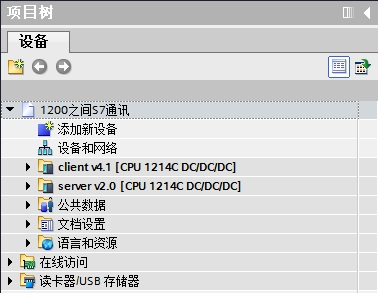 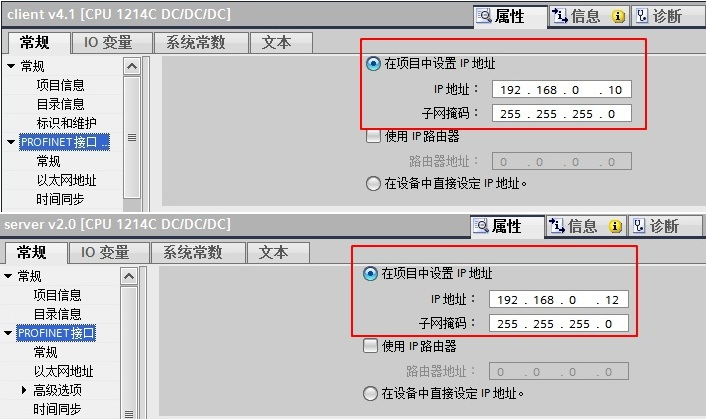

图 1 在新项目中插入2个 S7-1200 站点

### 1.2 网络配置，**组态 S7 连接**

在“设备组态”中 ，选择“网络视图”栏进行配置网络，点中左上角的“连接”图标，连接框中选择“S7连接”，然后选中client v4.1 CPU（客户端），右键选择“添加新的连接”，在创建新连接对话框内，选择连接对象“server v2.0 CPU”，选择“主动建立连接”后建立新连接，如图 2 所示。

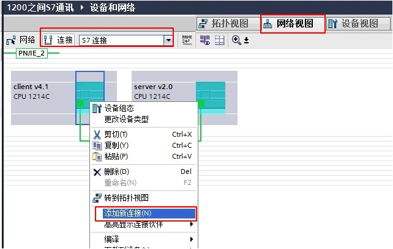

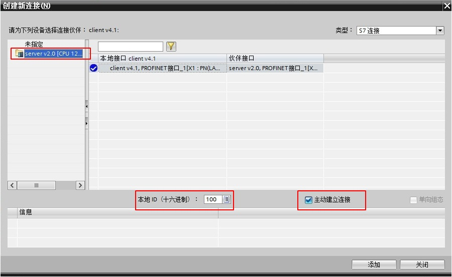

图 2 建立 S7 连接

#### 1.3 S7 连接及其属性说明

在中间栏的“连接”条目中，可以看到已经建立的“S7_连接_1”，如图 3 所示。

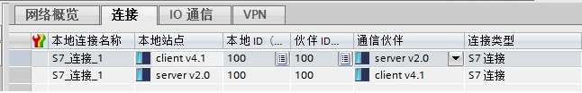

图 3 S7 连接

点中上面的连接，在“S7_连接_1”的连接属性中查看各参数，如图 4 所示。

在常规中，显示连接双方的设备，IP地址。

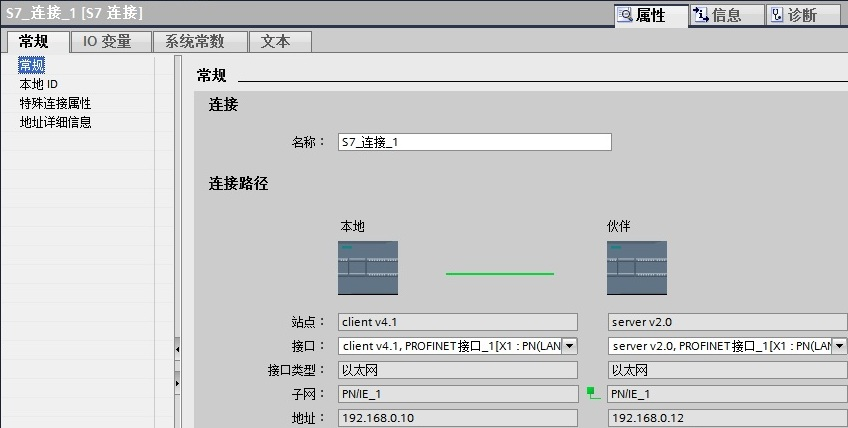

在本地ID中：显示通讯连接的ID 号，这里ID=W#16#100（编程使用）。

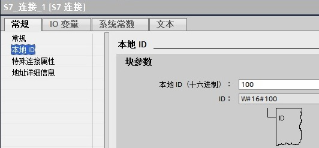

在特殊连接属性中：可以选择是否为主动连接，这里client v4.1是主动建立连接。

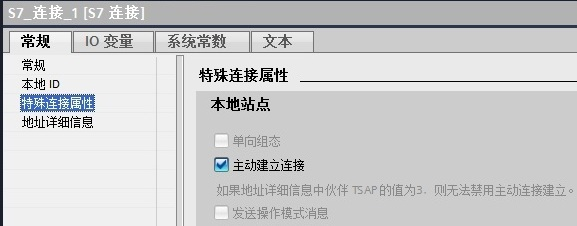

在地址详细信息中：定义通讯双方的 TSAP 号，这里不需要修改。

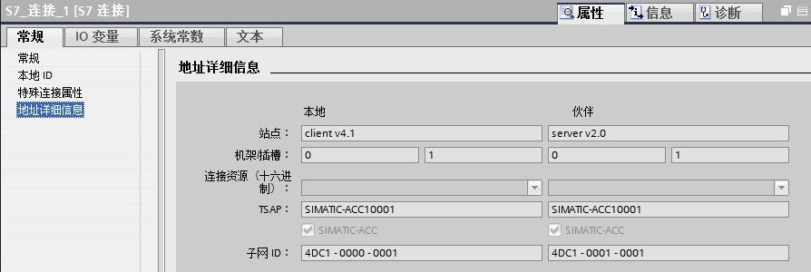

图 4 连接的属性

配置完网络连接，双方都编译存盘并下载。如果通讯连接正常，连接在线状态，如图 5 所示。

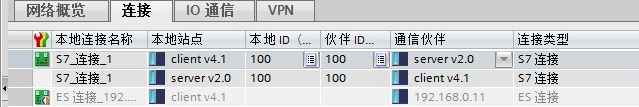

图 5 连接状态  

#### 1.4 软件编程

在 S7-1200 两侧，分别创建发送和接收数据块 DB1 和 DB2，定义成 10 个字节的数组，如图 6 所示。

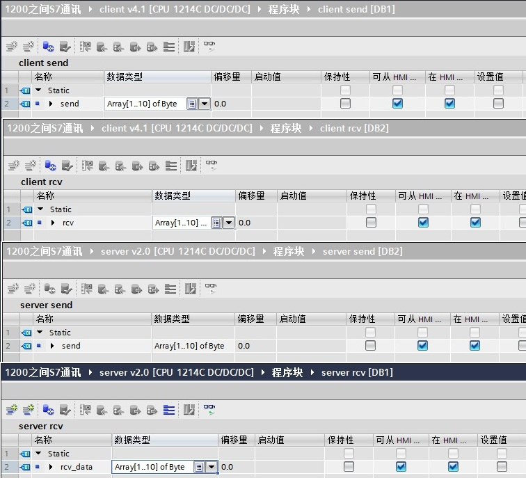

图 6 数据块

注意： 数据块的属性中，需要选择非优化块访问（把默认的勾去掉），如图 7 所示。

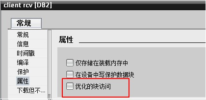

图 7 数据块属性-非优化的块访问

在主动建连接侧编程（client v4.1 CPU），在OB1中，从“Instruction” >“Communication” >“S7 Communication”下，调用 Get、Put 通信指令，如图 8 所示。

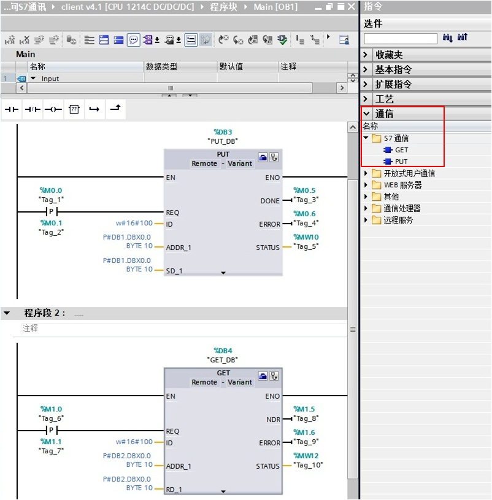

图 8 发送接收指令调用

功能块参数意义如下表1.

|     |     |     |
| --- | --- | --- |
| CALL “PUT” | , %DB3 | //调用 PUT，使用背景DB块：DB3 |
| REQ | ：=%M0.0 | //上升沿触发 |
| ID  | ：=W#16#100 | //连接号，要与连接配置中一致，创建连接时的本地连接号 |
| DONE | ：=%M0.5 | // 为1时，发送完成 |
| ERROR | ：=%M0.6 | // 为1时，有故障发生 |
| STATUS | ：=%MW10 | // 状态代码 |
| ADDR_1 | ：=P#DB1.DBX0.0 BYTE 10 | // 发送到通信伙伴数据区的地址 |
| SD_1 | ：=P#DB1.DBX0.0 BYTE 10 | // 本地发送数据区 |

|     |     |     |
| --- | --- | --- |
| CALL “GET” | , %DB4 | //调用 GET，使用背景DB块：DB4 |
| REQ | ：=%M1.0 | //上升沿触发 |
| ID  | ：=W#16#100 | //连接号，要与连接配置中一致，创建连接时的本地连接号 |
| NDR | ：=%M1.5 | //为1时，接收到新数据 |
| ERROR | ：=%M1.6 | //为1时，有故障发生 |
| STATUS | ：=%MW12 | //状态代码 |
| ADDR_1 | ：=P#DB2.DBX0.0 BYTE 10 | //从通信伙伴数据区读取数据的地址 |
| RD_1 | ：=P#DB2.DBX0.0 BYTE 10 | //本地接收数据地址 |

表1\. 功能块参数意义

#### 1.5 监控结果

通过在 S7-1200 客户机侧编程进行 S7 通讯，实现两个 CPU 之间数据交换，监控结果如图 9 所示。

图 9 监控结果

### 二. 第二种情况（不在同一项目中操作）

使用 STEP 7 V13 不在一个项目中，新建两个S7-1200站点，然后做 S7 通讯。

### 2.1 使用 Step7 V13生成项目

使用 STEP7 V13 创建一个新项目，并通过“添加新设备”组态 S7-1200 站 client V4.1，选择 CPU1214C DC/DC/DC V4.1；接着在另一个项目组态S7-1200站 server v2.0，选择 CPU1214C DC/DC/DC V2.0。

#### 2.2 网络配置，**组态 S7 连接**

在“设备组态”中 ，选择“网络视图”栏进行配置网络，点中左上角的“连接”图标，连接框中选择“S7连接”，然后选中client v4.1 CPU（客户端），右键选择“添加新的连接”，在创建新连接对话框内，选择连接对象“未指定”，如图 10 所示。

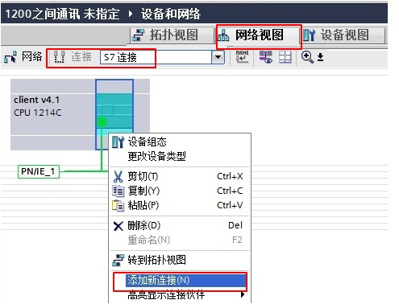

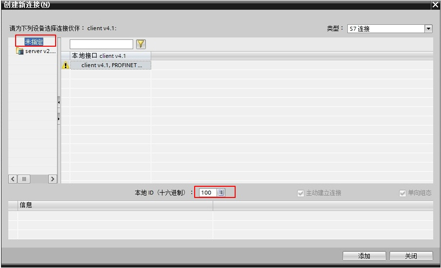

图 10 建立 S7 连接

#### 2.3 S7 连接及其属性说明

在中间栏的“连接”条目中，可以看到已经建立的“S7_连接_1”，如图 11 所示。

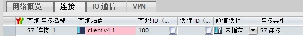

图 11 S7 连接

点中上面的连接，在“S7_连接_1”的连接属性中查看各参数，如图 12 所示。

在常规中，显示连接双方的设备，在伙伴方“站点”栏选择“未知”；在“地址”栏填写伙伴的IP地址192.168.0.12。

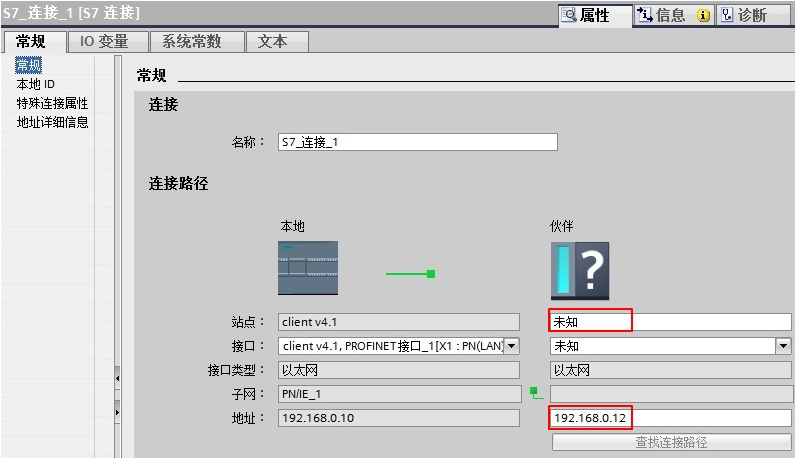

在本地ID中：显示通讯连接的ID 号，这里ID=W#16#100。

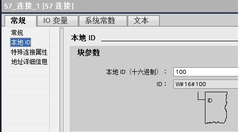

在特殊连接属性中：建未指定的连接，建连接侧为主动连接，这里client v4.1是主动建立连接。

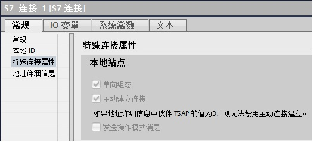

在地址详细信息中：定义伙伴侧的 TSAP 号（**注意：S7-1200预留给S7连接两个TSAP地址：03.01和03.00**），这里设置伙伴的 TSAP:03.00。

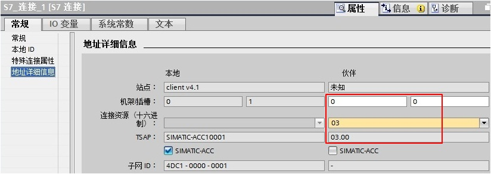

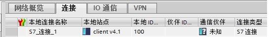

图 12 连接的属性及设置后连接状态

配置完网络连接，编译存盘并下载。如果通讯连接正常，连接在线状态，如图 13 所示。

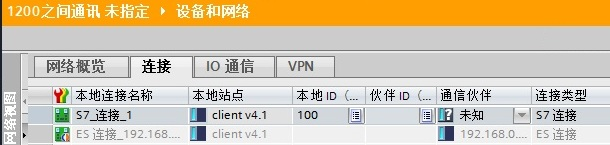

图 13 连接状态

#### 2.4 软件编程

在主动建连接的客户机侧调用 Get、Put 通信指令，具体使用同上一种情况。

### 三、附加说明

请注意，以上例子中使用的作为服务器的PLC是固件版本V2.0的S7-1200 CPU，如果您使用固件版本为 V4.0 以上的 S7-1200 CPU 作为服务器，则需要如下额外设置，才能保证S7通信正常。

请点开作为S7服务器(sever）的 CPU 的设备组态，“属性->常规->防护与安全”（V14及以前是“属性->常规->保护”）里“连接机制”一项需要勾选“允许来自远程对象的PUT/GET通信访问”（V14及以前是“允许从远程伙伴（PLC\\HMI\\OPC\\...)使用 PUT/GET 通信访问”），如下图所示：

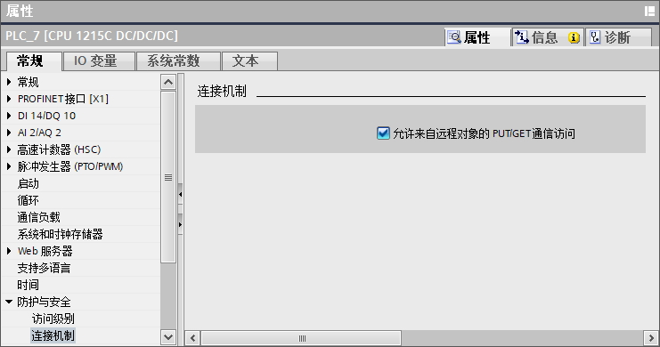

图14 通信保护设置