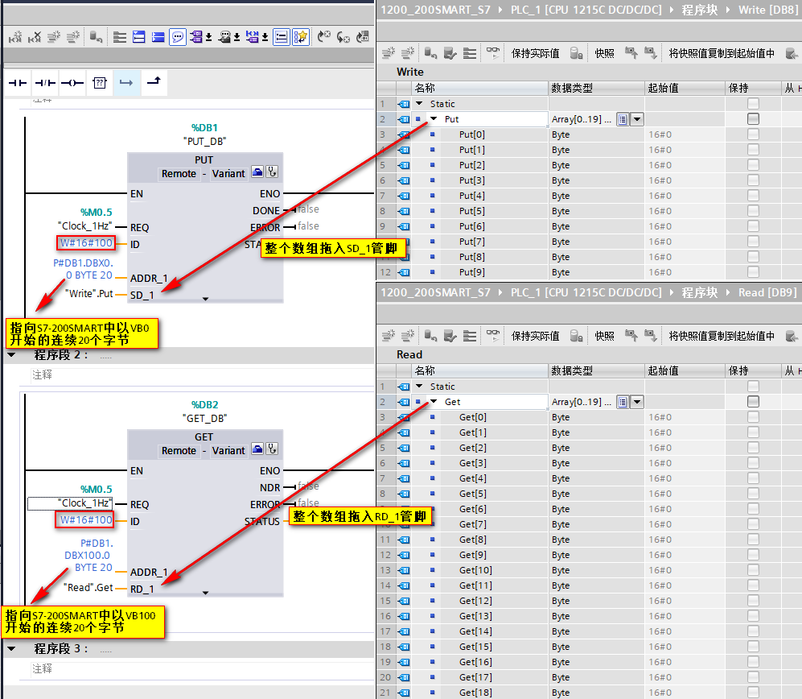
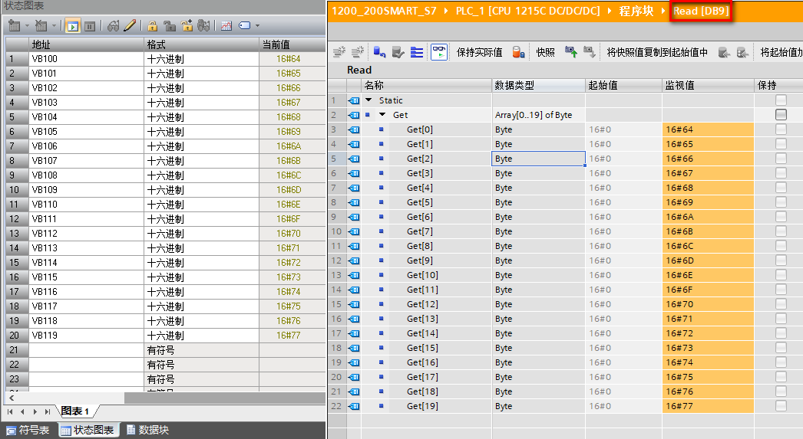

### S7-1200 CPU 与 S7-200 SMART S7 通信（S7-1200 作为客户端）

S7-1200 CPU 固件版本 V2.0 及其以上，本体集成的 PROFINET 通信接口可以做
S7 通信客户端。S7-1200 仅支持 S7
单边通信，做客户端仅需单边组态连接和编程，而做服务器端则只需准备好通信的数据即可。S7-1200
系统预留了 8 个可组态的 S7 连接资源，考虑上 6 个动态连接资源，最多可组态
14 个客户端的 S7 连接。

S7-200 SMART CPU 固件版本 V2.0 及其以上，本体集成的 PROFINET
通信接口支持 S7 通信，可以通过向导或使用 GET/PUT
指令两种方式实现，最多可以建立 16 个 S7 连接，其中包括：8 个客户端，8
个服务器。

本文以S7-1200 作客户端与S7-200 SMART 进行 S7 通信为例，加以说明。

#### 硬件和软件需求及所完成的通信任务

**硬件：**\
① S7-1200 CPU 固件版本 V4.4（文档中S7-1215 DC/DC/DC
订货号：6ES7215-1AG40-0XB0）\
② S7-200 SMART 标准 CPU 固件版本 V2.5 （文档中S7-ST40 DC/DC/DC
订货号：6ES7288-1ST40-0AA0）\
③ PC （带以太网卡），TP电缆(以太网电缆）

**软件：**\
① TIA STEP7 V16\
② STEP7-MicroWIN SMART V2.5

**所完成的通信任务：**\
① S7-1200 将通信数据区 DB8 中的 20 个字节发送到 S7-200 SMART 以 VB0
开始的连续 20 个字节中。\
② S7-1200 读取S7-200 SMART 中以 VB100 开始的连续 20 个字节的数据并存储到
S7-1200 的数据区 DB9 中。

#### S7-1200侧组态和编程

**1. 新建项目**

在项目中，添加 S7-1215 DC/DC/DC，并为其添加子网和分配 IP 地址，如图 1
所示。

{width="787" height="678"}

图1 S7-1215 DC/DC/DC

**2. 激活时钟存储器**

在硬件组态中选择系统和时钟存储器，并激活，如图 2 所示。

{width="612" height="525"}

图2 时钟存储器

**3. 在 OB1 中调用 PUT/GET 指令**

通过点击 PUT/GET 指令块右上角的蓝色图标开始组态 S7 连接，如图 3 所示。

{width="1062" height="736"}

图3 调用指令

**4. 组态 S7 连接**

在伙伴侧选择"未指定"，TIA 软件会自动创建一个 S7
连接（如：S7_连接_1），自动分配连接 ID ，并自动将该 ID
号关联到\"PUT\"指令的 ID 管脚（如：W#16#100）\

在地址栏输入通信伙伴的 IP 地址，本示例中 S7-200 SMART CPU 的 IP
地址为192.168.0.200。\

务必确认该连接 S7-1200 侧"主动建立连接"被勾选，如图 4 所示。

{width="892" height="664"}

图4 组态 S7 连接

**5. 设置 TSAP**

指令块组态完毕后，打开"网络视图"\-\--"连接"选项卡，可以看到 TIA
自动创建的连接，打开该连接属性后，可以为连接设置
TSAP，默认值为03.00；S7-200 SMART 侧的 TSAP 只能设置为 03.00 或
03.01，如图 5 所示。

{width="927" height="754"}

图5 设置TSAP

至此，S7-1200 与 S7-200 SMART 之间 S7
通信连接建立完毕，接下来就是编程了。

**6. 创建 DB**

依据要求，创建 DB 数据区，并建立相应数组，分别命名为 Write、Read，如图 6
所示。

{width="1236" height="661"}

图6 创建 DB

**7. 完善指令**

根据 PUT/GET 指令各个管脚的含义，进行正确编程，如图 7 所示。

{width="972" height="902"}

图7 完善指令

**注意：**

-   **S7-200 SMART 中 V 区对应于 DB1，即在 PUT
    指令中使用的通信伙伴数据区 ADDR_1=P#DB1.DBX0.0 BYTE 20 对应 S7-200
    SMART 中的 VB0-VB19**。\
-   **对于同一个 S7 连接，PUT/GET 指令的 ID 号要相同。**

#### S7-200 SMART侧组态

本文档中S7-200 SMART 作服务器，占用 S7-200 SMART CPU 的 S7
被动连接资源，CPU 中不需要做任何编程，只需设定 CPU 的 IP 地址和在
S7-1200 中设置的伙伴 IP 地址一致即可（图3），如图 8 所示。

{width="681" height="635"}

图8 S7-200 SMART

#### 通信测试

**连接状态**

S7 连接成功的建立是调用 PUT/GET 指令的基础，S7
连接成功建立后，方能正确执行 PUT/GET 指令。在 TIA
软件的网络视图中，转至在线，可以监控 S7 连接状态，如图 9 所示。

{width="1495" height="562"}

图9 S7 连接状态

**数据交互**

通过在线监控查看两者之间的数据交互是否正确，如图 10 、图 11 所示。

{width="1061" height="553"}

图10 DB8 数据

{width="1046" height="573"}

图11 DB9 数据
