### S7-1200 CPU 与 S7-200 SMART S7通信（S7-1200 作为服务器）

S7-200 SMART CPU 固件版本 V2.0 及其以上，本体集成的 PROFINET
通信接口支持 S7 通信，可以通过向导或使用 GET/PUT
指令两种方式实现，最多可以建立 16 个 S7 连接，其中包括：8 个客户端，8
个服务器。

S7-1200 CPU 本体集成的 PROFINET 通信接口可以做 S7 通信的服务器。S7-1200
仅支持 S7
单边通信，做客户端仅需单边组态连接和编程，而做服务器端则只需准备好通信的数据即可。S7-1200
作为S7服务器，可以使用 6 个动态连接资源。

本文以 S7-200 SMART 作客户端通过向导的方式与 S7-1200 进行 S7
通信为例，加以说明。

#### 硬件和软件需求及所完成的通信任务

**硬件：**\
① S7-200 SMART 标准 CPU 固件版本 V2.5 （文档中S7-ST40 DC/DC/DC
订货号：6ES7288-1ST40-0AA0）\
② S7-1200 CPU 固件版本 V4.4（文档中S7-1215 DC/DC/DC
订货号：6ES7215-1AG40-0XB0）\
③ PC （带以太网卡），TP电缆(以太网电缆）

**软件：**\
① STEP7-MicroWIN SMART V2.5\
② TIA STEP7 V16

**所完成的通信任务：**\
① S7-200 SMART 将 VB0 开始的连续 20 个字节中的数据发送到 S7-1200
通信数据区 DB8 中的 20 个字节中。\
② S7-200 SMART 读取 S7-1200 DB9 中的 20 个字节数据并存储在 VB100
开始的连续 20 个字节中。

#### S7-1200侧组态和编程

**1. 新建项目**

在项目中，添加 S7-1215 DC/DC/DC，并为其添加子网和分配 IP 地址，如图 1
所示。

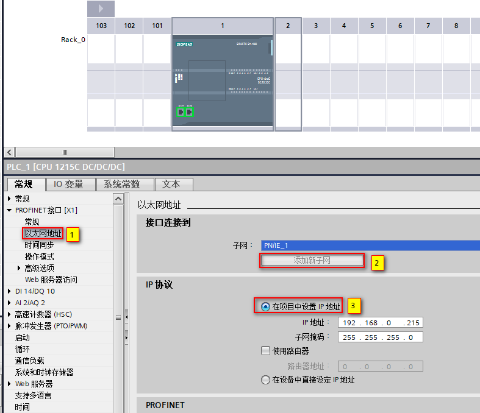{width="787" height="678"}

图1 S7-1215 DC/DC/DC

**2. 创建 DB**

依据要求，创建 DB 数据区，并建立相应数组，分别命名为 Write、Read，如图 2
所示。

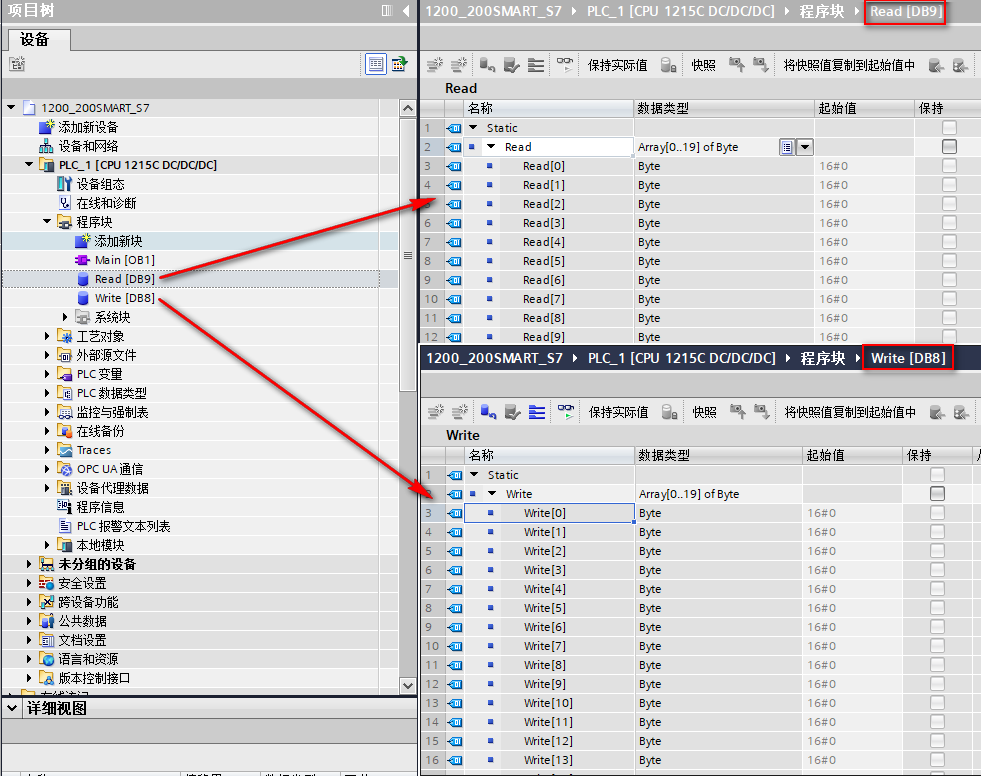{width="981" height="776"}

图2 创建 DB

**3. 创建DB1**

S7-200 SMART 作为 S7 客户端只能访问服务器的V区，而S7-1200没有V区， V
区对应 S7-1200 中 DB1，且只能对应 DB1 ，所以需要把 DB9 中数据传送到
DB1，而将DB1的数据传送到DB8，进而间接实现 S7-200 SMART 对 S7-1200 DB8、
DB9 写和读的操作；创建 DB1 并建立相关变量，如图 3 所示。

{width="955" height="527"}

图3 创建 DB1

**4. 优化的块访问**

数据块的属性中，需要选择非优化的块访问（把默认的勾取消掉），DB1
需要此操作，DB8、DB9 无需此操作，如图 4
所示。注意：需要编译后，才可看到偏移量。

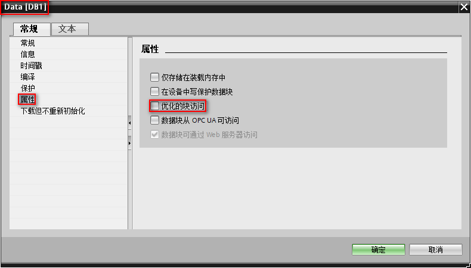{width="790" height="450"}

图4 优化的块访问

**5. 关联变量**

将 DB8、DB9 中需要写和读的变量与 DB1 中的数据进行关联，如图 5 所示。

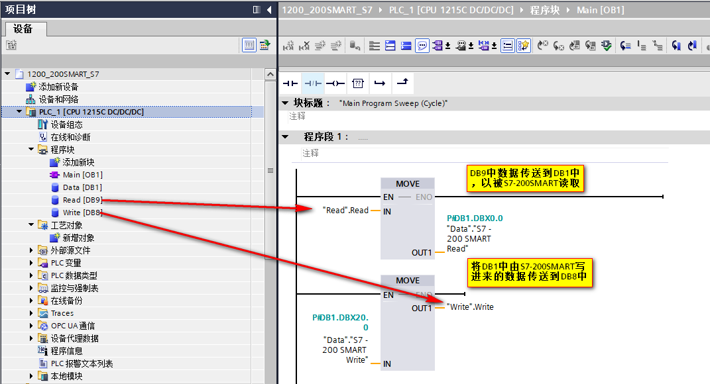{width="1071" height="580"}

图5 关联变量

**6. 连接机制**

S7-1200 作为服务器进行 S7 通信，对于 CPU
V4.0以后的固件版本，需要勾选"允许来自远程对象的PUT/GET通信访问"，否者，无法建立通信，如图
6 所示。

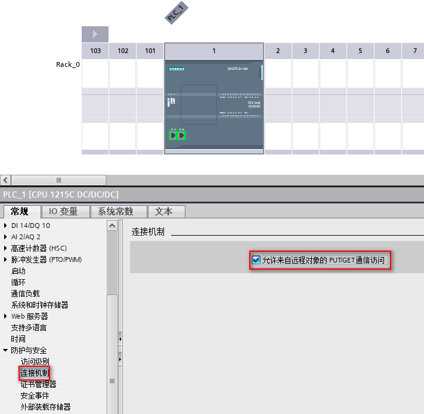{width="711" height="694"}

图6 连接机制

**注意：**

-   **S7-200 SMART 中 V 区对应于 S7-1200 中 DB1，且只能对应 DB1**。

#### S7-200 SMART侧组态和编程

**1. 系统块**

双击"系统块"，设置 S7-200 SMART CPU 的 IP 地址，如图 7 所示。

{width="681" height="635"}

图7 系统块

**2. 向导**

使用向导功能进行 GET/PUT 通信编程，并添加两个操作，分别命名为 Read
、Write，完成后点击"下一个"，如图 8 所示。

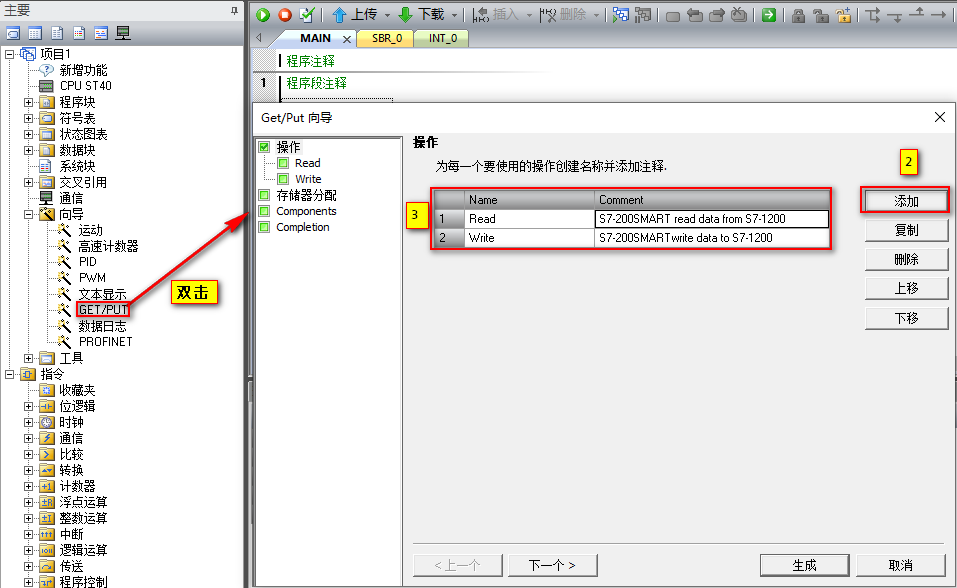{width="957" height="588"}

图8 向导

**3. 配置Read数据**

通过选择操作类型 GET、设置远程 CPU 的 IP 地址、设置本地 CPU
数据区、设置远程 CPU 数据区配置 Read
数据，操作完成后，点击"下一个"，其含义为：S7-200 SMART 读取 S7-1200 DB1
中以 DB1.DBB0 为起始地址的连续20 个字节数据并存储在以 VB100 开始的连续
20 个字节中，如图 9 所示。

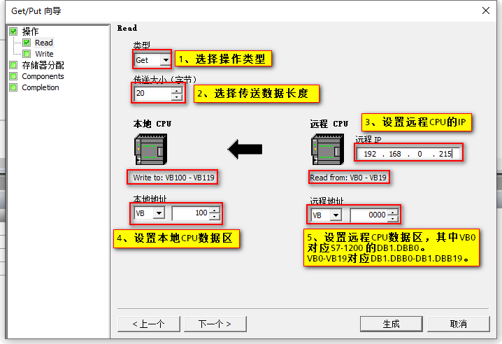{width="718" height="492"}

图9 配置 Read 数据

**4. 配置Write数据**

通过选择操作类型 PUT、设置远程 CPU 的 IP 地址、设置本地 CPU
数据区、设置远程 CPU 数据区配置 Wrtie
数据，操作完成后，点击"下一个"，其含义为： S7-200 SMART 将 VB0
开始的连续 20 个字节中的数据发送到 S7-1200 通信数据区 DB1 中以 DB1.DBB20
开始的连续 20 个字节中，如图 10 所示。

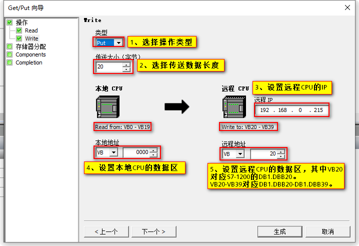{width="718" height="492"}

图10 配置 Write 数据

**5. 存储区分配**

在这里指定 V
存储区中放置组态的起始地址，建议使用较大数值，以免和其他数据冲突，操作完成后，点击"下一个"，如图
11 所示。

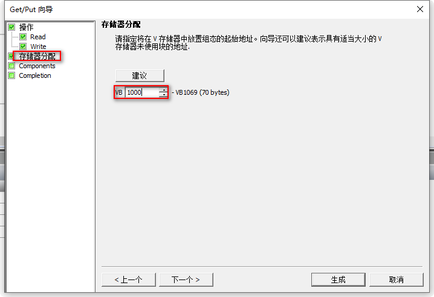{width="718" height="492"}

图11 存储区分配

**6. 组件**

在这里可以看到组态后自动生成的组件，点击"生成"，完成GET/PUT向导配置，如图
12 所示。

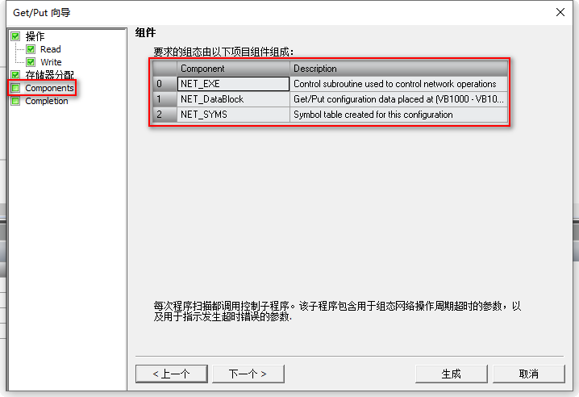{width="718" height="492"}

图12 组件

**7. 编程**

在 Main 函数中调用 NET_EXE 子程序，并分配相关引脚参数，如图 13 所示。

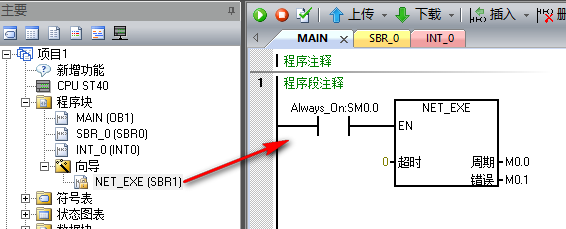{width="566" height="229"}

图13 编程

至此，S7-200 SMART 作客户端与 S7-1200 进行 S7 通信的组态和编程就完成了。

#### 通信测试

**连接状态**

S7 连接成功的建立是调用 PUT/GET 指令的基础，S7
连接成功建立后，方能正确执行 PUT/GET 指令。在 TIA
软件的网络视图中，转至在线，可以监控 S7 连接状态，如图 14 所示。

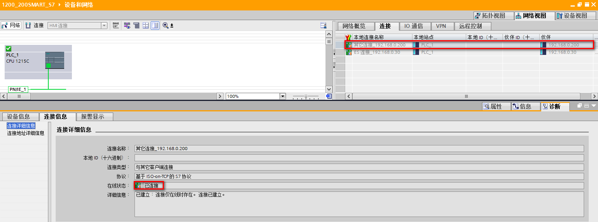{width="1547" height="574"}

图14 S7 连接状态

**数据交互**

通过在线监控查看两者之间的数据交互是否正确，如图 15 、图 16 所示，

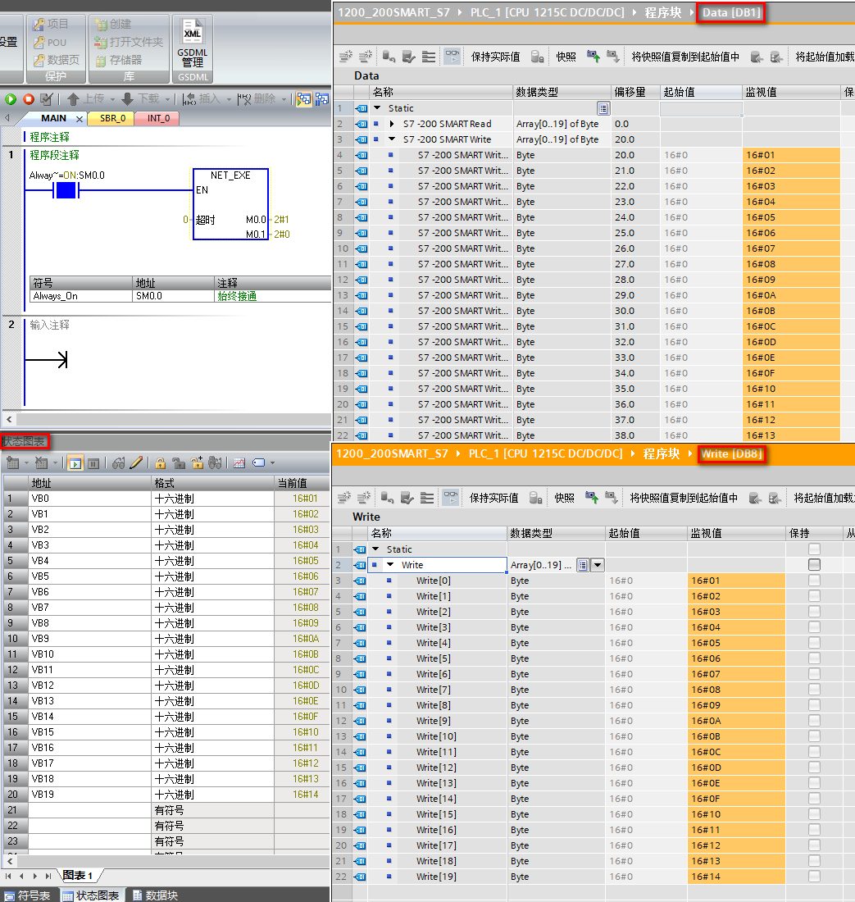{width="1043" height="1100"}

图15 DB8 数据

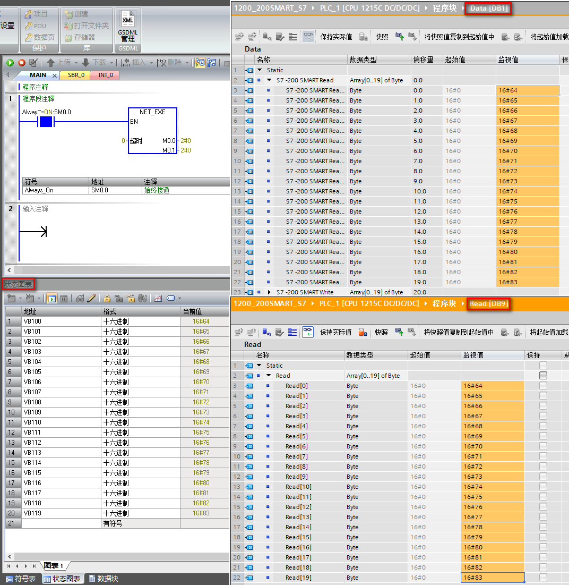{width="1072" height="1101"}

图16 DB9 数据
