## S7-1200 CPU 与S7-300 PN/S7-400 PN TCP通信（S7-1200作为客户端）

S7-1200 与 S7-300 PN 之间的以太网通信可以通过 TCP 协议来实现，使用的通信指令是在双方 CPU 调用 T-block (TSEND\_C，TRCV\_C，TCON，TDISCON，TSEND，TRCV) 指令来实现。通信方式为双边通信，因此 TSEND 和 TRCV 必须成对出现。

此外本文也可以作为S7-1200 与 S7-400 PN 之间的 TCP 通信文档。

### 硬件和软件需求及所完成的通信任务

所需条件：

① S7-1200(CPU1215C DC/DC/DC，固件版本V4.4)/S7-300(集成PN口，固件版本V3.2)  
② TIA STEP7 V16，STEP7 V5.6

所完成的通信任务：  
  
① S7-1200 CPU将通讯数据区 DB3 块中的 10 个字节的数据发送到 S7-300 CPU的接收数据区 DB2 块中。  
② S7-300 CPU将通讯数据区 DB1 块中的 10 个字节的数据发送到 S7-1200 CPU的接收数据区 DB4 块中。

S7-1200与S7-300(集成PN口)之间 TCP 通讯，可以分3种情况来操作，具体如下：

1.  [第一种情况：S7-1200与S7-300(集成PN口)在一个项目中操作(TIA STEP7 V16)；](01-S7-1200Client_S7-300PNServer.html#a)
2.  [第二种情况：S7-1200与S7-300(集成PN口)不在一个项目中的操作(两个TIA STEP7 V16项目);](01-S7-1200Client_S7-300PNServer.html#b)
3.  [第三种情况：S7-1200与S7-300(集成PN口)不在一个项目中的操作(S7-1200在TIA STEP7 V16项目中，S7-300在STEP7 V5.6项目中)。](01-S7-1200Client_S7-300PNServer.html#c)

### 一. 第一种情况（S7-1200与S7-300在同一项目中操作）

使用 STEP 7 V16 在同一个项目中，新建一个S7-1200站点，一个S7-300站点，然后做 TCP 通讯。

### 1.1 S7-1200 侧和S7-300PN 侧通信的编程，连接参数及通信参数的配置

**1\. 使用 STEP7 V16 软件新建一个项目并完成硬件配置**

在 STEP7 V16的 “Portal 视图” 中选择 “创建新项目” 创建一个新项目。

**2.****添加硬件并命名PLC**  
  
然后进入 “项目视图”，在“项目树” 下双击 “添加新设备”，在对话框中选择所使用的 S7-1200 CPU 添加到机架上，命名为 PLC_1，如图1所示。  
  
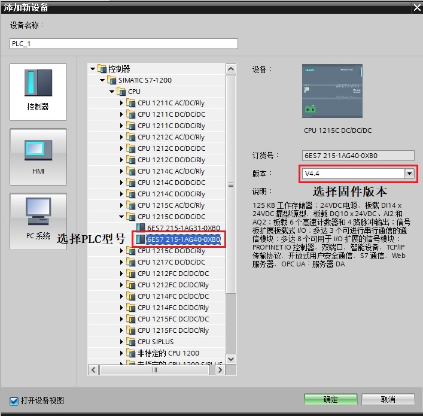

图1\. 添加新设备

为了编程方便，使用 CPU 属性中定义的时钟位，定义方法如下：  
在 “项目树” \> “PLC_1” > “设备组态” 中，选中 CPU ，然后在下面的属性窗口中，“属性” > “系统和时钟存储器” 下，将时钟位定义在 MB0，如图2所示。  
时钟位我们主要使用 M0.3，它是以 2Hz 的速率在 0 和 1 之间切换的一个位，可以使用它去自动激活发送任务。

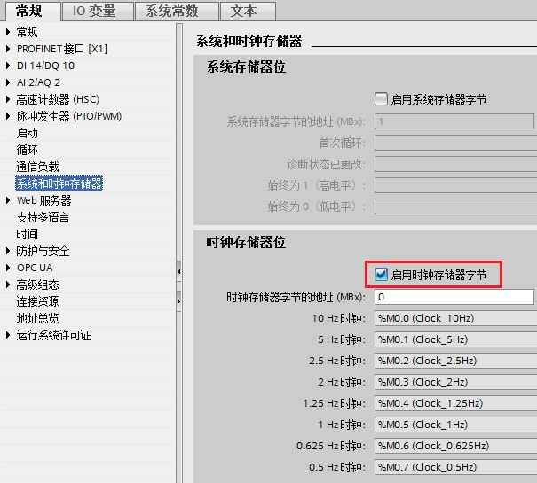

图2\. 时钟位

**3\. 为 PROFINET 通信口分配以太网地址**

在 “设备视图”中点击 CPU 上代表 PROFINET 通信口的绿色小方块，在下方会出现 PROFINET 接口的属性，在 “以太网地址” 下分配 IP 地址为 192.168.0.1 ，子网掩码为255.255.255.0，如图3所示。

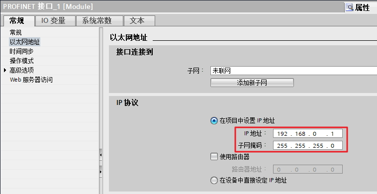

图3\. 分配IP 地址

**4．使用 STEP7 V16 软件添加新设备****并命名 PLC_2**

与PLC\_1在同一个项目中，在“项目树” 下双击 “添加新设备”，在对话框中选择所使用的 S7-300 CPU 添加到机架上，命名为 PLC\_2，如图4所示。

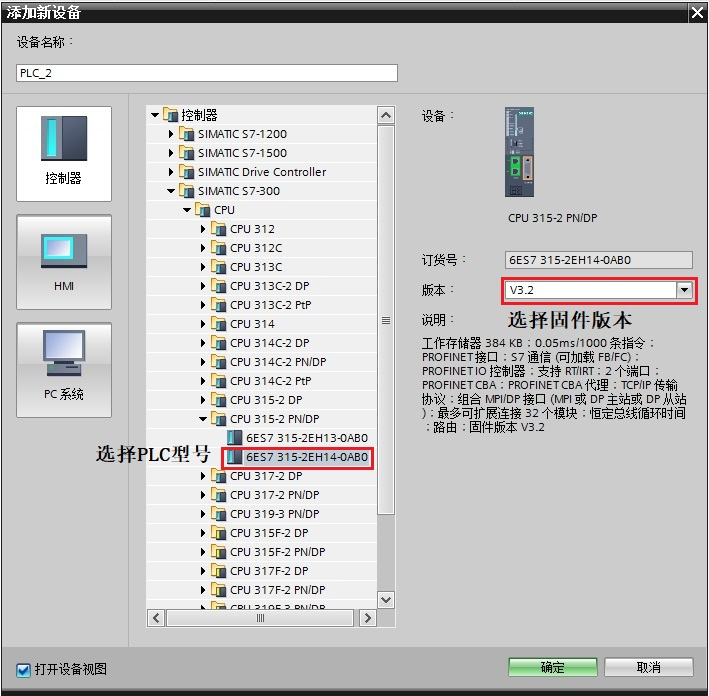

图4\. 添加新设备

为了编程方便，使用 CPU 属性中定义的时钟位，定义方法如下：  
在 “项目树” \> “PLC_2” > “设备组态” 中，选中 CPU ，然后在下面的属性窗口中，“属性” > “时钟存储器” 下时钟位定义在 MB0，如图5所示。  
时钟位我们主要使用 M0.3，它是以 2Hz 的速率在 0 和 1 之间切换的一个位，可以使用它去自动激活发送任务。

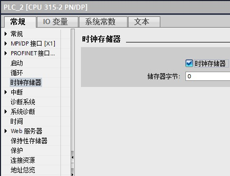

图5\. 时钟存储位

**5\. 为 PROFINET 通信口分配以太网地址**

在 “设备视图”中点击 CPU 上代表 PROFINET 通信口的绿色小方块，在下方会出现 PROFINET 接口的属性，在 “以太网地址” 下分配 IP 地址为 192.168.0.2 ，子网掩码为255.255.255.0，如图6所示。  
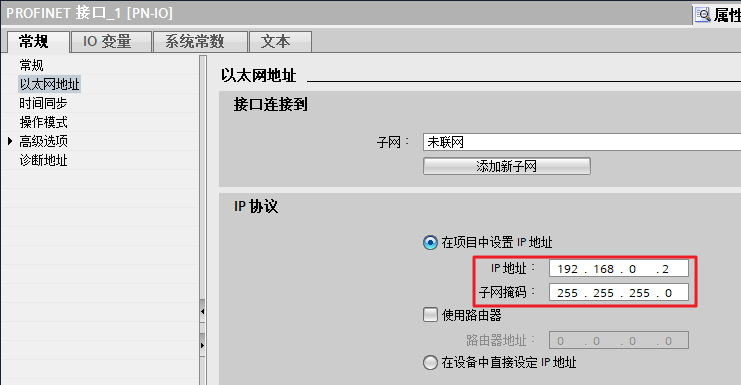

图6\. 分配IP 地址

**6\. 创建 CPU的逻辑网络连接**

在项目树 “项目树”>“设备和网络” >“网络视图” 视图下，创建两个设备的连接。用鼠标点中 S7-1200 上的PROFINET通信口的绿色小方框，然后拖拽出一条线，到另外一个 S7-300 上的PROFINET通信口上，松开鼠标，PN/IE_1的子网连接就建立起来了，如图7所示。  

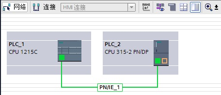

图7\. 网络视图

### 1.2 在 S7-1200 中调用并配置“TCON”、“TSEND”、“TRCV” 通信指令

#### **1．在 S7-1200 的 OB1 中调用“TCON” 通信指令**

① 在S7-1200 CPU 中调用发送通信指令，进入 “项目树” > “ PLC_1” > “程序块” > “OB1” 主程序中，从右侧窗口 “指令” > “通信” > “开放式用户通信”下调用 “TCON” 指令，创建连接，如图8所示。  
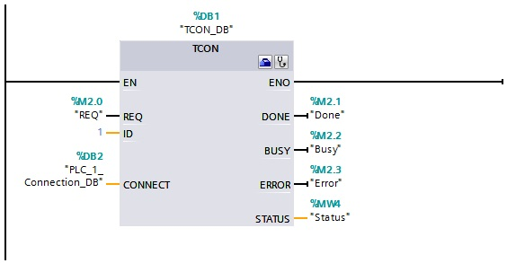  
图8\. 调用“TCON”通信指令

**注意：** S7-1200必须等S7-300先准备好（触发S7-300的TCON）后，才可以触发TCON。

② 定义 S7-1200 的 “TCON”连接参数

S7-1200 的 “TCON”指令的连接参数需要在指令下方的属性窗口“属性”> “组态”>“连接参数”中设置，如图9所示。  

图9\. 定义 TCON 连接参数  
  
**连接参数说明：**

|     |     |
| --- | --- |
| 端点  | ：可以通过点击选择按钮选择伙伴CPU为“PLC_2，CPU315-2PN/DP” ； |
| 连接类型 | ：选择通信协议为 TCP； |
| 连接 ID | ：连接的地址 ID 号，这个 ID 号在后面的编程里会用到； |
| 连接数据 | ：点击新建自动生成该数据块，如PLC\_1\_Connection\_DB和PLC\_2\_Connection\_DB； |
| 主动建立连接 | ：选择本地 S7-1200 作为主动连接； |
| 地址详细信息 | ：定义通信伙伴方的端口号为：2000。 |

#### **2．定义 S7-1200 的“TSEND”发送通信块接口参数**

①　调用 “TSEND” 在OB1内调用，发送10个字节数据到 S7-300PN 中  
进入 “项目树” \> “ PLC_1” > “程序块” > “OB1” 主程序中，从右侧窗口 “指令” > “通信” > “开放式用户通信”下调用 “TSEND” 指令，如图10所示。

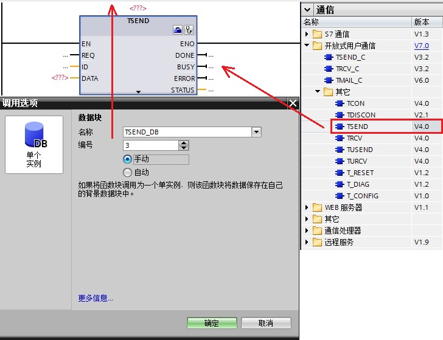

图10\. 调用 TSEND

②　创建并定义S7-1200的发送数据区 DB 块。  
  
通过“项目树”>“PLC_1”>“程序块”>“添加新块”，选择“数据块” 创建 DB 块，在DB块的“属性->常规->属性”中，取消勾选“优化的块访问”，点击“确定”键，定义发送数据区为 10个字节的数组，如图11及图12所示。

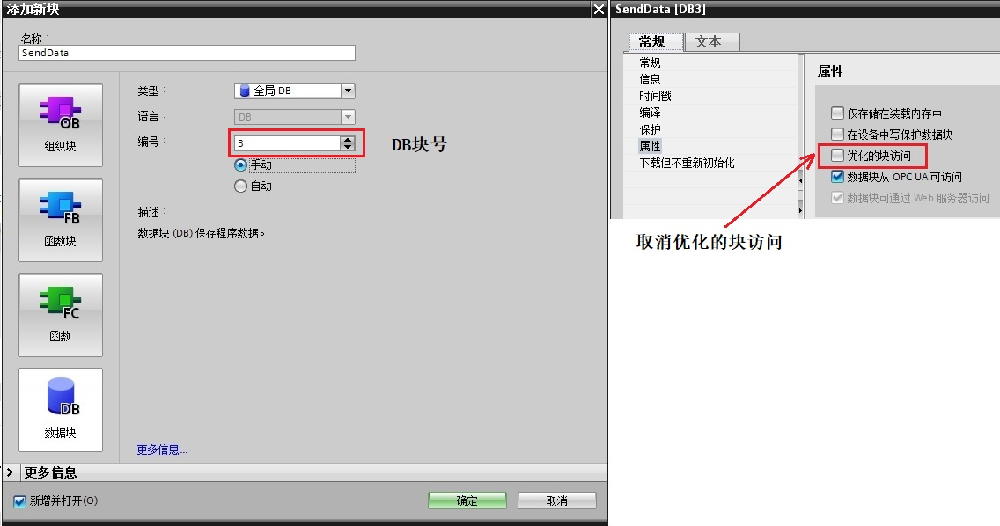  
  
图11\. 创建发送数据区 DB 块  
  
注意：对于双边编程通信的 CPU ，如果通信数据区使用 DB 块，既可以将 DB 块定义成符号寻址，也可以定义成绝对寻址。使用指针寻址方式，必须创建绝对寻址的 DB 块。

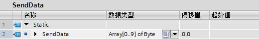

图12\. 定义发送数据区为字节类型的数组

③　定义S7-1200 的“TSEND”发送通信块接口参数，如图13所示。

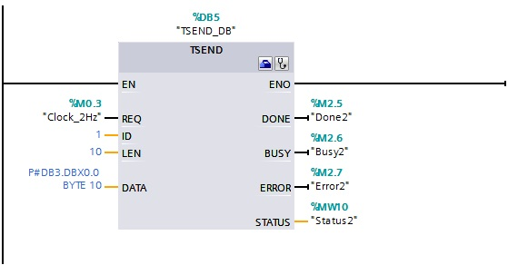  
  
图13\. 定义 TSEND 接口参数  
  
**参数说明：**  
**输入接口参数：**

|     |     |
| --- | --- |
| REQ | ：在上升沿启动发送作业 |
| ID  | ： 引用由“TCON”建立的连接 |
| LEN | ：要通过作业发送的最大字节数 |
| DATA | ：发送数据区的数据，使用指针寻址时，DB块要选用绝对寻址 |

**输出接口参数：**

|     |     |
| --- | --- |
| DONE | ：任务执行完成并且没有错误，该位置 1 |
| BUSY | ：该位为 1，代表任务未完成，不能激活新任务 |
| ERROR | ：通信过程中有错误发生，该位置 1 |
| STATUS | ：有错误发生时，会显示错位信息号 |

#### **3．在 S7-1200 的OB1中调用接收指令TRCV 并配置基本参数**

为了实现 S7-1200 接收来自 S7-300PN 的数据，则在 S7-1200 中调用接收指令TRCV 并配置基本参数。

①　创建并定义S7-1200的接收数据区 DB 块。  
  
通过“项目树”>“PLC_1”>“程序块”>“添加新块”，选择“数据块” 创建 DB 块，在DB块的“属性->常规->属性”中，取消勾选“优化的块访问”，点击“确定”键，定义接收数据区为 10个字节的数组，如图14及图15所示。

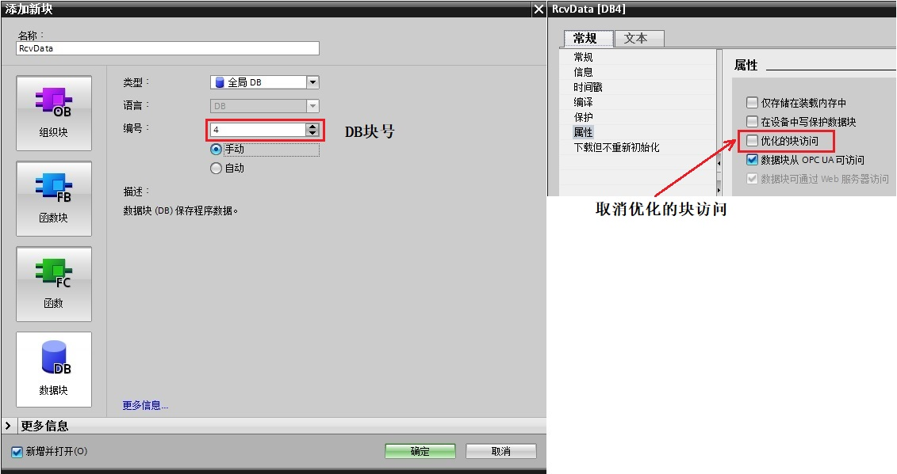  
  
图14\. 创建接收数据区 DB 块  
  
注意：对于双边编程通信的 CPU ，如果通信数据区使用 DB 块，既可以将 DB 块定义成符号寻址，也可以定义成绝对寻址。使用指针寻址方式，必须创建绝对寻址的 DB 块。

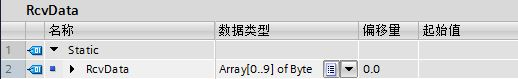

图15\. 定义接收数据区为字节类型的数组

②　调用 “TRCV” 在OB1内调用  
进入 “项目树” \> “ PLC_1” > “程序块” > “OB1” 主程序中，从右侧窗口 “指令” > “通信” > “开放式用户通信”下调用 “TRCV” 指令，配置接口参数，如图16所示。  
  
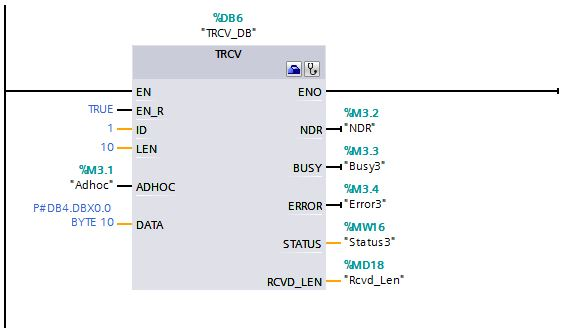  
图16\. 调用 TRCV 指令并配置接口参数

**参数说明：**  
**输入接口参数：**

|     |     |
| --- | --- |
| EN_R | ：启用接收功能 |
| ID  | ： 指向使用“TCON”建立的连接的引用 |
| LEN | ：接收数据长度 |
| ADHOC | ： TCP协议选项是否使用Ad-hoc模式 |
| DATA | ： 接收数据区的地址 |

**输出接口参数：**

|     |     |
| --- | --- |
| NDR | ：该位为 1，接收任务成功完成 |
| BUSY | ：该位为 1，代表任务未完成，不能激活新任务 |
| ERROR | ：通信过程中有错误发生，该位置 1 |
| STATUS | ：有错误发生时，会显示错误信息号 |
| RCVD_LEN | ：实际接收数据的字节数 |

**注意：ADHOC设置为 TRUE ，LEN设置为0时，可以接收变长数据。**

### 1.3在 S7-300 中调用并配置“TCON”、“TSEND”、“TRCV” 通信指令

#### **1．在 S7-300 的 OB1 中调用“TCON” 通信指令**

① 在 S7-300 CPU 中调用发送通信指令，进入 “项目树” > “PLC_2” > “程序块” > “OB1” 主程序中，从右侧窗口 “指令” > “通讯” > “开放式用户通信”下调用 “TCON” 指令，创建连接，如图17所示。

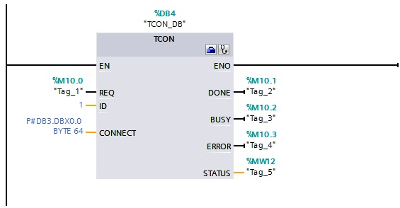

图17\. 调用 TCON 通信指令

② 定义 S7-300 的 “TCON”连接参数

S7-300 的 “TCON”指令的连接参数需要在指令下方的属性窗口“属性”> “组态”>“连接参数中”中设置，如图18所示。

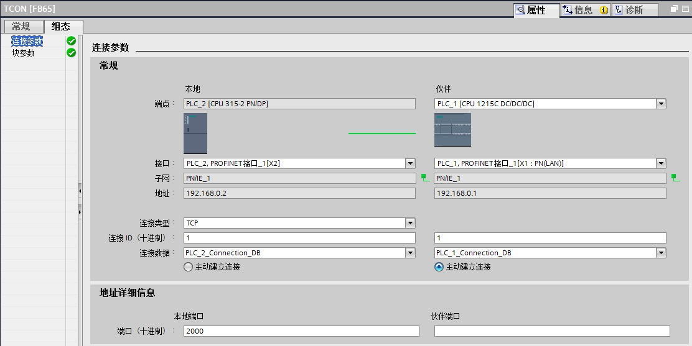

图18\. 定义 TCON 连接参数

**连接参数说明：**

|     |     |
| --- | --- |
| 端点  | ：可以通过点击选择按钮选择“PLC_1”； |
| 连接类型 | ：选择通信协议为 TCP； |
| 连接 ID | ：连接的地址 ID 号，这个 ID 号在后面的编程里会用到； |
| 连接数据 | ： **选择之前已建立的数据块（如图9所示）**PLC\_2\_Connection\_DB和PLC\_1\_Connection\_DB； |
| 主动建立连接 | ：选择对方 S7-1200 作为主动连接； |
| 地址详细信息 | ：定义本方的端口号为：2000。 |

#### **2．定义 S7-300 的“TSEND”发送通信块接口参数**

①创建并定义 S7-300 的发送数据区 DB1 块

通过“项目树”>“PLC_2”>“程序块”>“添加新块”，选择“数据块” 创建 DB1 块，点击“确定”键，定义发送数据区为 10个字节的数组，如图19所示，结果如图20所示。

图19\. 创建发送数据区 DB 块

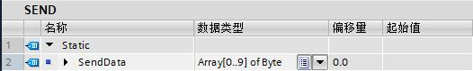

图20\. 定义发送数据区为字节类型的数组

②调用 “TSEND” 在OB1内调用 发送 10 个字节数据到 S7-1200 中  
进入 “项目树” \> “PLC_2” > “程序块” > “OB1 ” 主程序中，从右侧窗口 “指令” > “通讯” > “开放式用户通信”下调用 “TSEND” 指令，配置接口参数，如图21所示。

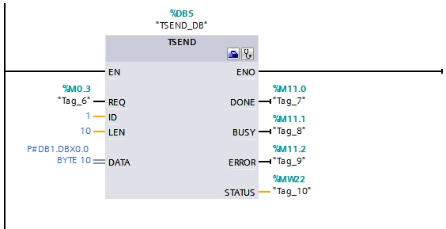

图21\. 调用 TSEND 指令并配置接口参数

**参数说明：**  
**输入接口参数：**

|     |     |
| --- | --- |
| REQ | ：在上升沿启动发送作业 |
| ID  | ：引用由“TCON”建立的连接 |
| LEN | ：要通过作业发送的最大字节数 |
| DATA | ：发送数据区的数据，使用指针寻址时，DB块要选用绝对寻址 |

**输出接口参数：**

|     |     |
| --- | --- |
| DONE | ：任务执行完成并且没有错误，该位置 1 |
| BUSY | ：该位为 1，代表任务未完成，不能激活新任务 |
| ERROR | ：通信过程中有错误发生，该位置 1 |
| STATUS | ：有错误发生时，会显示错位信息号 |

#### **3．在 S7-300 的OB1中调用接收指令TRCV并配置参数**

①创建并定义 S7-300 的接收数据区 DB2 块。  
  
通过“项目树”>“PLC_2”>“程序块”>“添加新块”，选择“数据块” 创建 DB2 块，点击“确定”键，定义接收数据区为 10 个字节的数组，如图22所示，结果如图23所示。

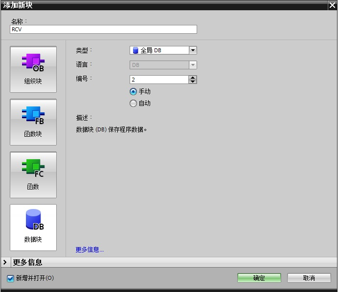

图22\. 创建接收数据区 DB2 块

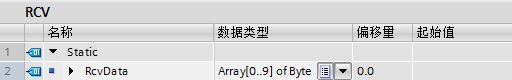

图23\. 定义接收数据区为字节类型的数组

② 将 “TRCV” 在OB1内调用  
进入 “项目树” \> “PLC_2” > “程序块” > “OB1 ” 主程序中，从右侧窗口 “指令” > “通讯” > “开放式用户通信”下调用 “TRCV” 指令，配置接口参数，如图24所示。

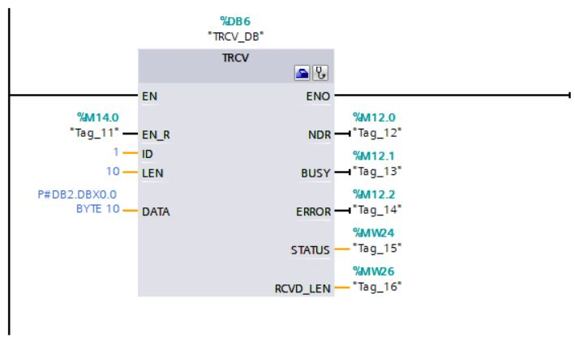

图24\. 调用 TRCV 指令并配置接口参数

**参数说明：**  
**输入接口参数：**

|     |     |
| --- | --- |
| EN_R | ：启用接收功能 |
| ID  | ：指向使用“TCON”建立的连接的引用 |
| LEN | ：接收数据长度 |
| DATA | ：接收数据区的地址 |

**输出接口参数：**

|     |     |
| --- | --- |
| NDR | ：该位为 1，接收任务成功完成 |
| BUSY | ：该位为 1，代表任务未完成，不能激活新任务 |
| ERROR | ：通信过程中有错误发生，该位置 1 |
| STATUS | ：有错误发生时，会显示错误信息号 |
| RCVD_LEN | ：实际接收数据的字节数 |

配置完连接并编译存盘。  

### 1.4 下载硬件组态及程序并监控通信结果

下载两个 CPU 中的所有硬件组态及程序，实现两个 CPU 之间数据交换，监控结果如图25所示。

图25\. 监控结果

### 二. 第二种情况（S7-1200与S7-300不在同一个TIA项目中操作）

使用 STEP 7 V16 在一个项目中，新建一个S7-300站点，在另一个项目中，新建一个S7-1200站点，然后做 TCP 通讯。

### 2.1 S7-300PN 侧通信的编程，连接参数及通信参数的配置

**1．使用 STEP7 V16 软件新建项目，添加新设备****并命名 PLC_2**

打开STEP7 V16，在 STEP7 V16的 “Portal 视图” 中选择 “创建新项目” 创建一个新项目。然后进入 “项目视图”，在“项目树” 下双击 “添加新设备”，在对话框中选择所使用的 S7-300 CPU 添加到机架上，命名为 PLC_2，如图26所示。

图26\. 添加新设备

为了编程方便，使用 CPU 属性中定义的时钟位，定义方法如下：  
在 “项目树” \> “PLC_2” > “设备组态” 中，选中 CPU ，然后在下面的属性窗口中，“属性” > “时钟存储器” 下时钟位定义在 MB0，如图27所示。  
时钟位我们主要使用 M0.3，它是以 2Hz 的速率在 0 和 1 之间切换的一个位，可以使用它去自动激活发送任务。

图27\. 时钟存储位

**2\. 为 PROFINET 通信口分配以太网地址**

在 “设备视图”中点击 CPU 上代表PROFINET 通信口的绿色小方块，在下方会出现PROFINET 接口的属性，在 “以太网地址” 下分配IP 地址为 192.168.0.2 ，子网掩码为255.255.255.0，图28所示。  

图28\. 分配IP 地址

### 2.2在 S7-300 中调用并配置“TCON”、“TSEND”、“TRCV” 通信指令

#### **1．在 S7-300 的 OB1 中调用“TCON” 通信指令**

① 在 S7-300 CPU 中调用发送通信指令，进入 “项目树” > “PLC_2” > “程序块” > “OB1” 主程序中，从右侧窗口 “指令” > “通讯” > “开放式用户通信”下调用 “TCON” 指令，创建连接，如图29所示。

图29\. 调用 TCON 通信指令

② 定义 S7-300 的 “TCON”连接参数

S7-300 的 “TCON”指令的连接参数需要在指令下方的属性窗口“属性”> “组态”>“连接参数中”中设置，如图30所示。

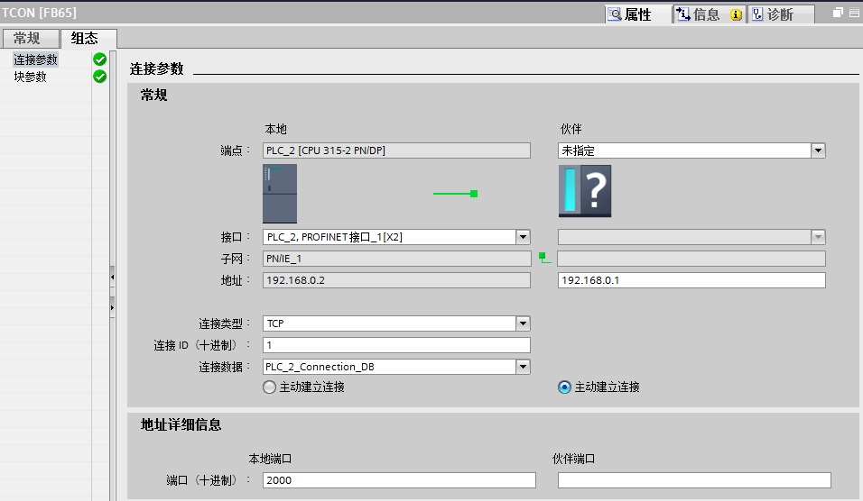

图30\. 定义 TCON 连接参数

地址处输入伙伴IP：192.168.0.1。

**连接参数说明：**

|     |     |
| --- | --- |
| 端点  | ：可以通过点击选择按钮选择“未指定”； |
| 连接类型 | ：选择通信协议为 TCP； |
| 连接 ID | ：连接的地址 ID 号，这个 ID 号在后面的编程里会用到； |
| 连接数据 | ：点击新建自动生成该数据块； |
| 主动建立连接 | ：选择对方 S7-1200 作为主动连接； |
| 地址详细信息 | ：定义本方的端口号为：2000。 |

#### **2．定义 S7-300 的“TSEND”发送通信块接口参数**

①创建并定义 S7-300 的发送数据区 DB1 块

通过“项目树”>“PLC_2”>“程序块”>“添加新块”，选择“数据块” 创建 DB1 块，点击“确定”键，定义发送数据区为 10个字节的数组，如图31所示，结果如图32所示。

图31\. 创建发送数据区 DB 块

图32\. 定义发送数据区为字节类型的数组

②调用 “TSEND” 在OB1内调用 发送 10 个字节数据到 S7-1200 中  
进入 “项目树” \> “PLC_2” > “程序块” > “OB1 ” 主程序中，从右侧窗口 “指令” > “通讯” > “开放式用户通信”下调用 “TSEND” 指令，配置接口参数，如图33所示。

图33\. 调用 TSEND 指令并配置接口参数

**参数说明：**  
**输入接口参数：**

|     |     |
| --- | --- |
| REQ | ：在上升沿启动发送作业 |
| ID  | ：引用由“TCON”建立的连接 |
| LEN | ：要通过作业发送的最大字节数 |
| DATA | ：发送数据区的数据，使用指针寻址时，DB块要选用绝对寻址 |

**输出接口参数：**

|     |     |
| --- | --- |
| DONE | ：任务执行完成并且没有错误，该位置 1 |
| BUSY | ：该位为 1，代表任务未完成，不能激活新任务 |
| ERROR | ：通信过程中有错误发生，该位置 1 |
| STATUS | ：有错误发生时，会显示错位信息号 |

#### **3．定义 S7-300 的OB1中调用接收指令TRCV 并配置基本参数**

①创建并定义 S7-300 的接收数据区 DB2 块。  
  
通过“项目树”>“PLC_2”>“程序块”>“添加新块”，选择“数据块” 创建 DB2 块，点击“确定”键，定义接收数据区为 10 个字节的数组，如图34所示，结果如图35所示。

图34\. 创建接收数据区 DB2 块

图35\. 定义接收数据区为字节类型的数组

② 将 “TRCV” 在OB1内调用  
进入 “项目树” \> “PLC_2” > “程序块” > “OB1 ” 主程序中，从右侧窗口 “指令” > “通讯” > “开放式用户通信”下调用 “TRCV” 指令，配置接口参数，如图36所示。

图36\. 调用 TRCV 指令并配置接口参数

**参数说明：**  
**输入接口参数：**

|     |     |
| --- | --- |
| EN_R | ：启用接收功能 |
| ID  | ：指向使用“TCON”建立的连接的引用 |
| LEN | ：接收数据长度 |
| DATA | ：接收数据区的地址 |

**输出接口参数：**

|     |     |
| --- | --- |
| NDR | ：该位为 1，接收任务成功完成 |
| BUSY | ：该位为 1，代表任务未完成，不能激活新任务 |
| ERROR | ：通信过程中有错误发生，该位置 1 |
| STATUS | ：有错误发生时，会显示错误信息号 |
| RCVD_LEN | ：实际接收数据的字节数 |

配置完连接并编译存盘。

### 2.3 S7-1200 侧通信的编程，连接参数及通信参数的配置

**1\. 使用 STEP7 V16 软件新建一个项目并完成硬件配置**

在 STEP7 V16的 “Portal 视图” 中选择 “创建新项目” 创建一个新项目。

**2.****添加硬件并命名PLC**  
  
然后进入 “项目视图”，在“项目树” 下双击 “添加新设备”，在对话框中选择所使用的 S7-1200 CPU 添加到机架上，命名为 PLC_1，如图37所示。  
  

图37\. 添加新设备

为了编程方便，使用 CPU 属性中定义的时钟位，定义方法如下：  
在 “项目树” \> “PLC_1” > “设备组态” 中，选中 CPU ，然后在下面的属性窗口中，“属性” > “系统和时钟存储器” 下，将时钟位定义在 MB0，如图38所示。  
时钟位我们主要使用 M0.3，它是以 2Hz 的速率在 0 和 1 之间切换的一个位，可以使用它去自动激活发送任务。

图38\. 时钟位

**3\. 为 PROFINET 通信口分配以太网地址**

在 “设备视图”中点击 CPU 上代表PROFINET 通信口的绿色小方块，在下方会出现PROFINET 接口的属性，在 “以太网地址” 下分配IP 地址为 192.168.0.1 ，子网掩码为255.255.255.0，如图39所示。

图39\. 分配IP 地址

### 2.4在 S7-1200 中调用并配置“TCON”、“TSEND”、“TRCV” 通信指令

#### **1．在 S7-1200 的 OB1 中调用“TCON” 通信指令**

① 在S7-1200 CPU 中调用发送通信指令，进入 “项目树” > “ PLC_1” > “程序块” > “OB1” 主程序中，从右侧窗口 “指令” > “通信” > “开放式用户通信”下调用 “TCON” 指令，创建连接，如图40所示。  
  
图40\. 调用“TCON”通信指令

**注意：** S7-1200必须等S7-300先准备好（触发S7-300的TCON）后，才可以触发TCON。

② 定义 S7-1200 的 “TCON”连接参数

S7-1200 的 “TCON”指令的连接参数需要在指令下方的属性窗口“属性”> “组态”>“连接参数”中设置，如图41所示。  

图41\. 定义 TCON 连接参数  
  
**连接参数说明：**

|     |     |
| --- | --- |
| 端点  | ：可以通过点击选择按钮选择伙伴CPU为“未指定” ； |
| 连接类型 | ：选择通信协议为 TCP； |
| 连接 ID | ：连接的地址 ID 号，这个 ID 号在后面的编程里会用到； |
| 连接数据 | ：点击新建自动生成该数据块，如PLC\_1\_Connection_DB； |
| 主动建立连接 | ：选择本地 S7-1200 作为主动连接； |
| 地址详细信息 | ：定义通信伙伴方的端口号为：2000。 |

**注意：**伙伴端口号是因为服务器（S7-300）设置为2000，所以这里设置为2000。

#### **2．定义 S7-1200 的“TSEND”发送通信块接口参数**

①　调用 “TSEND” 在OB1内调用 发送10个字节数据到 S7-300PN 中  
进入 “项目树” \> “ PLC_1” > “程序块” > “OB1” 主程序中，从右侧窗口 “指令” > “通信” > “开放式用户通信”下调用 “TSEND” 指令，如图42所示。

图42\. 调用 TSEND

②　创建并定义S7-1200的发送数据区 DB 块。  
  
通过“项目树”>“PLC_1”>“程序块”>“添加新块”，选择“数据块” 创建 DB 块，在DB块的“属性->常规->属性”中，取消勾选“优化的块访问”，点击“确定”键，定义发送数据区为 10个字节的数组，如图43及图44所示。

  
  
图43\. 创建发送数据区 DB 块  
  
注意：对于双边编程通信的 CPU ，如果通信数据区使用 DB 块，既可以将 DB 块定义成符号寻址，也可以定义成绝对寻址。使用指针寻址方式，必须创建绝对寻址的 DB 块。

图44\. 定义发送数据区为字节类型的数组

③　定义S7-1200 的“TSEND”发送通信块接口参数，如图45所示。

  
  
图45\. 定义 TSEND 接口参数  
  
**参数说明：**  
**输入接口参数：**

|     |     |
| --- | --- |
| REQ | ：在上升沿启动发送作业 |
| ID  | ：引用由“TCON”建立的连接 |
| LEN | ：要通过作业发送的最大字节数 |
| DATA | ：发送数据区的数据，使用指针寻址时，DB块要选用绝对寻址 |

**输出接口参数：**

|     |     |
| --- | --- |
| DONE | ：任务执行完成并且没有错误，该位置 1 |
| BUSY | ：该位为 1，代表任务未完成，不能激活新任务 |
| ERROR | ：通信过程中有错误发生，该位置 1 |
| STATUS | ：有错误发生时，会显示错位信息号 |

#### **3．在 S7-1200 的OB1中调用接收指令TRCV 并配置基本参数**

为了实现 S7-1200 接收来自 S7-300PN 的数据，则在 S7-1200 中调用接收指令TRCV 并配置基本参数。

①　创建并定义S7-1200的接收数据区 DB 块。  
  
通过“项目树”>“PLC_1”>“程序块”>“添加新块”，选择“数据块” 创建 DB 块，在DB块的“属性->常规->属性”中，取消勾选“优化的块访问”，点击“确定”键，定义接收数据区为 10个字节的数组，如图46及图47所示。

  
  
图46\. 创建接收数据区 DB 块  
  
注意：对于双边编程通信的 CPU ，如果通信数据区使用 DB 块，既可以将 DB 块定义成符号寻址，也可以定义成绝对寻址。使用指针寻址方式，必须创建绝对寻址的 DB 块。

图47\. 定义接收数据区为字节类型的数组

②　调用 “TRCV” 在OB1内调用  
进入 “项目树” \> “ PLC_1” > “程序块” > “OB1” 主程序中，从右侧窗口 “指令” > “通信” > “开放式用户通信”下调用 “TRCV” 指令，配置接口参数，如图48所示。  
  
  
图48\. 调用 TRCV 指令并配置接口参数

**参数说明：**  
**输入接口参数：**

|     |     |
| --- | --- |
| EN_R | ：启用接收功能 |
| ID  | ：指向使用“TCON”建立的连接的引用 |
| LEN | ：接收数据长度 |
| ADHOC | ：TCP协议选项是否使用Ad-hoc模式 |
| DATA | ：接收数据区的地址 |

**输出接口参数：**

|     |     |
| --- | --- |
| NDR | ：该位为 1，接收任务成功完成 |
| BUSY | ：该位为 1，代表任务未完成，不能激活新任务 |
| ERROR | ：通信过程中有错误发生，该位置 1 |
| STATUS | ：有错误发生时，会显示错误信息号 |
| RCVD_LEN | ：实际接收数据的字节数 |

**注意：ADHOC设置为 TRUE 可以接收变长数据。**  

### 2.5 下载硬件组态及程序并监控通信结果

下载两个 CPU 中的所有硬件组态及程序，实现两个 CPU 之间数据交换，监控结果如图49所示。

图49\. 监控结果

### 三. 第三种情况（S7-1200在TIA项目中，S7-300在STEP7项目中）

使用STEP7 V5.6在一个项目中，新建一个S7-300站点，使用 STEP 7 V16 在一个项目中，新建一个S7-1200站点，然后做 TCP 通讯。

### 3.1 S7-300PN 侧通信的编程，连接参数及通信参数的配置

#### **1．创建PLC项目**

在 STEP7 V5.6中创建一个项目并插入CPU315-2PN/DP站。操作步骤如下：

(1) 在 PC 上打开 STEP7 V5.6，在 “File” 菜单中选择 “New…” 选项，如图50所示。

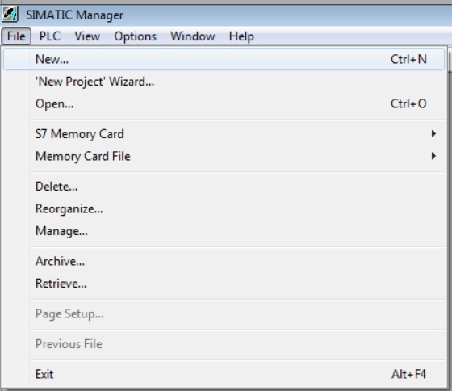

图50\. 新建项目

(2) 在弹出的创建新项目窗口里输入项目名为“TCP_Server”，然后点击“OK”按钮，如图51所示。

图51\. 输入项目名称

(3) 在TCP_Server下点击右键“Insert New Object”，选择“SIMATIC 300 Station”，如图52所示。

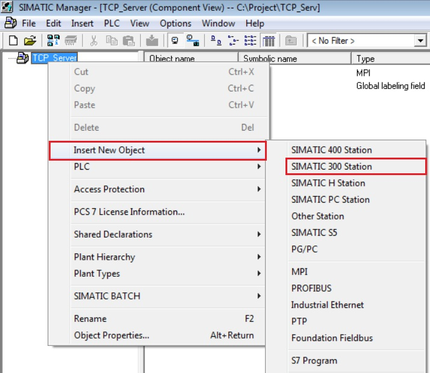

图52\. 插入300站点

(4) 双击“Hardware”打开硬件组态，如图53所示。

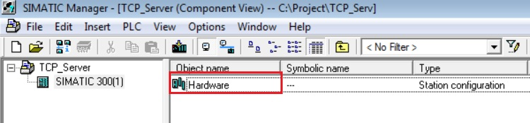

图53\. 硬件组态

(5) 插入 S7-300 插槽，如图54所示。

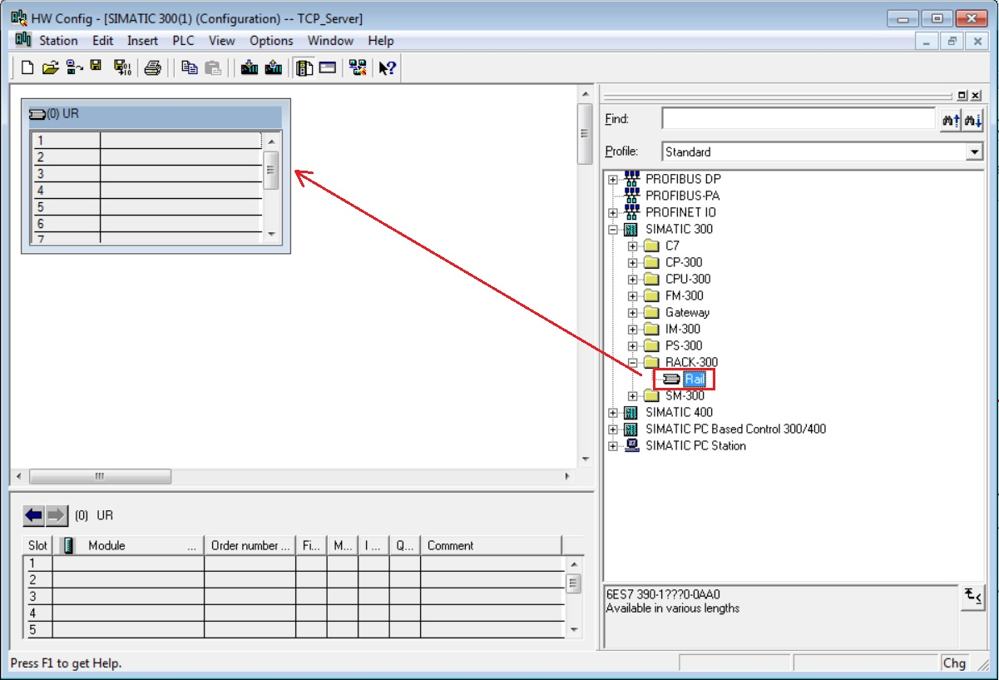

图54\. 插入 S7-300 插槽

(6) 插入S7-300 CPU，与实际PLC一致： 6ES7 315-2EH14-0AB0 V3.2，如图55所示。

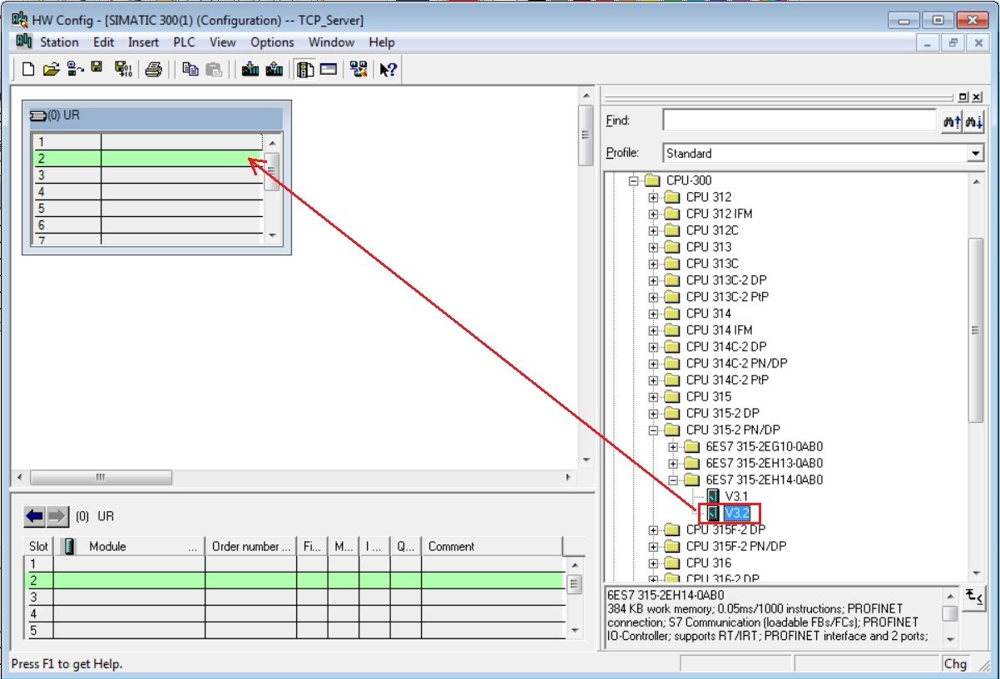

图55\. 插入 S7-300 CPU

(7) 在弹出的“Properties-Ethernet interface PN-IO”对话框的“Parmeters”选项卡中为以太网接口添加，设置IP地址192.168.0.1和子网掩码255.255.255.0 ，如图56所示。

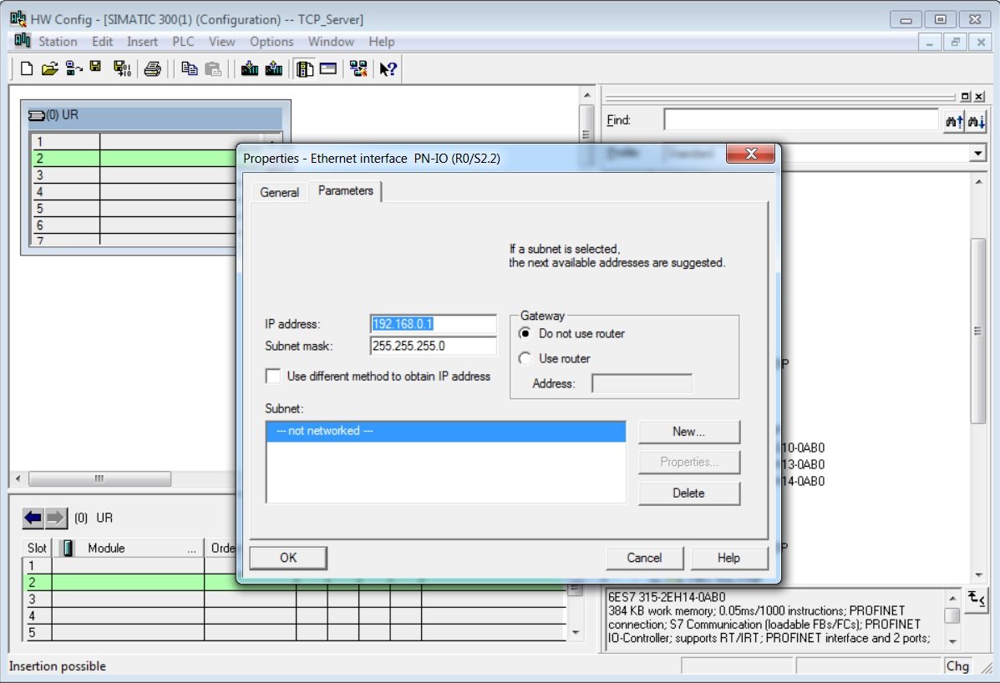

图56\. 设置IP地址和子网掩码

(8)点击“New...”新建子网，如图57所示。

图57\. 新建子网

(9) “New subnet Industrial Ethernet”对话框下 Name：Ethernet(1)，如图58所示。

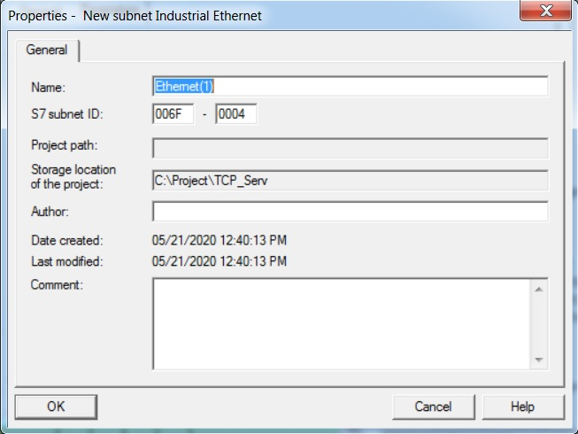

图58\. 子网名称

(10) 新建 Subnet 后，点击“OK”，如图59所示。

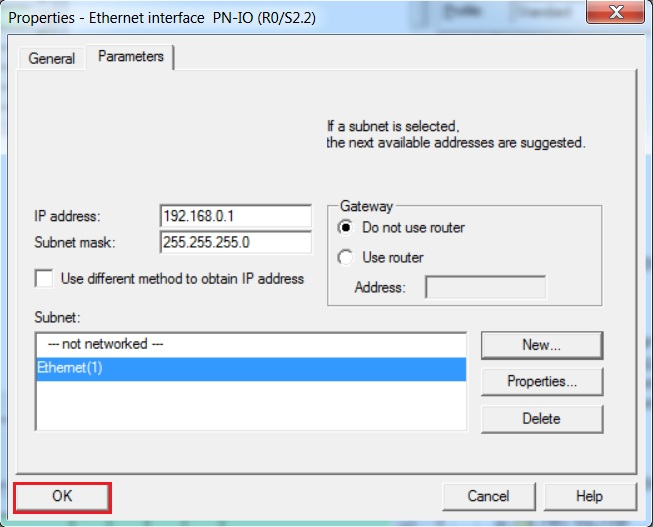

图59\. 确认子网

(11)点击“Save and Compile”按钮。编译保存硬件组态信息，如图60所示。

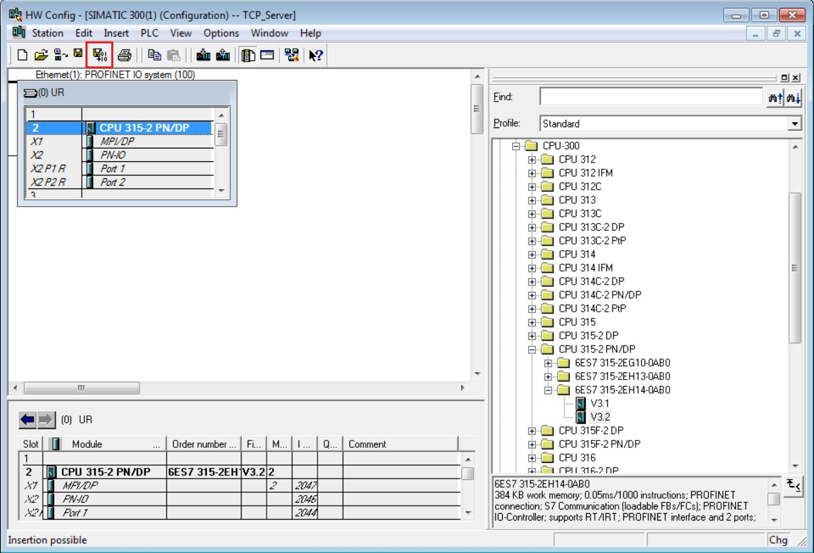

图60\. 保存并编译硬件组态

#### **2．TCP通信向导组态**

创建用于开放式 TCP/IP 通信的连接数据的向导 (开放式通信向导)下载链接：https://support.industry.siemens.com/cs/cn/en/view/98957840/zh

(1) 开始菜单中选择“SIMATIC”—“Open Communication Wizard”，如图61所示。

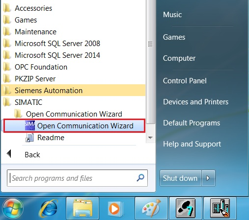

图61\. 选择TCP通信向导

(2) 打开“Open Communication Wizard”，如图62所示。

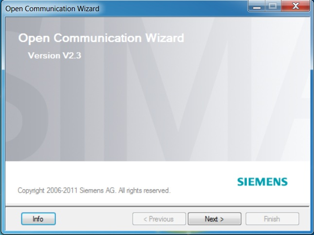

图62\. 打开TCP通信向导

(3) 选择 STEP 7 project，如图63所示。

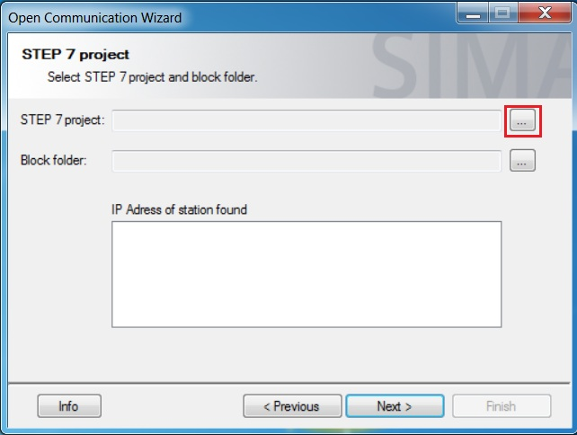

图63\. 选择 STEP 7 project

(4) 选择 TCP_Server 项目，如图64所示。

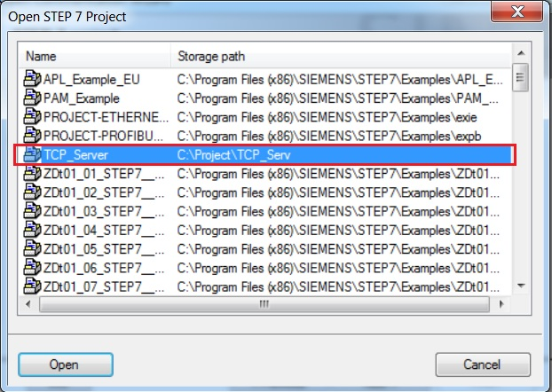

图64\. 选择项目

(5) 选择 Block folder，如图65所示。

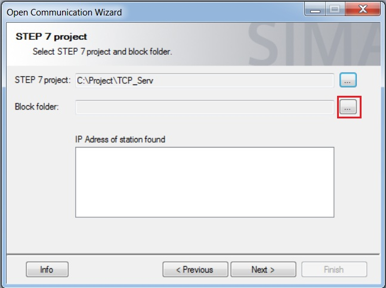

图65\. 选择 Block folder

(6) 选择项目下的Blocks，如图66所示。

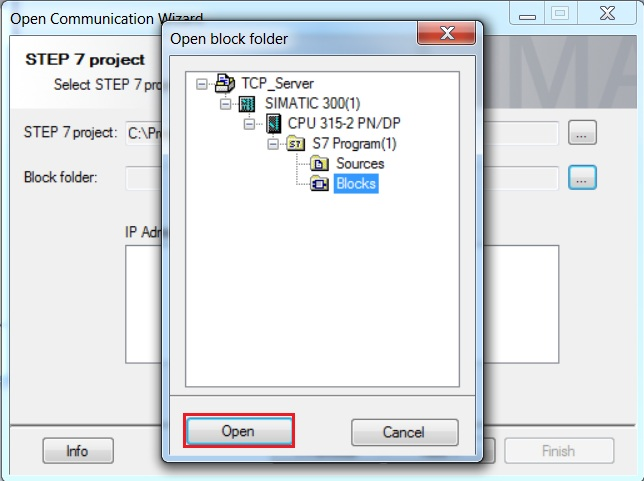

图66\. 选择 Blocks

(7) 点击“Next”，如图67所示。

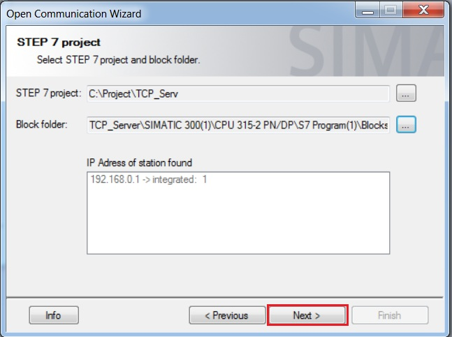

图67\. 点击下一步

(8) 点击“OK”，如图68所示。

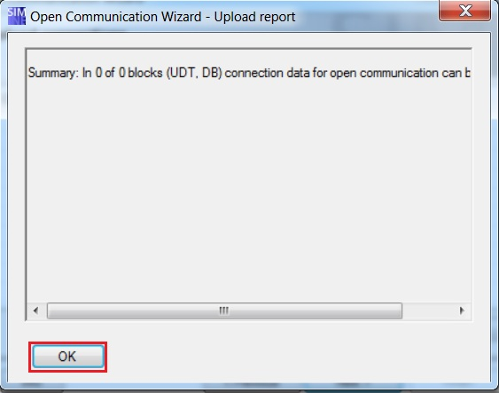

图68\. 点击确认

(9) 点击“Next”，如图69所示。

图69\. 点击下一步

(10) 选择“Connection type”—“TCP native”, 点击“Next”，如图70所示。

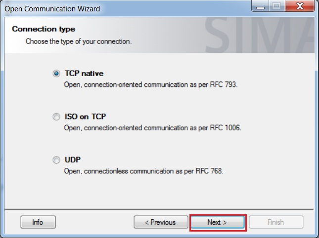

图70\. 选择TCP通信

(11) Connect name:“300_Server”。因为 S7 300 作服务器，因此选择“Passive”，如图71所示。

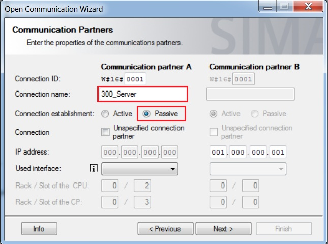

图71\. 配置本地连接

(12) 选择User interface：CPU 314/315/317/ET200pro（IM154-8 CPU），如图72所示。

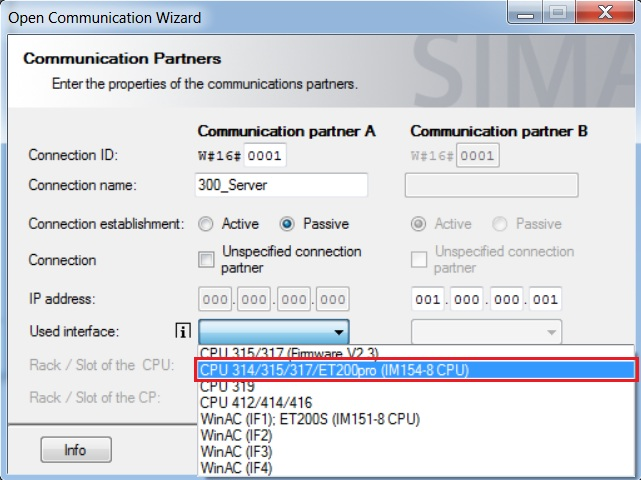

图72\. 选择接口

(13) Communication parter A 端口号：2000，点击“Next”，如图73所示。

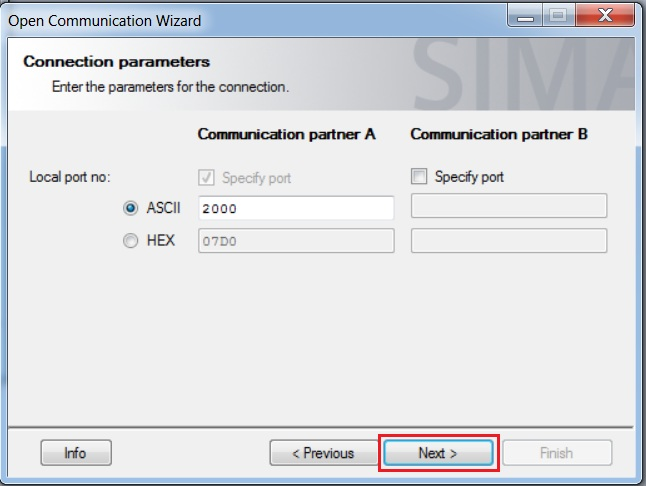

图73\. 配置端口

(14) Communication parter A，数据块Name：DB10，点击“Next”，如图74所示。

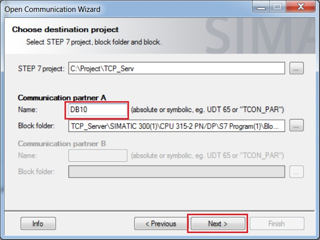

图74\. 配置数据块

(15) 点击“Next”，如图75所示。

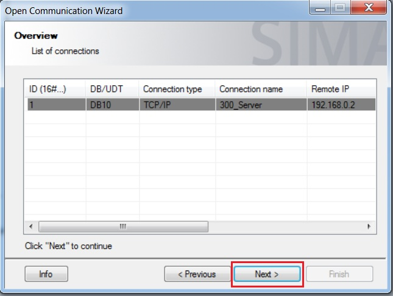

图75\. 点击下一步

(16) 点击“Finish”，如图76所示。

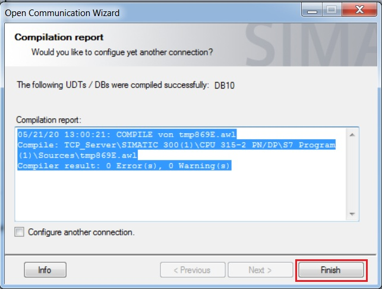

图76\. 点击完成

(17) 点击“是”，如图77所示。

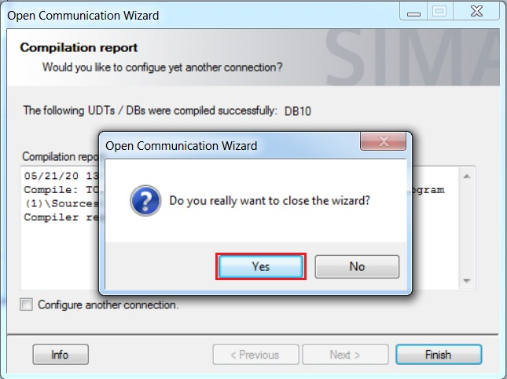

图77\. 点击确认

#### **3．TCP通信编程**

(1) 查看 SIMATIC Manager—Blocks 下生成了 DB10，如图78所示。

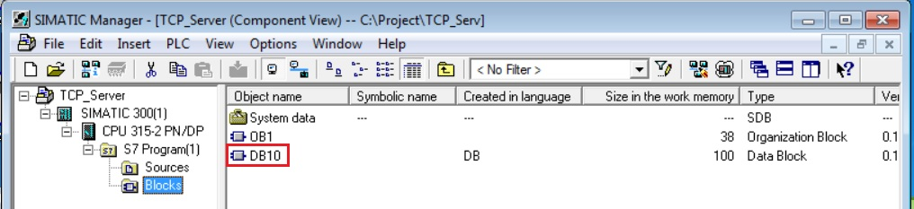

图78\. 查看Blocks

(2) 双击 OB1进入，如图79所示。

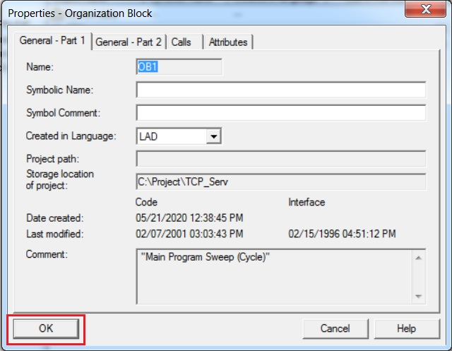

图79\. 点击OB1

(3) 需要的功能块，如图80所示。


图80\. 查找功能块

(4) 插入 FB65 TCON，如图81所示


图81\. 插入FB65

(5) 添加背景DB，如图82所示。


图82\. 添加背景DB

(6) 打开DB10，复制“OUCW_1”名称，如图83所示。


图83\. 复制变量名称

(7) “CONNECT”引脚输入DB10，粘贴“OUCW_1”，如图84所示。


图84\. 连接参数

(8) 正确填写 FB65 引脚，如图85所示。

图85\. 调用FB65

(9) 添加 Bata Block，如图86所示。


图86\. 添加数据块

(10) 添加共享 DB1，作为发送数据区，如图87所示。


图87\. 定义发送数据块

(11) 添加变量，类型为数组，如图88所示。


图88\. 修改数据类型

(12) 添加10个 BYTE 的数组变量，如图89所示。


图89\. 定义变量

(13)在S7-300项目的Hardware中，右键点击CPU，选择Object Properties->Cycle/Clock Memory，勾选“Clock memory”，输入Memory byte，如图90所示。

图90 使用时钟存储器

(14) 添加 FB63，背景数据块为DB63，正确填写 FB63 引脚，其中REQ使用时钟存储器M30.3，以2Hz的速率在0和1之间切换的一个位，如图91所示。


图91\. 调用FB63

(15) 添加共享 DB2，作为接收数据区，如图92所示。


图92\. 定义接收数据块

(16) 添加变量，类型为数组。添加10个 BYTE 的数组变量，如图93所示。


图93\. 定义变量

(17) 添加 FB64，背景数据块为DB64，正确填写 FB64 引脚，如图94所示。


图94\. 调用FB64

### 3.2 S7-1200 侧通信的编程，连接参数及通信参数的配置

**1\. 使用 STEP7 V16 软件新建一个项目并完成硬件配置**

在 STEP7 V16的 “Portal 视图” 中选择 “创建新项目” 创建一个新项目。

**2.****添加硬件并命名PLC**  
  
然后进入 “项目视图”，在“项目树” 下双击 “添加新设备”，在对话框中选择所使用的 S7-1200 CPU 添加到机架上，命名为 PLC_1，如图95所示。  
  

图95\. 添加新设备

为了编程方便，使用 CPU 属性中定义的时钟位，定义方法如下：  
在 “项目树” \> “S7-1200” > “设备组态” 中，选中 CPU ，然后在下面的属性窗口中，“属性” > “系统和时钟存储器” 下，将时钟位定义在 MB0，如图96所示。  
时钟位我们主要使用 M0.3，它是以 2Hz 的速率在 0 和 1 之间切换的一个位，可以使用它去自动激活发送任务。

图96\. 时钟位

**3\. 为 PROFINET 通信口分配以太网地址**

在 “设备视图”中点击 CPU 上代表PROFINET 通信口的绿色小方块，在下方会出现PROFINET 接口的属性，在 “以太网地址” 下分配IP 地址为 192.168.0.2 ，子网掩码为255.255.255.0，如图97所示。

图97\. 分配IP 地址

### 3.3在 S7-1200 中调用并配置“TCON”、“TSEND”、“TRCV” 通信指令

#### **1．在 S7-1200 的 OB1 中调用“TCON” 通信指令**

① 在S7-1200 CPU 中调用发送通信指令，进入 “项目树” > “ PLC_1” > “程序块” > “OB1” 主程序中，从右侧窗口 “指令” > “通信” > “开放式用户通信”下调用 “TCON” 指令，创建连接，如图98所示。  
  
图98\. 调用“TCON”通信指令

**注意：** S7-1200必须等S7-300先准备好（触发S7-300的TCON）后，才可以触发TCON。

② 定义 S7-1200 的 “TCON”连接参数

S7-1200 的 “TCON”指令的连接参数需要在指令下方的属性窗口“属性”> “组态”>“连接参数”中设置，如图99所示。  

图99\. 定义 TCON 连接参数  
  
**连接参数说明：**

|     |     |
| --- | --- |
| 端点  | ：可以通过点击选择按钮选择伙伴CPU为“未指定” ； |
| 连接类型 | ：选择通信协议为 TCP； |
| 连接 ID | ：连接的地址 ID 号，这个 ID 号在后面的编程里会用到； |
| 连接数据 | ：点击新建自动生成该数据块，如PLC\_1\_Connection_DB； |
| 主动建立连接 | ：选择本地 S7-1200 作为主动连接； |
| 地址详细信息 | ：定义通信伙伴方的端口号为：2000。 |

**注意：**伙伴端口号是因为服务器（S7-300）设置为2000，所以这里设置为2000。

#### **2．定义 S7-1200 的“TSEND”发送通信块接口参数**

①　调用 “TSEND” 在OB1内调用 发送10个字节数据到 S7-300PN 中  
进入 “项目树” \> “ PLC_1” > “程序块” > “OB1” 主程序中，从右侧窗口 “指令” > “通信” > “开放式用户通信”下调用 “TSEND” 指令，如图100所示。

图100\. 调用 TSEND

②　创建并定义S7-1200的发送数据区 DB 块。  
  
通过“项目树”>“PLC_1”>“程序块”>“添加新块”，选择“数据块” 创建 DB 块，在DB块的“属性->常规->属性”中，取消勾选“优化的块访问”，点击“确定”键，定义发送数据区为 10个字节的数组，如图101及图102所示。

  
  
图101\. 创建发送数据区 DB 块  
  
注意：对于双边编程通信的 CPU ，如果通信数据区使用 DB 块，既可以将 DB 块定义成符号寻址，也可以定义成绝对寻址。使用指针寻址方式，必须创建绝对寻址的 DB 块。

图102\. 定义发送数据区为字节类型的数组

③　定义S7-1200 的“TSEND”发送通信块接口参数，如图103所示。

  
  
图103\. 定义 TSEND 接口参数  
  
**参数说明：**  
**输入接口参数：**

|     |     |
| --- | --- |
| REQ | ：在上升沿启动发送作业 |
| ID  | ：引用由“TCON”建立的连接 |
| LEN | ：要通过作业发送的最大字节数 |
| DATA | ：发送数据区的数据，使用指针寻址时，DB块要选用绝对寻址 |

**输出接口参数：**

|     |     |
| --- | --- |
| DONE | ：任务执行完成并且没有错误，该位置 1 |
| BUSY | ：该位为 1，代表任务未完成，不能激活新任务 |
| ERROR | ：通信过程中有错误发生，该位置 1 |
| STATUS | ：有错误发生时，会显示错位信息号 |

#### **3．在 S7-1200 的OB1中调用接收指令TRCV 并配置基本参数**

为了实现 S7-1200 接收来自 S7-300PN 的数据，则在 S7-1200 中调用接收指令TRCV 并配置基本参数。

①　创建并定义S7-1200的接收数据区 DB 块。  
  
通过“项目树”>“PLC_1”>“程序块”>“添加新块”，选择“数据块” 创建 DB 块，在DB块的“属性->常规->属性”中，取消勾选“优化的块访问”，点击“确定”键，定义接收数据区为 10个字节的数组，如图104及图105所示。

  
  
图104\. 创建接收数据区 DB 块  
  
注意：对于双边编程通信的 CPU ，如果通信数据区使用 DB 块，既可以将 DB 块定义成符号寻址，也可以定义成绝对寻址。使用指针寻址方式，必须创建绝对寻址的 DB 块。

图105\. 定义接收数据区为字节类型的数组

②　调用 “TRCV” 在OB1内调用  
进入 “项目树” \> “ PLC_1” > “程序块” > “OB1” 主程序中，从右侧窗口 “指令” > “通信” > “开放式用户通信”下调用 “TRCV” 指令，配置接口参数，如图106所示。  
  
  
图106\. 调用 TRCV 指令并配置接口参数

**参数说明：**  
**输入接口参数：**

|     |     |
| --- | --- |
| EN_R | ：启用接收功能 |
| ID  | ：指向使用“TCON”建立的连接的引用 |
| LEN | ：接收数据长度 |
| ADHOC | ：TCP协议选项是否使用Ad-hoc模式 |
| DATA | ：接收数据区的地址 |

**输出接口参数：**

|     |     |
| --- | --- |
| NDR | ：该位为 1，接收任务成功完成 |
| BUSY | ：该位为 1，代表任务未完成，不能激活新任务 |
| ERROR | ：通信过程中有错误发生，该位置 1 |
| STATUS | ：有错误发生时，会显示错误信息号 |
| RCVD_LEN | ：实际接收数据的字节数 |

**注意：ADHOC设置为 TRUE 可以接收变长数据。**

### 3.4 下载硬件组态及程序并监控通信结果

#### **1\. TCP通信结果**

(1) 写入16进制数据“11 13 15 17 19 12 14 16 18 20”，如图107所示。


图107.CPU315-2PN/DP 写入数据

(2) 触发“TSEND_REQ”，发送10个字节数据给S7-1200；触发“TRCV\_EN\_R”，接收到S7-1200发送过来的 10 个字节数据，如图108所示。


图108.通信结果