### S7-1200 CPU 与S7-300 PN/S7-400 PN TCP通信（S7-1200作为服务器）

S7-1200 与 S7-300 PN 口之间的以太网通信可以通过 TCP
协议来实现，使用的通信指令是在双方 CPU 调用 T-block
(TSEND_C，TRCV_C，TCON，TDISCON，TSEND，TRCV)
指令来实现。通信方式为双边通信，因此 TSEND 和 TRCV 必须成对出现。

此外本文也可以作为S7-1200 与 S7-400 PN 之间的 TCP 通信文档。

### 硬件和软件需求及所完成的通信任务

所需条件：

① S7-1200(CPU1215C DC/DC/DC，固件版本V4.4)/S7-300(集成PN口)\
② TIA STEP7 V16，STEP7 V5.6

所完成的通信任务：\
\
① S7-1200 CPU将通讯数据区 DB3 块中的 10 个字节的数据发送到 S7-300
CPU的接收数据区 DB2 块中。\
② S7-300 CPU将通讯数据区 DB1 块中的 10 个字节的数据发送到 S7-1200
CPU的接收数据区 DB4 块中。

S7-1200与S7-300(集成PN口)之间 TCP 通讯，可以分3种情况来操作，具体如下：

1.  [第一种情况：S7-1200与S7-300(集成PN口)在一个项目中操作(TIA STEP7
    V16)](02-S7-1200Server_S7-300PNClient.html#a)
2.  [第二种情况：S7-1200与S7-300(集成PN口)不在一个项目中的操作(两个TIA
    STEP7 V16项目)](02-S7-1200Server_S7-300PNClient.html#b)
3.  [第三种情况：S7-1200与S7-300(集成PN口)不在一个项目中的操作(S7-1200在TIA
    STEP7 V16项目中，S7-300在STEP7
    V5.6项目中)](02-S7-1200Server_S7-300PNClient.html#c)

### []{#a}一. 第一种情况（S7-1200与S7-300在同一项目中操作）

使用 STEP 7 V16
在同一个项目中，新建一个S7-1200站点，一个S7-300站点，然后做 TCP 通讯。

### 1.1 S7-1200 侧和S7-300PN 侧通信的编程，连接参数及通信参数的配置

**1. 使用 STEP7 V16 软件新建一个项目并完成硬件配置**

在 STEP7 V16的 "Portal 视图" 中选择 "创建新项目" 创建一个新项目。

**2.添加硬件并命名PLC**\
\
然后进入 "项目视图"，在"项目树" 下双击
"添加新设备"，在对话框中选择所使用的 S7-1200 CPU 添加到机架上，命名为
PLC_1，如图1所示。\
\
{width="707" height="695"}

图1. 添加新设备

为了编程方便，使用 CPU 属性中定义的时钟位，定义方法如下：\
在 "项目树" \> "PLC_1" \> "设备组态" 中，选中 CPU
，然后在下面的属性窗口中，"属性" \> "系统和时钟存储器"
下，将系统位定义在 MB1，时钟位定义在 MB0，如图2所示。\
系统位我们主要使用M1.0；时钟位主要使用 M0.3，它是以 2Hz 的速率在 0 和 1
之间切换的一个位，可以使用它去自动激活发送任务。

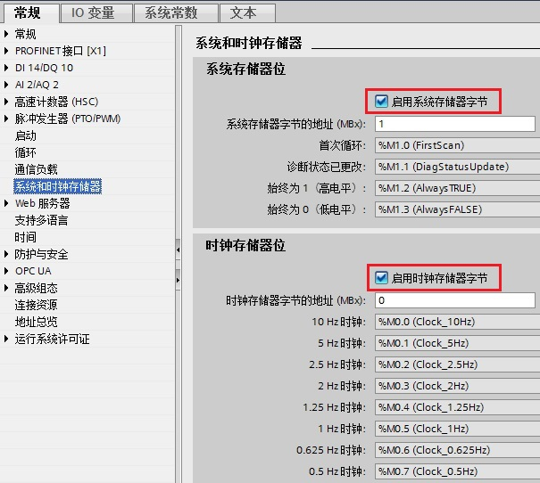{width="605" height="542"}

图2. 系统位与时钟位

**3. 为 PROFINET 通信口分配以太网地址**

在 "设备视图"中点击 CPU 上代表 PROFINET 通信口的绿色小方块，在下方会出现
PROFINET 接口的属性，在 "以太网地址" 下分配 IP 地址为 192.168.0.1
，子网掩码为255.255.255.0，如图3所示。

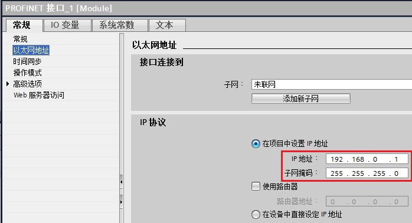{width="698" height="378"}

图3. 分配IP 地址

**4．使用 STEP7 V16 软件添加新设备并命名 PLC_2**

与PLC_1在同一个项目中，在"项目树" 下双击
"添加新设备"，在对话框中选择所使用的 S7-300 CPU 添加到机架上，命名为
PLC_2，如图4所示。

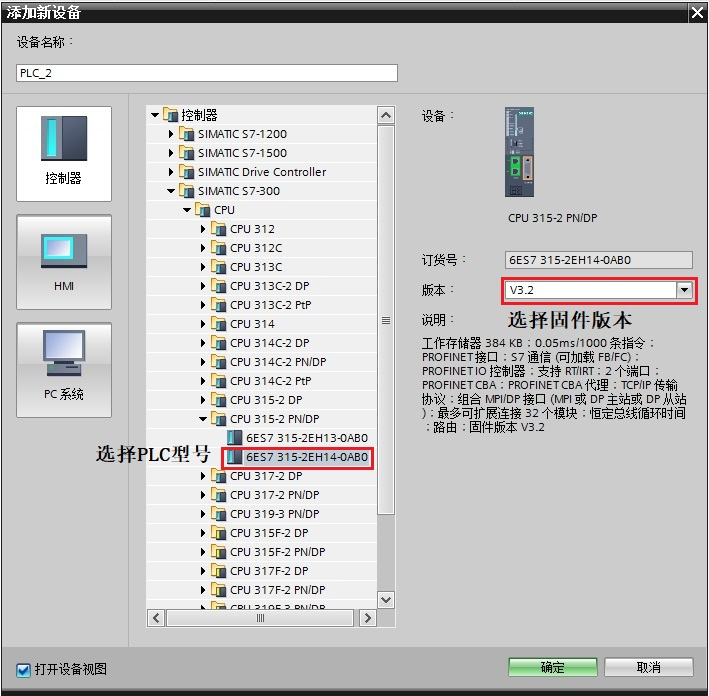{width="709" height="696"}

图4. 添加新设备

为了编程方便，使用 CPU 属性中定义的时钟位，定义方法如下：\
在 "项目树" \> "PLC_2" \> "设备组态" 中，选中 CPU
，然后在下面的属性窗口中，"属性" \> "时钟存储器" 下时钟位定义在
MB0，如图5所示。\
时钟位我们主要使用 M0.3，它是以 2Hz 的速率在 0 和 1
之间切换的一个位，可以使用它去自动激活发送任务。

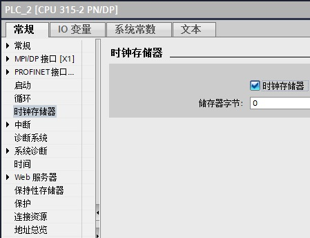{width="449" height="344"}

图5. 时钟存储位

**5. 为 PROFINET 通信口分配以太网地址**

在 "设备视图"中点击 CPU 上代表 PROFINET 通信口的绿色小方块，在下方会出现
PROFINET 接口的属性，在 "以太网地址" 下分配 IP 地址为
192.168.0.2，子网掩码为255.255.255.0，如图6所示。\
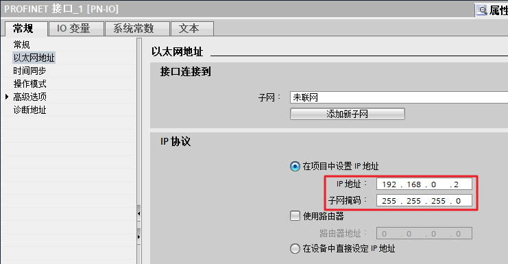{width="741" height="385"}

图6. 分配IP 地址

**6. 创建 CPU的逻辑网络连接**\
\
在项目树 "项目树"\>"设备和网络" \>"网络视图"
视图下，创建两个设备的连接。用鼠标点中 S7-1200
上的PROFINET通信口的绿色小方框，然后拖拽出一条线，到另外一个 S7-300
上的PROFINET通信口上，松开鼠标，PN/IE_1的子网连接就建立起来了，如图7所示。

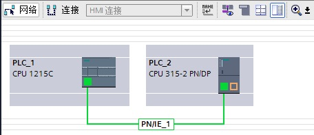{width="456" height="196"}

图7. 建立两个 CPU的逻辑连接

### 1.2在 S7-1200 中调用并配置"TCON"、"TSEND"、"TRCV" 通信指令

#### **1．在 S7-1200 的 OB1 中调用"TCON" 通信指令**

① 在S7-1200 CPU 中调用发送通信指令，进入 "项目树" \> " PLC_1" \>
"程序块" \> "OB1" 主程序中，从右侧窗口 "指令" \> "通信" \>
"开放式用户通信"下调用 "TCON" 指令，创建连接，如图8所示。\
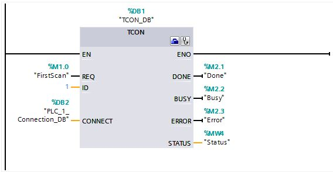{width="568" height="294"}\
图8. 调用"TCON"通信指令

**注意：**

S7-300必须等S7-1200先准备好（触发S7-1200的TCON）后，才可以触发TCON。

② 定义 S7-1200 的 "TCON"连接参数

S7-1200 的 "TCON"指令的连接参数需要在指令下方的属性窗口"属性"\>
"组态"\>"连接参数"中设置，如图9所示。\
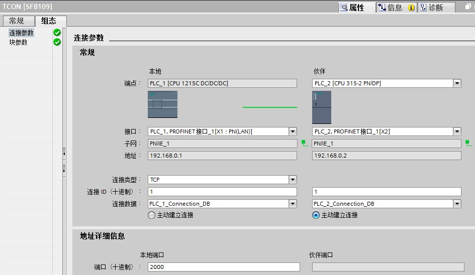{width="945" height="548"}

图9. 定义 TCON 连接参数\
\
**连接参数说明：**

+-----------------------------------+-----------------------------------+
| 端点                              | ::: {align="left"}                |
|                                   | ：可以通过点击选择按钮选          |
|                                   | 择伙伴CPU为"PLC_2，CPU315-2PN/DP" |
|                                   | ；                                |
|                                   | :::                               |
+-----------------------------------+-----------------------------------+
| 连接类型                          | ::: {align="left"}                |
|                                   | ：选择通信协议为 TCP；            |
|                                   | :::                               |
+-----------------------------------+-----------------------------------+
| 连接 ID　                         | ::: {align="left"}                |
|                                   | ：连接的地址 ID 号，这个 ID       |
|                                   | 号在后面的编程里会用到；          |
|                                   | :::                               |
+-----------------------------------+-----------------------------------+
| 连接数据                          | ::: {align="left"}                |
|                                   | ：点击                            |
|                                   | 新建自动生成该数据块，如PLC_1_Con |
|                                   | nection_DB和PLC_2_Connection_DB； |
|                                   | :::                               |
+-----------------------------------+-----------------------------------+
| 主动建立连接                      | ::: {align="left"}                |
|                                   | ：选择伙伴 S7-300 作为主动连接；  |
|                                   | :::                               |
+-----------------------------------+-----------------------------------+
| 地址详细信息                      | ::: {align="left"}                |
|                                   | ：定                              |
|                                   | 义通信本地的端口号为：2000。　　  |
|                                   | :::                               |
+-----------------------------------+-----------------------------------+

#### **2．定义 S7-1200 的"TSEND"发送通信块接口参数**

①　调用 "TSEND" 在OB1内调用，发送10个字节数据到 S7-300PN 中\
进入 "项目树" \> " PLC_1" \> "程序块" \> "OB1" 主程序中，从右侧窗口
"指令" \> "通信" \> "开放式用户通信"下调用 "TSEND" 指令，如图10所示。

{width="728" height="559"}

图10. 调用 TSEND

②　创建并定义S7-1200的发送数据区 DB 块。\
\
通过"项目树"\>"PLC_1"\>"程序块"\>"添加新块"，选择"数据块" 创建 DB
块，在DB块的"属性-\>常规-\>属性"中，取消勾选"优化的块访问"，点击"确定"键，定义发送数据区为
10个字节的数组，如图11及图12所示。

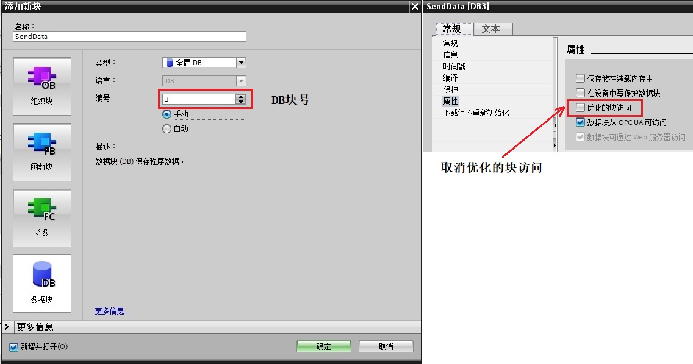{width="1131" height="599"}\
\
图11. 创建发送数据区 DB 块\
\
注意：对于双边编程通信的 CPU ，如果通信数据区使用 DB 块，既可以将 DB
块定义成符号寻址，也可以定义成绝对寻址。使用指针寻址方式，必须创建绝对寻址的
DB 块。

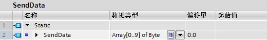{width="520" height="79"}

图12. 定义发送数据区为字节类型的数组

③　定义S7-1200 的"TSEND"发送通信块接口参数，如图13所示。

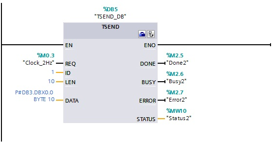{width="559" height="292"}\
\
图13. 定义 TSEND 接口参数\
\
**参数说明：**\
**输入接口参数：**

+-----------------------------------+-----------------------------------+
| ::: {align="left"}                | ::: {align="left"}                |
| REQ　　                           | ：在上升沿启动发送作业            |
| :::                               | :::                               |
+-----------------------------------+-----------------------------------+
| ::: {align="left"}                | ::: {align="left"}                |
| ID　                              | ：引用由"TCON"建立的连接          |
| :::                               | :::                               |
+-----------------------------------+-----------------------------------+
| ::: {align="left"}                | ::: {align="left"}                |
| LEN                               | ：要通过作业发送的最大字节数      |
| :::                               | :::                               |
+-----------------------------------+-----------------------------------+
| ::: {align="left"}                | ::: {align="left"}                |
| DATA　                            | ：发送数据区的数据，使            |
| :::                               | 用指针寻址时，DB块要选用绝对寻址  |
|                                   | :::                               |
+-----------------------------------+-----------------------------------+

**输出接口参数：**

+-----------------------------------+-----------------------------------+
| ::: {align="left"}                | ::: {align="left"}                |
| DONE                              | ：                                |
| :::                               | 任务执行完成并且没有错误，该位置  |
|                                   | 1                                 |
|                                   | :::                               |
+-----------------------------------+-----------------------------------+
| ::: {align="left"}                | ::: {align="left"}                |
| BUSY　                            | ：该位为                          |
| :::                               | 1，代表任务未完成，不能激活新任务 |
|                                   | :::                               |
+-----------------------------------+-----------------------------------+
| ::: {align="left"}                | ::: {align="left"}                |
| ERROR　　　                       | ：通信过程中有错误发生，该位置 1  |
| :::                               | :::                               |
+-----------------------------------+-----------------------------------+
| ::: {align="left"}                | ::: {align="left"}                |
| STATUS                            | ：有错误发生时，会显示错位信息号  |
| :::                               | :::                               |
+-----------------------------------+-----------------------------------+

#### **3．在 S7-1200 的OB1中调用接收指令TRCV 并配置基本参数**

为了实现 S7-1200 接收来自 S7-300PN 的数据，则在 S7-1200
中调用接收指令TRCV 并配置基本参数。

①　创建并定义S7-1200的接收数据区 DB 块。\
\
通过"项目树"\>"PLC_1"\>"程序块"\>"添加新块"，选择"数据块" 创建 DB
块，在DB块的"属性-\>常规-\>属性"中，取消勾选"优化的块访问"，点击"确定"键，定义接收数据区为
10个字节的数组，如图14及图15所示。

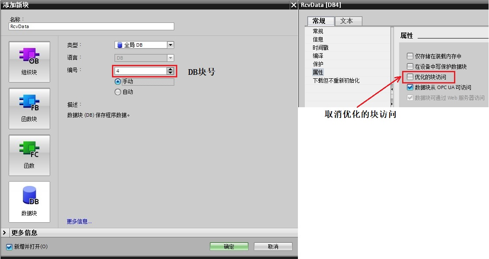{width="1131" height="599"}\
\
图14. 创建接收数据区 DB 块\
\
注意：对于双边编程通信的 CPU ，如果通信数据区使用 DB 块，既可以将 DB
块定义成符号寻址，也可以定义成绝对寻址。使用指针寻址方式，必须创建绝对寻址的
DB 块。

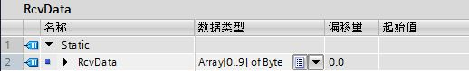{width="518" height="79"}

图15. 定义接收数据区为字节类型的数组

②　调用 "TRCV" 在OB1内调用\
进入 "项目树" \> " PLC_1" \> "程序块" \> "OB1" 主程序中，从右侧窗口
"指令" \> "通信" \> "开放式用户通信"下调用 "TRCV"
指令，配置接口参数，如图16所示。\
\
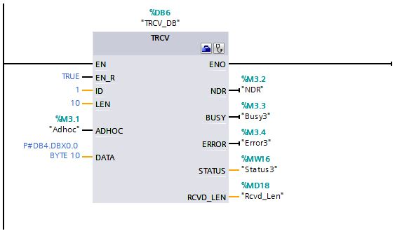{width="563" height="330"}\
图16. 调用 TRCV 指令并配置接口参数

**参数说明：**\
**输入接口参数：**

+-----------------------------------+-----------------------------------+
| ::: {align="left"}                | ::: {align="left"}                |
| EN_R                              | ：启用接收功能                    |
| :::                               | :::                               |
+-----------------------------------+-----------------------------------+
| ::: {align="left"}                | ::: {align="left"}                |
| ID                                | ：指向使用"TCON"建立的连接的引用  |
| :::                               | :::                               |
+-----------------------------------+-----------------------------------+
| ::: {align="left"}                | ::: {align="left"}                |
| LEN                               | ：接收数据长度                    |
| :::                               | :::                               |
+-----------------------------------+-----------------------------------+
| ::: {align="left"}                | ::: {align="left"}                |
| ADHOC                             | ：TCP协议选项是否使用Ad-hoc模式   |
| :::                               | :::                               |
+-----------------------------------+-----------------------------------+
| ::: {align="left"}                | ::: {align="left"}                |
| DATA                              | ：接收数据区的地址                |
| :::                               | :::                               |
+-----------------------------------+-----------------------------------+

**输出接口参数：**

+-----------------------------------+-----------------------------------+
| ::: {align="left"}                | ::: {align="left"}                |
| NDR                               | ：该位为 1，接收任务成功完成      |
| :::                               | :::                               |
+-----------------------------------+-----------------------------------+
| ::: {align="left"}                | ::: {align="left"}                |
| BUSY                              | ：该位为                          |
| :::                               | 1，代表任务未完成，不能激活新任务 |
|                                   | :::                               |
+-----------------------------------+-----------------------------------+
| ::: {align="left"}                | ::: {align="left"}                |
| ERROR                             | ：通信过程中有错误发生，该位置 1  |
| :::                               | :::                               |
+-----------------------------------+-----------------------------------+
| ::: {align="left"}                | ::: {align="left"}                |
| STATUS                            | ：有错误发生时，会显示错误信息号  |
| :::                               | :::                               |
+-----------------------------------+-----------------------------------+
| ::: {align="left"}                | ::: {align="left"}                |
| RCVD_LEN　　                      | ：实际接收数据的字节数            |
| :::                               | :::                               |
+-----------------------------------+-----------------------------------+

**注意：ADHOC设置为 TRUE 可以接收变长数据。**

### 1.3在 S7-300 中调用并配置"TCON"、"TSEND"、"TRCV" 通信指令

#### **1．在 S7-300 的 OB1 中调用"TCON" 通信指令**

① 在 S7-300 CPU 中调用发送通信指令，进入 "项目树" \> "PLC_2" \> "程序块"
\> "OB1" 主程序中，从右侧窗口 "指令" \> "通讯" \> "开放式用户通信"下调用
"TCON" 指令，创建连接，如图17所示。

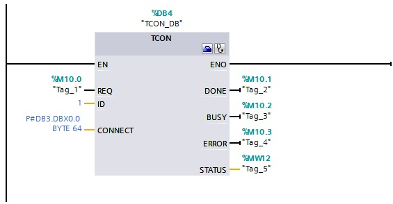{width="565" height="294"}

图17. 调用 TCON 通信指令

② 定义 S7-300 的 "TCON"连接参数

S7-300 的 "TCON"指令的连接参数需要在指令下方的属性窗口"属性"\>
"组态"\>"连接参数中"中设置，如图18所示。

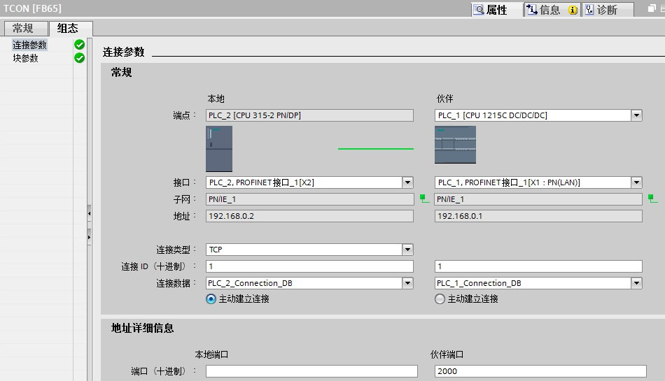{width="950" height="545"}

图18. 定义 TCON 连接参数

**连接参数说明：**

+-----------------------------------+-----------------------------------+
| 端点                              | ::: {align="left"}                |
|                                   | ：                                |
|                                   | 可以通过点击选择按钮选择"PLC_1"； |
|                                   | :::                               |
+-----------------------------------+-----------------------------------+
| 连接类型                          | ::: {align="left"}                |
|                                   | ：选择通信协议为 TCP；            |
|                                   | :::                               |
+-----------------------------------+-----------------------------------+
| 连接 ID　                         | ::: {align="left"}                |
|                                   | ：连接的地址 ID 号，这个 ID       |
|                                   | 号在后面的编程里会用到；          |
|                                   | :::                               |
+-----------------------------------+-----------------------------------+
| 连接数据                          | ::: {align="left"}                |
|                                   | ：**选择之前已建立                |
|                                   | 的数据块（如图9所示）**PLC_2_Con  |
|                                   | nection_DB和PLC_1_Connection_DB； |
|                                   | :::                               |
+-----------------------------------+-----------------------------------+
| 主动建立连接                      | ::: {align="left"}                |
|                                   | ：选择本地 S7-300 作为主动连接；  |
|                                   | :::                               |
+-----------------------------------+-----------------------------------+
| 地址详细信息                      | ::: {align="left"}                |
|                                   | ：定义伙伴的端口号为：2000。　　  |
|                                   | :::                               |
+-----------------------------------+-----------------------------------+

#### **2．定义 S7-300 的"TSEND"发送通信块接口参数**

①创建并定义 S7-300 的发送数据区 DB1 块

通过"项目树"\>"PLC_2"\>"程序块"\>"添加新块"，选择"数据块" 创建 DB1
块，点击"确定"键，定义发送数据区为
10个字节的数组，如图19所示，结果如图20所示。

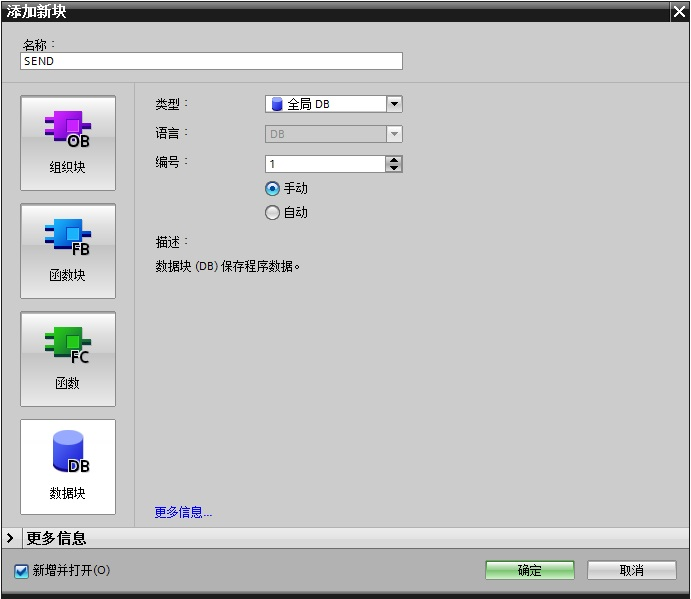{width="691" height="599"}

图19. 创建发送数据区 DB 块

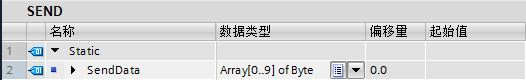{width="526" height="80"}

图20. 定义发送数据区为字节类型的数组

②调用 "TSEND" 在OB1内调用 发送 10 个字节数据到 S7-1200 中\
进入 "项目树" \> "PLC_2" \> "程序块" \> "OB1 " 主程序中，从右侧窗口
"指令" \> "通讯" \> "开放式用户通信"下调用 "TSEND"
指令，配置接口参数，如图21所示。

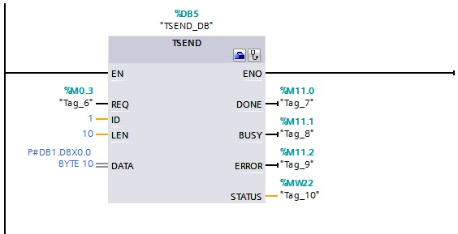{width="564" height="289"}

图21. 调用 TSEND 指令并配置接口参数

**参数说明：**\
**输入接口参数：**

+-----------------------------------+-----------------------------------+
| ::: {align="left"}                | ::: {align="left"}                |
| REQ　　                           | ：在上升沿启动发送作业            |
| :::                               | :::                               |
+-----------------------------------+-----------------------------------+
| ::: {align="left"}                | ::: {align="left"}                |
| ID                                | ：引用由"TCON"建立的连接          |
| :::                               | :::                               |
+-----------------------------------+-----------------------------------+
| ::: {align="left"}                | ::: {align="left"}                |
| LEN                               | ：要通过作业发送的最大字节数      |
| :::                               | :::                               |
+-----------------------------------+-----------------------------------+
| ::: {align="left"}                | ::: {align="left"}                |
| DATA　                            | ：发送数据区的数据，使            |
| :::                               | 用指针寻址时，DB块要选用绝对寻址  |
|                                   | :::                               |
+-----------------------------------+-----------------------------------+

**输出接口参数：**

+-----------------------------------+-----------------------------------+
| ::: {align="left"}                | ::: {align="left"}                |
| DONE                              | ：                                |
| :::                               | 任务执行完成并且没有错误，该位置  |
|                                   | 1                                 |
|                                   | :::                               |
+-----------------------------------+-----------------------------------+
| ::: {align="left"}                | ::: {align="left"}                |
| BUSY　                            | ：该位为                          |
| :::                               | 1，代表任务未完成，不能激活新任务 |
|                                   | :::                               |
+-----------------------------------+-----------------------------------+
| ::: {align="left"}                | ::: {align="left"}                |
| ERROR　　　                       | ：通信过程中有错误发生，该位置 1  |
| :::                               | :::                               |
+-----------------------------------+-----------------------------------+
| ::: {align="left"}                | ::: {align="left"}                |
| STATUS                            | ：有错误发生时，会显示错位信息号  |
| :::                               | :::                               |
+-----------------------------------+-----------------------------------+

#### **3．在 S7-300 的OB1中调用接收指令TRCV并配置参数**

①创建并定义 S7-300 的接收数据区 DB2 块。\
\
通过"项目树"\>"PLC_2"\>"程序块"\>"添加新块"，选择"数据块" 创建 DB2
块，点击"确定"键，定义接收数据区为 10
个字节的数组，如图22所示，结果如图23所示。

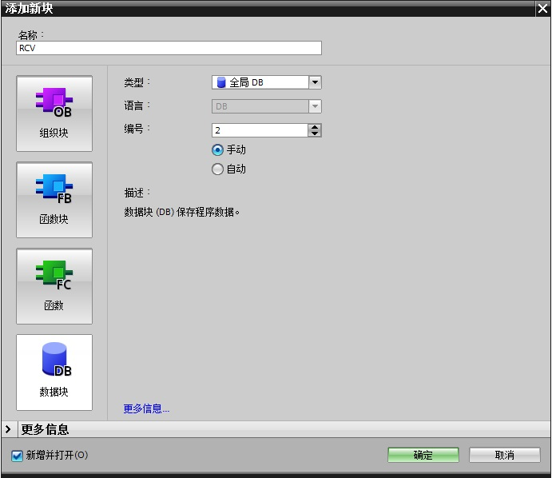{width="691" height="598"}

图22. 创建接收数据区 DB2 块

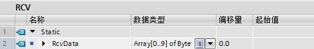{width="512" height="80"}

图23. 定义接收数据区为字节类型的数组

② 将 "TRCV" 在OB1内调用\
进入 "项目树" \> "PLC_2" \> "程序块" \> "OB1 " 主程序中，从右侧窗口
"指令" \> "通讯" \> "开放式用户通信"下调用 "TRCV"
指令，配置接口参数，如图24所示。

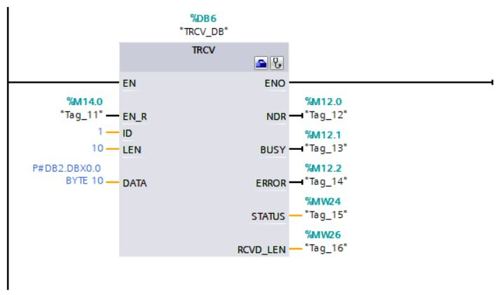{width="709" height="421"}

图24. 调用 TRCV 指令并配置接口参数

**参数说明：**\
**输入接口参数：**

+-----------------------------------+-----------------------------------+
| ::: {align="left"}                | ::: {align="left"}                |
| EN_R                              | ：启用接收功能                    |
| :::                               | :::                               |
+-----------------------------------+-----------------------------------+
| ::: {align="left"}                | ::: {align="left"}                |
| ID                                | ：指向使用"TCON"建立的连接的引用  |
| :::                               | :::                               |
+-----------------------------------+-----------------------------------+
| ::: {align="left"}                | ::: {align="left"}                |
| LEN                               | ：接收数据长度                    |
| :::                               | :::                               |
+-----------------------------------+-----------------------------------+
| ::: {align="left"}                | ::: {align="left"}                |
| DATA                              | ：接收数据区的地址                |
| :::                               | :::                               |
+-----------------------------------+-----------------------------------+

**输出接口参数：**

+-----------------------------------+-----------------------------------+
| ::: {align="left"}                | ::: {align="left"}                |
| NDR                               | ：该位为 1，接收任务成功完成      |
| :::                               | :::                               |
+-----------------------------------+-----------------------------------+
| ::: {align="left"}                | ::: {align="left"}                |
| BUSY                              | ：该位为                          |
| :::                               | 1，代表任务未完成，不能激活新任务 |
|                                   | :::                               |
+-----------------------------------+-----------------------------------+
| ::: {align="left"}                | ::: {align="left"}                |
| ERROR                             | ：通信过程中有错误发生，该位置 1  |
| :::                               | :::                               |
+-----------------------------------+-----------------------------------+
| ::: {align="left"}                | ::: {align="left"}                |
| STATUS                            | ：有错误发生时，会显示错误信息号  |
| :::                               | :::                               |
+-----------------------------------+-----------------------------------+
| ::: {align="left"}                | ::: {align="left"}                |
| RCVD_LEN　　                      | ：实际接收数据的字节数            |
| :::                               | :::                               |
+-----------------------------------+-----------------------------------+

配置完连接并编译存盘。\

### 1.4 下载硬件组态及程序并监控通信结果

下载两个 CPU 中的所有硬件组态及程序，实现两个 CPU
之间数据交换，监控结果如图25所示。

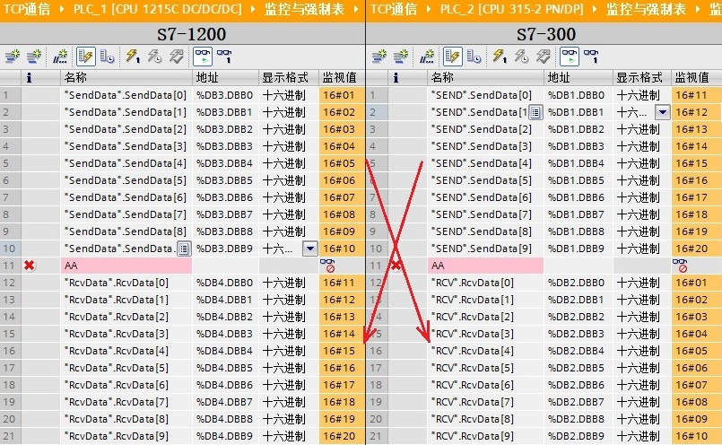{width="805" height="496"}

图25. 监控结果

### []{#b}二. 第二种情况（S7-1200与S7-300不在同一个TIA项目中操作）

使用 STEP 7 V16
在一个项目中，新建一个S7-1200站点，在另一个项目中，新建一个S7-300站点，然后做
TCP 通讯。

### 2.1 S7-1200 侧通信的编程，连接参数及通信参数的配置

**1. 使用 STEP7 V16 软件新建一个项目并完成硬件配置**

在 STEP7 V16的 "Portal 视图" 中选择 "创建新项目" 创建一个新项目。

**2.添加硬件并命名PLC**\
\
然后进入 "项目视图"，在"项目树" 下双击
"添加新设备"，在对话框中选择所使用的 S7-1200 CPU 添加到机架上，命名为
PLC_1，如图26所示。\
\
{width="707" height="695"}

图26. 添加新设备

为了编程方便，使用 CPU 属性中定义的时钟位，定义方法如下：\
在 "项目树" \> "PLC_1" \> "设备组态" 中，选中 CPU
，然后在下面的属性窗口中，"属性" \> "系统和时钟存储器"
下，将系统位定义在 MB1，时钟位定义在 MB0，如图27所示。\
系统位我们主要使用M1.0；时钟位主要使用 M0.3，它是以 2Hz 的速率在 0 和 1
之间切换的一个位，可以使用它去自动激活发送任务。

{width="605" height="542"}

图27. 系统位与时钟位

**3. 为 PROFINET 通信口分配以太网地址**

在 "设备视图"中点击 CPU 上代表PROFINET
通信口的绿色小方块，在下方会出现PROFINET 接口的属性，在 "以太网地址"
下分配IP 地址为 192.168.0.1 ，子网掩码为255.255.255.0，如图28所示。

{width="692" height="376"}

图28. 分配IP 地址

### 2.2在 S7-1200 中调用并配置"TCON"、"TSEND"、"TRCV" 通信指令

#### **1．在 S7-1200 的 OB1 中调用"TCON" 通信指令**

① 在S7-1200 CPU 中调用发送通信指令，进入 "项目树" \> " PLC_1" \>
"程序块" \> "OB1" 主程序中，从右侧窗口 "指令" \> "通信" \>
"开放式用户通信"下调用 "TCON" 指令，创建连接，如图29所示。\
{width="568" height="294"}\
图29. 调用"TCON"通信指令

**注意：**

S7-300必须等S7-1200先准备好（触发S7-1200的TCON）后，才可以触发TCON。

② 定义 S7-1200 的 "TCON"连接参数

S7-1200 的 "TCON"指令的连接参数需要在指令下方的属性窗口"属性"\>
"组态"\>"连接参数"中设置，如图30所示。\
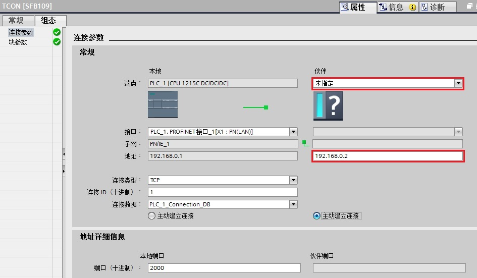{width="945" height="551"}

图30. 定义 TCON 连接参数\
\
**连接参数说明：**

+-----------------------------------+-----------------------------------+
| 端点                              | ::: {align="left"}                |
|                                   | ：可以通过                        |
|                                   | 点击选择按钮选择伙伴CPU为"未指定" |
|                                   | ；                                |
|                                   | :::                               |
+-----------------------------------+-----------------------------------+
| 连接类型                          | ::: {align="left"}                |
|                                   | ：选择通信协议为 TCP；            |
|                                   | :::                               |
+-----------------------------------+-----------------------------------+
| 连接 ID　                         | ::: {align="left"}                |
|                                   | ：连接的地址 ID 号，这个 ID       |
|                                   | 号在后面的编程里会用到；          |
|                                   | :::                               |
+-----------------------------------+-----------------------------------+
| 连接数据                          | ::: {align="left"}                |
|                                   | ：点击新建自动生成                |
|                                   | 该数据块，如PLC_1_Connection_DB； |
|                                   | :::                               |
+-----------------------------------+-----------------------------------+
| 主动建立连接                      | ::: {align="left"}                |
|                                   | ：选择伙伴"未指定"(               |
|                                   | 本例中为S7-300) 作为主动连接；    |
|                                   | :::                               |
+-----------------------------------+-----------------------------------+
| 地址详细信息                      | ::: {align="left"}                |
|                                   | ：定                              |
|                                   | 义通信本地的端口号为：2000。　　  |
|                                   | :::                               |
+-----------------------------------+-----------------------------------+

#### **2．定义 S7-1200 的"TSEND"发送通信块接口参数**

①　调用 "TSEND" 在OB1内调用 发送10个字节数据到 S7-300PN 中\
进入 "项目树" \> " PLC_1" \> "程序块" \> "OB1" 主程序中，从右侧窗口
"指令" \> "通信" \> "开放式用户通信"下调用 "TSEND" 指令，如图31所示。

{width="728" height="559"}

图31. 调用 TSEND

②　创建并定义S7-1200的发送数据区 DB 块。\
\
通过"项目树"\>"PLC_1"\>"程序块"\>"添加新块"，选择"数据块" 创建 DB
块，在DB块的"属性-\>常规-\>属性"中，取消勾选"优化的块访问"，点击"确定"键，定义发送数据区为
10个字节的数组，如图32及图33所示。

{width="1131" height="599"}\
\
图32. 创建发送数据区 DB 块\
\
注意：对于双边编程通信的 CPU ，如果通信数据区使用 DB 块，既可以将 DB
块定义成符号寻址，也可以定义成绝对寻址。使用指针寻址方式，必须创建绝对寻址的
DB 块。

{width="520" height="79"}

图33. 定义发送数据区为字节类型的数组

③　定义S7-1200 的"TSEND"发送通信块接口参数，如图34所示。

{width="559" height="292"}\
\
图34. 定义 TSEND 接口参数\
\
**参数说明：**\
**输入接口参数：**

+-----------------------------------+-----------------------------------+
| ::: {align="left"}                | ::: {align="left"}                |
| REQ　　                           | ：在上升沿启动发送作业            |
| :::                               | :::                               |
+-----------------------------------+-----------------------------------+
| ::: {align="left"}                | ::: {align="left"}                |
| ID　                              | ：引用由"TCON"建立的连接          |
| :::                               | :::                               |
+-----------------------------------+-----------------------------------+
| ::: {align="left"}                | ::: {align="left"}                |
| LEN                               | ：要通过作业发送的最大字节数      |
| :::                               | :::                               |
+-----------------------------------+-----------------------------------+
| ::: {align="left"}                | ::: {align="left"}                |
| DATA　                            | ：发送数据区的数据，使            |
| :::                               | 用指针寻址时，DB块要选用绝对寻址  |
|                                   | :::                               |
+-----------------------------------+-----------------------------------+

**输出接口参数：**

+-----------------------------------+-----------------------------------+
| ::: {align="left"}                | ::: {align="left"}                |
| DONE                              | ：                                |
| :::                               | 任务执行完成并且没有错误，该位置  |
|                                   | 1                                 |
|                                   | :::                               |
+-----------------------------------+-----------------------------------+
| ::: {align="left"}                | ::: {align="left"}                |
| BUSY　                            | ：该位为                          |
| :::                               | 1，代表任务未完成，不能激活新任务 |
|                                   | :::                               |
+-----------------------------------+-----------------------------------+
| ::: {align="left"}                | ::: {align="left"}                |
| ERROR　　　                       | ：通信过程中有错误发生，该位置 1  |
| :::                               | :::                               |
+-----------------------------------+-----------------------------------+
| ::: {align="left"}                | ::: {align="left"}                |
| STATUS                            | ：有错误发生时，会显示错位信息号  |
| :::                               | :::                               |
+-----------------------------------+-----------------------------------+

#### **3．在 S7-1200 的OB1中调用接收指令TRCV 并配置基本参数**

为了实现 S7-1200 接收来自 S7-300PN 的数据，则在 S7-1200
中调用接收指令TRCV 并配置基本参数。

①　创建并定义S7-1200的接收数据区 DB 块。\
\
通过"项目树"\>"PLC_1"\>"程序块"\>"添加新块"，选择"数据块" 创建 DB
块，在DB块的"属性-\>常规-\>属性"中，取消勾选"优化的块访问"，点击"确定"键，定义接收数据区为
10个字节的数组，如图35及图36所示。

{width="1131" height="599"}\
\
图35. 创建接收数据区 DB 块\
\
注意：对于双边编程通信的 CPU ，如果通信数据区使用 DB 块，既可以将 DB
块定义成符号寻址，也可以定义成绝对寻址。使用指针寻址方式，必须创建绝对寻址的
DB 块。

{width="518" height="79"}

图36. 定义接收数据区为字节类型的数组

②　调用 "TRCV" 在OB1内调用\
进入 "项目树" \> " PLC_1" \> "程序块" \> "OB1" 主程序中，从右侧窗口
"指令" \> "通信" \> "开放式用户通信"下调用 "TRCV"
指令，配置接口参数，如图37所示。\
\
{width="563" height="330"}\
图37. 调用 TRCV 指令并配置接口参数

**参数说明：**\
**输入接口参数：**

+-----------------------------------+-----------------------------------+
| ::: {align="left"}                | ::: {align="left"}                |
| EN_R                              | ：启用接收功能                    |
| :::                               | :::                               |
+-----------------------------------+-----------------------------------+
| ::: {align="left"}                | ::: {align="left"}                |
| ID                                | ：指向使用"TCON"建立的连接的引用  |
| :::                               | :::                               |
+-----------------------------------+-----------------------------------+
| ::: {align="left"}                | ::: {align="left"}                |
| LEN                               | ：接收数据长度                    |
| :::                               | :::                               |
+-----------------------------------+-----------------------------------+
| ::: {align="left"}                | ::: {align="left"}                |
| ADHOC                             | ：TCP协议选项是否使用Ad-hoc模式   |
| :::                               | :::                               |
+-----------------------------------+-----------------------------------+
| ::: {align="left"}                | ::: {align="left"}                |
| DATA                              | ：接收数据区的地址                |
| :::                               | :::                               |
+-----------------------------------+-----------------------------------+

**输出接口参数：**

+-----------------------------------+-----------------------------------+
| ::: {align="left"}                | ::: {align="left"}                |
| NDR                               | ：该位为 1，接收任务成功完成      |
| :::                               | :::                               |
+-----------------------------------+-----------------------------------+
| ::: {align="left"}                | ::: {align="left"}                |
| BUSY                              | ：该位为                          |
| :::                               | 1，代表任务未完成，不能激活新任务 |
|                                   | :::                               |
+-----------------------------------+-----------------------------------+
| ::: {align="left"}                | ::: {align="left"}                |
| ERROR                             | ：通信过程中有错误发生，该位置 1  |
| :::                               | :::                               |
+-----------------------------------+-----------------------------------+
| ::: {align="left"}                | ::: {align="left"}                |
| STATUS                            | ：有错误发生时，会显示错误信息号  |
| :::                               | :::                               |
+-----------------------------------+-----------------------------------+
| ::: {align="left"}                | ::: {align="left"}                |
| RCVD_LEN　　                      | ：实际接收数据的字节数            |
| :::                               | :::                               |
+-----------------------------------+-----------------------------------+

**注意：ADHOC设置为 TRUE 可以接收变长数据。**

### 2.3 S7-300PN 侧通信的编程，连接参数及通信参数的配置

**1．使用 STEP7 V16 软件新建项目，添加新设备并命名 PLC_2**

再次打开STEP7 V16，在 STEP7 V16的 "Portal 视图" 中选择 "创建新项目"
创建一个新项目。然后进入 "项目视图"，在"项目树" 下双击
"添加新设备"，在对话框中选择所使用的 S7-300 CPU 添加到机架上，命名为
PLC_2，如图38所示。

{width="709" height="696"}

图38. 添加新设备

为了编程方便，使用 CPU 属性中定义的时钟位，定义方法如下：\
在 "项目树" \> "PLC_2" \> "设备组态" 中，选中 CPU
，然后在下面的属性窗口中，"属性" \> "时钟存储器" 下时钟位定义在
MB0，如图39所示。\
时钟位我们主要使用 M0.3，它是以 2Hz 的速率在 0 和 1
之间切换的一个位，可以使用它去自动激活发送任务。

{width="449" height="344"}

图39. 时钟存储位

**2. 为 PROFINET 通信口分配以太网地址**

在 "设备视图"中点击 CPU 上代表PROFINET
通信口的绿色小方块，在下方会出现PROFINET 接口的属性，在 "以太网地址"
下分配IP 地址为 192.168.0.2 ，子网掩码为255.255.255.0，图40所示。\
{width="741" height="385"}

图40. 分配IP 地址

### 2.4 在 S7-300 中调用并配置"TCON"、"TSEND"、"TRCV" 通信指令

#### **1．在 S7-300 的 OB1 中调用"TCON" 通信指令**

① 在 S7-300 CPU 中调用发送通信指令，进入 "项目树" \> "PLC_2" \> "程序块"
\> "OB1" 主程序中，从右侧窗口 "指令" \> "通讯" \> "开放式用户通信"下调用
"TCON" 指令，创建连接，如图41所示。

{width="565" height="294"}

图41. 调用 TCON 通信指令

② 定义 S7-300 的 "TCON"连接参数

S7-300 的 "TCON"指令的连接参数需要在指令下方的属性窗口"属性"\>
"组态"\>"连接参数中"中设置，如图42所示。

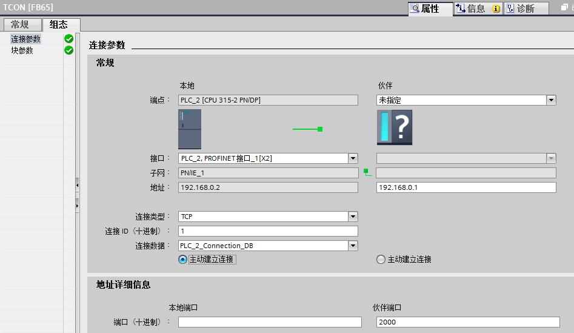{width="947" height="549"}

图42. 定义 TCON 连接参数

**连接参数说明：**

+-----------------------------------+-----------------------------------+
| 端点                              | ::: {align="left"}                |
|                                   | ：可                              |
|                                   | 以通过点击选择按钮选择"未指定"；  |
|                                   | :::                               |
+-----------------------------------+-----------------------------------+
| 连接类型                          | ::: {align="left"}                |
|                                   | ：选择通信协议为 TCP；            |
|                                   | :::                               |
+-----------------------------------+-----------------------------------+
| 连接 ID　                         | ::: {align="left"}                |
|                                   | ：连接的地址 ID 号，这个 ID       |
|                                   | 号在后面的编程里会用到；          |
|                                   | :::                               |
+-----------------------------------+-----------------------------------+
| 连接数据                          | ::: {align="left"}                |
|                                   | ：点击新建自动生成该数据块；      |
|                                   | :::                               |
+-----------------------------------+-----------------------------------+
| 主动建立连接                      | ::: {align="left"}                |
|                                   | ：选择本地 S7-300 作为主动连接；  |
|                                   | :::                               |
+-----------------------------------+-----------------------------------+
| 地址详细信息                      | ::: {align="left"}                |
|                                   | ：定义伙伴的端口号为：2000。　　  |
|                                   | :::                               |
+-----------------------------------+-----------------------------------+

**注意：**伙伴端口号是因为服务器（S7-1200）设置为2000，所以这里设置为2000。

#### **2．定义 S7-300 的"TSEND"发送通信块接口参数**

①创建并定义 S7-300 的发送数据区 DB1 块

通过"项目树"\>"PLC_2"\>"程序块"\>"添加新块"，选择"数据块" 创建 DB1
块，点击"确定"键，定义发送数据区为
10个字节的数组，如图43所示，结果如图44所示。

{width="691" height="599"}

图43. 创建发送数据区 DB 块

{width="526" height="80"}

图44. 定义发送数据区为字节类型的数组

②调用 "TSEND" 在OB1内调用 发送 10 个字节数据到 S7-1200 中\
进入 "项目树" \> "PLC_2" \> "程序块" \> "OB1 " 主程序中，从右侧窗口
"指令" \> "通讯" \> "开放式用户通信"下调用 "TSEND"
指令，配置接口参数，如图45所示。

{width="564" height="289"}

图45. 调用 TSEND 指令并配置接口参数

**参数说明：**\
**输入接口参数：**

+-----------------------------------+-----------------------------------+
| ::: {align="left"}                | ::: {align="left"}                |
| REQ　　                           | ：在上升沿启动发送作业            |
| :::                               | :::                               |
+-----------------------------------+-----------------------------------+
| ::: {align="left"}                | ::: {align="left"}                |
| ID                                | ：引用由"TCON"建立的连接          |
| :::                               | :::                               |
+-----------------------------------+-----------------------------------+
| ::: {align="left"}                | ::: {align="left"}                |
| LEN                               | ：要通过作业发送的最大字节数      |
| :::                               | :::                               |
+-----------------------------------+-----------------------------------+
| ::: {align="left"}                | ::: {align="left"}                |
| DATA　                            | ：发送数据区的数据，使            |
| :::                               | 用指针寻址时，DB块要选用绝对寻址  |
|                                   | :::                               |
+-----------------------------------+-----------------------------------+

**输出接口参数：**

+-----------------------------------+-----------------------------------+
| ::: {align="left"}                | ::: {align="left"}                |
| DONE                              | ：                                |
| :::                               | 任务执行完成并且没有错误，该位置  |
|                                   | 1                                 |
|                                   | :::                               |
+-----------------------------------+-----------------------------------+
| ::: {align="left"}                | ::: {align="left"}                |
| BUSY　                            | ：该位为                          |
| :::                               | 1，代表任务未完成，不能激活新任务 |
|                                   | :::                               |
+-----------------------------------+-----------------------------------+
| ::: {align="left"}                | ::: {align="left"}                |
| ERROR　　　                       | ：通信过程中有错误发生，该位置 1  |
| :::                               | :::                               |
+-----------------------------------+-----------------------------------+
| ::: {align="left"}                | ::: {align="left"}                |
| STATUS                            | ：有错误发生时，会显示错位信息号  |
| :::                               | :::                               |
+-----------------------------------+-----------------------------------+

#### **3．定义 S7-300 的OB1中调用接收指令TRCV 并配置基本参数**

①创建并定义 S7-300 的接收数据区 DB2 块。\
\
通过"项目树"\>"PLC_2"\>"程序块"\>"添加新块"，选择"数据块" 创建 DB2
块，点击"确定"键，定义接收数据区为 10
个字节的数组，如图46所示，结果如图47所示。

{width="691" height="598"}

图46. 创建接收数据区 DB2 块

{width="512" height="80"}

图47. 定义接收数据区为字节类型的数组

② 将 "TRCV" 在OB1内调用\
进入 "项目树" \> "PLC_2" \> "程序块" \> "OB1 " 主程序中，从右侧窗口
"指令" \> "通讯" \> "开放式用户通信"下调用 "TRCV"
指令，配置接口参数，如图48所示。

{width="709" height="421"}

图48. 调用 TRCV 指令并配置接口参数

**参数说明：**\
**输入接口参数：**

+-----------------------------------+-----------------------------------+
| ::: {align="left"}                | ::: {align="left"}                |
| EN_R                              | ：启用接收功能                    |
| :::                               | :::                               |
+-----------------------------------+-----------------------------------+
| ::: {align="left"}                | ::: {align="left"}                |
| ID                                | ：指向使用"TCON"建立的连接的引用  |
| :::                               | :::                               |
+-----------------------------------+-----------------------------------+
| ::: {align="left"}                | ::: {align="left"}                |
| LEN                               | ：接收数据长度                    |
| :::                               | :::                               |
+-----------------------------------+-----------------------------------+
| ::: {align="left"}                | ::: {align="left"}                |
| DATA                              | ：接收数据区的地址                |
| :::                               | :::                               |
+-----------------------------------+-----------------------------------+

**输出接口参数：**

+-----------------------------------+-----------------------------------+
| ::: {align="left"}                | ::: {align="left"}                |
| NDR                               | ：该位为 1，接收任务成功完成      |
| :::                               | :::                               |
+-----------------------------------+-----------------------------------+
| ::: {align="left"}                | ::: {align="left"}                |
| BUSY                              | ：该位为                          |
| :::                               | 1，代表任务未完成，不能激活新任务 |
|                                   | :::                               |
+-----------------------------------+-----------------------------------+
| ::: {align="left"}                | ::: {align="left"}                |
| ERROR                             | ：通信过程中有错误发生，该位置 1  |
| :::                               | :::                               |
+-----------------------------------+-----------------------------------+
| ::: {align="left"}                | ::: {align="left"}                |
| STATUS                            | ：有错误发生时，会显示错误信息号  |
| :::                               | :::                               |
+-----------------------------------+-----------------------------------+
| ::: {align="left"}                | ::: {align="left"}                |
| RCVD_LEN　　                      | ：实际接收数据的字节数            |
| :::                               | :::                               |
+-----------------------------------+-----------------------------------+

配置完连接并编译存盘。\

### 2.5 下载硬件组态及程序并监控通信结果

下载两个 CPU 中的所有硬件组态及程序，实现两个 CPU
之间数据交换，监控结果如图49所示。

{width="805" height="496"}

图49. 监控结果

### 三. 第三种情况（S7-1200在TIA项目中，S7-300在STEP7项目中）

使用 STEP 7 V16 在一个项目中，新建一个S7-1200站点，使用STEP7
V5.6在一个项目中，新建一个S7-300站点，然后做 TCP 通讯。

### 3.1 S7-1200 侧通信的编程，连接参数及通信参数的配置

**1. 使用 STEP7 V16 软件新建一个项目并完成硬件配置**

在 STEP7 V16的 "Portal 视图" 中选择 "创建新项目" 创建一个新项目。

**2.添加硬件并命名PLC**\
\
然后进入 "项目视图"，在"项目树" 下双击
"添加新设备"，在对话框中选择所使用的 S7-1200 CPU 添加到机架上，命名为
PLC_1，如图50所示。\
\
{width="707" height="695"}

图50. 添加新设备

为了编程方便，使用 CPU 属性中定义的时钟位，定义方法如下：\
在 "项目树" \> "S7-1200" \> "设备组态" 中，选中 CPU
，然后在下面的属性窗口中，"属性" \> "系统和时钟存储器"
下，将系统位定义在 MB1，时钟位定义在 MB0，如图51所示。\
系统位我们主要使用M1.0；时钟位主要使用 M0.3，它是以 2Hz 的速率在 0 和 1
之间切换的一个位，可以使用它去自动激活发送任务。

{width="605" height="542"}

图51. 系统位与时钟位

**3. 为 PROFINET 通信口分配以太网地址**

在 "设备视图"中点击 CPU 上代表PROFINET
通信口的绿色小方块，在下方会出现PROFINET 接口的属性，在 "以太网地址"
下分配IP 地址为 192.168.0.2 ，子网掩码为255.255.255.0，如图52所示。

{width="698" height="378"}

图52. 分配IP 地址

### 3.2在 S7-1200 中调用并配置"TCON"、"TSEND"、"TRCV" 通信指令

#### **1．在 S7-1200 的 OB1 中调用"TCON" 通信指令**

① 在S7-1200 CPU 中调用发送通信指令，进入 "项目树" \> " PLC_1" \>
"程序块" \> "OB1" 主程序中，从右侧窗口 "指令" \> "通信" \>
"开放式用户通信"下调用 "TCON" 指令，创建连接，如图53所示。\
{width="568" height="294"}\
图53. 调用"TCON"通信指令

**注意：**

S7-300必须等S7-1200先准备好（触发S7-1200的TCON）后，才可以触发TCON。

② 定义 S7-1200 的 "TCON"连接参数

S7-1200 的 "TCON"指令的连接参数需要在指令下方的属性窗口"属性"\>
"组态"\>"连接参数"中设置，如图54所示。\
{width="945" height="551"}

图54. 定义 TCON 连接参数\
\
**连接参数说明：**

+-----------------------------------+-----------------------------------+
| 端点                              | ::: {align="left"}                |
|                                   | ：可以通过                        |
|                                   | 点击选择按钮选择伙伴CPU为"未指定" |
|                                   | ；                                |
|                                   | :::                               |
+-----------------------------------+-----------------------------------+
| 连接类型                          | ::: {align="left"}                |
|                                   | ：选择通信协议为 TCP；            |
|                                   | :::                               |
+-----------------------------------+-----------------------------------+
| 连接 ID　                         | ::: {align="left"}                |
|                                   | ：连接的地址 ID 号，这个 ID       |
|                                   | 号在后面的编程里会用到；          |
|                                   | :::                               |
+-----------------------------------+-----------------------------------+
| 连接数据                          | ::: {align="left"}                |
|                                   | ：点击新建自动生成                |
|                                   | 该数据块，如PLC_1_Connection_DB； |
|                                   | :::                               |
+-----------------------------------+-----------------------------------+
| 主动建立连接                      | ::: {align="left"}                |
|                                   | ：选择伙伴"未指定"(               |
|                                   | 本例中为S7-300) 作为主动连接；    |
|                                   | :::                               |
+-----------------------------------+-----------------------------------+
| 地址详细信息                      | ::: {align="left"}                |
|                                   | ：定                              |
|                                   | 义通信本地的端口号为：2000。　　  |
|                                   | :::                               |
+-----------------------------------+-----------------------------------+

#### **2．定义 S7-1200 的"TSEND"发送通信块接口参数**

①　调用 "TSEND" 在OB1内调用 发送10个字节数据到 S7-300PN 中\
进入 "项目树" \> " PLC_1" \> "程序块" \> "OB1" 主程序中，从右侧窗口
"指令" \> "通信" \> "开放式用户通信"下调用 "TSEND" 指令，如图55所示。

{width="728" height="559"}

图55. 调用 TSEND

②　创建并定义S7-1200的发送数据区 DB 块。\
\
通过"项目树"\>"PLC_1"\>"程序块"\>"添加新块"，选择"数据块" 创建 DB
块，在DB块的"属性-\>常规-\>属性"中，取消勾选"优化的块访问"，点击"确定"键，定义发送数据区为
10个字节的数组，如图56及图57所示。

{width="1131" height="599"}\
\
图56. 创建发送数据区 DB 块\
\
注意：对于双边编程通信的 CPU ，如果通信数据区使用 DB 块，既可以将 DB
块定义成符号寻址，也可以定义成绝对寻址。使用指针寻址方式，必须创建绝对寻址的
DB 块。

{width="520" height="79"}

图57. 定义发送数据区为字节类型的数组

③　定义S7-1200 的"TSEND"发送通信块接口参数，如图58所示。

{width="559" height="292"}\
\
图58. 定义 TSEND 接口参数\
\
**参数说明：**\
**输入接口参数：**

+-----------------------------------+-----------------------------------+
| ::: {align="left"}                | ::: {align="left"}                |
| REQ　　                           | ：在上升沿启动发送作业            |
| :::                               | :::                               |
+-----------------------------------+-----------------------------------+
| ::: {align="left"}                | ::: {align="left"}                |
| ID　                              | ：引用由"TCON"建立的连接          |
| :::                               | :::                               |
+-----------------------------------+-----------------------------------+
| ::: {align="left"}                | ::: {align="left"}                |
| LEN                               | ：要通过作业发送的最大字节数      |
| :::                               | :::                               |
+-----------------------------------+-----------------------------------+
| ::: {align="left"}                | ::: {align="left"}                |
| DATA　                            | ：发送数据区的数据，使            |
| :::                               | 用指针寻址时，DB块要选用绝对寻址  |
|                                   | :::                               |
+-----------------------------------+-----------------------------------+

**输出接口参数：**

+-----------------------------------+-----------------------------------+
| ::: {align="left"}                | ::: {align="left"}                |
| DONE                              | ：                                |
| :::                               | 任务执行完成并且没有错误，该位置  |
|                                   | 1                                 |
|                                   | :::                               |
+-----------------------------------+-----------------------------------+
| ::: {align="left"}                | ::: {align="left"}                |
| BUSY　                            | ：该位为                          |
| :::                               | 1，代表任务未完成，不能激活新任务 |
|                                   | :::                               |
+-----------------------------------+-----------------------------------+
| ::: {align="left"}                | ::: {align="left"}                |
| ERROR　　　                       | ：通信过程中有错误发生，该位置 1  |
| :::                               | :::                               |
+-----------------------------------+-----------------------------------+
| ::: {align="left"}                | ::: {align="left"}                |
| STATUS                            | ：有错误发生时，会显示错位信息号  |
| :::                               | :::                               |
+-----------------------------------+-----------------------------------+

#### **3．在 S7-1200 的OB1中调用接收指令TRCV 并配置基本参数**

为了实现 S7-1200 接收来自 S7-300PN 的数据，则在 S7-1200
中调用接收指令TRCV 并配置基本参数。

①　创建并定义S7-1200的接收数据区 DB 块。\
\
通过"项目树"\>"PLC_1"\>"程序块"\>"添加新块"，选择"数据块" 创建 DB
块，在DB块的"属性-\>常规-\>属性"中，取消勾选"优化的块访问"，点击"确定"键，定义接收数据区为
10个字节的数组，如图59及图60所示。

{width="1131" height="599"}\
\
图59. 创建接收数据区 DB 块\
\
注意：对于双边编程通信的 CPU ，如果通信数据区使用 DB 块，既可以将 DB
块定义成符号寻址，也可以定义成绝对寻址。使用指针寻址方式，必须创建绝对寻址的
DB 块。

{width="518" height="79"}

图60. 定义接收数据区为字节类型的数组

②　调用 "TRCV" 在OB1内调用\
进入 "项目树" \> " PLC_1" \> "程序块" \> "OB1" 主程序中，从右侧窗口
"指令" \> "通信" \> "开放式用户通信"下调用 "TRCV"
指令，配置接口参数，如图61所示。\
\
{width="563" height="330"}\
图61. 调用 TRCV 指令并配置接口参数

**参数说明：**\
**输入接口参数：**

+-----------------------------------+-----------------------------------+
| ::: {align="left"}                | ::: {align="left"}                |
| EN_R                              | ：启用接收功能                    |
| :::                               | :::                               |
+-----------------------------------+-----------------------------------+
| ::: {align="left"}                | ::: {align="left"}                |
| ID                                | ：指向使用"TCON"建立的连接的引用  |
| :::                               | :::                               |
+-----------------------------------+-----------------------------------+
| ::: {align="left"}                | ::: {align="left"}                |
| LEN                               | ：接收数据长度                    |
| :::                               | :::                               |
+-----------------------------------+-----------------------------------+
| ::: {align="left"}                | ::: {align="left"}                |
| ADHOC                             | ：TCP协议选项是否使用Ad-hoc模式   |
| :::                               | :::                               |
+-----------------------------------+-----------------------------------+
| ::: {align="left"}                | ::: {align="left"}                |
| DATA                              | ：接收数据区的地址                |
| :::                               | :::                               |
+-----------------------------------+-----------------------------------+

**输出接口参数：**

+-----------------------------------+-----------------------------------+
| ::: {align="left"}                | ::: {align="left"}                |
| NDR                               | ：该位为 1，接收任务成功完成      |
| :::                               | :::                               |
+-----------------------------------+-----------------------------------+
| ::: {align="left"}                | ::: {align="left"}                |
| BUSY                              | ：该位为                          |
| :::                               | 1，代表任务未完成，不能激活新任务 |
|                                   | :::                               |
+-----------------------------------+-----------------------------------+
| ::: {align="left"}                | ::: {align="left"}                |
| ERROR                             | ：通信过程中有错误发生，该位置 1  |
| :::                               | :::                               |
+-----------------------------------+-----------------------------------+
| ::: {align="left"}                | ::: {align="left"}                |
| STATUS                            | ：有错误发生时，会显示错误信息号  |
| :::                               | :::                               |
+-----------------------------------+-----------------------------------+
| ::: {align="left"}                | ::: {align="left"}                |
| RCVD_LEN　　                      | ：实际接收数据的字节数            |
| :::                               | :::                               |
+-----------------------------------+-----------------------------------+

**注意：ADHOC设置为 TRUE 可以接收变长数据。**

### []{#c}3.3 S7-300PN 侧通信的编程，连接参数及通信参数的配置

#### **1．创建PLC项目**

在[ STEP7
V5.6]{lang="de"}中创建一个项目并插入[CPU315-2PN/DP]{lang="de"}站。操作步骤如下：

\(1\) 在[ PC ]{lang="de"}上打开 [STEP7 V5.6，]{lang="de"}在[ "File"
]{lang="de"}菜单中选择[ "New..." ]{lang="de"}选项，如图62所示。

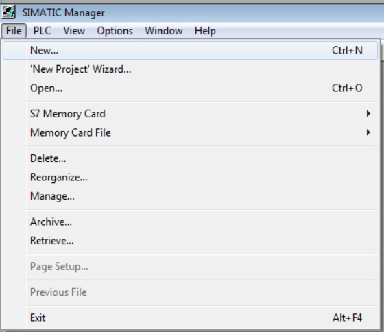{width="560" height="484"}

图62. 新建项目

\(2\)
在弹出的创建新项目窗口里输入项目名为"[TCP_Server]{lang="de"}"，然后点击"[OK]{lang="de"}"按钮，如图63所示。

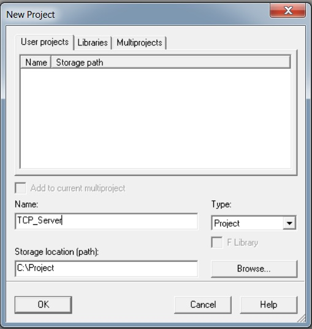{width="509" height="537"}

图63. 输入项目名称

\(3\) 在[TCP_Server]{lang="de"}下点击右键"[Insert New
Object]{lang="de"}"，选择"[SIMATIC 300
Station]{lang="de"}"，如图64所示。

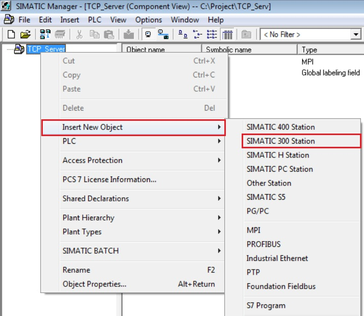{width="714" height="620"}

图64. 插入300站点

\(4\) 双击"[Hardware]{lang="de"}"打开硬件组态，如图65所示。

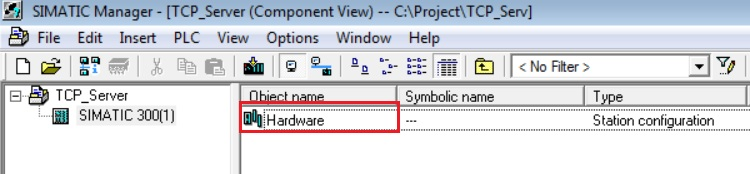{width="750" height="174"}

图65. 硬件组态

\(5\) 插入[ S7-300 ]{lang="de"}插槽，如图66所示。

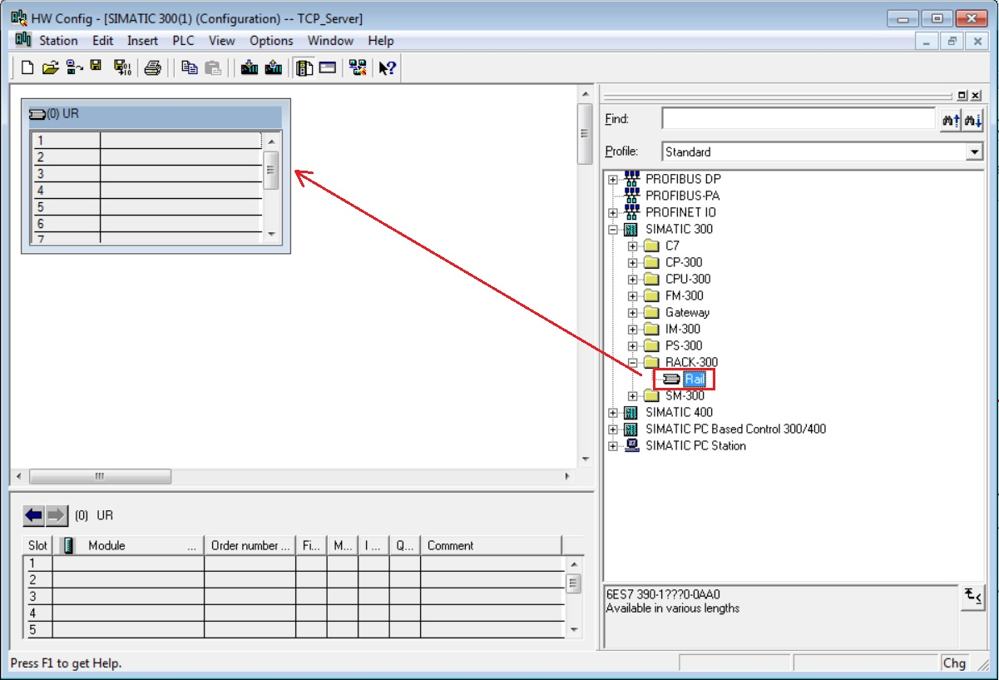{width="1201" height="817"}

图66. 插入[ S7-300 ]{lang="de"}插槽

\(6\) 插入[S7-300 CPU]{lang="de"}，与实际[PLC]{lang="de"}一致：[ 6ES7
315-2EH14-0AB0 V3.2]{lang="de"}，如图67所示。

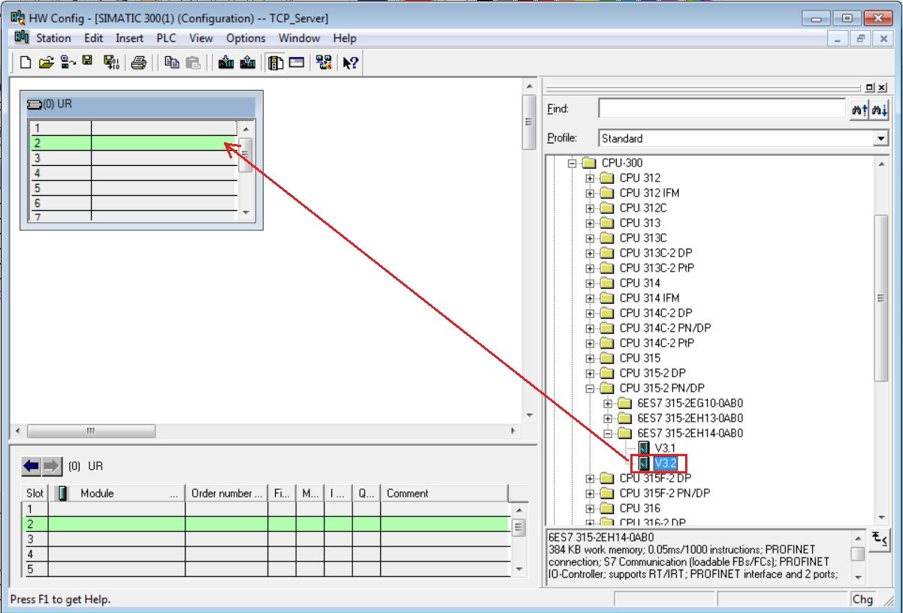{width="1202" height="817"}

图67. 插入[ S7-300 ]{lang="de"}CPU

\(7\) 在弹出的"[Properties-Ethernet interface
PN-IO]{lang="de"}"对话框的"[Parmeters]{lang="de"}"选项卡中为以太网接口添加，设置[IP]{lang="de"}地址[192.168.0.1]{lang="de"}和子网掩码[255.255.255.0
，如图68所示]{lang="de"}。

{width="1197" height="818"}

图68. 设置IP地址和子网掩码

(8)点击"[New\...]{lang="de"}"新建子网，如图69所示。

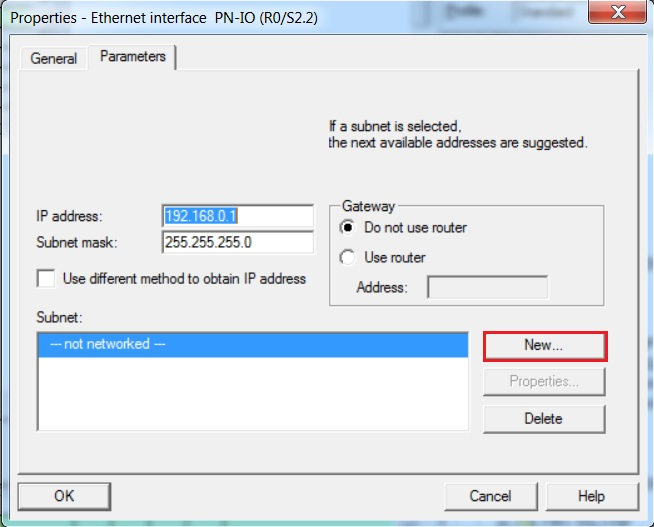{width="654" height="527"}

图69. 新建子网

\(9\) "[New subnet Industrial Ethernet]{lang="de"}"对话框下[
Name]{lang="de"}：[Ethernet(1)]{lang="de"}，如图70所示。

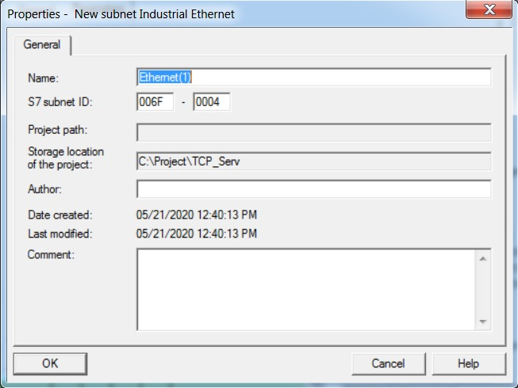{width="653" height="490"}

图70. 子网名称

\(10\) 新建[ Subnet ]{lang="de"}后，点击"[OK]{lang="de"}"，如图71所示。

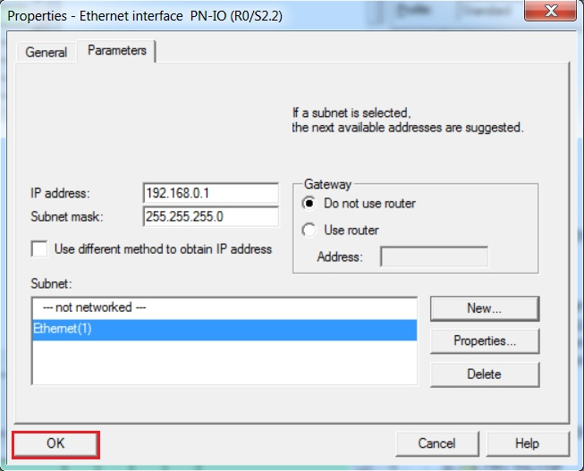{width="653" height="527"}

图71. 确认子网

(11)点击"[Save and
Compile]{lang="de"}"按钮。编译保存硬件组态信息，如图72所示。

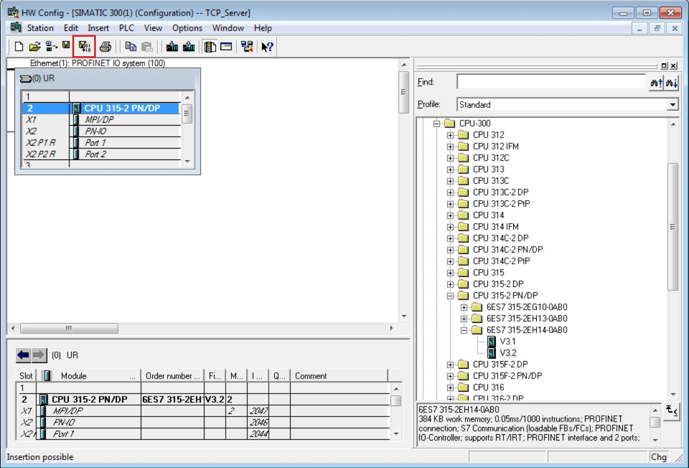{width="1200" height="816"}

图72. 保存并编译硬件组态

#### **2．TCP通信向导组态**

创建用于开放式[ TCP/IP ]{lang="de"}通信的连接数据的向导[
(]{lang="de"}开放式通信向导[)]{lang="de"}下载链接：[https://support.industry.siemens.com/cs/cn/en/view/98957840/zh]{lang="de"}

\(1\) 开始菜单中选择"[SIMATIC]{lang="de"}"---"[Open Communication
Wizard]{lang="de"}"，如图73所示。

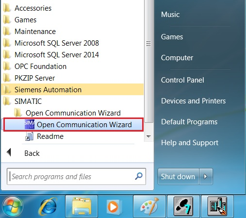{width="507" height="449"}

图73. 选择TCP通信向导

\(2\) 打开"[Open Communication Wizard]{lang="de"}"，如图74所示。

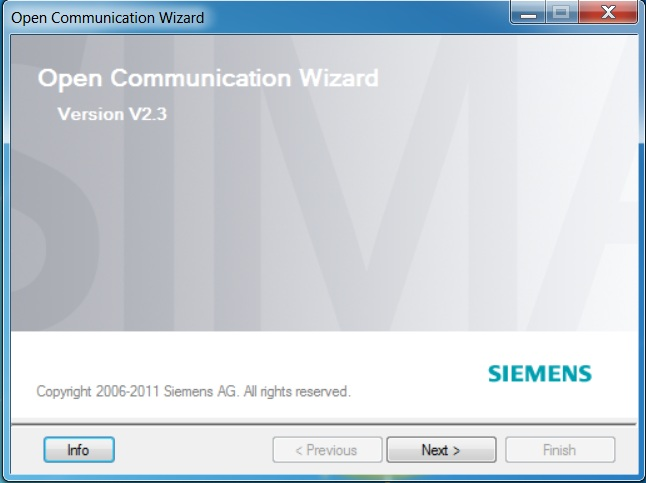{width="646" height="483"}

图74. 打开TCP通信向导

\(3\) 选择[ STEP 7 project]{lang="de"}，如图75所示。

{width="642" height="484"}

图75. 选择[ STEP 7 project]{lang="de"}

\(4\) 选择[ TCP_Server ]{lang="de"}项目，如图76所示。

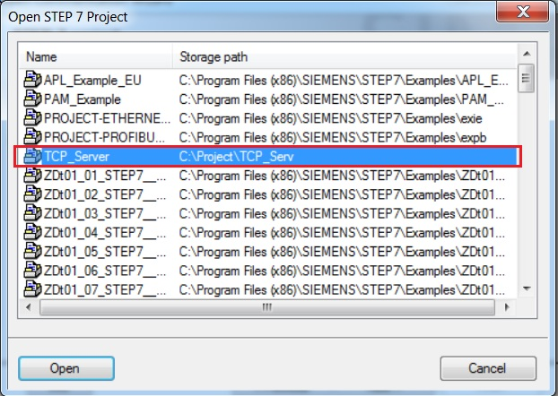{width="622" height="442"}

图76. 选择项目

\(5\) 选择[ Block folder，如图77所示]{lang="de"}。

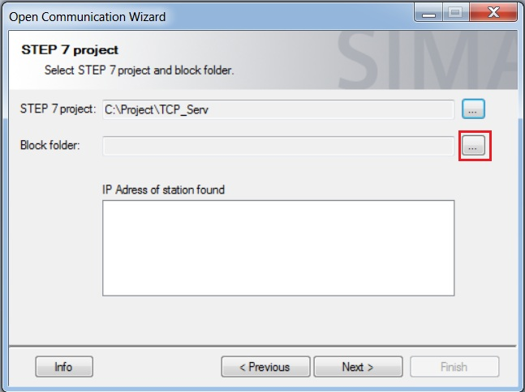{width="647" height="484"}

图77. 选择 Block folder

\(6\) 选择项目下的[Blocks]{lang="de"}，如图78所示。

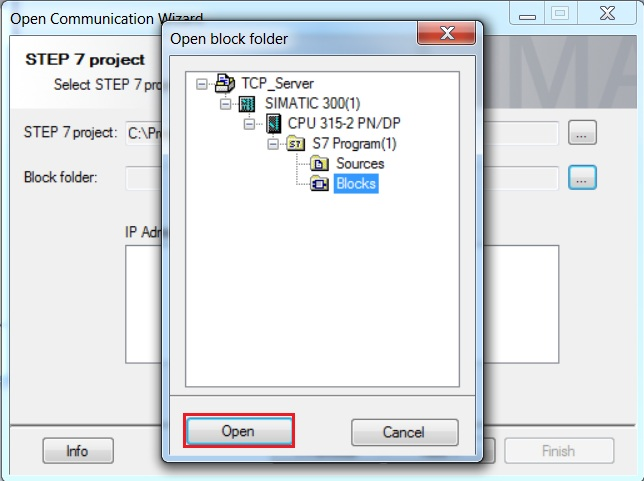{width="644" height="481"}

图78. 选择 Blocks

\(7\) 点击"[Next]{lang="de"}"，如图79所示。

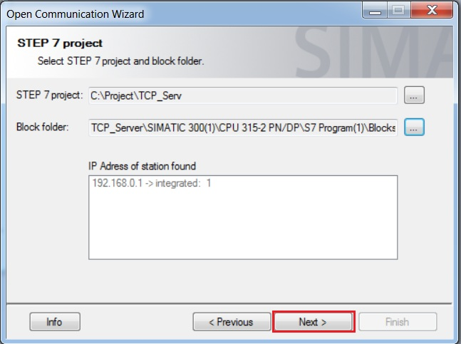{width="647" height="483"}

图79. 点击下一步

\(8\) 点击"[OK]{lang="de"}"，如图80所示。

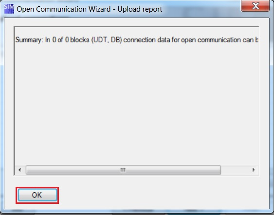{width="563" height="443"}

图80. 点击确认

\(9\) 点击"[Next]{lang="de"}"，如图81所示。

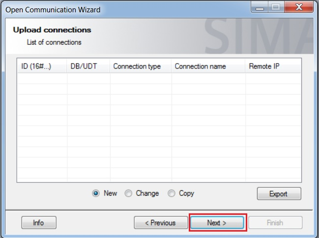{width="649" height="483"}

图81. 点击下一步

\(10\) 选择"[Connection type]{lang="de"}"---"[TCP native]{lang="de"}"[,
]{lang="de"}点击"[Next]{lang="de"}"，如图82所示。

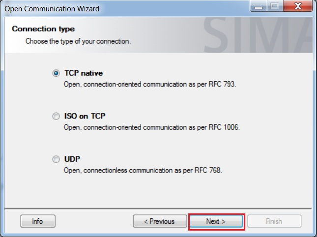{width="645" height="482"}

图82. 选择TCP通信

[(11) Connect name:]{lang="de"}"[300_Client]{lang="de"}"。因为[ S7 300
]{lang="de"}作客户端，因此选择"[Active]{lang="de"}"，如图83所示。

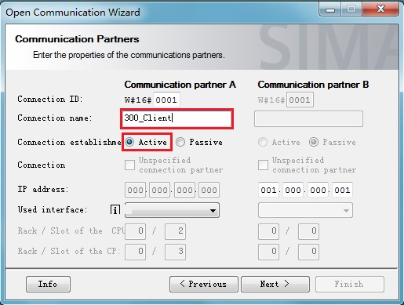{width="515" height="389"}

图83. 配置本地连接

\(12\) 选择[User interface]{lang="de"}：[CPU
314/315/317/ET200pro]{lang="de"}（[IM154-8
CPU]{lang="de"}），如图84所示。

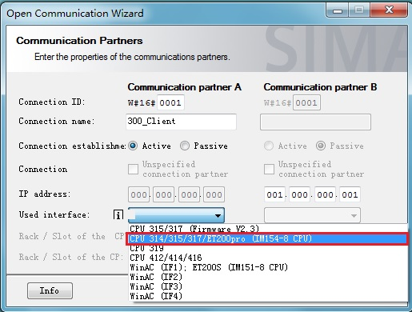{width="515" height="390"}

图84. 选择接口

[(13) Communication parter B
]{lang="de"}的[IP]{lang="de"}地址[192.168.0.2]{lang="de"}，点击"[Next]{lang="de"}"，如图85所示。

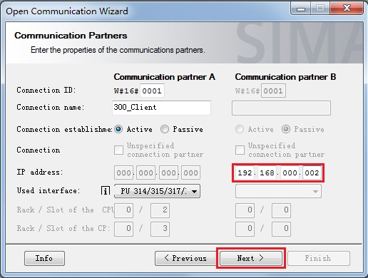{width="516" height="390"}

图85. 配置伙伴方连接

[(14) Communication parter B
]{lang="de"}端口号：[2000]{lang="de"}，点击"[Next]{lang="de"}"，如图86所示。

**注意：**端口号是因为服务器（S7-1200）设置为2000，所以这里设置为2000。

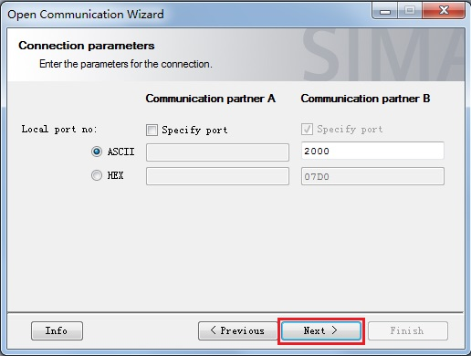{width="516" height="390"}

图86. 配置端口

[(15) Communication parter
A]{lang="de"}，数据块[Name]{lang="de"}：[DB1]{lang="de"}0，点击"[Next]{lang="de"}"，如图87所示。

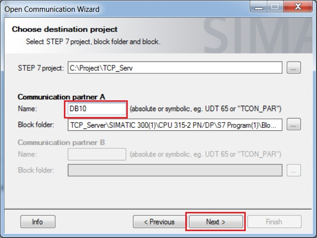{width="645" height="484"}

图87. 配置数据块

\(16\) 点击"[Next]{lang="de"}"，如图88所示。

{width="515" height="389"}

图88. 点击下一步

\(17\) 点击"[Finish]{lang="de"}"，如图89所示。

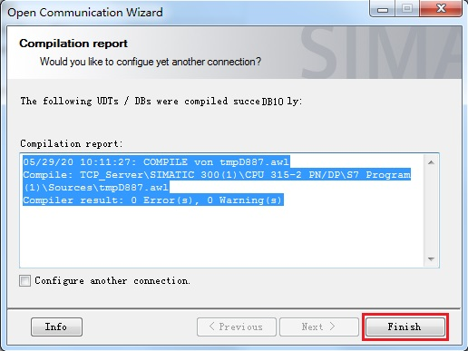{width="516" height="387"}

图89. 点击完成

\(18\) 点击"是"，如图90所示。

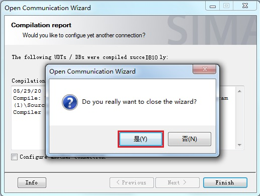{width="517" height="389"}

图90. 点击确认

#### **3．TCP通信编程**

\(1\) 查看[ SIMATIC Manager]{lang="de"}---[Blocks ]{lang="de"}下生成了[
DB1]{lang="de"}0，如图91所示。

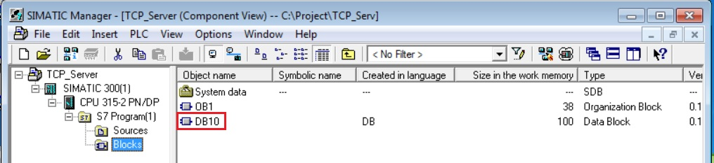{width="1016" height="233"}

图91. 查看Blocks

\(2\) 双击[ OB1]{lang="de"}进入，如图92所示。

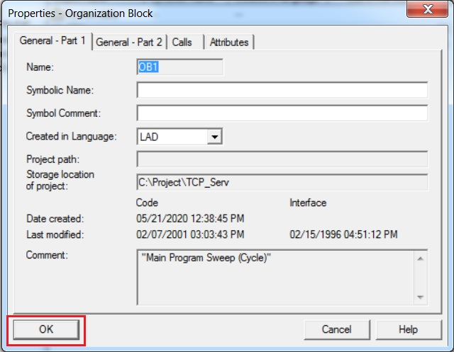{width="640" height="497"}

图92. 点击OB1

\(3\) 需要的功能块，如图93所示。

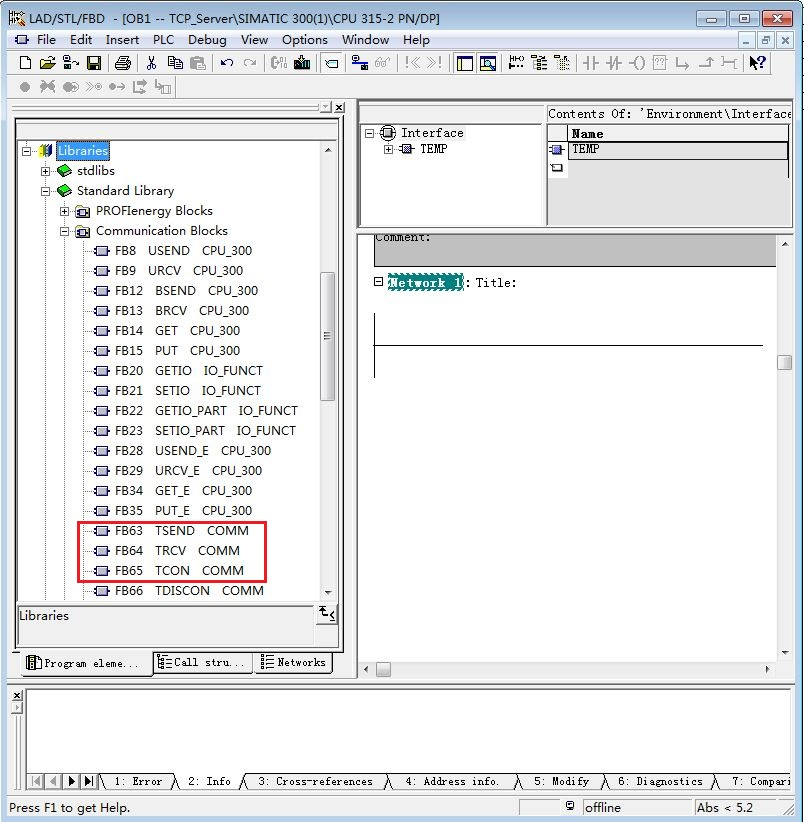{width="804" height="822"}

图93. 查找功能块

\(4\) 插入[ FB65 TCON，如图94所示]{lang="de"}

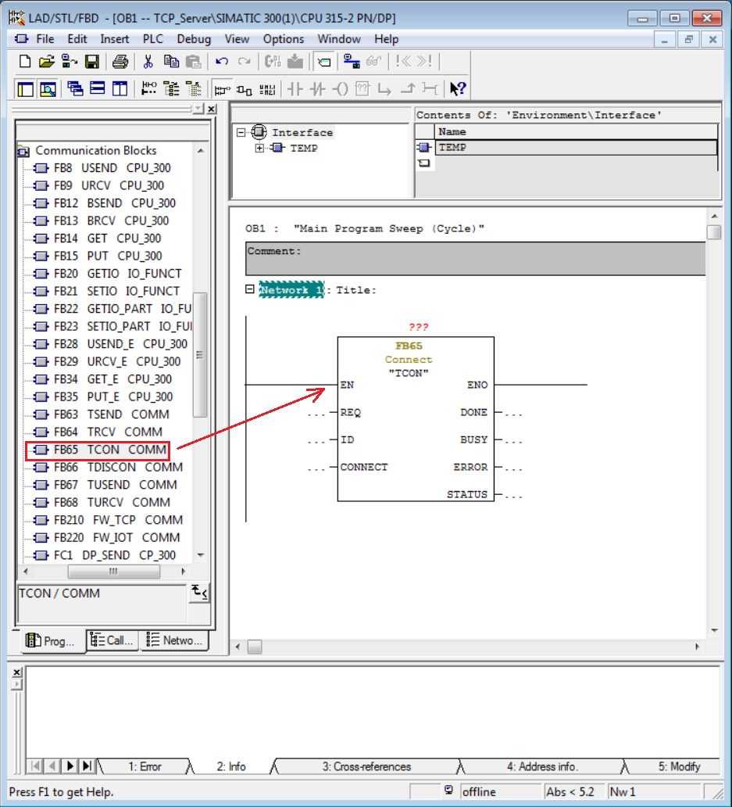{width="937" height="1032"}

图94. 插入FB65

\(5\) 添加背景[DB，如图95所示]{lang="de"}。

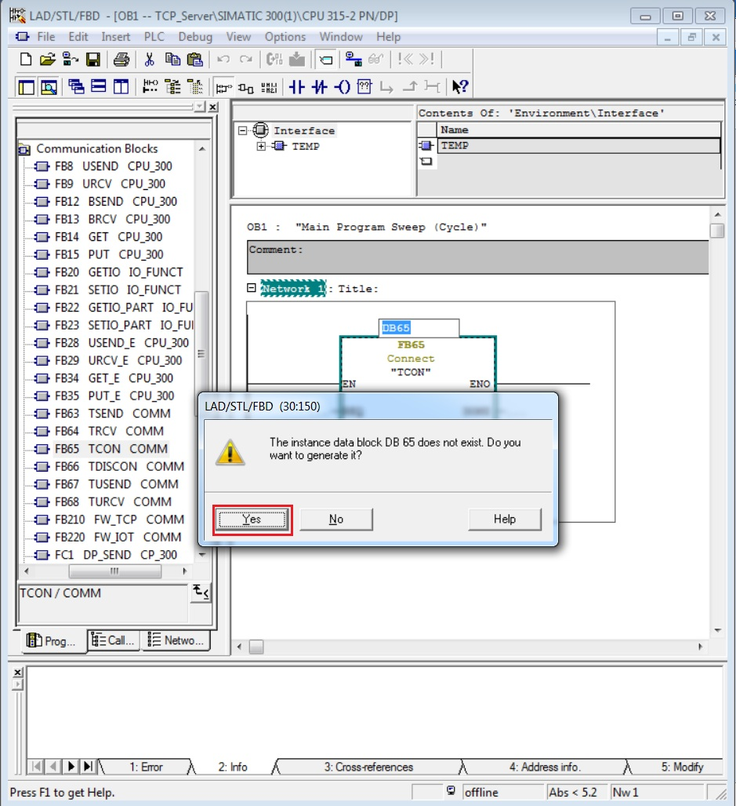{width="939" height="1027"}

图95. 添加背景DB

\(6\) 打开[DB1]{lang="de"}0，复制"[OUCW_1]{lang="de"}"名称，如图96所示。

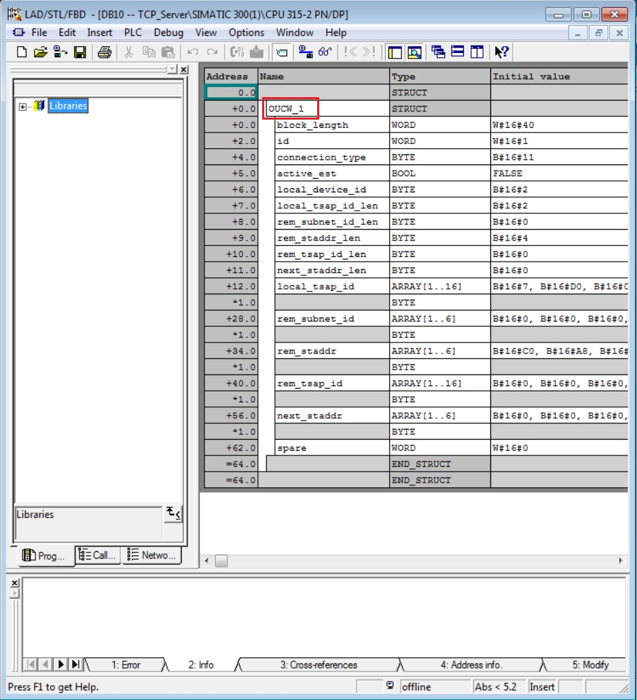{width="938" height="1030"}

图96. 复制变量名称

\(7\)
"[CONNECT]{lang="de"}"引脚输入[DB10，]{lang="de"}粘贴"[OUCW_1]{lang="de"}"，如图97所示。

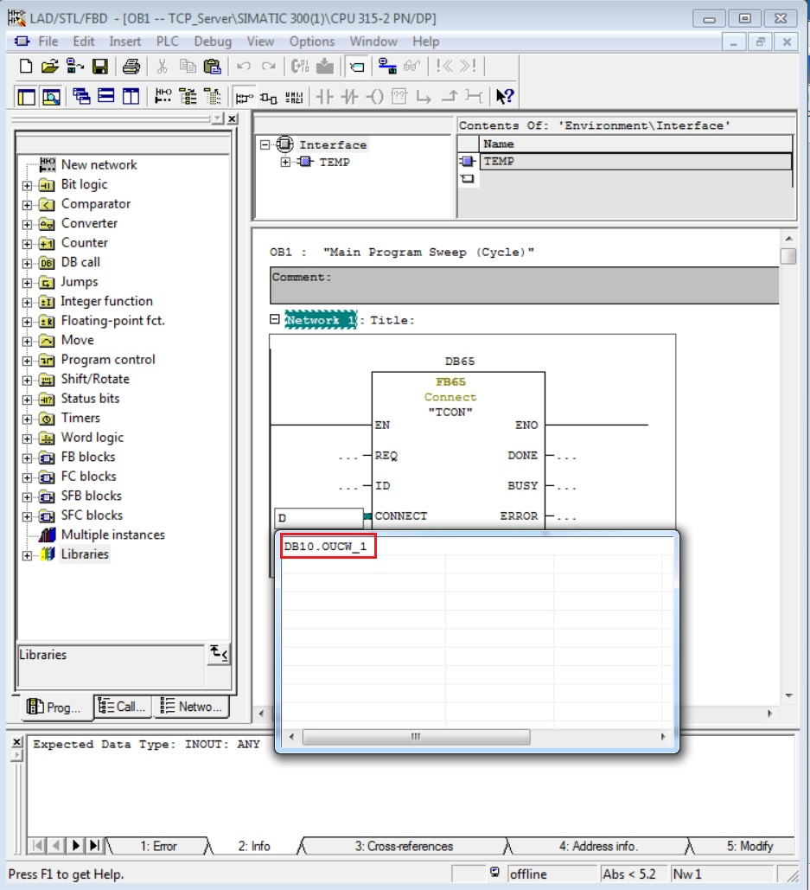{width="937" height="1029"}

图97. 连接参数

\(8\) 正确填写[ FB65 ]{lang="de"}引脚，如图98所示。

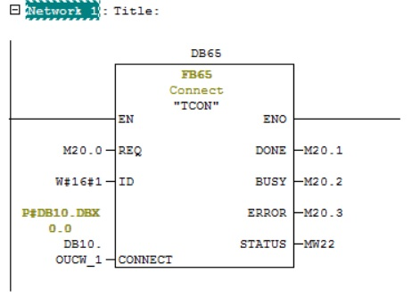{width="471" height="343"}

图98. 调用FB65

\(9\) 添加[ Bata Block]{lang="de"}，如图99所示。

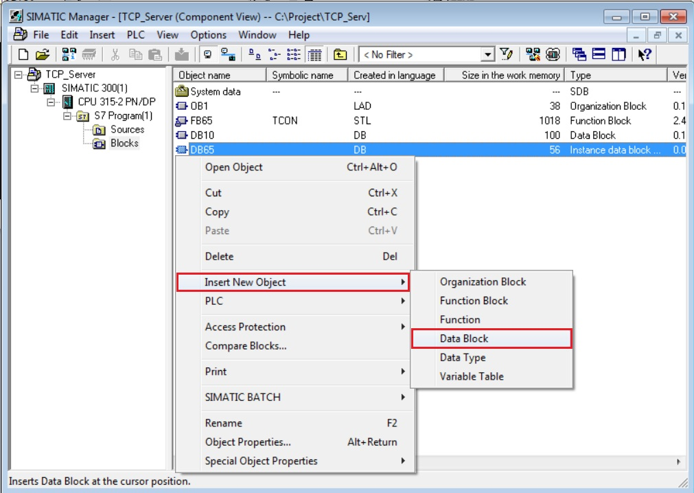{width="1011" height="718"}

图99. 添加数据块

\(10\) 添加共享[ DB1]{lang="de"}，作为发送数据区，如图100所示。

{width="641" height="496"}

图100. 定义发送数据块

\(11\) 添加变量，类型为数组，如图101所示。

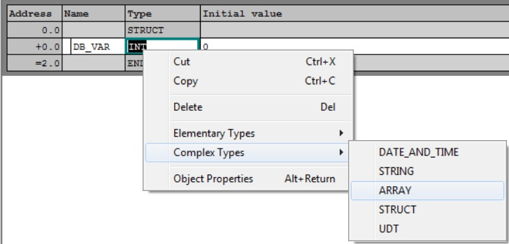{width="728" height="350"}

图101. 修改数据类型

\(12\) 添加[10]{lang="de"}个[ BYTE ]{lang="de"}的数组变量，如图102所示。

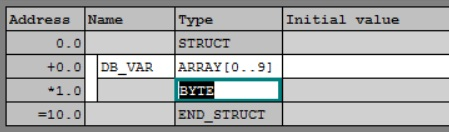{width="449" height="132"}

图102. 定义变量

(13)在S7-300项目的Hardware中，右键点击CPU，选择Object
Properties-\>Cycle/Clock Memory，勾选"Clock memory"，输入Memory
byte，如图103所示。

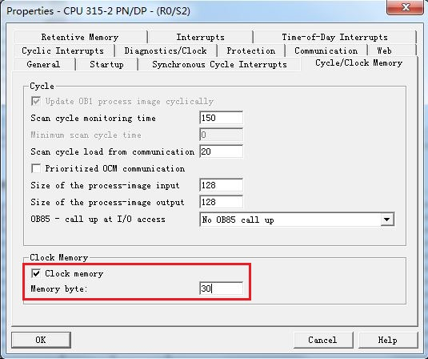{width="535" height="448"}

图103 使用时钟存储器

\(14\) 添加[ FB63]{lang="de"}，背景数据块为[DB63]{lang="de"}，正确填写[
FB63
]{lang="de"}引脚，其中REQ使用时钟存储器M30.3，以2Hz的速率在0和1之间切换的一个位，如图104所示。

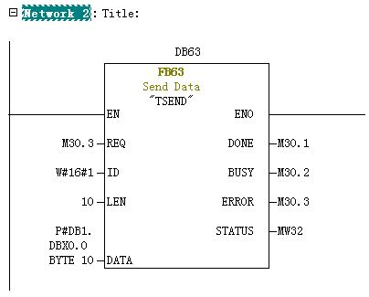{width="404" height="325"}

图104. 调用FB63

\(15\) 添加共享[ DB2]{lang="de"}，作为接收数据区，如图105所示。

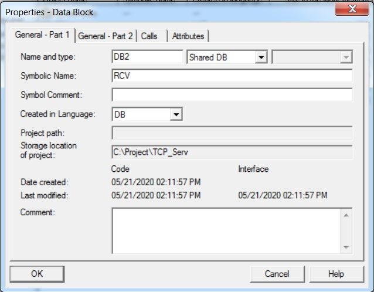{width="638" height="498"}

图105. 定义接收数据块

\(16\) 添加变量，类型为数组。添加[10]{lang="de"}个[ BYTE
]{lang="de"}的数组变量，如图106所示。

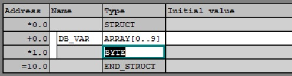{width="496" height="130"}

图106. 定义变量

\(17\) 添加[ FB64]{lang="de"}，背景数据块为[DB64]{lang="de"}，正确填写[
FB64 ]{lang="de"}引脚，如图107所示。

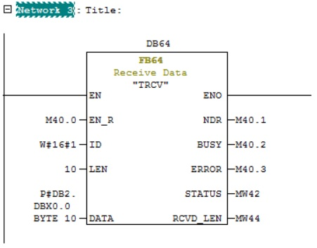{width="451" height="353"}

图107. 调用FB64

### 3.4 下载硬件组态及程序并监控通信结果

#### **1. TCP通信结果**

\(1\) 写入[16]{lang="de"}进制数据"[11 13 15 17 19 12 14 16 18
20]{lang="de"}"，如图108所示。

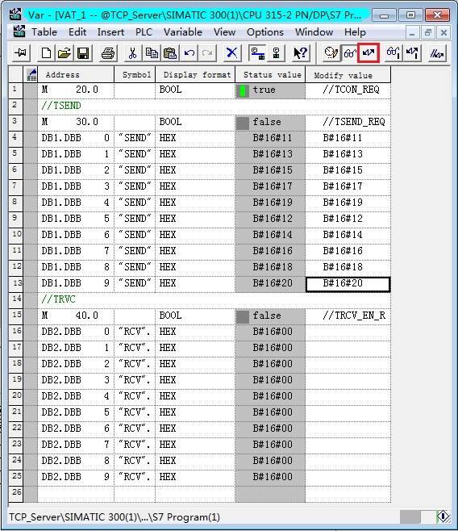{width="568" height="658"}

图108.[CPU315-2PN/DP 写入数据]{lang="de"}

\(2\)
触发"[TSEND_REQ]{lang="de"}"，发送10个字节数据给S7-1200；触发"[TRCV_EN_R]{lang="de"}"，接收到[S7-1200发送过来的
10 ]{lang="de"}个字节数据，如图109所示。

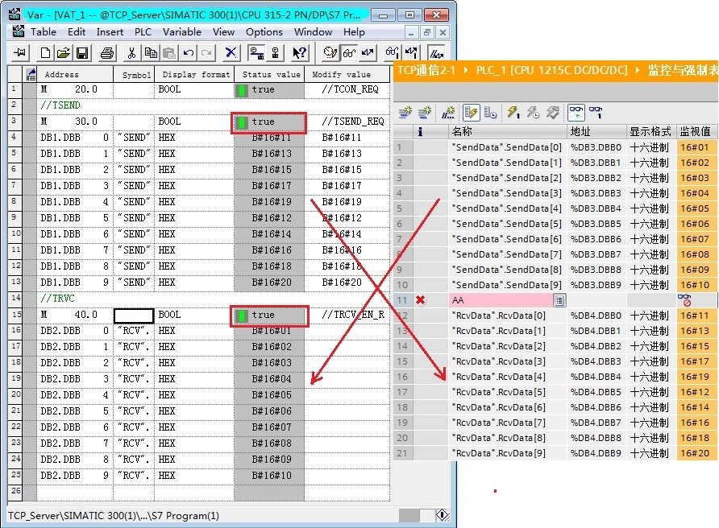{width="892" height="656"}

图109.通信结果
