#### S7-1200 CPU 与 S7-300 CP/S7-400 CP TCP 通信（S7-1200 作为客户端）

S7-1200 与 S7-300 CP 之间的以太网通信可以通过 TCP
协议来实现，使用的通信指令是在 S7-1200 CPU 侧调用 T-Block
(TSEND_C，TRCV_C，TCON，TDISCON，TSEND，TRCV) 指令，在 S7-300 CPU 侧调用
AG_SEND，AG_RECV 指令来实现。通信方式为双边通信，因此 SEND 和 RCV
必须成对出现。

此外本文也可以作为 S7-1200 与 S7-400 CP 之间的 TCP 通信文档。

#### 硬件和软件需求及所完成的通信任务

所需条件：

① S7-1215 DC/DC/DC V4.4 / CPU 314C-2 PN/DP，V3.3 + CP343-1，V3.0\
② TIA Step7 V17 Professional / Step7 V5.6 SP2

所完成的通信任务：

① S7-1200 CPU 将通讯数据区 DB5 块中的 10 个字节的数据发送到 S7-300 CPU
的接收数据区 DB2 块中。\
② S7-300 CPU 将通讯数据区 DB1 块中的 10 个字节的数据发送到 S7-1200 CPU
的接收数据区 DB6 块中。

S7-1200 与 CP343-1 之间 TCP 通讯，可以分 2 种情况来操作，具体如下：

1.  [第一种情况：S7-1200 与 CP343-1 都在 TIA STEP7 V17
    中操作](03-S7-1200Client_S7-300CPServer.html#a)
2.  [第二种情况：S7-1200 在 TIA STEP7 V17 项目中，CP343-1 在 STEP7 V5.6
    项目中操作](03-S7-1200Client_S7-300CPServer.html#b)

#### []{#a}一. 第一种情况（S7-1200 与 CP 343-1 都在 TIA Portal 中操作）

在 STEP 7 V17 中，新建一个 S7-1200 站点和一个 S7-300 站点，然后做 TCP
通讯。

#### 1.1 S7-1200 侧和 S7-300CP 侧硬件组态配置

**1. 使用 STEP7 V17 软件新建一个项目并完成硬件配置**

在 STEP7 V17 的 "Portal 视图" 中选择 "创建新项目" 创建一个新项目。

**2.添加 1200CPU 硬件并为命名 PLC**

然后进入 "项目视图"，在"项目树" 下双击
"添加新设备"，在对话框中选择所使用的 S7-1200 CPU 添加到机架上，命名为
PLC_1，如图 1 所示。

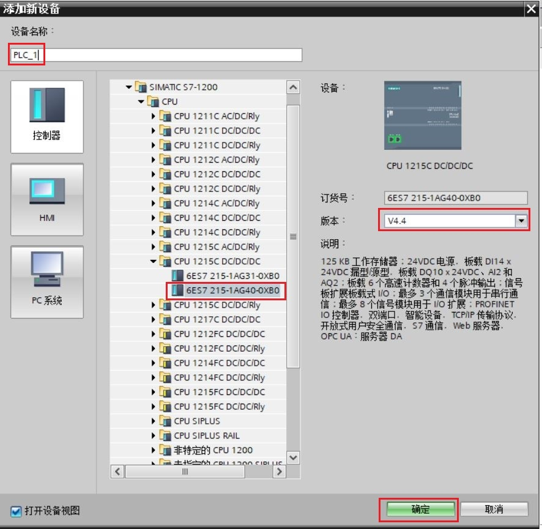{width="886" height="865"}

图 1. 添加1200 CPU设备

为了编程方便，使用 CPU 属性中定义的时钟位，定义方法如下：

在 "项目树" \> "PLC_1" \> "设备组态" 中，选中 CPU
，然后在下面的属性窗口中，"属性" \> "系统和时钟存储器"
下，将时钟字节定义在 MB0，如图 2 所示。

时钟位使用 M0.5，以 1Hz 的速率自动激活发送任务。

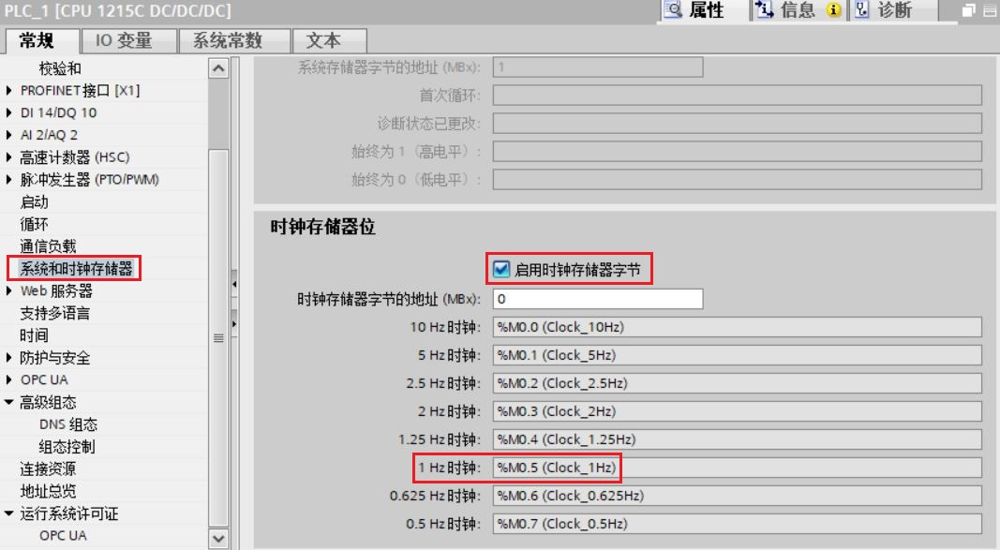{width="1067" height="587"}

图 2. 设置系统和时钟存储器

**3. 为 PROFINET 通信口分配以太网地址**

在 PROFINET 接口的属性， "以太网地址" 下分配 IP 地址为 192.168.0.15
，子网掩码为 255.255.255.0，如图 3 所示。

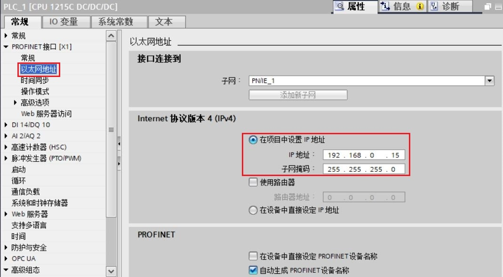{width="1069" height="590"}

图 3. 分配 1200CPU IP 地址

**4．添加 300CPU 并命名 PLC**

然后进入 "项目视图"，在"项目树" 下双击
"添加新设备"，在对话框中选择所使用的 S7-300 CPU 添加到机架上，命名为
PLC_2，如图 4 所示。

{width="883" height="859"}

图 4. 添加 300 CPU 设备

为了编程方便，使用 CPU 属性中定义的时钟位，定义方法如下：

在 "项目树" \> "PLC_2"\> "设备组态" 中，选中 CPU
，然后在下面的属性窗口中，"属性" \> "时钟存储器" 下时钟字节定义在
MB0，如图 5 所示。

时钟位使用 M0.5，以 1Hz 的速率自动激活发送任务。

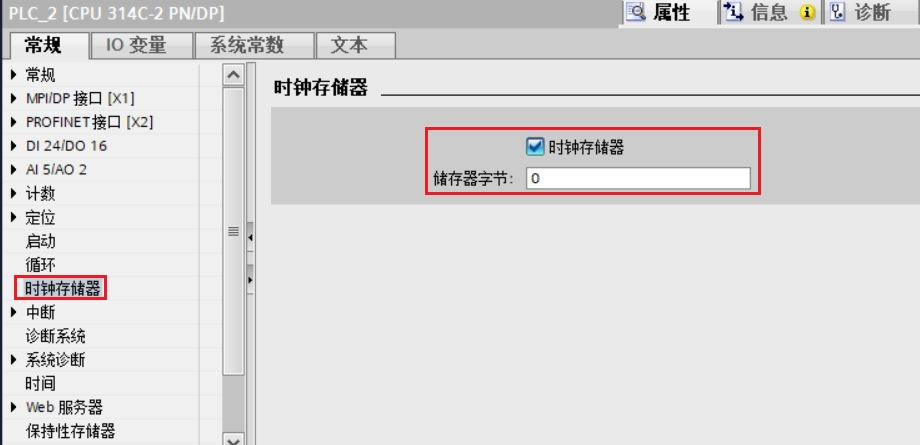{width="920" height="445"}

图 5. 启动时钟存储器

**5. 组态 CP343-1 并配以太网地址**

在 "设备视图"中添加 CP343-1 ，之后点击 CP 上代表 PROFINET
通信口的绿色小方块，在下方会出现 PROFINET 接口的属性，在 "以太网地址"
下分配 IP 地址为 192.168.0.11，子网掩码为255.255.255.0，如图 6 所示。

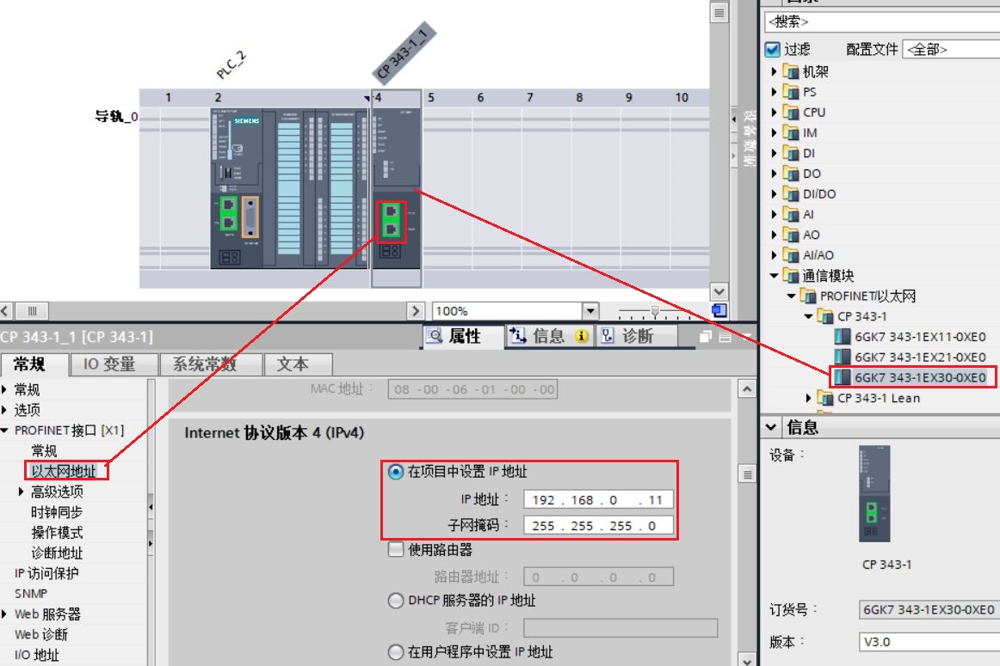{width="1162" height="775"}

图 6. 分配 300CP IP 地址

**6. 创建 CPU 的逻辑网络连接（仅当 1200 和 300CP 在同一 TIA
项目时操作）**

在项目树 "项目树"\>"设备和网络" \>"网络视图"
视图下，创建两个设备的连接。用鼠标点中 S7-1200 上的 PROFINET
通信口的绿色小方框，然后拖拽出一条线，到另外一个 CP343-1 上的 PROFINET
通信口上，松开鼠标， PN/IE_1 的子网连接就建立起来了，如图 7 所示。

{width="568" height="260"}

图 7. 建立伙伴间的网络子网连接

**注：当 1200PLC 和 300CP 在不同 TIA 项目或一个 TIA 一个 Step7
组态时，无需操作此步骤。独立设置各自 PLC 的子网连接即可。**

#### 1.2 在 S7-1200 OB1中调用并配置"TCON"、"TSEND"、"TRCV" 通信指令

#### **1．调用"TCON" 通信指令并配置连接参数**

① 在 S7-1200 CPU 中调用发送通信指令，进入 "项目树" \> " PLC_1" \>
"程序块" \> "OB1" 主程序中，从右侧窗口 "指令" \> "通信" \>
"开放式用户通信"\> "其他"下调用 "TCON" 指令，创建连接，如图 8 所示。

{width="1013" height="444"}

图 8. 调用 "TCON" 通信指令

② 定义 S7-1200 的 "TCON" 连接参数

S7-1200 的 "TCON"指令的连接参数需要在指令下方的属性窗口"属性"\>
"组态"\>"连接参数"中设置，如图 9 所示。

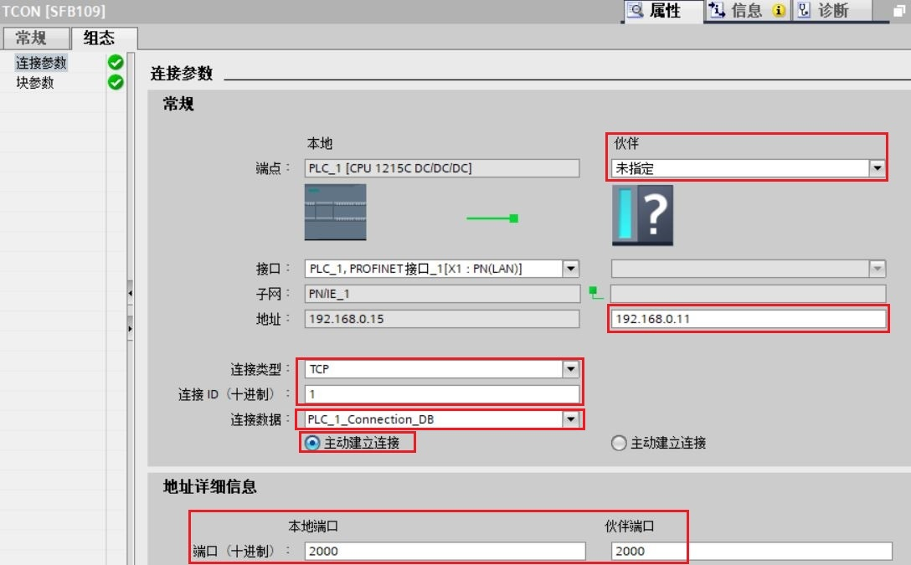{width="1088" height="675"}

图 9. 定义 TCON 连接参数

**连接参数说明：**

+-----------------------------------+-----------------------------------+
| 端点                              | ::: {align="left"}                |
|                                   | ：可以                            |
|                                   | 通过点击选择按钮选择未指定伙伴；  |
|                                   | :::                               |
+-----------------------------------+-----------------------------------+
| 地址                              | ::: {align="left"}                |
|                                   | ：设置伙伴的 IP 地址，如伙伴      |
|                                   | CP343-1 的 IP 192.168.0.11；      |
|                                   | :::                               |
+-----------------------------------+-----------------------------------+
| 连接类型                          | ::: {align="left"}                |
|                                   | ：选择通信协议为 TCP；            |
|                                   | :::                               |
+-----------------------------------+-----------------------------------+
| 连接 ID　                         | ::: {align="left"}                |
|                                   | ：连接的地址 ID 号，这个 ID       |
|                                   | 号在后面的编程里会用到；          |
|                                   | :::                               |
+-----------------------------------+-----------------------------------+
| 连接数据                          | ::: {align="left"}                |
|                                   | ：点击新建自动生成该数据块，如    |
|                                   | PLC_1_Connection_DB；             |
|                                   | :::                               |
+-----------------------------------+-----------------------------------+
| 主动建立连接                      | ::: {align="left"}                |
|                                   | ：选择本地 S7-1200                |
|                                   | 作为主动连接（做客                |
|                                   | 户端的一方需要勾选主动建立连接）  |
|                                   | :::                               |
+-----------------------------------+-----------------------------------+
| 地址详细信息                      | ::: {align="left"}                |
|                                   | ：定义本地通信的端口              |
|                                   | 号为：2000，伙伴端口为：2000；　  |
|                                   | :::                               |
+-----------------------------------+-----------------------------------+

#### **2．调用 "TSEND" 通信指令并配置基本参数**

①　在 OB1 内调用 "TSEND" ，发送 10 个字节数据到 S7-300 中

进入 "项目树" \> " PLC_1" \> "程序块" \> "OB1" 主程序中，从右侧窗口
"指令" \> "通信" \> "开放式用户通信"\> "其他"下调用 "TSEND"
指令，并配置接口参数，如图 10 所示。

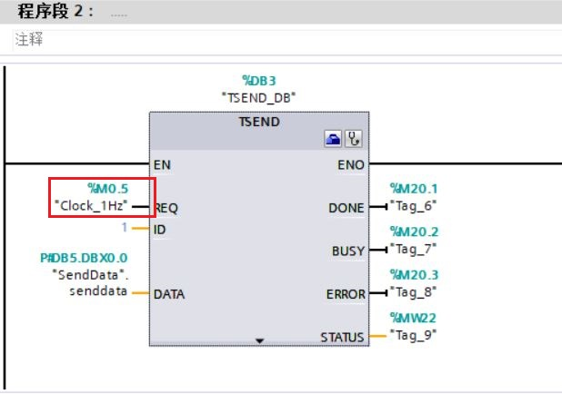{width="618" height="434"}

图 10. 调用 TSEND 通信指令并配置接口参数

**参数说明：** **输入接口参数：**

+-----------------------------------+-----------------------------------+
| ::: {align="left"}                | ::: {align="left"}                |
| REQ　　                           | ：在上升沿启动发送作业            |
| :::                               | :::                               |
+-----------------------------------+-----------------------------------+
| ::: {align="left"}                | ::: {align="left"}                |
| ID　                              | ： 引用由 "TCON" 建立的连接       |
| :::                               | :::                               |
+-----------------------------------+-----------------------------------+
| ::: {align="left"}                | ::: {align="left"}                |
| LEN                               | ：要通过作业发送的最大字节数      |
| :::                               | :::                               |
+-----------------------------------+-----------------------------------+
| ::: {align="left"}                | ::: {align="left"}                |
| DATA　                            | ：发送数据区的数据，使            |
| :::                               | 用指针寻址时，DB块要选用绝对寻址  |
|                                   | :::                               |
+-----------------------------------+-----------------------------------+

**输出接口参数：**

+-----------------------------------+-----------------------------------+
| ::: {align="left"}                | ::: {align="left"}                |
| DONE                              | ：                                |
| :::                               | 任务执行完成并且没有错误，该位置  |
|                                   | 1                                 |
|                                   | :::                               |
+-----------------------------------+-----------------------------------+
| ::: {align="left"}                | ::: {align="left"}                |
| BUSY　                            | ：该位为                          |
| :::                               | 1，代表任务未完成，不能激活新任务 |
|                                   | :::                               |
+-----------------------------------+-----------------------------------+
| ::: {align="left"}                | ::: {align="left"}                |
| ERROR　　　                       | ：通信过程中有错误发生，该位置 1  |
| :::                               | :::                               |
+-----------------------------------+-----------------------------------+
| ::: {align="left"}                | ::: {align="left"}                |
| STATUS                            | ：有错误发生时，会显示错位信息号  |
| :::                               | :::                               |
+-----------------------------------+-----------------------------------+

②　创建并定义S7-1200的发送数据区 DB 块。

通过"项目树"\>"PLC_1"\>"程序块"\>"添加新块"，选择"数据块" 创建 DB
块，在DB块的"属性-\>常规-\>属性"中，取消勾选"优化的块访问"，点击"确定"键，定义发送数据区为
10个字节的数组，如图 11 所示。

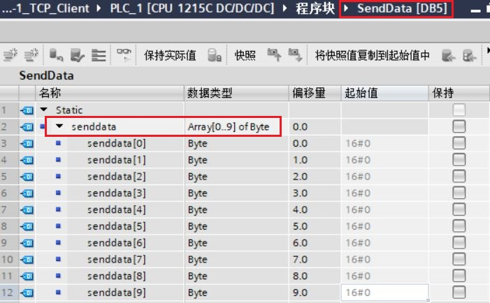{width="701" height="434"}

图 11. 创建发送数据区 DB 块

**注意：对于双边编程通信的 CPU ，如果通信数据区使用 DB 块，既可以将 DB
块定义成符号寻址，也可以定义成绝对寻址。使用指针寻址方式，必须创建绝对寻址的
DB 块。**

#### **3．调用"TRCV"通信指令并配置基本参数**

为了实现 S7-1200 接收来自 S7-300 的数据，则在 S7-1200 中调用接收指令TRCV
并配置基本参数。

①　在 OB1 内调用 "TRCV"，接收来自 S7-300 的 10 个字节数据

进入 "项目树" \> " PLC_1" \> "程序块" \> "OB1" 主程序中，从右侧窗口
"指令" \> "通信" \> "开放式用户通信"\> "其他"下调用 "TRCV"
指令，并配置接口参数，如图 12 所示。

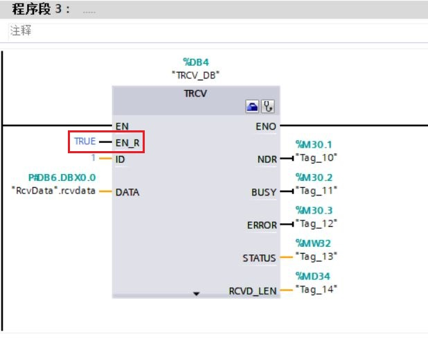{width="618" height="489"}

图 12. 调用 TRCV 指令并配置接口参数

**参数说明：**

**输入接口参数：**

+-----------------------------------+-----------------------------------+
| ::: {align="left"}                | ::: {align="left"}                |
| EN_R                              | ：启用接收功能                    |
| :::                               | :::                               |
+-----------------------------------+-----------------------------------+
| ::: {align="left"}                | ::: {align="left"}                |
| ID                                | ： 指向使用 "TCON"                |
| :::                               | 建立的连接的引用                  |
|                                   | :::                               |
+-----------------------------------+-----------------------------------+
| ::: {align="left"}                | ::: {align="left"}                |
| LEN                               | ：接收数据长度                    |
| :::                               | :::                               |
+-----------------------------------+-----------------------------------+
| ::: {align="left"}                | ::: {align="left"}                |
| ADHOC                             | ： TCP 协议选项是否使用 Ad-hoc    |
| :::                               | 模式                              |
|                                   | :::                               |
+-----------------------------------+-----------------------------------+
| ::: {align="left"}                | ::: {align="left"}                |
| DATA                              | ： 接收数据区的地址               |
| :::                               | :::                               |
+-----------------------------------+-----------------------------------+

**输出接口参数：**

+-----------------------------------+-----------------------------------+
| ::: {align="left"}                | ::: {align="left"}                |
| NDR                               | ：该位为 1，接收任务成功完成      |
| :::                               | :::                               |
+-----------------------------------+-----------------------------------+
| ::: {align="left"}                | ::: {align="left"}                |
| BUSY                              | ：该位为                          |
| :::                               | 1，代表任务未完成，不能激活新任务 |
|                                   | :::                               |
+-----------------------------------+-----------------------------------+
| ::: {align="left"}                | ::: {align="left"}                |
| ERROR                             | ：通信过程中有错误发生，该位置 1  |
| :::                               | :::                               |
+-----------------------------------+-----------------------------------+
| ::: {align="left"}                | ::: {align="left"}                |
| STATUS                            | ：有错误发生时，会显示错误信息号  |
| :::                               | :::                               |
+-----------------------------------+-----------------------------------+
| ::: {align="left"}                | ::: {align="left"}                |
| RCVD_LEN　　                      | ：实际接收数据的字节数            |
| :::                               | :::                               |
+-----------------------------------+-----------------------------------+

**注意： ADHOC 设置为 TRUE 可以接收变长数据。**

②　创建并定义 S7-1200 的接收数据区 DB 块。

通过"项目树"\>"PLC_1"\>"程序块"\>"添加新块"，选择"数据块" 创建 DB 块，在
DB
块的"属性-\>常规-\>属性"中，取消勾选"优化的块访问"，点击"确定"键，定义接收数据区为
10个字节的数组，如图 13 所示。

{width="725" height="435"}

图 13. 创建接收数据区 DB 块

**注意：对于双边编程通信的 CPU ，如果通信数据区使用 DB 块，既可以将 DB
块定义成符号寻址，也可以定义成绝对寻址。使用指针寻址方式，必须创建绝对寻址的
DB 块。**

1200CPU 侧配置和编程完成，编译并存盘。

#### 1.3 在 S7-300CP 中配置 TCP 连接参数并调用"AG_SEND"、"AG_RECV" 通信指令

#### **1．在 S7-300CP 中配置 TCP 连接参数**

①点击设备和网络，在网络视图内在 300CP 中新建 TCP 连接，如图 14 所示。

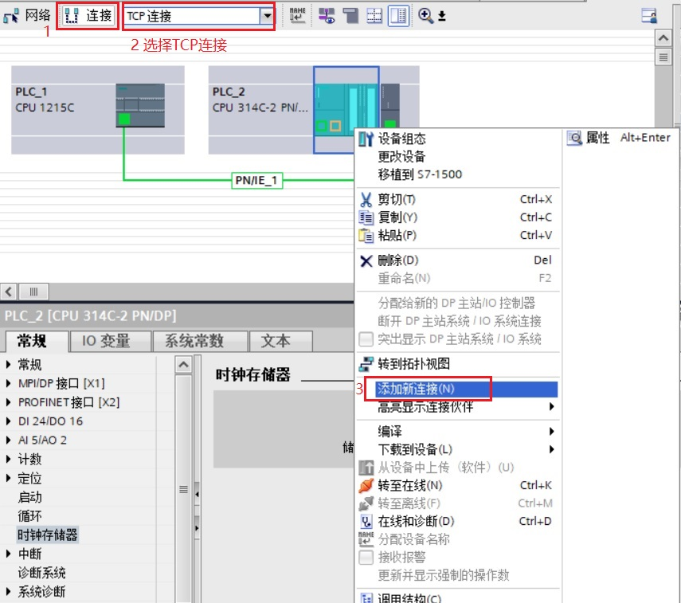{width="855" height="757"}

图 14. 300CP 中新建 TCP 连接

②选择未指定的伙伴，确认连接 ID 号，不勾选主动建立连接（CP343-1
做服务器），然后添加，如图 15 所示。

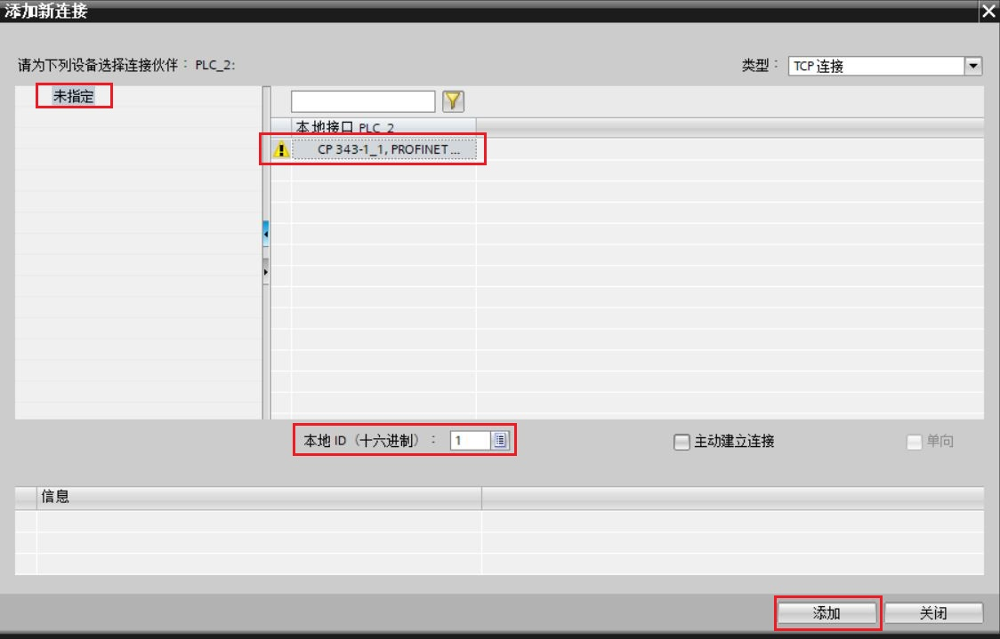{width="1124" height="719"}

图 15. 添加未指定 TCP 连接

③添加完成后，在网络视图-连接内可以查看新建的连接。点击新建的 TCP
连接可进一步设置 TCP 连接参数， 如图 16 所示。

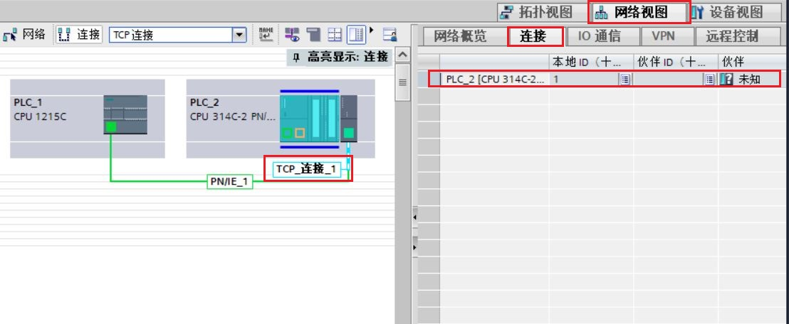{width="1108" height="456"}

图 16. 查看新建的 TCP 连接

④连接的常规-属性内，检查新建连接的本地 ID
和不激活主动建立连接（做服务器的一方无需主动建立连接），并设置伙伴 IP
及端口，如图 17、18、19 所示。

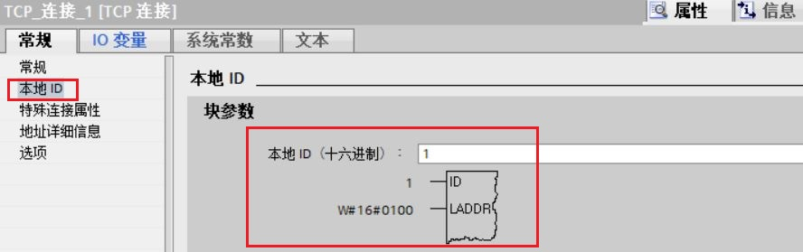{width="888" height="279"}

图 17.连接的本地 ID 和伙伴 IP 及端口号

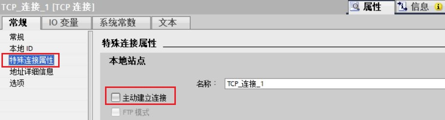{width="911" height="247"}

图 18.不激活主动建立连接

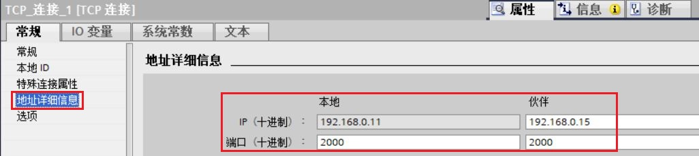{width="1026" height="230"}

图 19.设置伙伴 IP 及端口

#### **2．在 S7-300 中调用"AG_SEND"、"AG_RECV" 通信指令**

在 OB1 中，从"指令"\>"通信 "\>"通信处理器 "\>"SIMATIC NET
CP"下，调用"AG_SEND" 、"AG_RECV "通信指令，并创建接收和发送数据块 ，发送
DB 10 字节数组，接收 DB 10 字节数组。如图 20、21、22 所示。

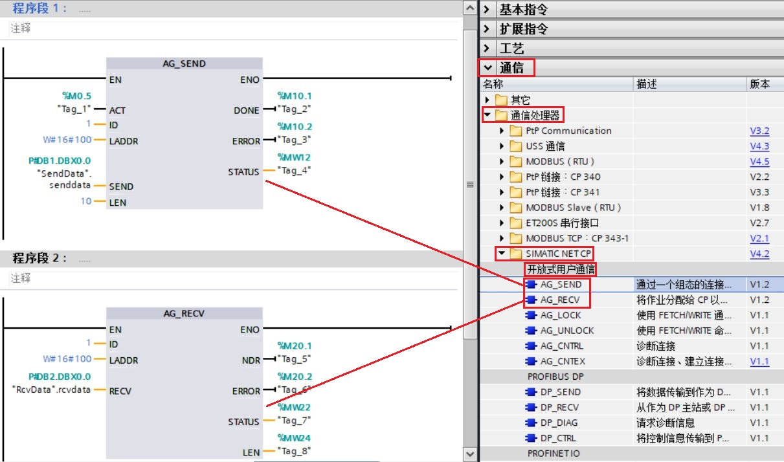{width="1211" height="714"}

图 20. 调用AG_SEND和AG_RECV指令

**指令管脚参数说明：**

  ---------------- ------------------------ ---------------------------------------------
  CALL "AG_SEND"                            //调用 AG_SEND
  ACT 　           ：=%M0.5                 //使用 1Hz 的时钟脉冲，上升沿激活发送任务
  ID               ：=1                     // 连接号，要与配置中一致见图 17，块参数
  LADDR            ：=W#16#100              // CP 的地址，要与配置中一致见图 17，块参数
  SEND             ：="SendData".senddata   //发送数据区
  LEN              ：=10                    //发送数据的长度
  DONE             ：=%M10.1                //为 1 时，发送完成
  ERROR            ：=%M10.2                //为 1 时，有故障发生
  STATUS           ：=%MW12                 //状态代码
  ---------------- ------------------------ ---------------------------------------------

 

  ----------------- ---------------------- ---------------------------------------------
  CALL " AG_RECV"                          //调用 AG_RECV
  ID                ：=1                   // 连接号，要与配置中一致见图 17，块参数
  LADDR             ：=W#16#100            // CP 的地址，要与配置中一致见图 17，块参数
  RECV 　           ：="RcvData".rcvdata   //接收数据区
  NDR               ：=%M20.1              //为 1 时，接收到新数据
  ERROR             ：=%M20.2              //为 1 时，有故障发生
  STATUS            ：=%MW22               //状态代码
  LEN               ：=%MW24               //接收到的实际数据长度
  ----------------- ---------------------- ---------------------------------------------

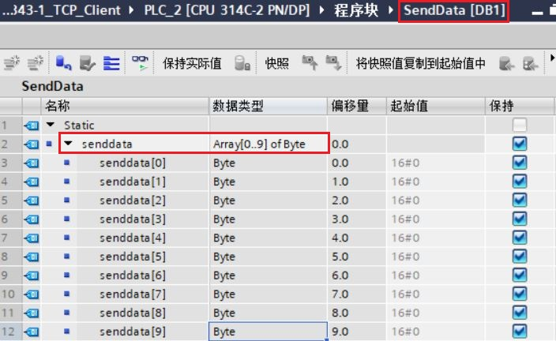{width="704" height="432"}

图 21. 创建发送数据区 DB 块

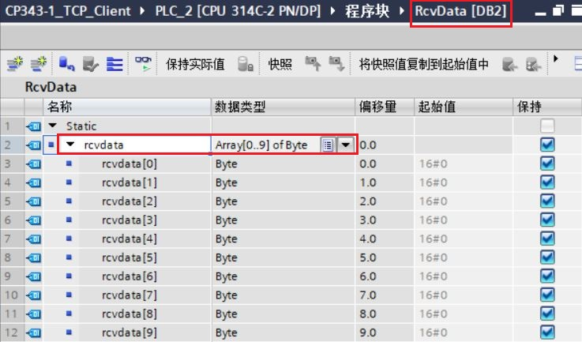{width="737" height="433"}

图 22. 创建接收数据区 DB 块

300CPU 侧配置和编程完成，编译并存盘。

#### 1.4 下载硬件组态及程序并监控通信结果

下载两个 CPU 中的所有硬件组态及程序，实现两个 CPU
之间数据交换，监控结果如图 23 所示。

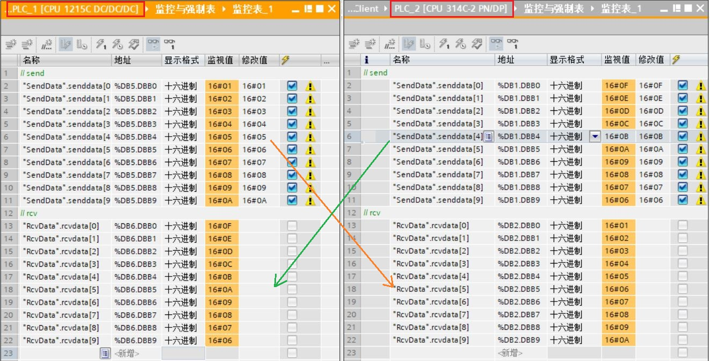{width="1322" height="674"}

图23. 监控结果

#### []{#b}二. 第二种情况（S7-1200 在 TIA 项目中，CP343-1 在 Step7 项目）

1215C 作为 TCP 客户端，使用 Step7 V17 编程；CP343-1 作为 TCP 服务器 使用
Step7 V5.6 编程，详细步骤如下。

#### 2.1 S7-1200 侧硬件组态、编程和连接参数的配置

该部分内容和 S7-1200 CPU 与 S7-300 CP TCP 通信（S7-1200
作为客户端）-第一种情况\--\> 1.1 和 1.2 章节内容相同，不再赘述。

#### 2.2 S7-300CP 侧硬件组态、编程和连接参数的配置

#### **1．创建PLC项目**并进行硬件组态配置

在 STEP7 V5.6 中创建一个项目并插入 CPU 314C-2 PN/DP 和 CP343-1
。操作步骤如下：

\(1\) 在PC上打开STEP7 V5.6，在 "File"菜单中选择 "New..." 选项，如图 24
所示。

{width="560" height="484"}

图 24. 新建项目

\(2\) 在弹出的创建新项目窗口里输入项目名为 "CP343-1_TCP_Server"
，然后点击 "OK" 按钮，如图 25 所示。

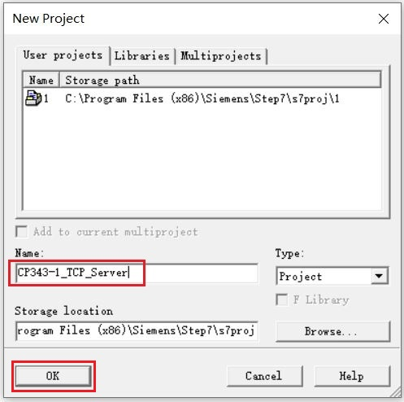{width="497" height="494"}

图 25. 输入项目名称

\(3\) 在 CP343-1_TCP_Server 下点击右键选择 "Insert New Object" ，选择
"SIMATIC 300 Station" ，如图 26 所示。

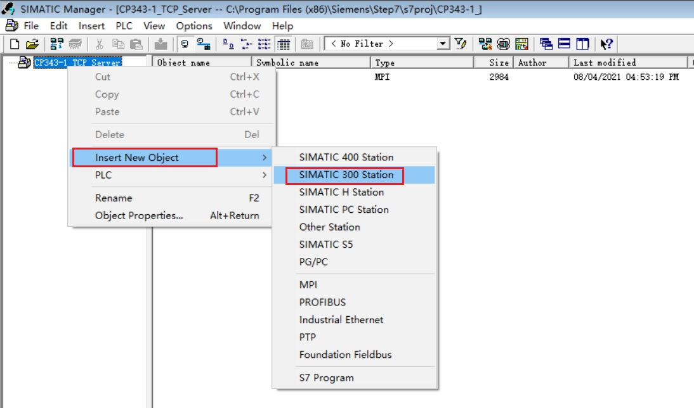{width="1094" height="644"}

图 26. 插入300站点

\(4\) 双击 "Hardware" 打开硬件组态，如图 27 所示。

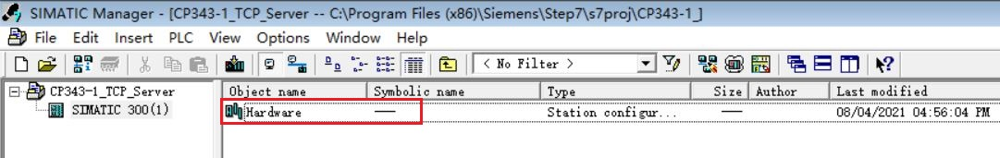{width="1081" height="171"}

图 27. 硬件组态

\(5\) 插入 S7-300 机架，如图 28 所示。

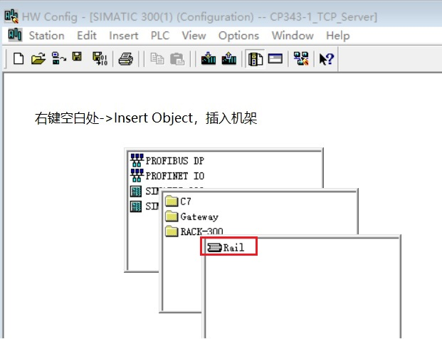{width="621" height="476"}

图 28. 插入S7-300 机架

\(6\) 插入 S7-314C-2 PN/DP CPU 和 CP343-1 ，如图 29、30 所示。

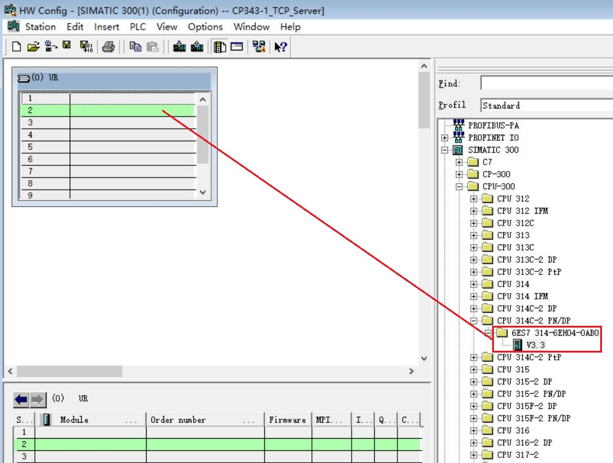{width="1004" height="759"}

图 29. 插入S7-300 CPU

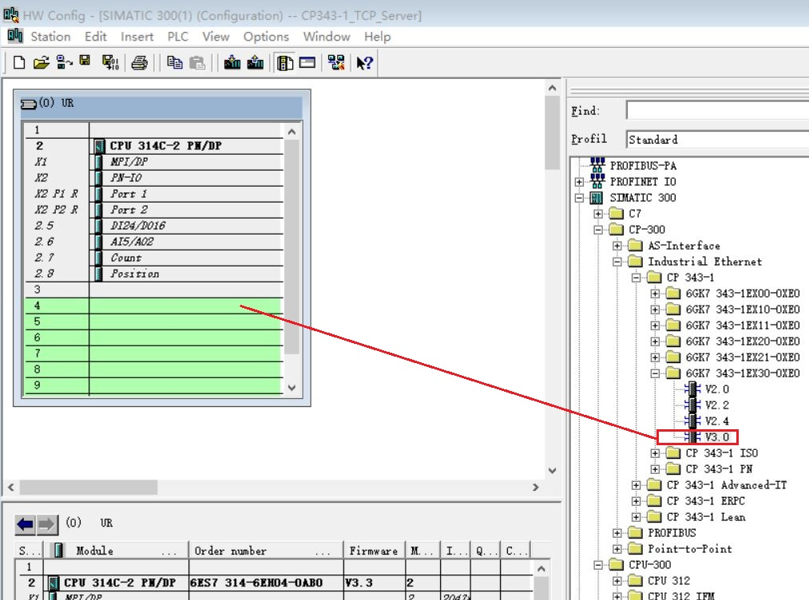{width="1013" height="752"}

图 30. 插入CP343-1

\(7\) 设置 CP343-1 的 IP 地址 192.168.0.11 和子网掩码 255.255.255.0
，并添加新建子网。如图 31 所示。

{width="741" height="659"}

图 31. 设置 IP 地址和添加子网

\(8\) 为了编程方便，使用 CPU 属性中定义的时钟位，定义方法如下：

双击硬件配置机架内的 CPU 314C-2PN/DP ，进入 CPU 属性设置，选择
Cycle/Clock Memory ，然后激活 Clock memory 时钟字节定义为 MB0 ，如图 32
所示。

时钟位使用 M0.5，以 1Hz 的速率自动激活发送任务。

{width="761" height="748"}

图 32. 启动时钟存储器

\(9\) 点击 "Save and Compile" 按钮。编译保存硬件组态信息，如图 33 内 1
所示。

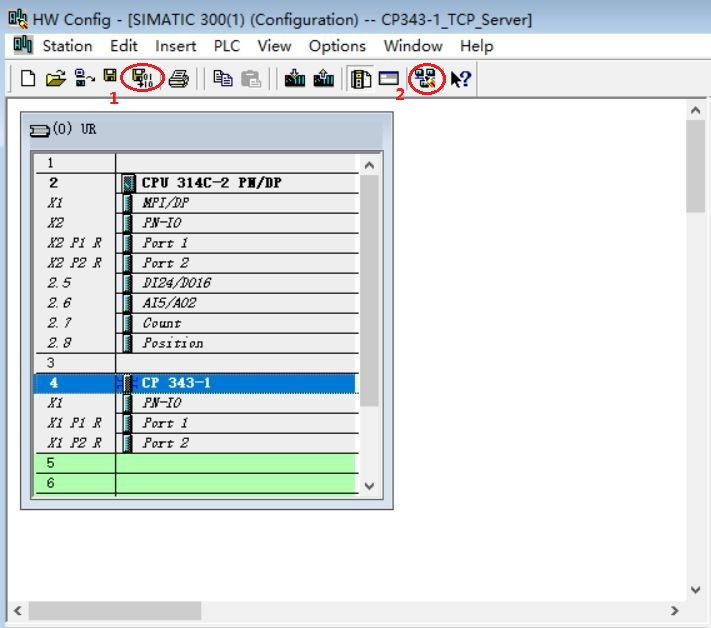{width="711" height="628"}

图 33. 保存并编译硬件组态

#### **2．在 Netpro 内组态并配置 TCP 连接**参数

①硬件配置完毕后，点击 Netpro 图标如图 33 内 2 所示，进入 Netpro 后，右键
CPU 添加新连接，如图 34 所示。

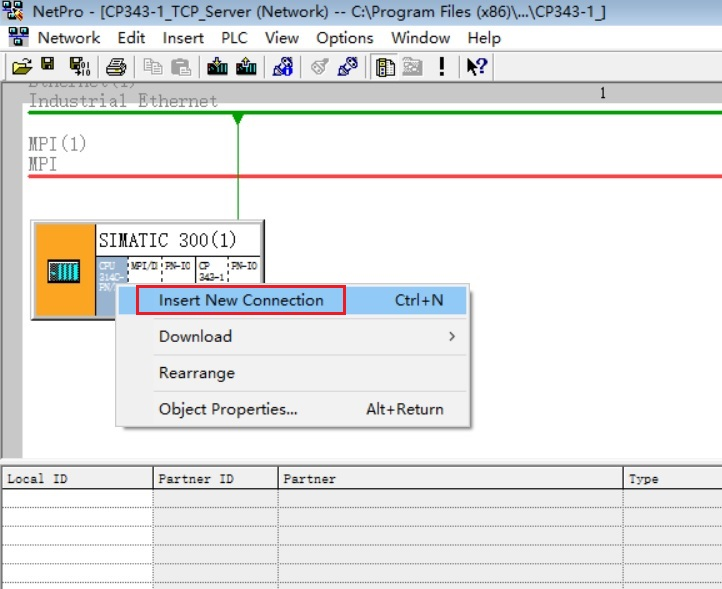{width="722" height="589"}

图 34. Netpro 内新建 TCP 连接

②选择未指定的伙伴，类型选择 TCP 连接，然后确定，如图 35 所示。

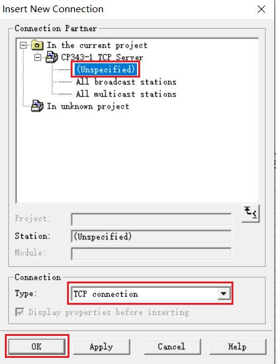{width="453" height="596"}

图 35. 新建未指定 TCP 连接

③添加完成后，可进一步设置 TCP 连接参数， 因 CP343-1 做 TCP
服务器，所以不激活主动建立连接。如图 36 所示。

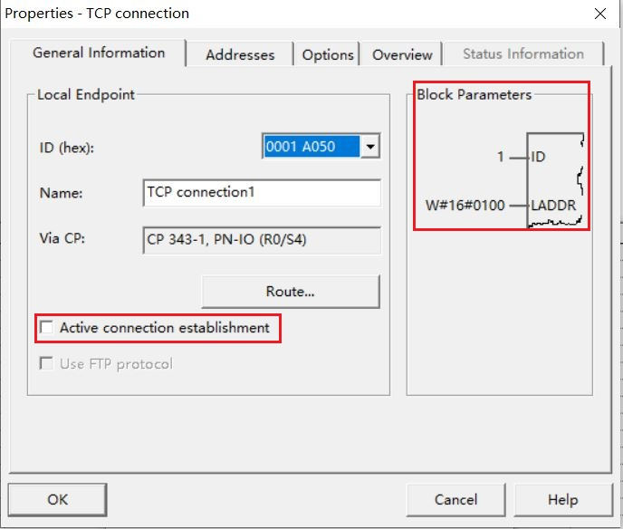{width="688" height="584"}

图 36. 查看新建的 TCP 连接 ID

④连接的属性-地址内，设置新建连接的本地 ID 和伙伴 IP 及端口，如图 37
所示。

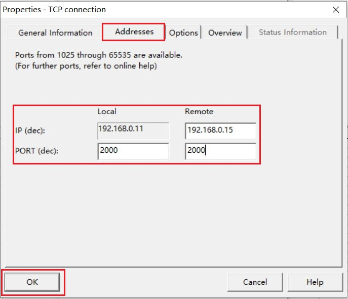{width="687" height="589"}

图 37. 设置连接伙伴 IP 及端口号

⑤ 300 侧新建 TCP 连接配置完毕，如图 38 所示。

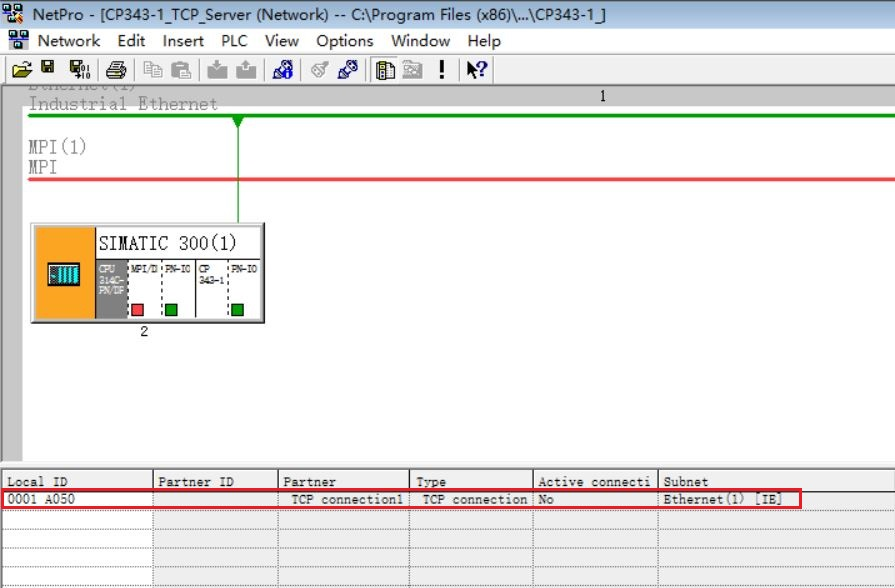{width="895" height="588"}

图 38. Netpro 内新建的 TCP 连接

#### **3．在 S7-300 中调用"AG_SEND"、"AG_RECV" 通信指令**

打开 OB1，在左侧指令库内调用 TCP 通信指令， "库" \> "SIMATIC_NET_CP" \>
"CP300"下，调用"AG_SEND" 、"AG_RECV "通信指令，并创建接收和发送数据块
，发送 DB 10 字节数组，接收 DB 10 字节数组。图 39、40、41 所示。

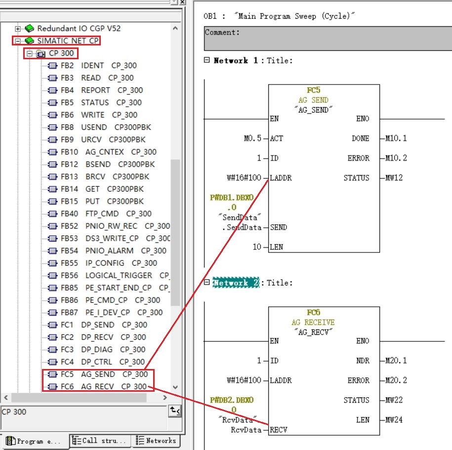{width="915" height="911"}

图 39. 调用 AG_SEND 和 AG_RECV 指令

**指令管脚参数说明：**

  ---------------- ------------------------ ---------------------------------------------
  CALL "AG_SEND"                            //调用 AG_SEND
  ACT 　           ：=%M0.5                 //使用 1Hz 的时钟脉冲，上升沿激活发送任务
  ID               ：=1                     // 连接号，要与配置中一致见图 36，块参数
  LADDR            ：=W#16#100              // CP 的地址，要与配置中一致见图 36，块参数
  SEND             ：="SendData".SendData   //发送数据区
  LEN              ：=10                    //发送数据的长度
  DONE             ：=%M10.1                //为 1 时，发送完成
  ERROR            ：=%M10.2                //为 1 时，有故障发生
  STATUS           ：=%MW12                 //状态代码
  ---------------- ------------------------ ---------------------------------------------

 

  ----------------- ---------------------- ---------------------------------------------
  CALL " AG_RECV"                          //调用 AG_RECV
  ID                ：=1                   // 连接号，要与配置中一致见图 36，块参数
  LADDR             ：=W#16#100            // CP 的地址，要与配置中一致见图 36，块参数
  RECV 　           ：="RcvData".RcvData   //接收数据区
  NDR               ：=%M20.1              //为 1 时，接收到新数据
  ERROR             ：=%M20.2              //为 1 时，有故障发生
  STATUS            ：=%MW22               //状态代码
  LEN               ：=%MW24               //接收到的实际数据长度
  ----------------- ---------------------- ---------------------------------------------

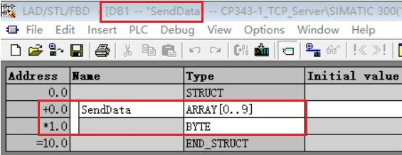{width="568" height="214"}

图 40. 创建发送数据区 DB 块

{width="568" height="214"}

图 41. 创建接收数据区 DB 块

300CPU 侧配置和编程完成，编译并存盘。

如果使用 S7-400 系列 CPU，并使用 CP443-1 实现 TCP，则需要使用如图 42
所示的 CP 400 文件夹中的 指令。对于 FC 50/FC 60/FC 53/FC
63，请参考相关技术手册。

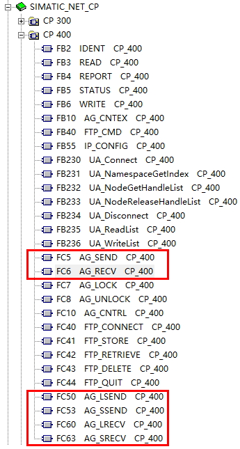{width="345" height="645"}

图 42. S7-400 系列库

#### 2.3 下载硬件组态及程序并监控通信结果

下载两个 CPU 中的所有硬件组态及程序，实现两个 CPU
之间数据交换，监控结果如图 43 所示。

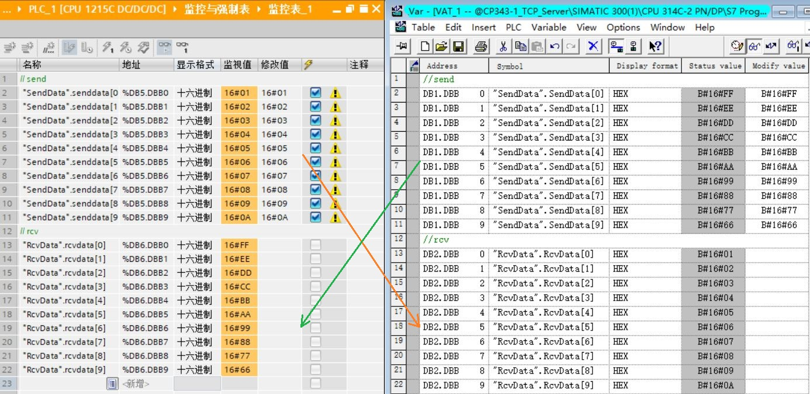{width="1386" height="676"}

图 43. 监控结果
