### S7-1200 CPU 与S7-300 CP/S7-400 CP TCP 通信（S7-1200 作为服务器）

S7-1200 与 S7-300 CP 之间的以太网通信可以通过 TCP 协议来实现，使用的通信指令是在 S7-1200 CPU 侧调用 T-Block (TSEND\_C，TRCV\_C，TCON，TDISCON，TSEND，TRCV) 指令,在 S7-300 CPU 侧调用 AG\_SEND, AG\_RECV 指令来实现。通信方式为双边通信，因此 SEND 和 RCV 必须成对出现。

此外本文也可以作为 S7-1200 与 S7-400 CP 之间的 TCP 通信文档。

#### 硬件和软件需求及所完成的通信任务

所需条件：

① S7-1215 DC/DC/DC V4.4 / CPU 314C-2 PN/DP，V3.3 + CP343-1,V3.0  
②TIA Step7 V17 Professional / Step7 V5.6 SP2

所完成的通信任务：

① S7-1200 CPU将通讯数据区 DB5 块中的 10 个字节的数据发送到 S7-300 CPU的接收数据区 DB2 块中。  
② S7-300 CPU将通讯数据区 DB1 块中的 10 个字节的数据发送到 S7-1200 CPU的接收数据区 DB6 块中。

S7-1200 与 CP343-1 之间 TCP 通讯，可以分 2 种情况来操作，具体如下：

1.  [第一种情况：S7-1200 与 CP343-1 都在 TIA STEP7 V17 中操作](03-S7-1200Client_S7-300CPServer.html#a)
2.  [第二种情况：S7-1200 在 TIA STEP7 V17 项目中，CP343-1 在 STEP7 V5.6 项目中操作](03-S7-1200Client_S7-300CPServer.html#b)

#### 一. 第一种情况（S7-1200 与 CP 343-1 都在 TIA Portal 中操作）

在 STEP 7 V17 中，新建一个 S7-1200 站点和一个 S7-300 站点，然后做 TCP 通讯。

#### 1.1 S7-1200 侧和 S7-300CP 侧硬件组态配置

**1\. 使用 STEP7 V17 软件新建一个项目并完成硬件配置**

在 STEP7 V17 的 “Portal 视图” 中选择 “创建新项目” 创建一个新项目。

**2.** **添加 1200CPU 硬件并为命名 PLC**

然后进入 “项目视图”，在“项目树” 下双击 “添加新设备”，在对话框中选择所使用的 S7-1200 CPU 添加到机架上，命名为 PLC_1，如图 1 所示。

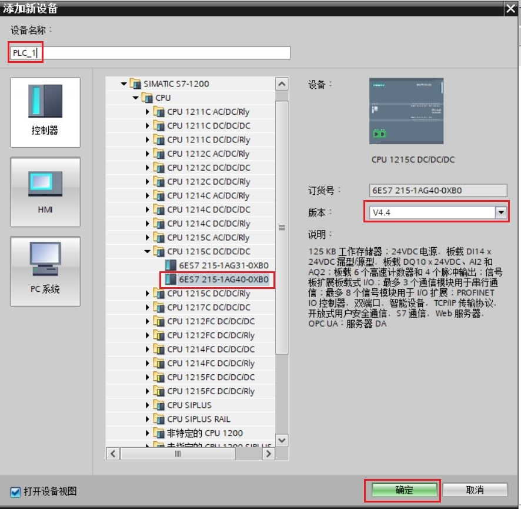

图 1\. 添加 1200 CPU 设备

为了编程方便，使用 CPU 属性中定义的时钟位，定义方法如下：

在 “项目树” \> “PLC_1” > “设备组态” 中，选中 CPU ，然后在下面的属性窗口中，“属性” > “系统和时钟存储器” 下，将时钟字节定义在 MB0，如图 2 所示。

时钟位使用 M0.5，以 1Hz 的速率自动激活发送任务。

图 2\. 设置系统和时钟存储器

**3\. 为 PROFINET 通信口分配以太网地址**

在 PROFINET 接口的属性，“以太网地址” 下分配 IP 地址为 192.168.0.15 ，子网掩码为 255.255.255.0，如图 3 所示。

图 3\. 分配 1200CPU IP 地址

**4．添加 300CPU 和 CP343-1 硬件并命名 PLC**

然后进入 “项目视图”，在“项目树” 下双击 “添加新设备”，在对话框中选择所使用的 S7-300 CPU 添加到机架上，命名为 PLC_2，如图 4 所示。

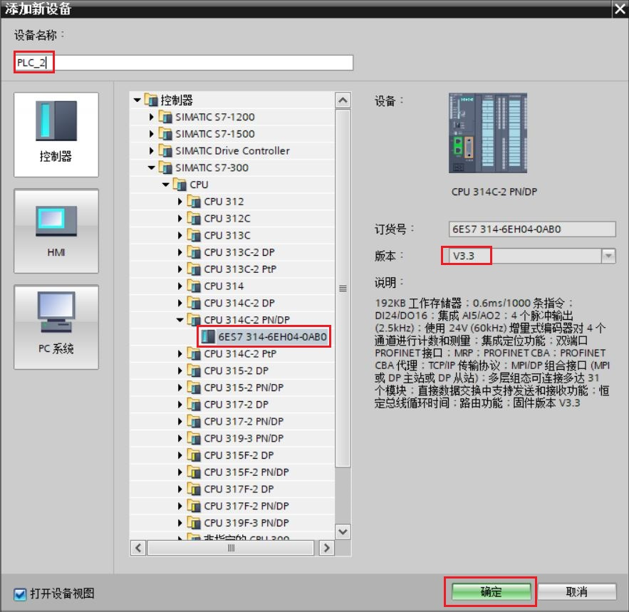

图 4\. 添加 300 CPU设备

为了编程方便，使用 CPU 属性中定义的时钟位，定义方法如下：

在 “项目树” \> “PLC_2”> “设备组态” 中，选中 CPU ，然后在下面的属性窗口中，“属性” > “时钟存储器” 下时钟字节定义在 MB0，如图 5 所示。

时钟位使用 M0.5，以 1Hz 的速率自动激活发送任务。

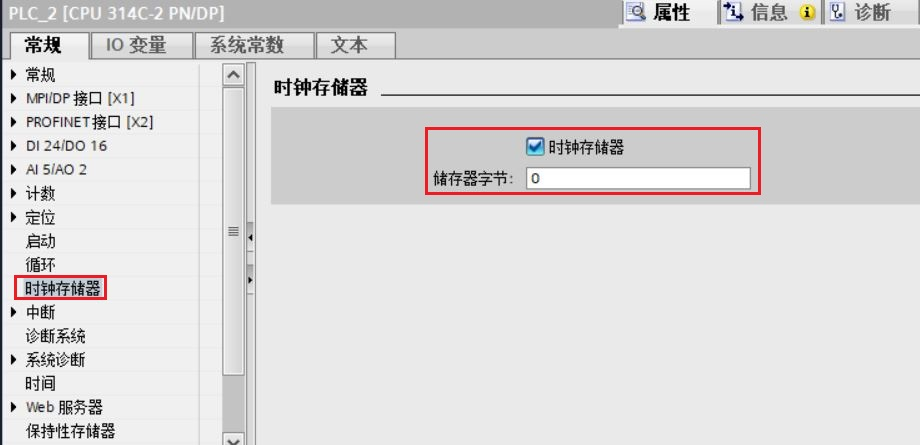

图 5\. 启动时钟存储器

**5\. 组态 CP343-1 并配以太网地址**

在 “设备视图”中点击 CP 上代表 PROFINET 通信口的绿色小方块，在下方会出现 PROFINET 接口的属性，在 “以太网地址” 下分配 IP 地址为 192.168.0.11，子网掩码为 255.255.255.0，如图 6 所示。

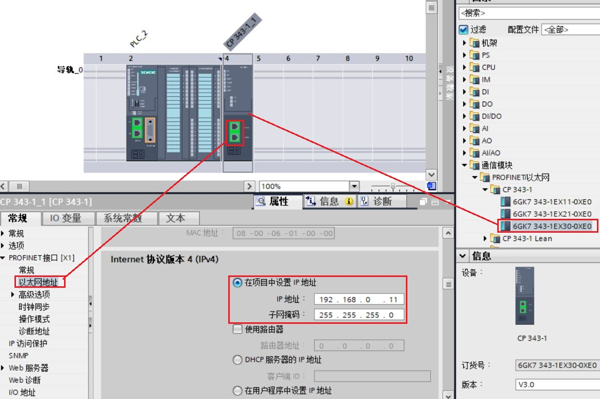

图 6\. 分配 300CP IP 地址

**6\. 创建 CPU 的逻辑网络连接（仅当 1200 和 300CP 在同一 TIA 项目时操作）**

在项目树 “项目树”>“设备和网络” >“网络视图” 视图下，创建两个设备的连接。用鼠标点中 S7-1200 上的 PROFINET 通信口的绿色小方框，然后拖拽出一条线，到另外一个 CP343-1 上的 PROFINET 通信口上，松开鼠标，PN/IE_1 的子网连接就建立起来了，如图 7 所示。

图 7\. 建立伙伴间的网络子网连接

**注：当 1200PLC 和 300CP 在不同 TIA 项目或一个 TIA 一个 Step7 组态时，无需操作此步骤。独立设置各自 PLC 的子网连接即可。**

#### 1.2 在 S7-1200 OB1 中调用并配置 “TCON”、“TSEND”、“TRCV” 通信指令

#### **1．调用 “TCON” 通信指令并配置连接参数**

① 在 S7-1200 CPU 中调用发送通信指令，进入 “项目树” > “ PLC_1” > “程序块” > “OB1” 主程序中，从右侧窗口 “指令” > “通信” > “开放式用户通信”> “其他”下调用 “TCON” 指令，创建连接，如图 8 所示。

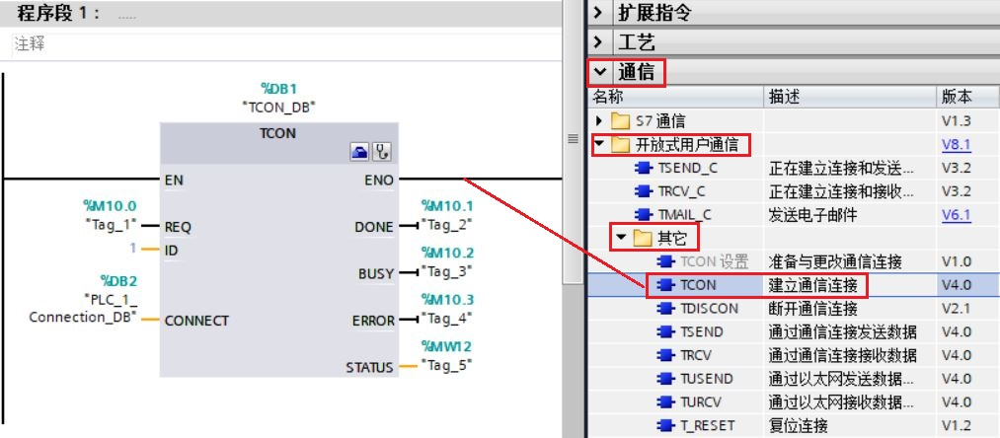

图 8\. 调用“TCON”通信指令

② 定义 S7-1200 的 “TCON”连接参数

S7-1200 的 “TCON”指令的连接参数需要在指令下方的属性窗口“属性”> “组态”>“连接参数”中设置，如图 9 所示。

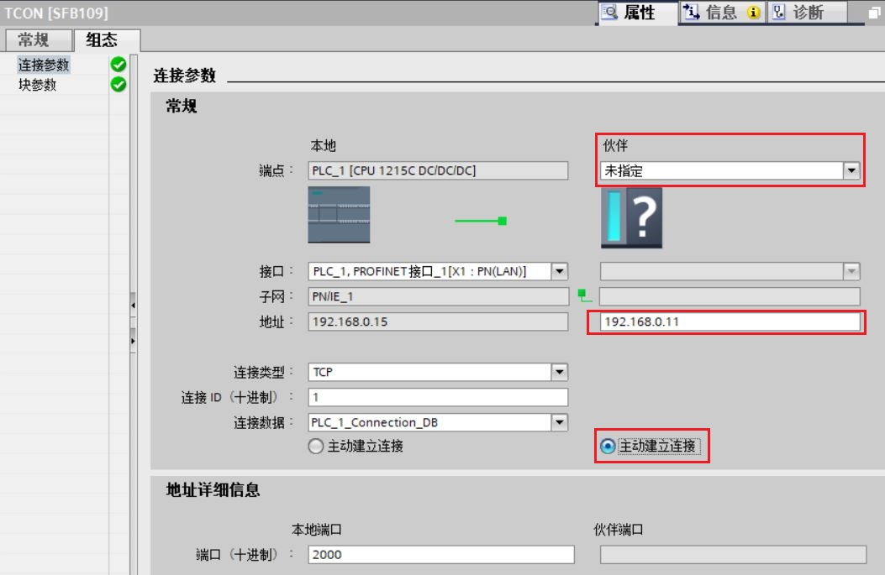

图 9\. 定义 TCON 连接参数

**连接参数说明：**

|     |     |
| --- | --- |
| 端点  | ：可以通过点击选择按钮选择未指定伙伴； |
| 地址  | ：设置伙伴的 IP 地址，如伙伴 CP343-1 的 IP 192.168.0.11； |
| 连接类型 | ：选择通信协议为 TCP； |
| 连接 ID | ：连接的地址 ID 号，这个 ID 号在后面的编程里会用到； |
| 连接数据 | ：点击新建自动生成该数据块，如 PLC\_1\_Connection_DB； |
| 主动建立连接 | ：选择伙伴作为主动连接（做客户端的一方需要勾选主动建立连接） |
| 地址详细信息 | ：定义本地通信的端口号为：2000，伙伴端口为：2000； |

#### **2．****调用“TSEND”通信指令并配置基本参数**

① 在 OB1 内调用 “TSEND” ，发送 10 个字节数据到 S7-300 中

进入 “项目树” \> “ PLC_1” > “程序块” > “OB1” 主程序中，从右侧窗口 “指令” > “通信” > “开放式用户通信”> “其他”下调用 “TSEND” 指令，并配置接口参数，如图 10 所示。

图 10\. 调用 TSEND 通信指令并配置接口参数

**参数说明：**

**输入接口参数：**

|     |     |
| --- | --- |
| REQ | ：在上升沿启动发送作业 |
| ID  | ： 引用由“TCON”建立的连接 |
| LEN | ：要通过作业发送的最大字节数 |
| DATA | ：发送数据区的数据，使用指针寻址时，DB 块要选用绝对寻址 |

**输出接口参数：**

|     |     |
| --- | --- |
| DONE | ：任务执行完成并且没有错误，该位置 1 |
| BUSY | ：该位为 1，代表任务未完成，不能激活新任务 |
| ERROR | ：通信过程中有错误发生，该位置 1 |
| STATUS | ：有错误发生时，会显示错位信息号 |

② 创建并定义 S7-1200 的发送数据区 DB 块。

通过“项目树”>“PLC_1”>“程序块”>“添加新块”，选择“数据块” 创建 DB 块，在 DB 块的“属性->常规->属性”中，取消勾选“优化的块访问”，点击“确定”键，定义发送数据区为 10 个字节的数组，如图1 1 所示。

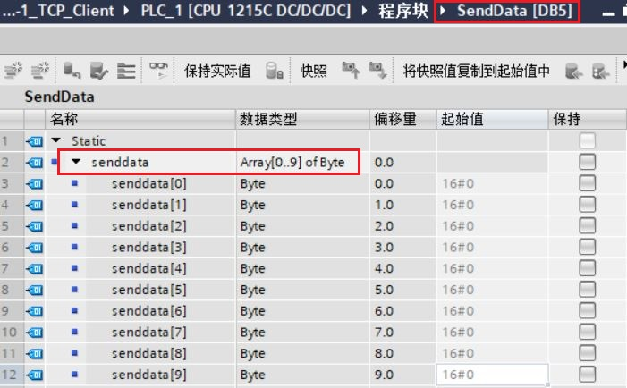

图 11\. 创建发送数据区 DB 块

**注意：对于双边编程通信的 CPU ，如果通信数据区使用 DB 块，既可以将 DB 块定义成符号寻址，也可以定义成绝对寻址。使用指针寻址方式，必须创建绝对寻址的 DB 块。**

#### **3．调用“TRCV”通信指令并配置基本参数**

为了实现 S7-1200 接收来自 S7-300 的数据，则在 S7-1200 中调用接收指令 TRCV 并配置基本参数。

① 在 OB1 内调用 “TRCV”，接收来自 S7-300 的 10 个字节数据

进入 “项目树” \> “ PLC_1” > “程序块” > “OB1” 主程序中，从右侧窗口 “指令” > “通信” > “开放式用户通信”> “其他”下调用 “TRCV” 指令，并配置接口参数，如图 12 所示。

图 12\. 调用 TRCV 指令并配置接口参数

**参数说明：**

**输入接口参数：**

|     |     |
| --- | --- |
| EN_R | ：启用接收功能 |
| ID  | ： 指向使用“TCON”建立的连接的引用 |
| LEN | ：接收数据长度 |
| ADHOC | ： TCP 协议选项是否使用 Ad-hoc 模式 |
| DATA | ： 接收数据区的地址 |

**输出接口参数：**

|     |     |
| --- | --- |
| NDR | ：该位为 1，接收任务成功完成 |
| BUSY | ：该位为 1，代表任务未完成，不能激活新任务 |
| ERROR | ：通信过程中有错误发生，该位置 1 |
| STATUS | ：有错误发生时，会显示错误信息号 |
| RCVD_LEN | ：实际接收数据的字节数 |

**注意： ADHOC 设置为 TRUE 可以接收变长数据。**

②　创建并定义 S7-1200 的接收数据区 DB 块。

通过“项目树”>“PLC_1”>“程序块”>“添加新块”，选择“数据块” 创建 DB 块，在 DB 块的“属性->常规->属性”中，取消勾选“优化的块访问”，点击“确定”键，定义接收数据区为 10 个字节的数组，如图 13 所示。

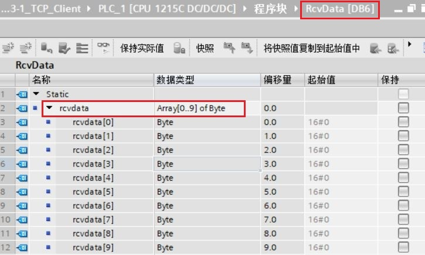

图 13\. 创建接收数据区 DB 块

**注意：对于双边编程通信的 CPU ，如果通信数据区使用 DB 块，既可以将 DB 块定义成符号寻址，也可以定义成绝对寻址。使用指针寻址方式，必须创建绝对寻址的 DB 块。**

1200CPU 侧配置和编程完成，编译并存盘。

#### 1.3 在 S7-300CP 中配置 TCP 连接参数并调用“AG\_SEND”、“AG\_RECV” 通信指令

#### **1．在 S7-300CP 中配置 TCP 连接参数**

① 点击设备和网络，在网络视图内在 300CP 中新建 TCP 连接，如图 14 所示。

图 14\. 300CP 中新建 TCP 连接

②选择未指定的伙伴，确认连接 ID 号，勾选主动建立连接（CP343-1 做客户端），然后添加，如图 15 所示。

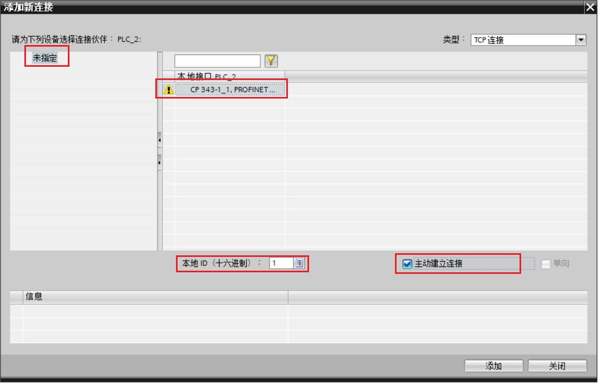

图 15\. 添加未指定 TCP 连接

③添加完成后，在网络视图-连接内可以查看新建的连接。点击新建的 TCP 连接可进一步设置 TCP 连接参数， 如图 16 所示。

图 16\. 查看新建的 TCP 连接

④连接的常规-属性内，检查新建连接的本地 ID 和主动建立连接（做客户端的一方需主动建立连接），并设置伙伴 IP 及端口，如图 17、18、19 所示。

图 17.连接的本地 ID 和伙伴 IP 及端口号

图 18.激活主动建立连接

图 19.设置伙伴 IP 及端口

#### **2．在 S7-300 中调用“AG\_SEND”、“AG\_RECV” 通信指令**

在 OB1 中，从“指令”>“通信 ”>“通信处理器 ”>“SIMATIC NET CP”下，调用“AG\_SEND” 、“AG\_RECV ”通信指令，并创建接收和发送数据块 ，发送 DB 10 字节数组，接收 DB 10 字节数组。图 20、21、22 所示。

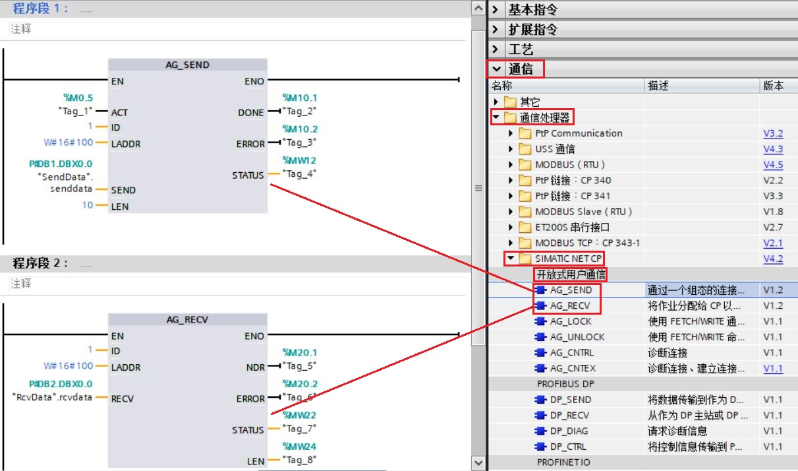

图 20\. 调用 AG\_SEND 和 AG\_RECV 指令

**指令管脚参数说明：**

|     |     |     |
| --- | --- | --- |
| CALL “AG_SEND” |     | //调用 AG_SEND |
| ACT | ：=%M0.5 | //使用 1Hz 的时钟脉冲，上升沿激活发送任务 |
| ID  | ：=1 | // 连接号，要与配置中一致见图 17，块参数 |
| LADDR | ：=W#16#100 | // CP 的地址，要与配置中一致见图 17，块参数 |
| SEND | ：=“SendData”.senddata | //发送数据区 |
| LEN | ：=10 | //发送数据的长度 |
| DONE | ：=%M10.1 | //为 1 时，发送完成 |
| ERROR | ：=%M10.2 | //为 1 时，有故障发生 |
| STATUS | ：=%MW12 | //状态代码 |

|     |     |     |
| --- | --- | --- |
| CALL “ AG_RECV” |     | //调用 AG_RECV |
| ID  | ：=1 | // 连接号，要与配置中一致见图 17，块参数 |
| LADDR | ：=W#16#100 | // CP 的地址，要与配置中一致见图 17，块参数 |
| RECV | ：=“RcvData”.rcvdata | //接收数据区 |
| NDR | ：=%M20.1 | //为 1 时，接收到新数据 |
| ERROR | ：=%M20.2 | //为 1 时，有故障发生 |
| STATUS | ：=%MW22 | //状态代码 |
| LEN | ：=%MW24 | //接收到的实际数据长度 |

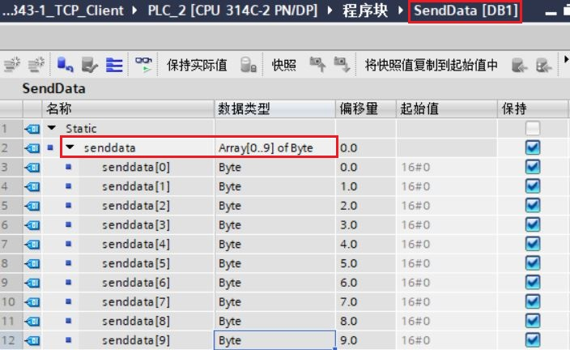

图 21\. 创建发送数据区 DB 块

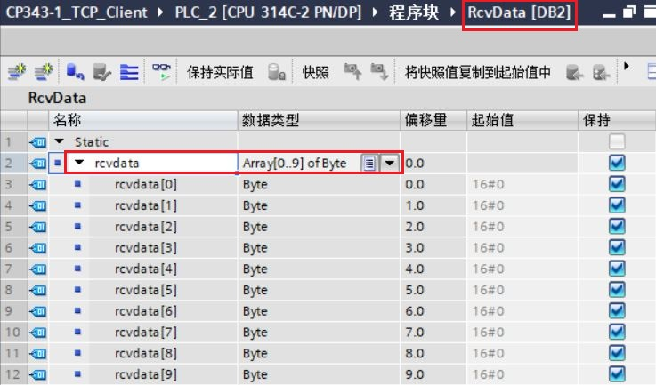

图 22\. 创建接收数据区 DB 块

300CPU 侧配置和编程完成，编译并存盘。

#### 1.4 下载硬件组态及程序并监控通信结果

下载两个 CPU 中的所有硬件组态及程序，实现两个 CPU 之间数据交换，监控结果如图 23 所示。

图 23\. 监控结果

#### 二. 第二种情况（S7-1200 在 TIA 项目中，CP343-1 在 Step7 项目）

1215C 作为 TCP 服务器，使用 Step7 V17 编程；CP343-1 作为 TCP 客户端 使用 Step7 V5.6 编程，详细步骤如下。

#### 2.1 S7-1200 侧硬件组态、编程和连接参数的配置

该部分内容和 S7-1200 CPU 与S7-300 CP TCP通信（S7-1200 作为服务器）-第一种情况-->1.1 和 1.2 章节内容相同，不再赘述。

#### 2.2 S7-300CP 侧硬件组态、编程和连接参数的配置

#### **1．创建 PLC 项目**并进行硬件组态配置

在 STEP7 V5.6 中创建一个项目并插入 CPU 314C-2 PN/DP 和 CP343-1 。操作步骤如下：

(1) 在PC上打开STEP7 V5.6，在“File” 菜单中选择 “New…”选项，如图 24 所示。

图 24\. 新建项目

(2) 在弹出的创建新项目窗口里输入项目名为“CP343-1\_TCP\_Server”，然后点击“OK”按钮，如图 25 所示。

图 25\. 输入项目名称

(3) 在 CP343-1\_TCP\_Server 下右键点击 “Insert New Object” ，选择 “SIMATIC 300 Station” ，如图 26 所示。

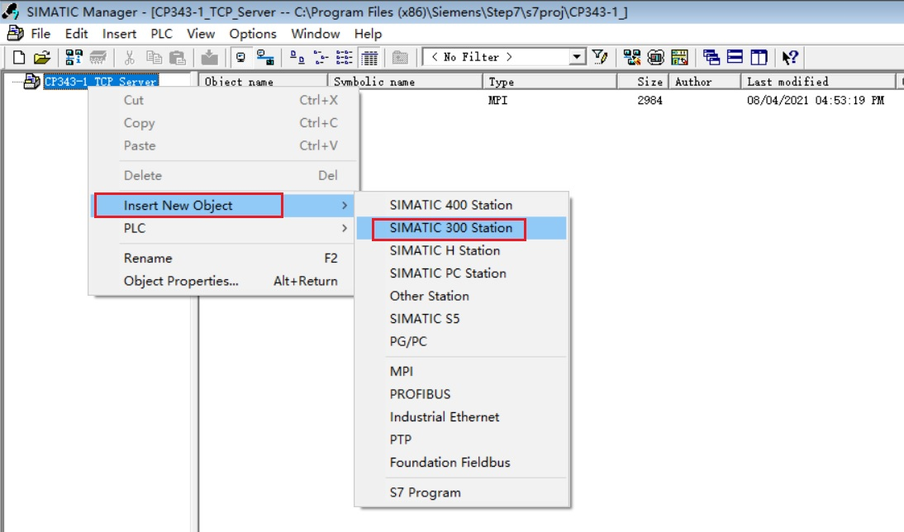

图 26\. 插入 300 站点

(4) 双击 “Hardware” 打开硬件组态，如图 27 所示。

图 27\. 硬件组态

(5) 插入 S7-300 机架，如图 28 所示。

图 28\. 插入 S7-300 机架

(6) 插入CPU 314C-2 PN/DP CPU 和 CP343-1，如图 29、30 所示。

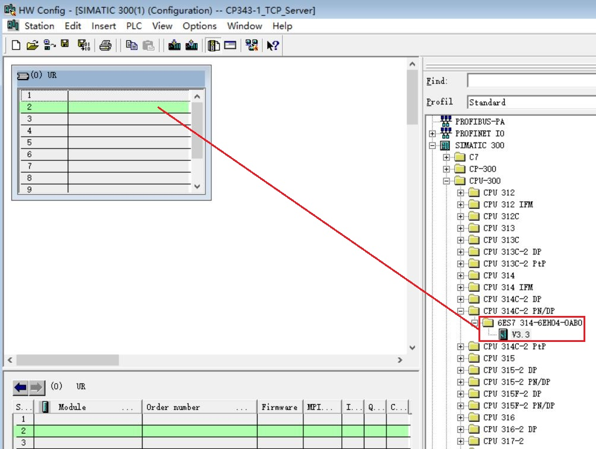

图 29\. 插入 S7-300 CPU

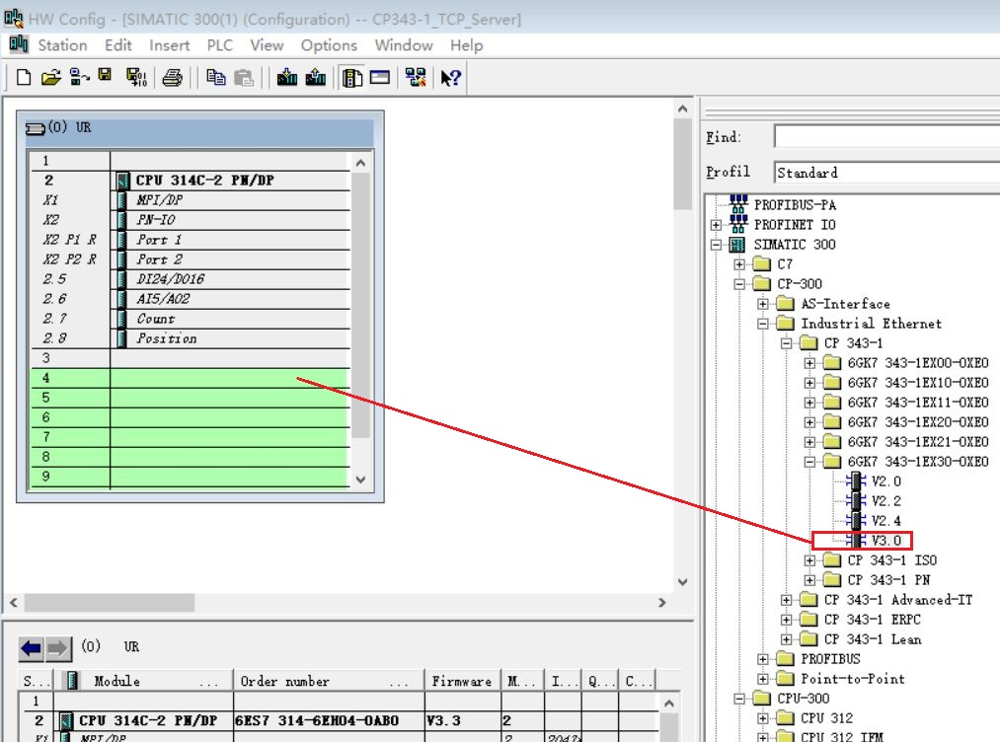

图 30\. 插入 CP343-1

(7) 设置 CP343-1 的 IP 地址 192.168.0.11 和子网掩码 255.255.255.0 ，并添加新建子网。如图 31 所示。

图 31\. 设置 IP 地址和添加子网

(8) 为了编程方便，使用 CPU 属性中定义的时钟位，定义方法如下：

双击硬件配置机架内的 CPU 314C-2PN/DP ，进入 CPU 属性设置，选择 Cycle/Clock Memory ，然后激活 Clock memory 时钟字节定义为 MB0，如图 32 所示。

时钟位使用 M0.5，以 1Hz 的速率自动激活发送任务。

图 32\. 启动时钟存储器

(9) 点击 “Save and Compile” 按钮。编译保存硬件组态信息，如图 33 内 1 所示。

图 33\. 保存并编译硬件组态

#### **2．****在 Netpro 内组态并配置 TCP 连接**参数

① 硬件配置完毕后，点击 Netpro 图标如图 33 内 2 所示，进入 Netpro 右键 CPU 添加新连接，如图 34 所示。

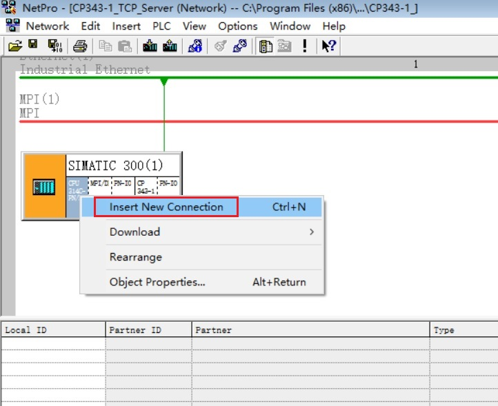

图 34\. Netpro 内新建 TCP 连接

② 选择未指定的伙伴，类型选择 TCP 连接，然后确定，如图 35 所示。

图 35\. 新建未指定 TCP 连接

③ 添加完成后，可进一步设置 TCP 连接参数， 因 CP343-1 做 TCP 客户端，需要激活主动建立连接。如图 36 所示。

图 36\. 查看新建的 TCP 连接 ID

④ 连接的属性-地址内，设置新建连接的本地 ID 和伙伴 IP 及端口，如图 37 所示。

图 37\. 设置连接伙伴 IP 及端口号

⑤ 300 侧新建 TCP 连接配置完毕，如图 38 所示。

图 38\. Netpro 内新建的 TCP 连接

#### **3．在 S7-300 中调用“AG\_SEND”、“AG\_RECV” 通信指令**

打开 OB1，在左侧指令树内调用 TCP 通信指令， “库” > “SIMATIC\_NET\_CP” > “CP300”下，调用“AG\_SEND” 、“AG\_RECV ”通信指令，并创建接收和发送数据块 ，发送 DB 10 字节数组，接收 DB 10 字节数组。图 39、40、41 所示。

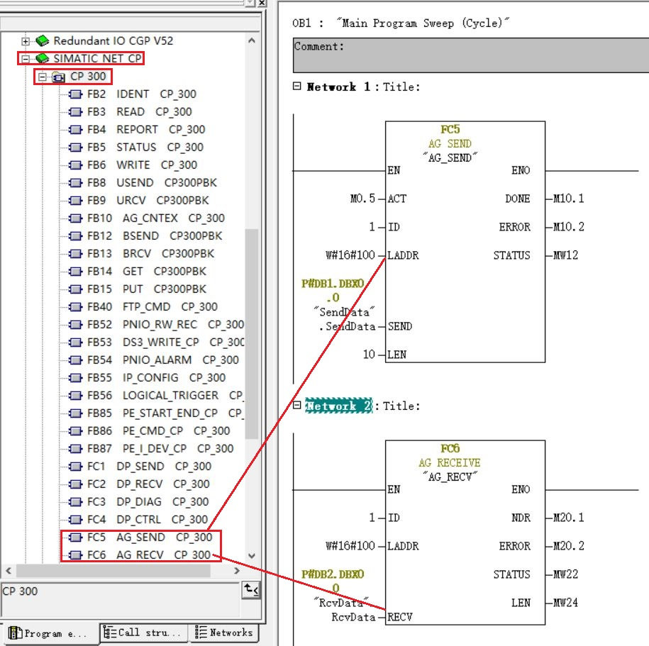

图 39\. 调用 AG\_SEND 和 AG\_RECV 指令

**指令管脚参数说明：**

|     |     |     |
| --- | --- | --- |
| CALL “AG_SEND” |     | //调用 AG_SEND |
| ACT | ：=%M0.5 | //使用 1Hz 的时钟脉冲，上升沿激活发送任务 |
| ID  | ：=1 | // 连接号，要与配置中一致见图 36，块参数 |
| LADDR | ：=W#16#100 | // CP 的地址，要与配置中一致见图 36，块参数 |
| SEND | ：=“SendData”.SendData | //发送数据区 |
| LEN | ：=10 | //发送数据的长度 |
| DONE | ：=%M10.1 | //为 1 时，发送完成 |
| ERROR | ：=%M10.2 | //为 1 时，有故障发生 |
| STATUS | ：=%MW12 | //状态代码 |

|     |     |     |
| --- | --- | --- |
| CALL “ AG_RECV” |     | //调用 AG_RECV |
| ID  | ：=1 | // 连接号，要与配置中一致见图 36，块参数 |
| LADDR | ：=W#16#100 | // CP 的地址，要与配置中一致见图 36，块参数 |
| RECV | ：=“RcvData”.RcvData | //接收数据区 |
| NDR | ：=%M20.1 | //为 1 时，接收到新数据 |
| ERROR | ：=%M20.2 | //为 1 时，有故障发生 |
| STATUS | ：=%MW22 | //状态代码 |
| LEN | ：=%MW24 | //接收到的实际数据长度 |

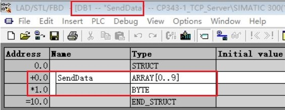

图 40\. 创建发送数据区 DB 块

图 41\. 创建接收数据区 DB 块

300CPU 侧配置和编程完成，编译并存盘。

如果使用 S7-400 系列 CPU，并使用 CP443-1 实现 TCP，则需要使用如图 42 所示的 CP 400 文件夹中的 指令。对于 FC 50/FC 60/FC 53/FC 63，请参考相关技术手册。

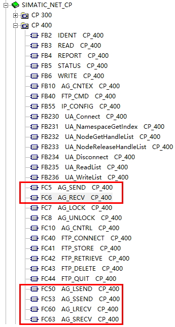

图 42\. S7-400 系列库

#### 2.3 下载硬件组态及程序并监控通信结果

下载两个 CPU 中的所有硬件组态及程序，实现两个 CPU 之间数据交换，监控结果如图 43 所示。

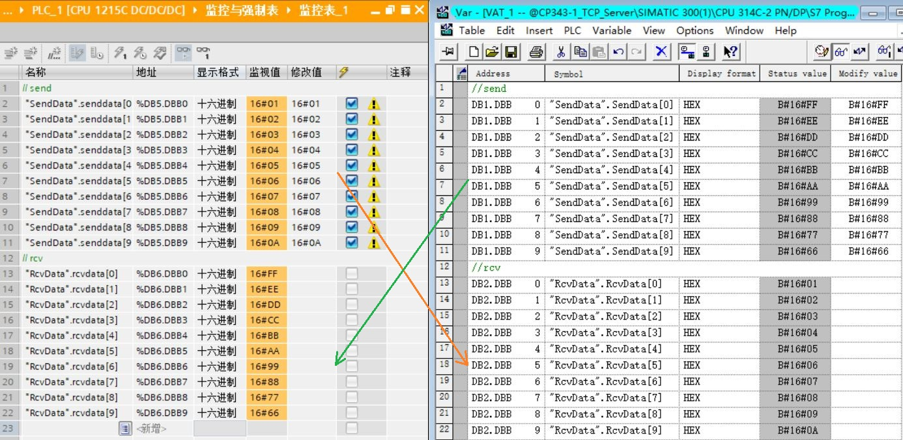

图 43\. 监控结果