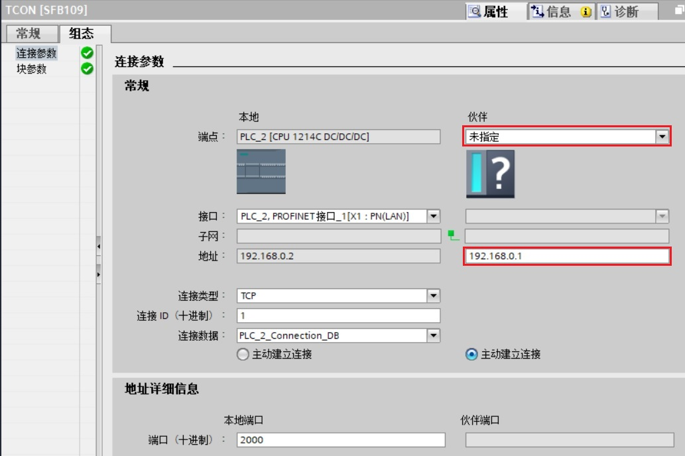

## S7-1200/S7-1500

S7-1200 与 S7-1200 之间的以太网通信可以通过 TCP 协议来实现，使用的通信指令是在双方 CPU 调用 T-block （TSEND\_C，TRCV\_C，TCON，TDISCON，TSEND，TRCV） 指令来实现。通信方式为双边通信，因此 TSEND 和 TRCV 必须成对出现。

此外本文也可用于S7-1200和S7-1500 TCP 通信。

#### 硬件和软件需求及所完成的通信任务

**硬件：**

① 两台S7-1200 CPU（PLC\_1：CPU1215C DC/DC/DC，固件版本V4.4和PLC\_2：CPU1214C DC/DC/DC，固件版本V4.4）

② PC（带以太网卡）

③ TP电缆（以太网电缆）

**软件：**

TIA PORTAL STEP7 V16

**所完成的通信任务：**

① 将PLC\_1 的通信数据区 DB3 块中的 100 个字节的数据发送到 PLC\_2 的接收数据区 DB4 块中。

② 将PLC\_2 的通信数据区 DB3 块中的 100 个字节的数据发送到 PLC\_1 的接收数据区 DB4 块中。

S7-1200之间 TCP 通讯，可以分2种情况来操作，具体如下：

1.  [第一种情况：两个 S7-1200 在一个项目中操作](01-S7-1200.htm#a)
2.  [第二种情况：两个 S7-1200 不在一个项目中的操作](01-S7-1200.htm#b)

### 一. 第一种情况（同一项目中操作）

使用 STEP 7 V16 在同一个项目中，新建两个S7-1200站点，然后做 TCP 通讯。

#### 1.1 通信的编程，连接参数及通信参数的配置

#### **1\. 打开 STEP7 V16 软件并新建项目**

在 STEP7 V16 的 “Portal 视图” 中选择 “创建新项目” 创建一个新项目

#### **2\. 添加硬件并命名PLC**

然后进入 “项目视图”，在“项目树” 下双击 “添加新设备”，在对话框中选择所使用的S7-1200 CPU添加到机架上，命名为 PLC_1，如图1所示。

同样方法再添加通信伙伴的S7-1200 CPU ，命名为 PLC_2。

图1\. 添加新设备

为了编程方便，使用 CPU 属性中定义的时钟位，定义方法如下：

在 “项目树” \> “PLC_1” > “设备组态” 中，选中 CPU ，然后在下面的属性窗口中，“属性” > “系统和时钟存储器” 下，将系统位定义在MB1，时钟位定义在MB0，如图2所示。

时钟位我们主要使用 M0.3，它是以2Hz 的速率在0和1之间切换的一个位，可以使用它去自动激活发送任务。

图2\. 系统位与时钟位

#### **3\. 为 PROFINET 通信口分配以太网地址**

在 “设备视图”中点击 CPU 上代表PROFINET 通信口的绿色小方块，在下方会出现PROFINET 接口的属性，在 “以太网地址” 下分配IP 地址为 192.168.0.1 ，子网掩码为255.255.255.0，如图3所示。

图3\. 分配IP 地址

同样方法，在同一个项目里添加另一个新设备S7-1200 CPU 并为其分配 IP 地址为192.168.0.2

#### **4\. 创建 CPU之间的逻辑网络连接**

在项目树 “项目树”>“设备和网络” >“网络视图” 视图下，创建两个设备的连接。用鼠标点中 PLC\_1 上的PROFINET通信口的绿色小方框，然后拖拽出一条线，到另外一个PLC\_2 上的PROFINET通信口上，松开鼠标，连接就建立起来了，如图4所示。

图4\. 建立两个 CPU的逻辑连接

#### 1.2 在 PLC_1 中调用并配置“TCON”、“TSEND”、“TRCV” 通信指令

#### **1．在 PLC_1 的 OB1 中调用“TCON” 通信指令**

① 在第一个 CPU 中调用通信指令，进入 “项目树” > “ PLC_1” > “程序块” > “OB1” 主程序中，从右侧窗口 “指令” > “通信” > “开放式用户通信”下调用 “TCON” 指令，创建连接，如图5所示。

图5\. 调用“TCON”通信指令

② 点击“开始组态”按钮(如图5中红色方框所示)，分配连接参数，在伙伴“端点”的下拉菜单中选择伙伴为“PLC_2”，在本地“连接数据”的下拉菜单中选择“新建”，如图6所示：

图6\. 分配连接参数

③ 定义PLC_1的 “TCON”连接参数

PLC\_1 的 TCON 指令的连接参数需要在指令下方的属性窗口“属性”> “组态”>“连接参数”中设置，同样使用“新建”，创建伙伴方的“连接数据”，"PLC\_2\_Connection\_DB"，如图7所示。

图7\. 定义 TCON 连接参数

**连接参数说明：**

|     |     |
| --- | --- |
| 端点  | ：可以通过点击选择按钮选择伙伴 CPU ：PLC_2 |
| 连接类型 | ：选择通信协议为 TCP（ |
| 连接ID | ：连接的地址 ID 号，这个 ID 号在后面的编程里会用到 |
| 连接数据 | ：创建连接时，点击“新建”（见图6所示），创建本地和伙伴的连接数据。 |
| 主动连接设置 | ：选择本地 PLC_1作为主动连接 |
| 地址详细信息 | ：定义通信伙伴方的端口号为：2000； |

④ 组态完成后 “TCON” 指令如图8所示。

图8 “TCON”通信指令

#### **2．定义 PLC_1 的“TSEND”发送通信块接口参数**

①　调用 “TSEND” 在OB1内调用 发送100个字节数据到PLC2中

进入 “项目树” \> “ PLC_1” > “程序块” > “OB1” 主程序中，从右侧窗口 “指令” > “通信” > “开放式用户通信”下调用 “TSEND” 指令，如图9所示。

图9\. 调用 TSEND

②　创建并定义PLC_1的发送数据区 DB 块。

通过“项目树”>“PLC_1”>“程序块”>“添加新块”，选择“数据块” 创建 DB 块，在DB块的“属性->常规->属性”中，取消勾选“优化的块访问”，点击“确定”键，定义发送数据区为 100个字节的数组，如图10及图11所示。

图10\. 创建发送数据区 DB 块

注意：对于双边编程通信的 CPU ，如果通信数据区使用 DB 块，既可以将 DB 块定义成符号寻址，也可以定义成绝对寻址。使用指针寻址方式，必须创建绝对寻址的 DB 块。

图11\. 定义发送数据区为字节类型的数组

③　定义 PLC_1 的“TSEND”发送通信块接口参数，如图12所示。

图12\. 定义 TSEND 接口参数

**参数说明：**

**输入接口参数：**

|     |     |     |
| --- | --- | --- |
| REQ | := M0.3 | // 使用 2Hz 的时钟脉冲，上升沿激活发送任务 |
| ID  | := 1 | // 创建连接ID |
| LEN | := 100 | //发送数据长度 |
| DATA | := P#DB3.DBX0.0 BYTE 100 | // 发送数据区的数据，使用指针寻址时，DB块要选用绝对寻址 |

**输出接口参数：**

|     |     |     |
| --- | --- | --- |
| DONE | := M2.5 | //任务执行完成并且没有错误，该位置 1 |
| BUSY | := M2.6 | // 该位为 1，代表任务未完成，不能激活新任务 |
| ERROR | := M2.7 | //通信过程中有错误发生，该位置 1 |
| STATUS | := MW10 | //有错误发生时，会显示错位信息号 |

#### **3．在 PLC\_1 的OB1中调用接收指令T\_RCV 并配置基本参数**

为了实现 PLC\_1 接收来自 PLC\_2 的数据，则在 PLC\_1 中调用接收指令T\_RCV 并配置基本参数。

①　创建并定义PLC_1的接收数据区 DB 块。

通过“项目树”>“PLC_1”>“程序块”>“添加新块”，选择“数据块” 创建 DB 块，在DB块的“属性->常规->属性”中，取消勾选“优化的块访问”，点击“确定”键，定义接收数据区为 100个字节的数组，如图13及图14所示。

图13\. 创建接收数据区 DB 块

注意：对于双边编程通信的 CPU ，如果通信数据区使用 DB 块，既可以将 DB 块定义成符号寻址，也可以定义成绝对寻址。使用指针寻址方式，必须创建绝对寻址的 DB 块。

图14\. 定义接收数据区为字节类型的数组

②　调用 “TRCV” 在OB1内调用

进入 “项目树” \> “ PLC_1” > “程序块” > “OB1” 主程序中，从右侧窗口 “指令” > “通信” > “开放式用户通信”下调用 “TRCV” 指令，配置接口参数，如图15所示。

图15\. 调用 TRCV 指令并配置接口参数

**参数说明：**

**输入接口参数：**

|     |     |     |
| --- | --- | --- |
| EN_R | := TRUE | // 准备好接收数据 |
| ID  | := 1 | // 连接号，使用的是 TCON 的连接参数中 ID号 |
| LEN | := 100 | // 接收数据长度为 100 个字节 |
| ADHOC | := FALSE | // TCP协议选项未使用Ad-hoc模式 |
| DATA | := P#DB4.DBX0.0 BYTE 100 | // 接收数据区的地址 |

**输出接口参数：**

|     |     |     |
| --- | --- | --- |
| NDR | := M3.2 | // 该位为 1，接收任务成功完成 |
| BUSY | := M3.3 | // 该位为 1，代表任务未完成，不能激活新任务 |
| ERROR | := M3.4 | // 通信过程中有错误发生，该位置 1 |
| STATUS | := MW16 | // 有错误发生时，会显示错误信息号 |
| RCVD_LEN | := MD18 | // 实际接收数据的字节数 |

**注意：ADHOC设置为 TRUE 可以接收变长数据。**

#### 1.3 在 PLC_2 中调用并配置“TCON”、“TSEND”、“TRCV” 通信指令

#### **1．在 PLC_2 的 OB1 中调用“TCON” 通信指令**

① 在第一个 CPU 中调用通信指令，进入 “项目树” > “ PLC_2” > “程序块” > “OB1” 主程序中，从右侧窗口 “指令” > “通信” > “开放式用户通信”下调用 “TCON” 指令，创建连接，如图16所示。

图16\. 调用“TCON”通信指令

② 点击“开始组态”按钮(如图16中红色方框所示)，分配连接参数，在伙伴“端点”的下拉菜单中选择伙伴为“PLC\_1”，在本地“连接数据”的下拉菜单中选择已经建立的连接数据“PLC\_2\_Connection\_DB”。如图17所示：

图17\. 分配连接参数

③ 定义 PLC_2的 连接参数 “TCON”

PLC\_2 的 TCON 指令的连接参数需要在指令下方的属性窗口“属性”> “组态”>“连接参数”中设置，在伙伴“连接数据”的下拉菜单中选择已经建立的连接数据“PLC\_1\_Connection\_DB”，如图18所示。

图18\. 定义 TCON 连接参数

**连接参数说明：**

|     |     |
| --- | --- |
| 端点  | ：可以通过点击选择按钮选择伙伴 CPU ：PLC_1 |
| 连接类型 | ：选择通信协议为 TCP（也可以选择 ISO on TCP 或UDP协议） |
| 连接ID | ：连接的地址 ID 号，这个 ID 号在后面的编程里会用到 |
| 连接数据 | ：选择已创建完成的连接数据 |
| 主动建立连接 | ：选择通信伙伴 PLC_1作为主动连接 |
| 地址详细信息 | ：定义通信本地端口号为：2000； |

④ 组态完成后 “TCON” 指令如图19所示。

图19 “TCON”通信指令

#### **2\. 在 PLC_2 中在OB1调用“TRCV”通信指令**

接收从PLC\_1 发送到 PLC\_2的100个字节数据

① 创建并定义接收数据区 DB 块。

通过“项目树”>“ PLC_2”>“程序块”>“添加新块” ，选择 “数据块”创建 DB 块，在DB块的“属性->常规->属性”中，取消勾选“优化的块访问”，点击“确定”键定义接收数据区为 100 个字节的数组，图20及图21所示。

图20\. 创建接收数据区 DB 块

图21\. 定义接收区为 100 个字节的数组

② 定义调用 “TRCV” 程序

图22\. TRCV 块参数配置

**参数配置：**

**输入接口参数：**

|     |     |     |
| --- | --- | --- |
| EN_R | := TRUE | // 准备好接收数据 |
| ID  | := 1 | // 建立连接并一直保持连接 |
| LEN | := 100 | // 接收的数据长度为 100 个字节 |
| ADHOC | := FALSE | // TCP协议选项未使用Ad-hoc模式 |
| DATA | := P#DB4.DBX0.0 BYTE 100 | //接收数据区，DB 块选用的是符号寻址 |

**输出接口参数：**

|     |     |     |
| --- | --- | --- |
| DONE | := M3.2 | // 任务执行完成并且没有错误，该位置 1 |
| BUSY | := M3.3 | // 该位为 1，代表任务未完成，不能激活新任务 |
| ERROR | := M3.4 | // 通信过程中有错误发生，该位置 1 |
| STATUS | := MW16 | // 有错误发生时，会显示错误信息号 |
| RCVD_LEN | := MD18 | // 实际接收数据的字节数 |

#### **3\. 在 PLC_2 中调用并配置“TSEND”通信指令**

PLC\_2 将 发送100个字节数据 到 PLC\_1 中，如何创建发送数据块DB3，与创建接收数据块方法相同，不再详述。在 PLC_2 中调用发送指令并配置块参数，发送指令与接收指令使用同一个连接，如图23所示。

图23\. 调用TSEND 指令并配置块接口参数

**参数说明：**

**输入接口参数：**

|     |     |     |
| --- | --- | --- |
| REQ | := M0.3 | // 使用 2Hz 的时钟脉冲，上升沿激活发送任务 |
| ID  | := 1 | // 连接ID号，通过TCON创建的连接 |
| LEN | := 100 | // 发送数据长度为 100 个字节 |
| DATA | := P#DB3.DBX0.0 BYTE 100 | // 发送数据区的符号地址 |

**输出接口参数：**

|     |     |     |
| --- | --- | --- |
| DONE | ：M2.5 | // 任务执行完成并且没有错误，该位置 1 |
| BUSY | ：M2.6 | // 该位为 1，代表任务未完成，不能激活新任务 |
| ERROR | ：M2.7 | // 通信过程中有错误发生，该位置 1 |
| STATUS | ：MW10 | //有错误发生时，会显示错误信息号 |

#### 1.4 下载硬件组态及程序并监控通信结果

下载两个 CPU 中的所有硬件组态及程序，从监控表中可以看到，PLC\_1 的 TSEND 指令发送数据：“1”，“2”，“3”，“4”，“5”，“6”，PLC\_2 接收到数据：“1”，“2”，“3”，“4”，“5”，“6”。而 PLC\_2 发送数据“7”，“8”，“9”，“10”，“11”，“12”，PLC\_1接收数据是“7”，“8”，“9”，“10”，“11”，“12”，如图24所示。

图24\. PLC\_1 及 PLC\_2 的监控表

### 二. 第二种情况（不在同一项目中操作）

使用 STEP 7 V16 不在一个项目中，新建两个S7-1200站点，然后做 TCP 通讯。

#### 2.1 通信的编程，连接参数及通信参数的配置

#### **1\. 打开 STEP7 V16 软件并新建项目**

在 STEP7 V16 的 “Portal 视图” 中选择 “创建新项目” 创建一个新项目

#### **2\. 添加硬件并命名PLC**

然后进入 “项目视图”，在“项目树” 下双击 “添加新设备”，在对话框中选择所使用的S7-1200 CPU添加到机架上，命名为 PLC_1，如图25所示。

同样方法，再次打开STEP7 V16，新建另一个项目并添加通信伙伴的S7-1200 CPU ，命名为 PLC_2。

图25\. 添加新设备

为了编程方便，使用 CPU 属性中定义的时钟位，定义方法如下：

在 “项目树” \> “PLC_1” > “设备组态” 中，选中 CPU ，然后在下面的属性窗口中，“属性” > “系统和时钟存储器” 下，将系统位定义在MB1，时钟位定义在MB0，如图26所示。

时钟位我们主要使用 M0.3，它是以2Hz 的速率在0和1之间切换的一个位，可以使用它去自动激活发送任务。

图26\. 系统位与时钟位

#### **3\. 为 PROFINET 通信口分配以太网地址**

在 “设备视图”中点击 CPU 上代表PROFINET 通信口的绿色小方块，在下方会出现PROFINET 接口的属性，在 “以太网地址” 下分配IP 地址为 192.168.0.1 ，子网掩码为255.255.255.0，点击“添加新子网”，增加子网“PN/IE_1”，如图27所示。

图27\. 分配IP 地址

同样方法，在另一个项目里添加另一个新设备S7-1200 CPU 并为其分配 IP 地址为192.168.0.2

#### 2.2 在 PLC_1 中调用并配置“TCON”、“TSEND”、“TRCV” 通信指令

#### **1．在 PLC_1 的 OB1 中调用“TCON” 通信指令**

① 在第一个 CPU 中调用通信指令，进入 “项目树” > “ PLC_1” > “程序块” > “OB1” 主程序中，从右侧窗口 “指令” > “通信” > “开放式用户通信”下调用 “TCON” 指令，创建连接，如图28所示。

图28\. 调用“TCON”通信指令

② 点击“开始组态”按钮(如图28中红色方框所示)，分配连接参数，由于PLC_2是在不同项目中，因此伙伴方“端点”选择“未指定”，在本地“连接数据”的下拉菜单中选择“新建”。如图29所示：

图29\. 分配连接参数

③ 定义PLC_1的 “TCON”连接参数

PLC_1 的 TCON 指令的连接参数需要在指令下方的属性窗口“属性”> “组态”>“连接参数”中设置，设置伙伴方的IP地址为“192.168.0.2”，如图30所示。

图30\. 定义 TCON 连接参数

**连接参数说明：**

|     |     |
| --- | --- |
| 端点  | ：可以通过点击选择按钮选择伙伴 CPU ：未指定 |
| 连接类型 | ：选择通信协议为 TCP（ |
| 连接ID | ：连接的地址 ID 号，这个 ID 号在后面的编程里会用到 |
| 连接数据 | ：创建连接时，点击“新建”（见图29所示），创建本地连接数据。 |
| 主动连接设置 | ：选择本地 PLC_1作为主动连接 |
| 地址详细信息 | ：定义通信伙伴方的端口号为：2000； |

④ 组态完成后 “TCON” 指令如图31所示。

图31 “TCON”通信指令

#### **2．定义 PLC_1 的“TSEND”发送通信块接口参数**

①　调用 “TSEND” 在OB1内调用 发送100个字节数据到PLC2中

进入 “项目树” \> “ PLC_1” > “程序块” > “OB1” 主程序中，从右侧窗口 “指令” > “通信” > “开放式用户通信”下调用 “TSEND” 指令，如图32所示。

图32\. 调用 TSEND

②　创建并定义PLC_1的发送数据区 DB 块。

通过“项目树”>“PLC_1”>“程序块”>“添加新块”，选择“数据块” 创建 DB 块，在DB块的“属性->常规->属性”中，取消勾选“优化的块访问”，点击“确定”键，定义发送数据区为 100个字节的数组，如图33及图34所示。

图33\. 创建发送数据区 DB 块

注意：对于双边编程通信的 CPU ，如果通信数据区使用 DB 块，既可以将 DB 块定义成符号寻址，也可以定义成绝对寻址。使用指针寻址方式，必须创建绝对寻址的 DB 块。

图34\. 定义发送数据区为字节类型的数组

③　定义 PLC_1 的“TSEND”发送通信块接口参数，如图35所示。

图35\. 定义 TSEND 接口参数

**参数说明：**

**输入接口参数：**

|     |     |     |
| --- | --- | --- |
| REQ | := M0.3 | // 使用 2Hz 的时钟脉冲，上升沿激活发送任务 |
| ID  | := 1 | //创建连接ID |
| LEN | := 100 | //发送数据长度 |
| DATA | := P#DB3.DBX0.0 BYTE 100 | // 发送数据区的数据，使用指针寻址时，DB块要选用绝对寻址 |

**输出接口参数：**

|     |     |     |
| --- | --- | --- |
| DONE | := M2.5 | //任务执行完成并且没有错误，该位置 1 |
| BUSY | := M2.6 | // 该位为 1，代表任务未完成，不能激活新任务 |
| ERROR | := M2.7 | //通信过程中有错误发生，该位置 1 |
| STATUS | := MW10 | //有错误发生时，会显示错位信息号 |

#### **3．在 PLC\_1 的OB1中调用接收指令T\_RCV 并配置基本参数**

为了实现 PLC\_1 接收来自 PLC\_2 的数据，则在 PLC\_1 中调用接收指令T\_RCV 并配置基本参数。

①　创建并定义PLC_1的接收数据区 DB 块。

通过“项目树”>“PLC_1”>“程序块”>“添加新块”，选择“数据块” 创建 DB 块，在DB块的“属性->常规->属性”中，取消勾选“优化的块访问”，点击“确定”键，定义接收数据区为 100个字节的数组，如图36及图37所示。

图36\. 创建接收数据区 DB 块

注意：对于双边编程通信的 CPU ，如果通信数据区使用 DB 块，既可以将 DB 块定义成符号寻址，也可以定义成绝对寻址。使用指针寻址方式，必须创建绝对寻址的 DB 块。

图37\. 定义接收数据区为字节类型的数组

②　调用 “TRCV” 在OB1内调用

进入 “项目树” \> “ PLC_1” > “程序块” > “OB1” 主程序中，从右侧窗口 “指令” > “通信” > “开放式用户通信”下调用 “TRCV” 指令，配置接口参数，如图38所示。

图38\. 调用 TRCV 指令并配置接口参数

**参数说明：**

**输入接口参数：**

|     |     |     |
| --- | --- | --- |
| EN_R | := TRUE | // 准备好接收数据 |
| ID  | := 1 | // 连接号，使用的是 TCON 的连接参数中 ID号 |
| LEN | := 100 | // 接收数据长度为 100 个字节 |
| ADHOC | := FALSE | // TCP协议选项未使用Ad-hoc模式 |
| DATA | := P#DB4.DBX0.0 BYTE 100 | // 接收数据区的地址 |

**输出接口参数：**

|     |     |     |
| --- | --- | --- |
| NDR | := M3.2 | // 该位为 1，接收任务成功完成 |
| BUSY | := M3.3 | // 该位为 1，代表任务未完成，不能激活新任务 |
| ERROR | := M3.4 | // 通信过程中有错误发生，该位置 1 |
| STATUS | := MW16 | // 有错误发生时，会显示错误信息号 |
| RCVD_LEN | := MD18 | // 实际接收数据的字节数 |

**注意：ADHOC设置为 TRUE 可以接收变长数据。**

#### 2.3 在 PLC_2 中调用并配置“TCON”、“TSEND”、“TRCV” 通信指令

#### **1．在 PLC_2 的 OB1 中调用“TCON” 通信指令**

① 在第一个 CPU 中调用通信指令，进入 “项目树” > “ PLC_2” > “程序块” > “OB1” 主程序中，从右侧窗口 “指令” > “通信” > “开放式用户通信”下调用 “TCON” 指令，创建连接，如图39所示。

图39\. 调用“TCON”通信指令

② 点击“开始组态”按钮(如图39中红色方框所示)，分配连接参数，由于PLC_1是在不同项目中，因此伙伴方“端点”选择“未指定”，在本地“连接数据”的下拉菜单中选择“新建”。如图40所示：

图40\. 分配连接参数

③ 定义 PLC_2 的 连接参数 “TCON”

PLC_2 的 TCON 指令的连接参数需要在指令下方的属性窗口“属性”> “组态”>“连接参数”中设置，设置伙伴方的IP地址为“192.168.0.1”，如图41所示。

图41\. 定义 TCON 连接参数

**连接参数说明：**

|     |     |
| --- | --- |
| 端点  | ：可以通过点击选择按钮选择伙伴 CPU ：未指定 |
| 连接类型 | ：选择通信协议为 TCP（ |
| 连接ID | ：连接的地址 ID 号，这个 ID 号在后面的编程里会用到 |
| 连接数据 | ：创建连接时，点击“新建”（见图40所示），创建本地连接数据。 |
| 主动建立连接 | ：选择通信伙伴 PLC_1作为主动连接 |
| 地址详细信息 | ：定义通信本地端口号为：2000； |

④ 组态完成后 “TCON” 指令如图42所示。

图42 “TCON”通信指令

#### **2\. 在 PLC_2 中在OB1调用“TRCV”通信指令**

接收从PLC\_1 发送到 PLC\_2的100个字节数据

① 创建并定义接收数据区 DB 块。

通过“项目树”>“ PLC_2”>“程序块”>“添加新块” ，选择 “数据块”创建 DB 块，在DB块的“属性->常规->属性”中，取消勾选“优化的块访问”，点击“确定”键定义接收数据区为 100 个字节的数组，图43及图44所示。

图43\. 创建接收数据区 DB 块

图44\. 定义接收区为 100 个字节的数组

② 定义调用 “TRCV” 程序

图45\. TRCV 块参数配置

**参数配置：** **输入接口参数：**

|     |     |     |
| --- | --- | --- |
| EN_R | := TRUE | // 准备好接收数据 |
| ID  | := 1 | // 建立连接并一直保持连接 |
| LEN | := 100 | // 接收的数据长度为 100 个字节 |
| ADHOC | := FALSE | // TCP协议选项未使用Ad-hoc模式 |
| DATA | := P#DB4.DBX0.0 BYTE 100 | // 接收数据区，DB 块选用的是符号寻址 |

**输出接口参数：**

|     |     |     |
| --- | --- | --- |
| DONE | := M3.2 | // 任务执行完成并且没有错误，该位置 1 |
| BUSY | := M3.3 | // 该位为 1，代表任务未完成，不能激活新任务 |
| ERROR | := M3.4 | // 通信过程中有错误发生，该位置 1 |
| STATUS | := MW16 | // 有错误发生时，会显示错误信息号 |
| RCVD_LEN | := MD18 | // 实际接收数据的字节数 |

#### **3\. 在 PLC_2 中调用并配置“TSEND”通信指令**

PLC\_2 将 发送100个字节数据 到 PLC\_1 中，如何创建发送数据块DB3，与创建接收数据块方法相同，不再详述。在 PLC_2 中调用发送指令并配置块参数，发送指令与接收指令使用同一个连接，如图46所示。

图46\. 调用TSEND 指令并配置块接口参数

**参数说明：**

**输入接口参数：**

|     |     |     |
| --- | --- | --- |
| REQ | := M0.3 | // 使用 2Hz 的时钟脉冲，上升沿激活发送任务 |
| ID  | := 1 | // 连接ID号，通过TCON创建的连接 |
| LEN | := 100 | // 发送数据长度为 100 个字节 |
| DATA | := P#DB3.DBX0.0 BYTE 100 | // 发送数据区的符号地址 |

**输出接口参数：**

|     |     |     |
| --- | --- | --- |
| DONE | ：M2.5 | // 任务执行完成并且没有错误，该位置 1 |
| BUSY | ：M2.6 | // 该位为 1，代表任务未完成，不能激活新任务 |
| ERROR | ：M2.7 | // 通信过程中有错误发生，该位置 1 |
| STATUS | ：MW10 | // 有错误发生时，会显示错误信息号 |

#### 2.4 下载硬件组态及程序并监控通信结果

下载两个 CPU 中的所有硬件组态及程序，从监控表中可以看到，PLC\_1 的 TSEND 指令发送数据：“1”，“2”，“3”，“4”，“5”，“6”，PLC\_2 接收到数据：“1”，“2”，“3”，“4”，“5”，“6”。而 PLC\_2 发送数据“7”，“8”，“9”，“10”，“11”，“12”，PLC\_1接收数据是“7”，“8”，“9”，“10”，“11”，“12”，如图47所示。

图47\. PLC\_1 及 PLC\_2 的监控表