### TCP和调试助手

S7-1200支持标准TCP协议，可以作为客户端和服务器与其他设备或软件进行TCP通信。通过调用TSEND_C、TRCV_C、TCON等指令可以与通信伙伴建立TCP的连接。在PC上使用网络调试助手与S7-1200建立TCP通信是一种简便的调试方法。

本示例中使用的软件和硬件环境：

① TIA Portal V16

② TCP/UDP Socket调试工具

③ CPU1214C DC/DC/DC(6ES7 214-1AG40-0XB0),V4.4

④ PC

⑤ 以太网线

需要完成的通信任务：

① [S7-1200作为客户端和调试助手进行数据通信](03-3rd_party.html#Client)

② [S7-1200作为服务器和调试助手进行数据通信](03-3rd_party.html#Server)

### []{#Client}S7-1200作为客户端

#### 创建TCP Server

1、打开调试软件，选中左方的TCP Server，然后点击"创建"按钮。如图1所示：

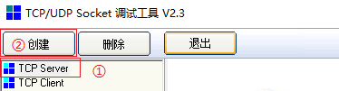{width="374" height="101"}

> 图1.Socket 创建服务器

2、软件弹出监听端口输入框，输入通信端口号。如图2所示：

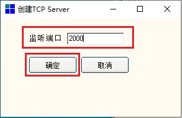{width="307" height="199"}

> 图2.Socket 设置通信端口

3、输入监听端口后，软件会自动启动TCP Server
Socket对指定的通信端口进行监听。如图3所示：

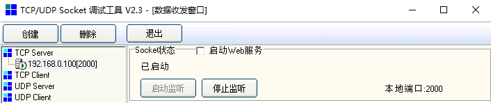{width="706" height="148"}

> 图3.Socket 开启侦听

#### 创建TCP Client

1、打开TIA Portal V16,创建一个新项目,添加CPU1214C DC/DC/DC
V4.4并设置CPU的IP地址。如图4所示：

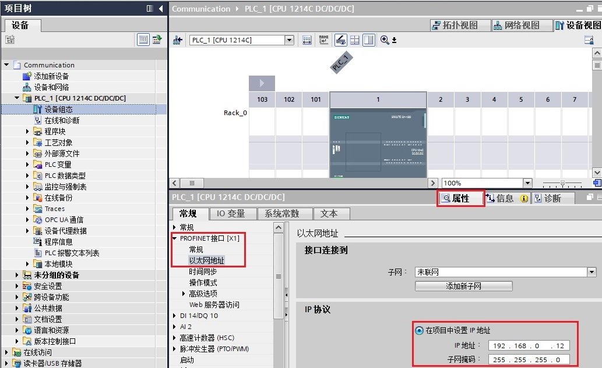{width="1033" height="633"}

> 图4.设置IP地址

2、添加TCP通信指令。如图5所示：

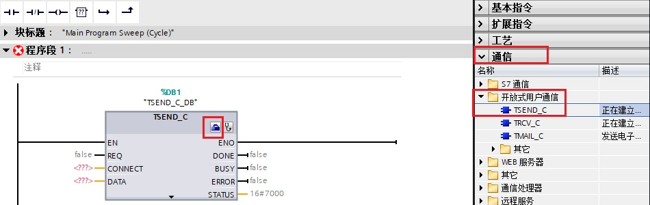{width="950" height="300"}

> 图5.调用TCP通信指令

3、对通信进行组态。如图6所示：

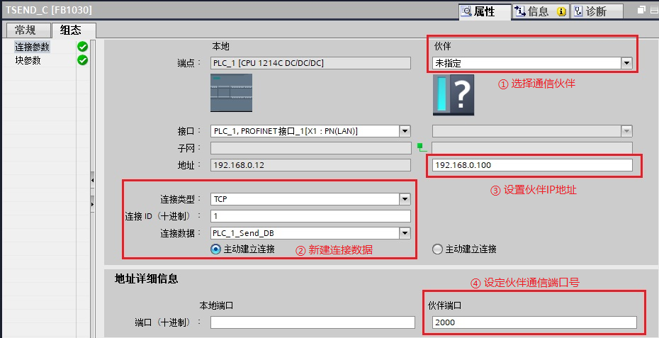{width="930" height="477"}

> 图6.组态通信连接

4、编写发送和接收指令并下载。如图7所示：

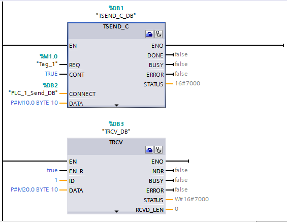{width="565" height="437"}

> 图7.数据收发指令

**注意**：S7-1200作为客户端时，调用并下载TSEND_C后CPU会自动周期性地发送TCP连接请求直到被服务器侦听到从而建立TCP连接。

5、确认连接。如图8所示：

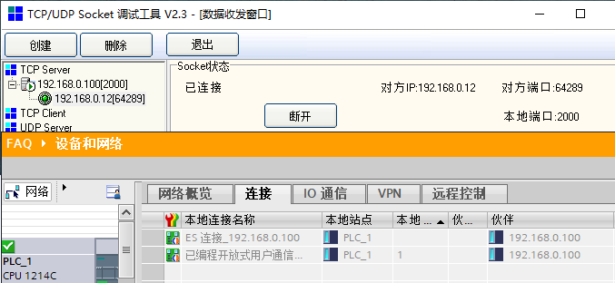{width="677" height="312"}

> 图8.TCP连接建立

6、数据的发送和接收。如图9所示：

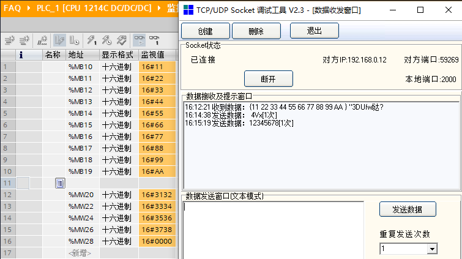{width="755" height="423"}

> 图9.数据交换
>
> 注意：本例中调试助手是按照ASCII发送，所以发送12345678，S7-1200这边接收会显示十六进制，也就是16#3132333435363738。

### []{#Server}S7-1200作为服务器

#### 创建TCP Server

1、打开TIA Portal V16,创建一个新项目,添加CPU1214C DC/DC/DC
V4.4并设置CPU的IP地址。如图10所示：

{width="1033" height="633"}

> 图10.设置IP地址

2、添加TCP通信指令。如图11所示：

{width="950" height="300"}

> 图11.调用TCP通信指令

3、对通信进行组态。如图12所示：

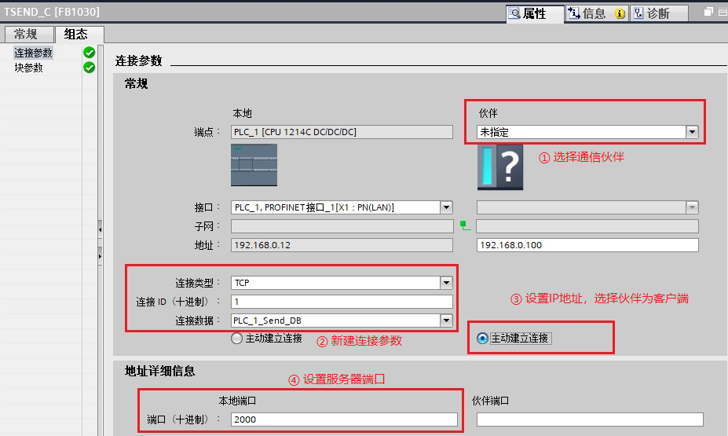{width="927" height="555"}

> 图12.组态通信连接

4、编写发送和接收指令并下载。如图13所示：

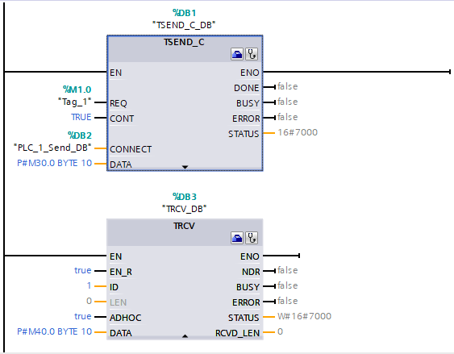{width="563" height="439"}

> 图13.数据收发指令

**注意**：S7-1200作为服务器时，调用并下载TSEND_C后CPU会自动开启针对指定端口的侦听直到建立TCP连接。

#### 创建TCP Client

1、打开调试软件，选中左方的TCP Client，然后点击"创建"按钮。如图14所示：

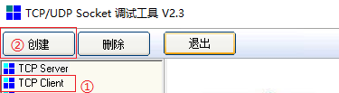{width="375" height="103"}

> 图14. Socket 创建客户端

2、软件弹出输入框，输入服务器IP地址和通信端口号。如图15所示：

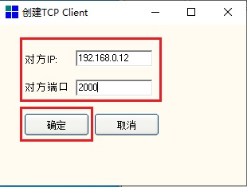{width="310" height="235"}

> 图15.设置服务器IP地址和端口

3、确认后，软件不会自动连接TCP Server，点击"连接"按钮即可连接TCP
Server。如图16所示：

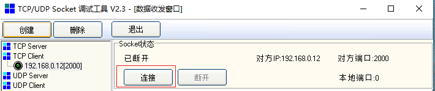{width="710" height="149"}

> 图16.客户端创建完成

4、确认连接。如图17所示：

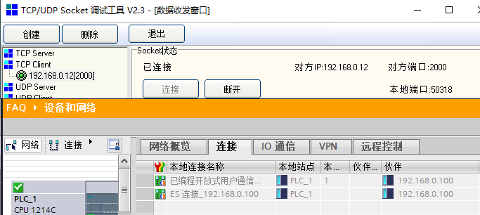{width="683" height="306"}

> 图17.TCP建立连接

5、数据发送。如图18所示：

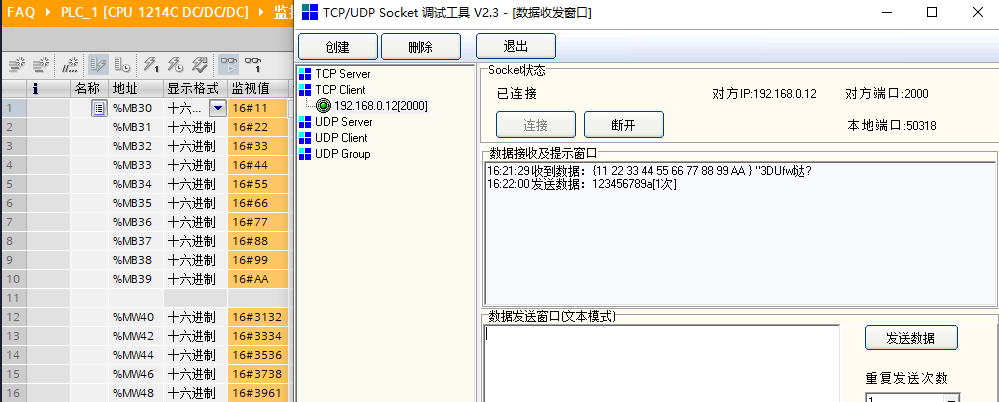{width="999" height="402"}

> 图18.数据交互
>
> 注意：本例中调试助手是按照ASCII发送，所以发送123456789a，S7-1200这边接收会显示十六进制，也就是16#31323334353637383961。
