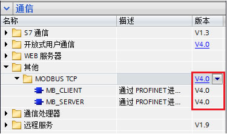
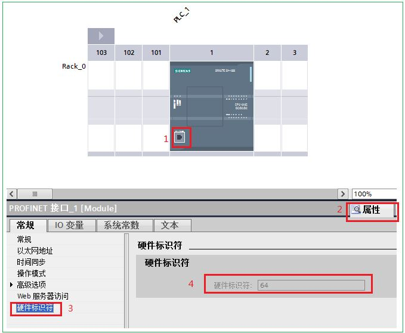
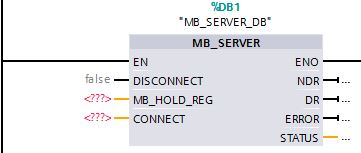
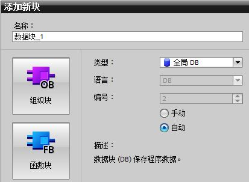
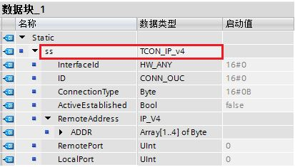
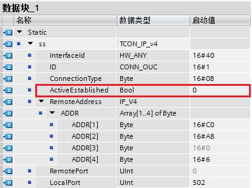
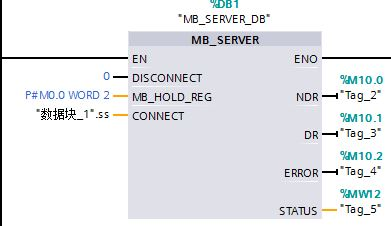
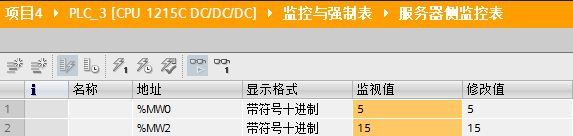
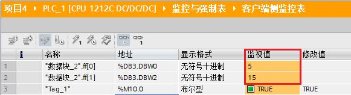

### S7-1200 Modbus TCP 通信服务器指令块 MB_SERVER

STEP 7 V13 SP1 软件版本中的 Modbus TCP 指令目前最新的版本已升至
V4.0，如图 1 所示。该版本的使用需要具备以下两个条件：

1\. 软件版本： STEP 7 V13 SP1 及其以上

2\. 固件版本： S7-1200 CPU 的固件版本 V4.1 及其以上

{width="375" height="221"}

图1. Modbus TCP V4.0 版本指令块

V4.0 作为 Modbus TCP 新版指令的第一个基础版本，后续版本新增内容参见：

-   V5.0 版本新功能文档参见[链接](../04-Modbus_TCP_V5.htm)。
-   V6.0 版本新功能文档参见[链接](../05-Modbus_TCP_V6.htm)。

V4.0 版本 Modbus TCP 客户端文档参见[链接](01-Client.html)。

旧版指令主要应用于固件版本 V4.0 及其以前的 CPU：

-   客户端指令块文档参见[链接](../02-Modbus_TCP_old/01-Client.htm)。
-   服务器指令块文档参见[链接](../02-Modbus_TCP_old/02-Server.htm)。

### S7-1200 Modbus TCP 实验环境

下面以两台 S7-1200 之间进行 Modbus TCP
通信为例，详细阐述客户端与服务器侧如何编程及通信的过程，本文档只介绍服务器部分组态编程，客户端部分参见[链接](01-Client.html)。

表 1 列出了具体的实验环境，表 2 列出了双方 CPU 通信所需主要参数。

+-----------------------------------+-----------------------------------+
| 操作系统                          | WIN7 SP1 专业版 64 位             |
+-----------------------------------+-----------------------------------+
| 编程软件                          | STEP 7 Professional V13 SP1       |
|                                   | Update 5                          |
+-----------------------------------+-----------------------------------+
| 系统硬件                          | 1.  CPU1212C                      |
|                                   |     6ES7212-1AE40-0XB0 V4.1       |
|                                   | 2.  CPU1215C 6ES7215-1AG40-0XB0   |
|                                   |     V4.1                          |
+-----------------------------------+-----------------------------------+

表1. Modbus TCP 通信的实验环境

+-------------+-------------+-------------+-------------+-------------+
|             | ::: {alig   | ::: {alig   | ::: {alig   | ::: {alig   |
|             | n="center"} | n="center"} | n="center"} | n="center"} |
|             | CPU类型     | IP 地址     | 端口号      | 硬件标识符  |
|             | :::         | :::         | :::         | :::         |
+-------------+-------------+-------------+-------------+-------------+
| ::: {alig   | ::: {alig   | ::: {alig   | ::: {alig   | ::: {alig   |
| n="center"} | n="center"} | n="center"} | n="center"} | n="center"} |
| 客户端      | CPU 1212C   | 192.168.0.6 | 0           | 64          |
| :::         | :::         | :::         | :::         | :::         |
+-------------+-------------+-------------+-------------+-------------+
| ::: {alig   | ::: {alig   | ::: {alig   | ::: {alig   | ::: {alig   |
| n="center"} | n="center"} | n="center"} | n="center"} | n="center"} |
| 服务器      | CPU 1215C   | 192.168.0.4 | 502         | 64          |
| :::         | :::         | :::         | :::         | :::         |
+-------------+-------------+-------------+-------------+-------------+

表2. Modbus TCP 通信双方的基本配置

硬件标识符是在"设备组态"中，双击 PROFINET
接口，然后在"属性"中的"硬件标识符"中查看，如图 2 所示。

{width="679" height="558"}

图 2. S7-1200 设备的 PROFINET 接口硬件标识符

### S7-1200 Modbus TCP 服务器编程

"MB_SERVER"指令将处理 Modbus TCP 客户端的连接请求、接收并处理 Modbus
请求并发送响应。

**1.** **调用 MB_SERVER**

将 MB_SERVER 指令块在" 程序块 \> OB1
"中的程序段里调用，调用时会自动生成背景 DB ，点击确定即可，如图 3 所示。

{width="361" height="153"}

图 3. 调用 MB_SERVER 指令块

该功能块各个引脚定义如表 3 所示：

  ------------- ---------------------------------------------------------------------------------------------------------------------------------------------------------------------------------------------------------------------------------
  **参数**      **说明**
  DISCONNET     0（默认）：被动建立与客户端的通信连接；1：终止连接。
  MB_HOLD_REG   指向 Modbus 保持寄存器的数据区。可以设为数据块或 M 存储区地址。数据块可以为优化的数据块，也可以为非优化的数据块。对于优化数据块只能是基本数据类型的数组。对于非优化的数据块没有要求，一般通过 P# 指针的形式输入。具体参见表 4。
  CONNECT       指向连接描述结构的指针。使用 TCON_IP_v4 数据类型。
  NDR           0：无新写入的数据；1：Modbus 客户端写入了新的数据。
  DR            0：未读取数据；1： Modbus 客户端读取了数据
  ERROR         错误位：0：无错误；1：出现错误，错误原因查看 STATUS。
  STATUS        指令的详细状态信息。
  ------------- ---------------------------------------------------------------------------------------------------------------------------------------------------------------------------------------------------------------------------------

表 3. MB_SERVER 各个引脚定义说明

Modbus TCP 服务器数据区定义，参见表 4。

+-----------------------+-----------------------+-----------------------+
| 地址区                | 定义                  | 说明                  |
+=======================+=======================+=======================+
| 输出位                | Q0.0 开始             | -                     |
|                       |                       |    ::: {align="left"} |
|                       |                       |     Q0.0 为地址       |
|                       |                       |     1，Q0.1 为地址    |
|                       |                       |     2，Q0.7 为地址    |
|                       |                       |     8，Q1.0 为地址    |
|                       |                       |     9\...             |
|                       |                       |     :::               |
+-----------------------+-----------------------+-----------------------+
| 输入位                | I0.0 开始             | -                     |
|                       |                       |    ::: {align="left"} |
|                       |                       |     I0.0 为地址       |
|                       |                       |     10001，I0.1       |
|                       |                       |     为地址            |
|                       |                       |     10002，I0.7       |
|                       |                       |     为地址            |
|                       |                       |     10008，I1.0       |
|                       |                       |     为地址 10009\...  |
|                       |                       |     :::               |
+-----------------------+-----------------------+-----------------------+
| 输入寄存器            | IW0 开始              | -                     |
|                       |                       |    ::: {align="left"} |
|                       |                       |     IW0 为地址        |
|                       |                       |     30001，IW2 为地址 |
|                       |                       |     30002，IW4 为地址 |
|                       |                       |     30003\...         |
|                       |                       |     :::               |
+-----------------------+-----------------------+-----------------------+
| 保持寄存器            | 由 MB_HOLD_REG 定义   | -                     |
|                       |                       |    ::: {align="left"} |
|                       |                       |                       |
|                       |                       |  指针指向的第一个字为 |
|                       |                       |     40001，第二个字为 |
|                       |                       |     40002\...         |
|                       |                       |                       |
|                       |                       | -   例如：MB_HOLD_REG |
|                       |                       |         为 P#M100.0   |
|                       |                       |         WORD 8，则    |
|                       |                       |         MW100 为      |
|                       |                       |         40001，MW102  |
|                       |                       |         为            |
|                       |                       |         40002，MW104  |
|                       |                       |         为            |
|                       |                       |                       |
|                       |                       |        40003\...MW114 |
|                       |                       |         为 40008      |
|                       |                       |                       |
|                       |                       | -   例如：MB_HOLD_REG |
|                       |                       |         为 优化 DB 中 |
|                       |                       |         INT           |
|                       |                       |         数            |
|                       |                       | 组\[0..7\]，数组名为  |
|                       |                       |         "XXX".AA，则  |
|                       |                       |         "XXX".AA\[0\] |
|                       |                       |         为            |
|                       |                       |                       |
|                       |                       |  40001，"XXX".AA\[1\] |
|                       |                       |         为            |
|                       |                       |                       |
|                       |                       |  40002，"XXX".AA\[2\] |
|                       |                       |         为            |
|                       |                       |         4             |
|                       |                       | 0003\..."XXX".AA\[7\] |
|                       |                       |         为 40008      |
|                       |                       |     :::               |
+-----------------------+-----------------------+-----------------------+

表 4. 数据区定义

{width="15" height="15"}注意：数据区从指令库版本 V5.0
开始，可以自由定义，方法参见[链接](../04-Modbus_TCP_V5.htm)。

**2. CONNECT 引脚的指针类型**

第一步，先创建一个新的全局数据块 DB2，如图 4 所示：

{width="413" height="303"}

图 4. 创建全局数据块

第二步，双击打开新生成的 DB2
数据块，定义变量名称为"ss\"，数据类型为"TCON_IP_v4"（可以将 TCON_IP_v4
拷贝到该对话框中），然后点击"回车"按键。该数据类型结构创建完毕。如图 5
所示：

{width="413" height="235"}

图 5. 创建 MB_SERVER 中的 TCP 连接结构的数据类型

各个参数定义说明如表 4 所示：

  ------------------- ----------------------------------------------------
  **参数**            **说明**
  InterfaceId         网口硬件标识符，对于本体网口为 64，即16#40。
  ID                  连接 ID，取值范围 1\~4095
  Connection Type     连接类型。TCP 连接默认为：16#0B
  ActiveEstablished   建立连接。主动为 1（客户端），被动为 0（服务器）。
  ADDR                服务器侧的 IP 地址
  RemotePort          远程端口号
  LocalPort           本地端口号
  ------------------- ----------------------------------------------------

表4. TCON_IP_v4 数据结构的引脚定义

客户端侧的 IP 地址为 192.168.0.6，端口号为 0，所以 MB_SERVER
服务器侧该数据结构的各项值如图 6 所示。

{width="415" height="309"}

图 6. MB_SERVER 服务器侧的 CONNECT 数据结构定义

**注意：**

-   CONNECT 引脚的填写需要用**符号寻址**的方式。
-   TCON_IP_v4 是系统数据类型，不是在 PLC 数据类型中创建的。
-   RemotePort 一般使用默认值 0，意思是不指定客户端端口。
-   RemoteAddress 可以不指定，意思是不指定客户端 IP 地址。也可以像图 6
    所示指定客户端地址。

**3. S7-1200 服务器侧 MB_SERVER 编程**

调用 MB_SERVER 指令块，实现被客户端读取 2 个保持寄存器的值，如图7所示。

{width="391" height="226"}

图7. MB_SERVER 服务器侧编程

### []{#a}S7-1200 MODBUS TCP 通信调试

S7-1200 MODBUS TCP 服务器侧准备数据，用于客户端读访问，如图8所示。

{width="573" height="136"}

图8. 服务器侧监控表

S7-1200 MODBUS TCP 客户端侧，给 MB_CLIENT 指令块中 REQ
引脚一个上升沿，监控数据读取成功。如图9所示。

{width="581" height="158"}

图9. 客户端侧监控表
