### S7-1200 与 S7-300 PN/S7-400 PN UDP 通信 TIA 不同项目

S7-1200 与 S7-300 PN 口之间的以太网通信可以通过 UDP
协议来实现，使用的通信指令是在双方 CPU
调用通信-开放式用户通信TSEND_C，TRCV_C（1200支持，300不支持）或TCON，TDISCON，TUSEND，TURCV
指令来实现。通信方式为双边通信，因此 TUSEND 和 TURCV 必须成对出现。

此外对于伙伴是S7-400PN 也可以参考本文档。

### 硬件和软件需求及所完成的通信任务

**测试软/硬件：**

① S7-1214 DC/DC/DC V4.4

② S7-315-2PN/DP V2.6

③ STEP7 V16

**所完成的通信任务：**

① S7-1200 CPU将通讯数据区 DB4 块中的 10 个字节的数据发送到 S7-300
CPU的接收数据区 DB5 块中。

② S7-300 CPU将通讯数据区 DB5 块中的 10 个字节的数据发送到 S7-1200
CPU的接收数据区 DB4 块中。

### S7-1200 侧硬件组态、编程和连接参数的配置

**1.添加1200CPU硬件并命名PLC**

然后进入 "项目视图"，在"项目树" 下双击
"添加新设备"，在对话框中选择所使用的 S7-1200 CPU添加到机架上，命名为
1200，如图1所示。

{width="706" height="695"}

图1. 添加1200 CPU设备

为了编程方便，使用 CPU 属性中定义的时钟位，定义方法如下：

在 "项目树" \> "1200" \> "设备组态" 中，选中 CPU
，然后在下面的属性窗口中，"属性" \> "系统和时钟存储器"
下，将系统位定义在 MB1，时钟字节定义在 MB0，如图2所示。

时钟位使用 M0.5，以 1Hz 的速率自动激活发送任务。

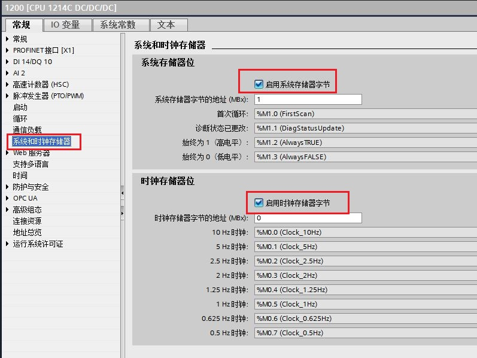{width="797" height="598"}

图2. 启用系统字节与时钟字节

**2.为 PROFINET 通信口分配以太网地址**

在 "设备视图"中点击 CPU 上代表 PROFINET 通信口的绿色小方块，在下方会出现
PROFINET 接口的属性，在 "以太网地址" 下分配 IP 地址为 192.168.0.12
，子网掩码为255.255.255.0，如图3所示。

{width="818" height="581"}

图3. 分配1200CPU IP 地址

**3.在OB1调用"TSEND_C"通信指令**

在 S7-1200 CPU 中调用发送通信指令，进入 "项目树" \> " 1200" \> "程序块"
\> "OB1" 主程序中，从右侧窗口 "指令" \> "通信" \> "开放式用户通信"下调用
"TSEND_C" 指令，创建连接，如图4所示。

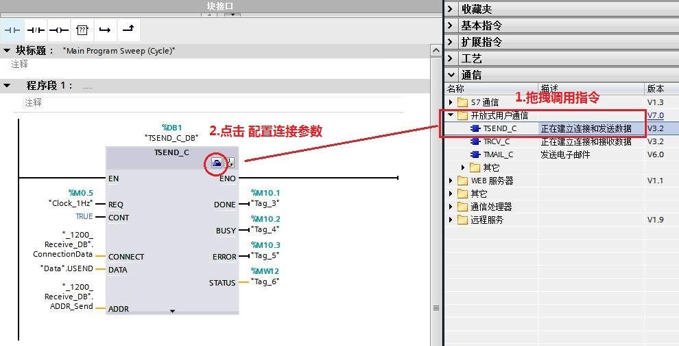{width="990" height="504"}

图4. 调用 TSEND_C 通信指令

**参数说明：**

**输入接口参数：**

+-----------------------+-----------------------+-----------------------+
| ::: {align="left"}    | ::: {align="left"}    | ::: {align="left"}    |
| REQ　　               | := %M0.5              | // 使用 1Hz           |
| :::                   | :::                   | 的时钟脉冲，          |
|                       |                       | 上升沿激活发送任务；  |
|                       |                       | :::                   |
+-----------------------+-----------------------+-----------------------+
| ::: {align="left"}    | ::: {align="left"}    | ::: {align="left"}    |
| CONT                  | := TRUE               | //                    |
| :::                   | :::                   | 创建连接，默认TRUE；  |
|                       |                       | :::                   |
+-----------------------+-----------------------+-----------------------+
| ::: {align="left"}    | ::: {align="left"}    | ::: {align="left"}    |
| CONNECT               | :="\_1200_Receiv      | // UDP连接结构描述；  |
| :::                   | e_DB\".ConnectionData | :::                   |
|                       | :::                   |                       |
+-----------------------+-----------------------+-----------------------+
| ::: {align="left"}    | ::: {align="left"}    | ::: {align="left"}    |
| DATA　                | := \"Data\".USEND     | // 发送数据区的数据； |
| :::                   | :::                   | :::                   |
+-----------------------+-----------------------+-----------------------+
| ::: {align="left"}    | ::: {align="left"}    | ::: {align="left"}    |
| ADDR                  | :="\_1200_R           | //                    |
| :::                   | eceive_DB\".ADDR_Send | UDP通                 |
|                       | :::                   | 讯伙伴的连接参数，包  |
|                       |                       | 括对方IP地址及端口；  |
|                       |                       | :::                   |
+-----------------------+-----------------------+-----------------------+

**输出接口参数：**

+-----------------------+-----------------------+-----------------------+
| ::: {align="left"}    | ::: {align="left"}    | ::: {align="left"}    |
| DONE                  | := %M10.1             | //                    |
| :::                   | :::                   | 任务执行完成          |
|                       |                       | 并且没有错误，该位置  |
|                       |                       | 1；                   |
|                       |                       | :::                   |
+-----------------------+-----------------------+-----------------------+
| ::: {align="left"}    | ::: {align="left"}    | ::: {align="left"}    |
| BUSY　                | := %M10.2             | // 该位为             |
| :::                   | :::                   | 1，代表任务未完       |
|                       |                       | 成，不能激活新任务；  |
|                       |                       | :::                   |
+-----------------------+-----------------------+-----------------------+
| ::: {align="left"}    | ::: {align="left"}    | ::: {align="left"}    |
| ERROR　　　           | := %M10.3             | //                    |
| :::                   | :::                   | 通信过程              |
|                       |                       | 中有错误发生，该位置  |
|                       |                       | 1；                   |
|                       |                       | :::                   |
+-----------------------+-----------------------+-----------------------+
| ::: {align="left"}    | ::: {align="left"}    | ::: {align="left"}    |
| STATUS                | := %MW12              | //                    |
| :::                   | :::                   | 有错误发生时          |
|                       |                       | ，会显示错位信息号。  |
|                       |                       | :::                   |
+-----------------------+-----------------------+-----------------------+

**4.配置 S7-1200 的 "TSEND_C"连接参数**

S7-1200 的 "TSEND_C"指令的连接参数需要在指令下方的属性窗口"属性"\>
"组态"\>"连接参数中"中设置，如图5所示。

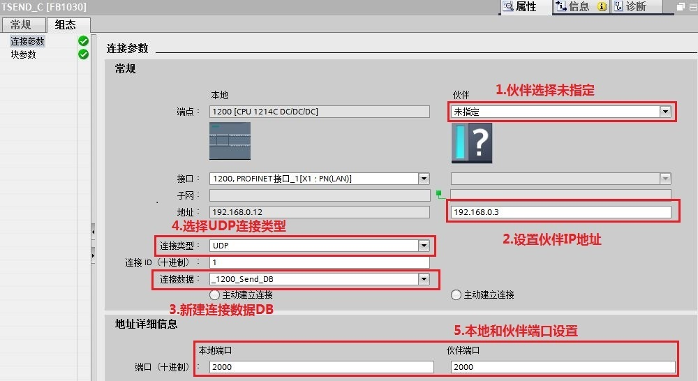{width="1000" height="546"}

图5. 配置 TSEND_C 连接参数

**连接参数说明：**

+-----------------------------------+-----------------------------------+
| ::: {align="left"}                | ::: {align="left"}                |
| 端点                              | ：可以                            |
| :::                               | 通过点击选择按钮选择未指定伙伴；  |
|                                   | :::                               |
+-----------------------------------+-----------------------------------+
| ::: {align="left"}                | ::: {align="left"}                |
| 地址                              | ：输入未指定伙伴的IP地址；        |
| :::                               | :::                               |
+-----------------------------------+-----------------------------------+
| ::: {align="left"}                | ::: {align="left"}                |
| 连接类型                          | ：选择通信协议为 UDP；            |
| :::                               | :::                               |
+-----------------------------------+-----------------------------------+
| ::: {align="left"}                | ::: {align="left"}                |
| 连接 ID　                         | ：连接的地址 ID 号，这个 ID       |
| :::                               | 号在后面的编程里会用到；          |
|                                   | :::                               |
+-----------------------------------+-----------------------------------+
| ::: {align="left"}                | ::: {align="left"}                |
| 连接数据                          | ：点击新建自动生成该数据块；      |
| :::                               | :::                               |
+-----------------------------------+-----------------------------------+
| ::: {align="left"}                | ::: {align="left"}                |
| 主动建立连接                      | ： 此功能在UDP连接时，不能选择；  |
| :::                               | :::                               |
+-----------------------------------+-----------------------------------+
| ::: {align="left"}                | ::: {align="left"}                |
| 地址详细信息　                    | ：定义本地通信的端                |
| :::                               | 口号为：2000，伙伴端口为：2000；  |
|                                   | :::                               |
+-----------------------------------+-----------------------------------+

**5.创建并定义 S7-1200 的发送/接收数据区 DB4 块**

通过"项目树"\>"1200"\>"程序块"\>"添加新块"，选择"数据块" 创建 DB4
命名为"Data"。定义发送数据区USDED为 10 个字节的数组，接收数据区URCV为 10
个字节的数组，如图6所示。

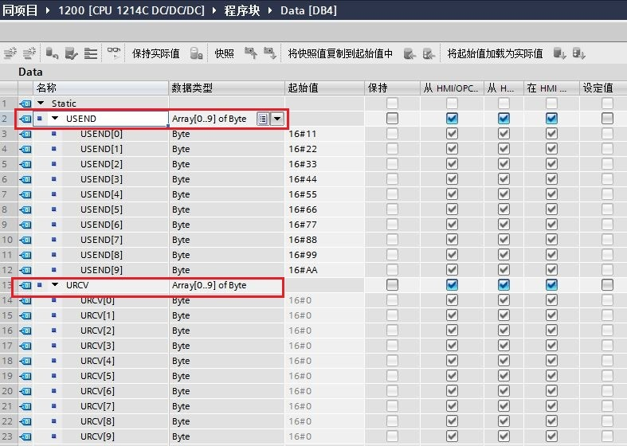{width="787" height="560"}

图6. 创建发送/接收数据区 DB 块

**6.在OB1调用"TRCV_C"通信指令**

进入 "项目树" \> "1200" \> "程序块" \> "OB1 " 主程序中，从右侧窗口
"指令" \> "通讯" \> "开放式用户通信"下调用 "TRCV_C" 指令，如图7所示。

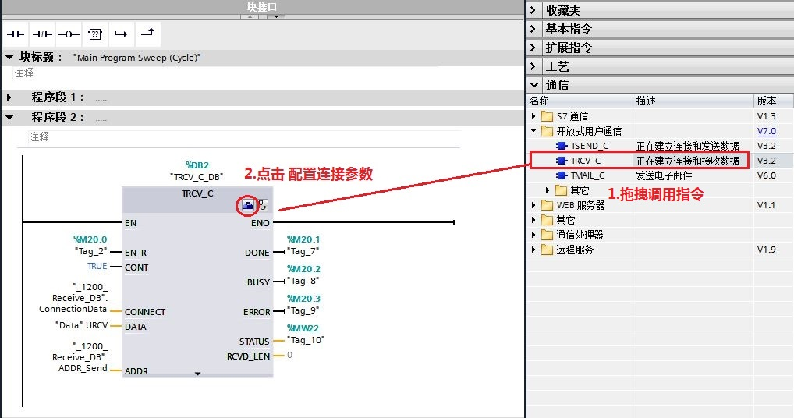{width="1018" height="536"}

图7. 调用 TRCV_C 通信指令

**参数说明：**

**输入接口参数：**

+-----------------------+-----------------------+-----------------------+
| ::: {align="left"}    | ::: {align="left"}    | ::: {align="left"}    |
| REQ　　               | := %M20.0             | // 准备好接收数据     |
| :::                   | :::                   | M20.0=TRUE；          |
|                       |                       | :::                   |
+-----------------------+-----------------------+-----------------------+
| ::: {align="left"}    | ::: {align="left"}    | ::: {align="left"}    |
| CONT                  | := TRUE               | //                    |
| :::                   | :::                   | 创建连接，默认TRUE；  |
|                       |                       | :::                   |
+-----------------------+-----------------------+-----------------------+
| ::: {align="left"}    | ::: {align="left"}    | ::: {align="left"}    |
| CONNECT               | :="\_1200_Receiv      | // UDP连接结构描述；  |
| :::                   | e_DB\".ConnectionData | :::                   |
|                       | :::                   |                       |
+-----------------------+-----------------------+-----------------------+
| ::: {align="left"}    | ::: {align="left"}    | ::: {align="left"}    |
| DATA　                | := \"Data\".URCV      | // 接收数据区的数据； |
| :::                   | :::                   | :::                   |
+-----------------------+-----------------------+-----------------------+
| ::: {align="left"}    | ::: {align="left"}    | ::: {align="left"}    |
| ADDR                  | :="\_1200_R           | //                    |
| :::                   | eceive_DB\".ADDR_Send | UDP通                 |
|                       | :::                   | 讯伙伴的连接参数，包  |
|                       |                       | 括对方IP地址及端口；  |
|                       |                       | :::                   |
+-----------------------+-----------------------+-----------------------+

**输出接口参数：**

+-----------------------+-----------------------+-----------------------+
| ::: {align="left"}    | ::: {align="left"}    | ::: {align="left"}    |
| DONE                  | := %M20.1             | //                    |
| :::                   | :::                   | 任务执行完成          |
|                       |                       | 并且没有错误，该位置  |
|                       |                       | 1；                   |
|                       |                       | :::                   |
+-----------------------+-----------------------+-----------------------+
| ::: {align="left"}    | ::: {align="left"}    | ::: {align="left"}    |
| BUSY　                | := %M20.2             | // 该位为             |
| :::                   | :::                   | 1，代表任务未完       |
|                       |                       | 成，不能激活新任务；  |
|                       |                       | :::                   |
+-----------------------+-----------------------+-----------------------+
| ::: {align="left"}    | ::: {align="left"}    | ::: {align="left"}    |
| ERROR　　　           | := %M20.3             | //                    |
| :::                   | :::                   | 通信过程              |
|                       |                       | 中有错误发生，该位置  |
|                       |                       | 1；                   |
|                       |                       | :::                   |
+-----------------------+-----------------------+-----------------------+
| ::: {align="left"}    | ::: {align="left"}    | ::: {align="left"}    |
| STATUS                | := %MW22              | //                    |
| :::                   | :::                   | 有错误发生时          |
|                       |                       | ，会显示错位信息号。  |
|                       |                       | :::                   |
+-----------------------+-----------------------+-----------------------+

**7.配置 S7-1200 的 "TRCV_C"连接参数**

S7-1200 的 "TRCV_C"指令的连接参数需要在指令下方的属性窗口"属性"\>
"组态"\>"连接参数中"中设置，如图8所示。

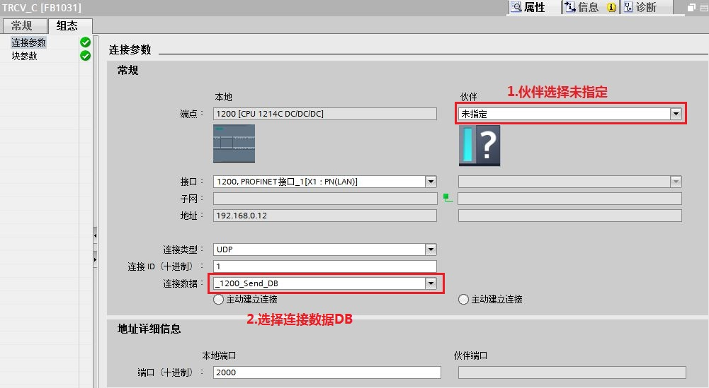{width="1001" height="549"}

图8. 配置 TRCV_C 连接参数

**连接参数说明：**

+-----------------------------------+-----------------------------------+
| ::: {align="left"}                | ::: {align="left"}                |
| 端点                              | ：可以                            |
| :::                               | 通过点击选择按钮选择未指定伙伴；  |
|                                   | :::                               |
+-----------------------------------+-----------------------------------+
| ::: {align="left"}                | ::: {align="left"}                |
| 连接类型                          | ：选择通信协议为 UDP；            |
| :::                               | :::                               |
+-----------------------------------+-----------------------------------+
| ::: {align="left"}                | ::: {align="left"}                |
| 连接 ID　                         | ：连接的地址 ID 号，这个 ID       |
| :::                               | 号在后面的编程里会用到；          |
|                                   | :::                               |
+-----------------------------------+-----------------------------------+
| ::: {align="left"}                | ::: {align="left"}                |
| 连接数据                          | ：点击新建自动生成该数据块；      |
| :::                               | :::                               |
+-----------------------------------+-----------------------------------+
| ::: {align="left"}                | ::: {align="left"}                |
| 主动建立连接                      | ： 此功能在UDP连接时，不能选择；  |
| :::                               | :::                               |
+-----------------------------------+-----------------------------------+
| ::: {align="left"}                | ::: {align="left"}                |
| 地址详细信息　                    | ：                                |
| :::                               | 定义本地通信的端口号为：2000。　  |
|                                   | :::                               |
+-----------------------------------+-----------------------------------+

1200CPU侧配置和编程完成，编译并存盘。

### S7-300PN 侧硬件组态、编程和连接参数的配置

**1.添加300CPU硬件并命名PLC**

然后进入 "项目视图"，在"项目树" 下双击
"添加新设备"，在对话框中选择所使用的 S7-300 CPU 添加到机架上，命名为
300PN，如图9所示。

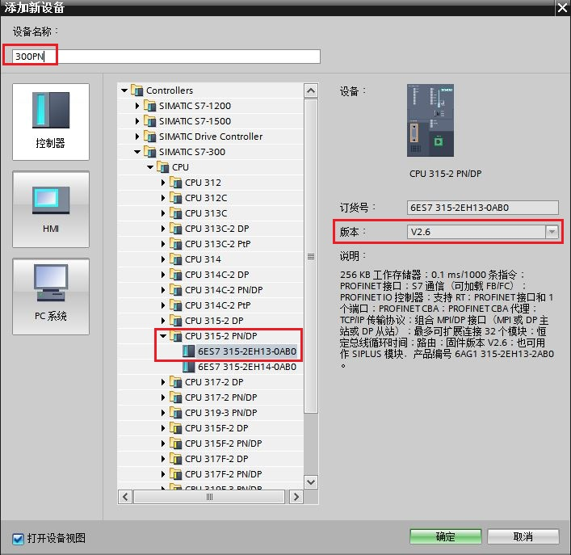{width="706" height="692"}

图9. 添加300 CPU设备

为了编程方便，使用 CPU 属性中定义的时钟位，定义方法如下：

在 "项目树" \> "300PN" \> "设备组态" 中，选中 CPU
，然后在下面的属性窗口中，"属性" \> "时钟存储器" 下时钟字节定义在
MB0，如图10所示。

时钟位使用 M0.5，以 1Hz 的速率自动激活发送任务。

{width="619" height="357"}

图10. 启动时钟存储器

**2.为 PROFINET 通信口分配以太网地址**

在 "设备视图"中点击 CPU 上代表 PROFINET 通信口的绿色小方块，在下方会出现
PROFINET 接口的属性，在 "以太网地址" 下分配 IP 地址为
192.168.0.3，子网掩码为255.255.255.0，如图11所示。

{width="871" height="487"}

图11. 分配300CPU IP 地址

**3.在 S7-300 中调用"TCON"（300不支持TSEND_C和TRCV_C）通信指令**

在S7-300 CPU 中调用通信指令，进入 "项目树" \> " 300PN" \> "程序块" \>
"OB1" 主程序中，从右侧窗口 "指令" \> "通讯" \> "开放式用户通信"下调用
"TCON" 指令，创建连接，如图12所示。

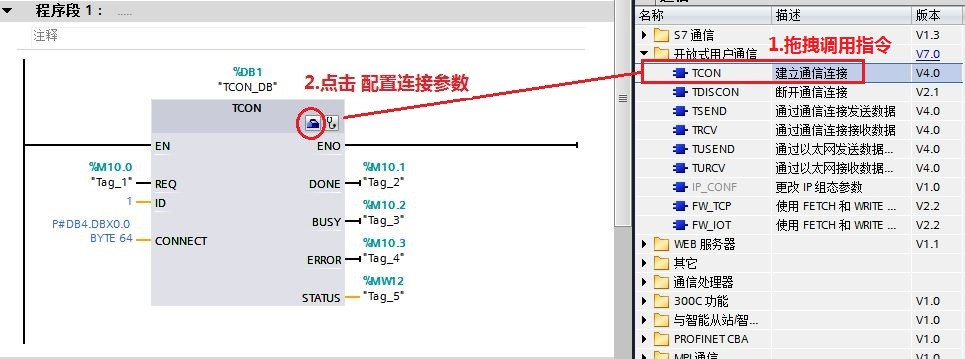{width="965" height="359"}

图12. 调用 TCON 通信指令

**4.配置S7-300 的 "TCON"连接参数**

S7-300 的 "TCON"指令的连接参数需要在指令下方的属性窗口"属性"\>
"组态"\>"连接参数中"中设置，如图13所示。

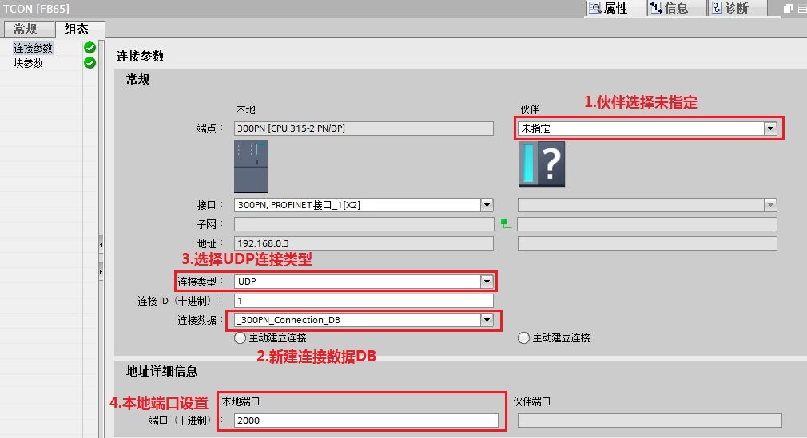{width="1010" height="549"}

图13. 配置 TCON 连接参数

**连接参数说明：**

+-----------------------------------+-----------------------------------+
| ::: {align="left"}                | ::: {align="left"}                |
| 端点                              | ：可以                            |
| :::                               | 通过点击选择按钮选择未指定伙伴；  |
|                                   | :::                               |
+-----------------------------------+-----------------------------------+
| ::: {align="left"}                | ::: {align="left"}                |
| 连接类型                          | ：选择通信协议为 UDP；            |
| :::                               | :::                               |
+-----------------------------------+-----------------------------------+
| ::: {align="left"}                | ::: {align="left"}                |
| 连接 ID　                         | ：连接的地址 ID 号，这个 ID       |
| :::                               | 号在后面的编程里会用到；          |
|                                   | :::                               |
+-----------------------------------+-----------------------------------+
| ::: {align="left"}                | ::: {align="left"}                |
| 连接数据                          | ：点击新建自动生成该数据块；      |
| :::                               | :::                               |
+-----------------------------------+-----------------------------------+
| ::: {align="left"}                | ::: {align="left"}                |
| 主动建立连接                      | ： 此功能在UDP连接时，不能选择；  |
| :::                               | :::                               |
+-----------------------------------+-----------------------------------+
| ::: {align="left"}                | ::: {align="left"}                |
| 地址详细信息　                    | ：定义本地通信的端口号为：2000。  |
| :::                               | :::                               |
+-----------------------------------+-----------------------------------+

**5.创建并定义 S7-300 的发送/接收数据区和UDP 连接参数数据块 DB5 块**

通过"项目树"\>"300PN"\>"程序块"\>"添加新块"，选择"数据块" 创建 DB5
命名为"Data"。定义发送数据区USDED为 10 个字节的数组，接收数据区URCV为 10
个字节的数组；

定义UDP
连接参数数据，数据类型为"TADDR_PAR"，包含伙伴的IP地址和端口号信息（如对方1200
CPU 的 IP：192.168.0.12，端口号：2000）。如图14所示。

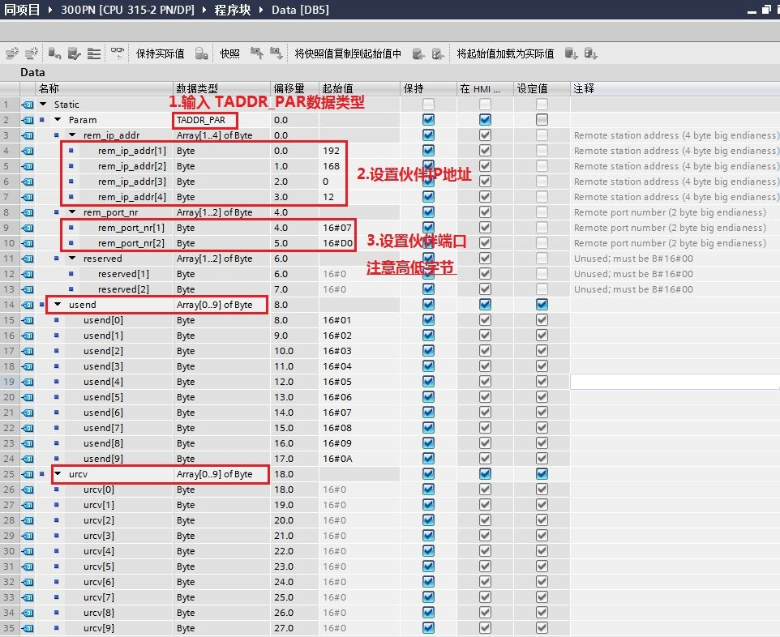{width="962" height="786"}

图14. 创建发送/接收数据区和UDP 连接参数数据块DB 块

**6.在 OB1 内调用"TUSEND" 通信指令**

进入 "项目树" \> "300PN" \> "程序块" \> "OB1 " 主程序中，从右侧窗口
"指令" \> "通讯" \> "开放式用户通信"下调用 "TUSEND"
指令，配置接口参数，如图15所示。

{width="971" height="436"}

图15. 调用 TUSEND 通信指令

**参数说明：**

**输入接口参数：**

+-----------------------+-----------------------+-----------------------+
| ::: {align="left"}    | ::: {align="left"}    | ::: {align="left"}    |
| REQ　　               | : = %M0.5             | // 使用 1Hz           |
| :::                   | :::                   | 的时钟脉冲，          |
|                       |                       | 上升沿激活发送任务；  |
|                       |                       | :::                   |
+-----------------------+-----------------------+-----------------------+
| ::: {align="left"}    | ::: {align="left"}    | ::: {align="left"}    |
| ID                    | : = 1                 | // 创建连接ID；       |
| :::                   | :::                   | :::                   |
+-----------------------+-----------------------+-----------------------+
| ::: {align="left"}    | ::: {align="left"}    | ::: {align="left"}    |
| LEN                   | := 10                 | // 发送数据长度；     |
| :::                   | :::                   | :::                   |
+-----------------------+-----------------------+-----------------------+
| ::: {align="left"}    | ::: {align="left"}    | ::: {align="left"}    |
| DATA　                | : = \"Data\".usend    | // 发送数据区的数据； |
| :::                   | :::                   | :::                   |
+-----------------------+-----------------------+-----------------------+
| ::: {align="left"}    | ::: {align="left"}    | ::: {align="left"}    |
| ADDR                  | : = \"Data\".Param    | //                    |
| :::                   | :::                   | UDP通讯伙伴的连接参   |
|                       |                       | 数，包括对方IP地址及  |
|                       |                       | 端口，使用指针寻址；  |
|                       |                       | :::                   |
+-----------------------+-----------------------+-----------------------+

**输出接口参数：**

+-----------------------+-----------------------+-----------------------+
| ::: {align="left"}    | ::: {align="left"}    | ::: {align="left"}    |
| DONE                  | := %M20.1             | //                    |
| :::                   | :::                   | 任务执行完成          |
|                       |                       | 并且没有错误，该位置  |
|                       |                       | 1；                   |
|                       |                       | :::                   |
+-----------------------+-----------------------+-----------------------+
| ::: {align="left"}    | ::: {align="left"}    | ::: {align="left"}    |
| BUSY　                | := %M20.2             | // 该位为             |
| :::                   | :::                   | 1，代表任务未完       |
|                       |                       | 成，不能激活新任务；  |
|                       |                       | :::                   |
+-----------------------+-----------------------+-----------------------+
| ::: {align="left"}    | ::: {align="left"}    | ::: {align="left"}    |
| ERROR　　　           | := %M20.3             | //                    |
| :::                   | :::                   | 通信过程              |
|                       |                       | 中有错误发生，该位置  |
|                       |                       | 1；                   |
|                       |                       | :::                   |
+-----------------------+-----------------------+-----------------------+
| ::: {align="left"}    | ::: {align="left"}    | ::: {align="left"}    |
| STATUS                | := %MW22              | //                    |
| :::                   | :::                   | 有错误发生时          |
|                       |                       | ，会显示错位信息号。  |
|                       |                       | :::                   |
+-----------------------+-----------------------+-----------------------+

**7.在 OB1 内调用"TURCV" 通信指令**

进入 "项目树" \> "300PN" \> "程序块" \> "OB1 " 主程序中，从右侧窗口
"指令" \> "通讯" \> "开放式用户通信"下调用 "TURCV"
指令，配置接口参数，如图16所示。

{width="976" height="520"}

图16. 调用 TURCV 指令并配置接口参数

**参数说明：**

**输入接口参数：**

+-----------------------+-----------------------+-----------------------+
| ::: {align="left"}    | ::: {align="left"}    | ::: {align="left"}    |
| EN_R                  | := M30.0              | // 准备好接收数据     |
| :::                   | :::                   | M30.0=TRUE；          |
|                       |                       | :::                   |
+-----------------------+-----------------------+-----------------------+
| ::: {align="left"}    | ::: {align="left"}    | ::: {align="left"}    |
| ID                    | := 1                  | // 连接号，使用的是   |
| :::                   | :::                   | TCON 的连接参数中     |
|                       |                       | ID号；                |
|                       |                       | :::                   |
+-----------------------+-----------------------+-----------------------+
| ::: {align="left"}    | ::: {align="left"}    | ::: {align="left"}    |
| LEN                   | := 10                 | // 接收数据长度为 10  |
| :::                   | :::                   | 个字节；              |
|                       |                       | :::                   |
+-----------------------+-----------------------+-----------------------+
| ::: {align="left"}    | ::: {align="left"}    | ::: {align="left"}    |
| DATA                  | : = \"Data\".urcv     | // 接收数据区的地址； |
| :::                   | :::                   | :::                   |
+-----------------------+-----------------------+-----------------------+
| ::: {align="left"}    | ::: {align="left"}    | ::: {align="left"}    |
| ADDR                  | : = \"Data\".Param    | //                    |
| :::                   | :::                   | UDP通讯伙伴的连接参   |
|                       |                       | 数，包括对方IP地址及  |
|                       |                       | 端口，使用指针寻址；  |
|                       |                       | :::                   |
+-----------------------+-----------------------+-----------------------+

**输出接口参数：**

+-----------------------+-----------------------+-----------------------+
| ::: {align="left"}    | ::: {align="left"}    | ::: {align="left"}    |
| NDR                   | := %M30.1             | // 该位为             |
| :::                   | :::                   | 1，接收任务成功完成； |
|                       |                       | :::                   |
+-----------------------+-----------------------+-----------------------+
| ::: {align="left"}    | ::: {align="left"}    | ::: {align="left"}    |
| BUSY                  | := %M30.2             | // 该位为             |
| :::                   | :::                   | 1，代表任务未完       |
|                       |                       | 成，不能激活新任务；  |
|                       |                       | :::                   |
+-----------------------+-----------------------+-----------------------+
| ::: {align="left"}    | ::: {align="left"}    | ::: {align="left"}    |
| ERROR                 | := %M30.2             | //                    |
| :::                   | :::                   | 通信过程              |
|                       |                       | 中有错误发生，该位置  |
|                       |                       | 1；                   |
|                       |                       | :::                   |
+-----------------------+-----------------------+-----------------------+
| ::: {align="left"}    | ::: {align="left"}    | ::: {align="left"}    |
| STATUS                | := %MW32              | //                    |
| :::                   | :::                   | 有错误发生时          |
|                       |                       | ，会显示错误信息号；  |
|                       |                       | :::                   |
+-----------------------+-----------------------+-----------------------+
| ::: {align="left"}    | ::: {align="left"}    | ::: {align="left"}    |
| RCVD_LEN　　          | :::                   | //                    |
| :::                   |                       | 实                    |
|                       |                       | 际接收数据的字节数。  |
|                       |                       | :::                   |
+-----------------------+-----------------------+-----------------------+

300CPU侧配置和编程完成，编译并存盘。

### 下载硬件组态及程序并监控通信结果

下载两个 CPU 中的所有硬件组态及程序，实现 两个 CPU
之间数据交换，监控结果如图17-18所示。

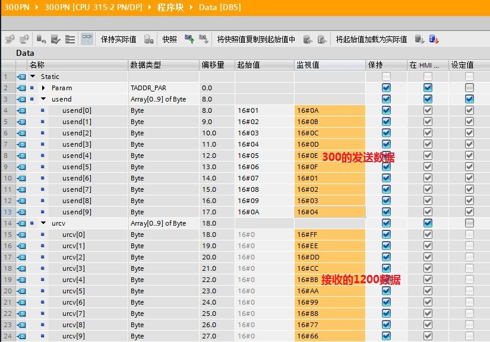{width="825" height="576"}

图17 300侧数据

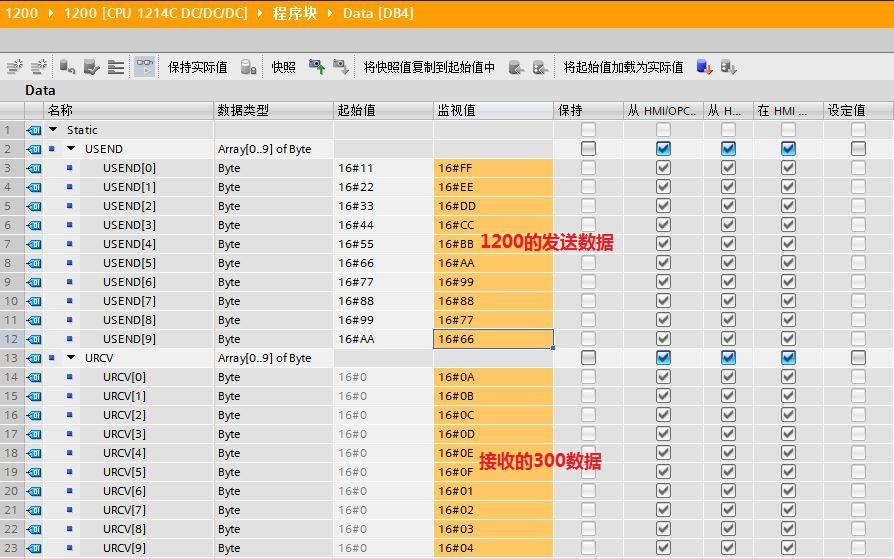{width="894" height="559"}

图18. 1200侧数据

### 附加说明

如果通信异常，请参考以下附加说明：[链接](04-Additional.html)。
