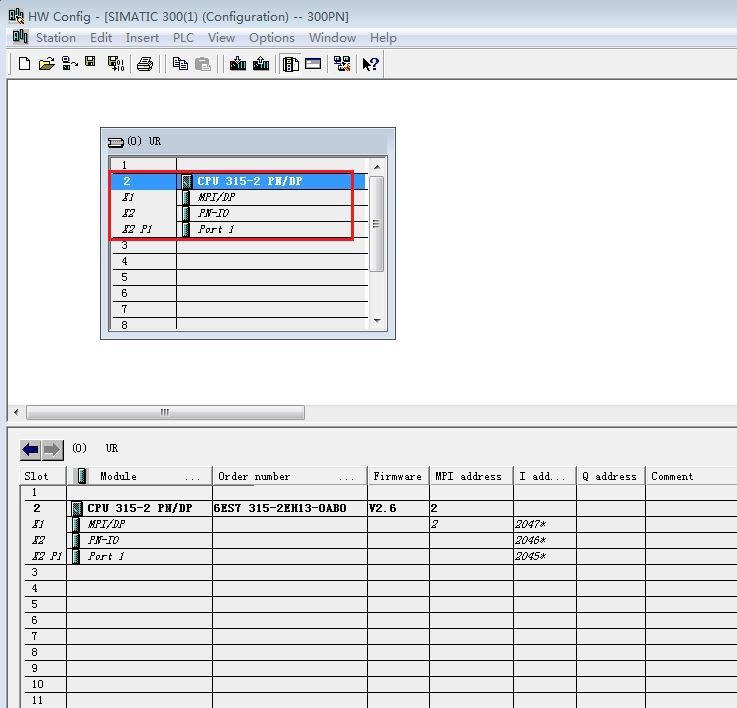
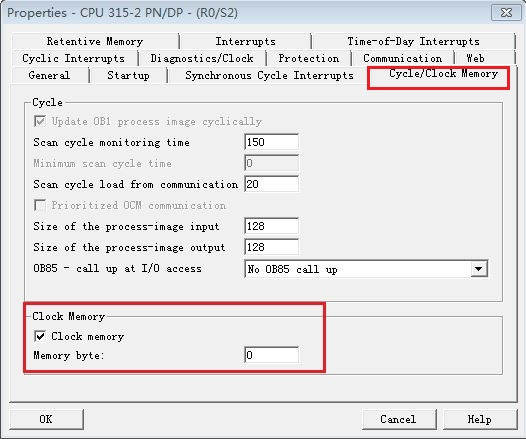
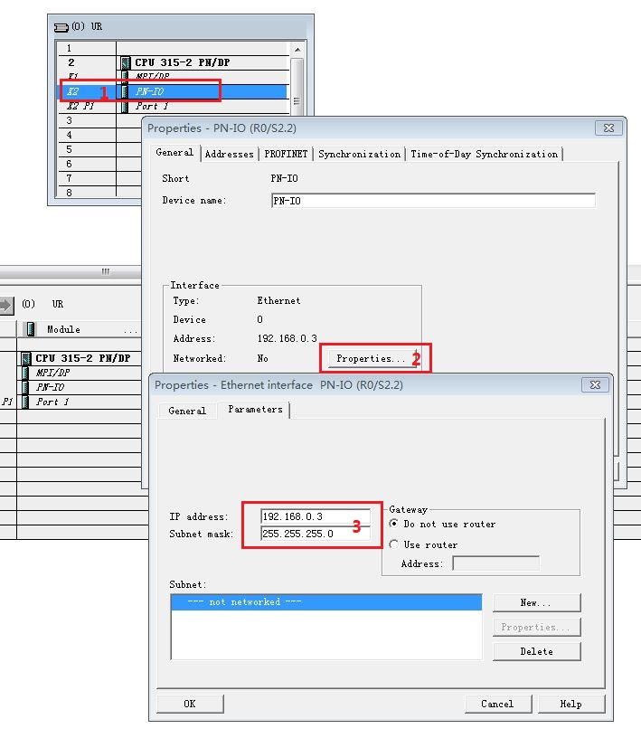
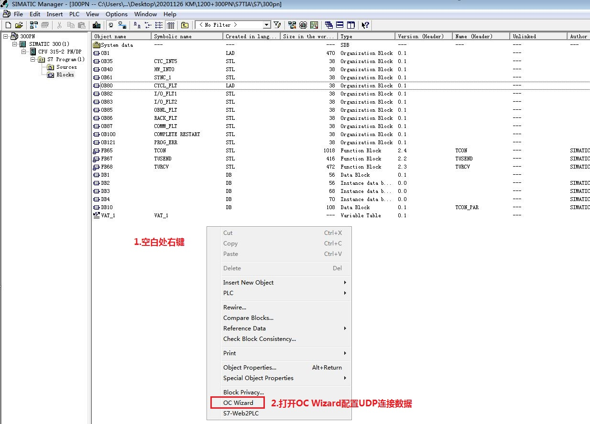
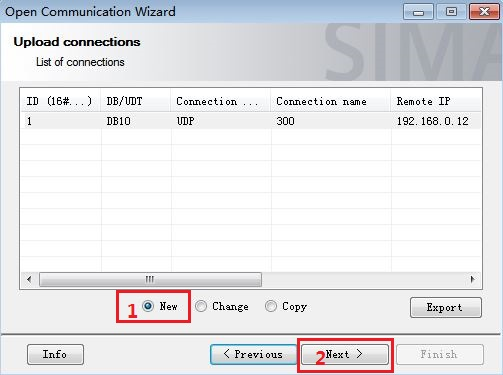
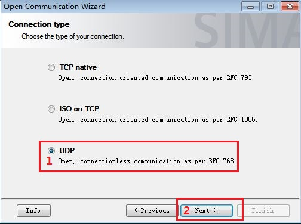
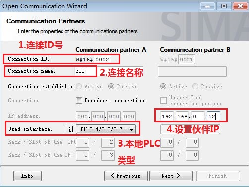
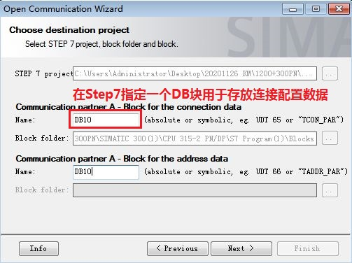
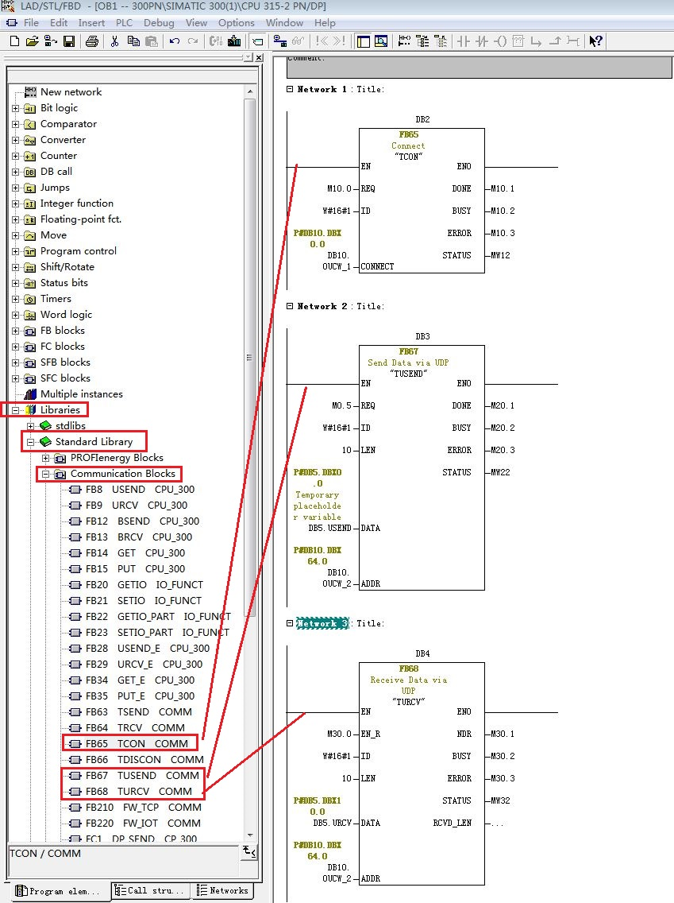
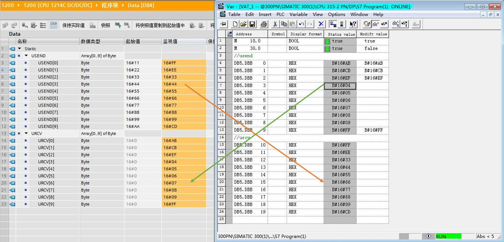

### S7-1200 与 S7-300 PN/S7-400 PN UDP STEP7 通信

S7-1200 与 S7-300 PN 口之间的以太网通信可以通过 UDP
协议来实现，使用的通信指令是在双方 CPU
调用通信-开放式用户通信TSEND_C，TRCV_C（1200支持，300不支持）或TCON，TDISCON，TUSEND，TURCV
指令来实现。通信方式为双边通信，因此 TUSEND 和 TURCV 必须成对出现。

此外对于伙伴是S7-400PN 也可以参考本文档。

### 硬件和软件需求及所完成的通信任务

**测试软/硬件：**

① S7-1214 DC/DC/DC V4.4

② S7-315-2PN/DP V2.6

③ STEP7 V16

④ STEP7 V5.5 SP4

**所完成的通信任务：**

① S7-1200 CPU将通讯数据区 DB4 块中的 10 个字节的数据发送到 S7-300
CPU的接收数据区 DB5 块中。

② S7-300 CPU将通讯数据区 DB5 块中的 10 个字节的数据发送到 S7-1200
CPU的接收数据区 DB4 块中。

### S7-1200 侧硬件组态、编程和连接参数的配置

该部分内容和 S7-1200 CPU 与S7-300 PN UDP通信-TIA不同项目-\>S7-1200
侧硬件组态、编程和连接参数的配置 章节一致，请参见[链接](02-Diff.html)。

### S7-300PN 侧硬件组态、编程和连接参数的配置

**1.Step7内添加300CPU硬件**

在硬件配置内添加300机架和315-2PN/DP CPU，如图1所示。

{width="737" height="708"}

图1. 添加300 CPU设备

为了编程方便，使用 CPU 属性中定义的时钟位，定义方法如下：

双击硬件配置机架内的CPU 315-2PN/DP ，进入CPU属性设置，选择Cycle/Clock
Memory，然后激活Clock memory时钟字节定义为 MB0，如图2所示。

时钟位使用 M0.5，以 1Hz 的速率自动激活发送任务。

{width="526" height="439"}

图2. 启动时钟存储器

**2.为 PROFINET 通信口分配以太网地址**

双击PN-IO设置CPU IP地址，分配 IP 地址为
192.168.0.3，子网掩码为255.255.255.0，如图3所示。

{width="709" height="816"}

图3. 分配300CPU IP 地址

**3.在Step7内使用OC Wizard向导生成UDP连接参数DB块**

①按照如下链接下载并安装OC Wizard向导。

[创建用于开放式 TCP/IP 通信的连接数据的向导
(开放式通信向导)。](https://support.industry.siemens.com/cs/cn/zh/view/98957840)

② 在Step7程序块文件夹空白处右键，启动OC
Wizard向导生成UDP连接参数DB块，如图4所示。

{width="1234" height="888"}

图4. 启动OC Wizard向导

③选择新建，点击下一步,如图5所示。

{width="503" height="375"}

图5. 新建UDP连接数据DB

④连接类型选择UDP，如图6所示。

{width="504" height="376"}

图6. 选择UDP连接类型

⑤设置UDP连接ID号、连接名称、本地PLC类型和设置伙伴IP地址，如图7所示。

{width="502" height="378"}

图7. 配置UDP本地和伙伴连接信息

⑥配置本地和伙伴端口号，如图8所示。

{width="503" height="377"}

图8. 配置本地和伙伴端口号

⑦指定Step7项目内一个DB块，用来存放UDP连接配置数据，项目使用DB10，如图9所示。

{width="503" height="376"}

图9. 指定DB块存放连接配置数据

⑧UDP连接配置数据生成完毕，生成的数据块为DB10，DB10数据结构，如图为10所示。

{width="918" height="730"}

图10. UDP连接配置数据结构

**4.在 OB1 内调用 UDP 通信指令**

打开OB1，在作出指令树内调用UDP通信指令， "库" \> "标准库" \>
"通信块"下调用 "TCON"、"TUSEND"、"TURCV" 指令。创建接收和发送数据块
DB5，发送10字节数组，接收10字节数组，如图11所示。

{width="849" height="1136"}

图11. 从库内调用 UDP 通信指令

300CPU侧配置和编程完成，编译并存盘。

### 下载硬件组态及程序并监控通信结果

下载两个 CPU 中的所有硬件组态及程序，实现 两个 CPU
之间数据交换，监控结果如图12所示。

{width="1265" height="610"}

图12. 监控结果

### 附加说明

如果通信异常，请参考以下附加说明：[链接](04-Additional.html)。
