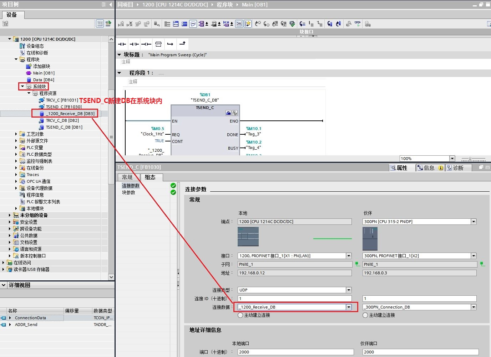
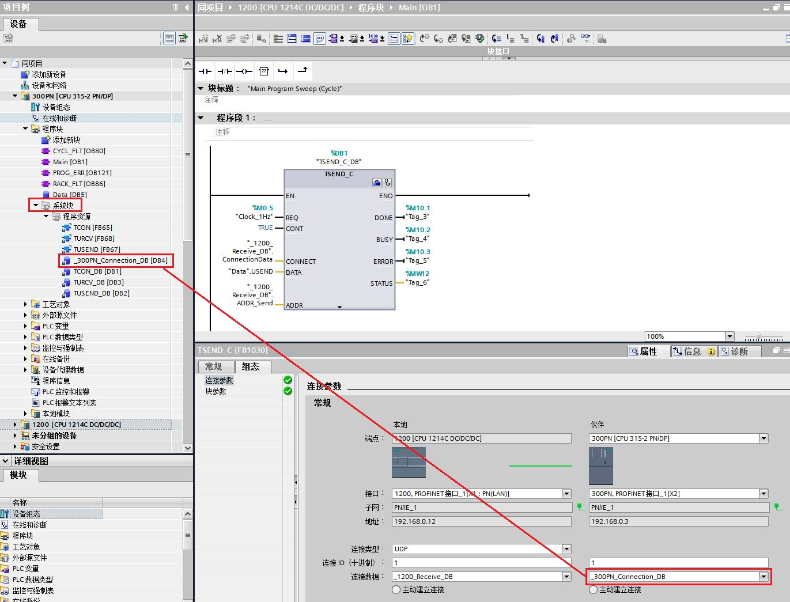
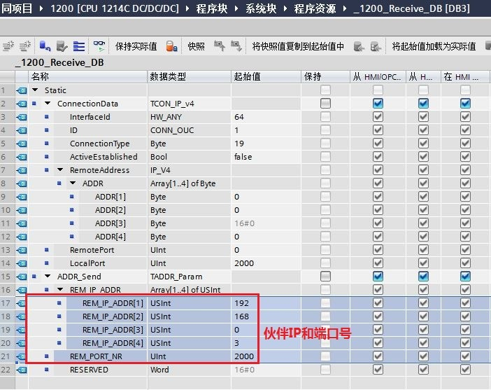
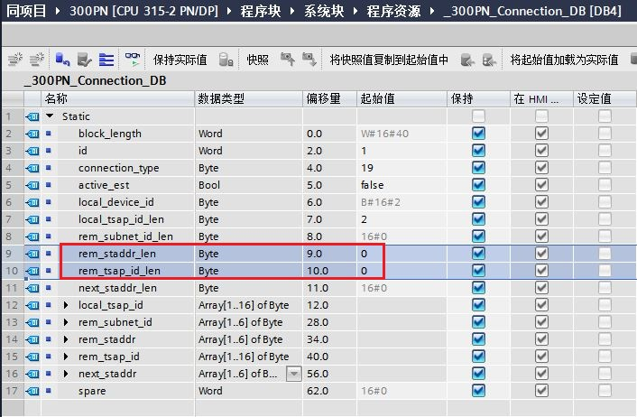

### S7-1200 与 S7-300 PN/S7-400 PN UDP 通信附加说明

以下情况时需要注意确认部分参数的正确设置。

①1200侧同时使用TSEND_C和TRCV_C做指定或未指定伙伴UDP通信，参考图3确认参数的正确设置；\
②在1200内使用TSEND_C新建自动生成300PLC连接描述DB块，参考图4确认参数的正确设置；

**需确认注意的参数设置：**

1.在1200侧使用TSEND_C可新建自动生成1200PLC的连接描述DB块（\_1200_Receive_DB），如图1所示和300PLC的连接描述DB块(\_300PN_Connection_DB），如图2所示。

{width="1376" height="1002"}

图1. TSEND_C新建自动生成1200PLC的连接描述DB块

{width="1371" height="1045"}

图2. TSEND_C新建自动生成300PLC的连接描述DB块

2.确认TSEND_C新建自动生成1200PLC的连接描述DB块内，**ADDR_Send数据结构必需包含伙伴IP地址和端口号**，如图3所示。

{width="702" height="557"}

图3. 确认1200侧新建生成DB内包含伙伴IP和端口号

3.确认TSEND_C新建自动生成300PLC的连接描述DB块内，**rem_staddr_len和rem_tsap_id_len参数必需设置为0**，如图4所示。

{width="706" height="462"}

图4. 确认300侧新建生成DB内rem_staddr_len和rem_tsap_id_len参数必需为0
