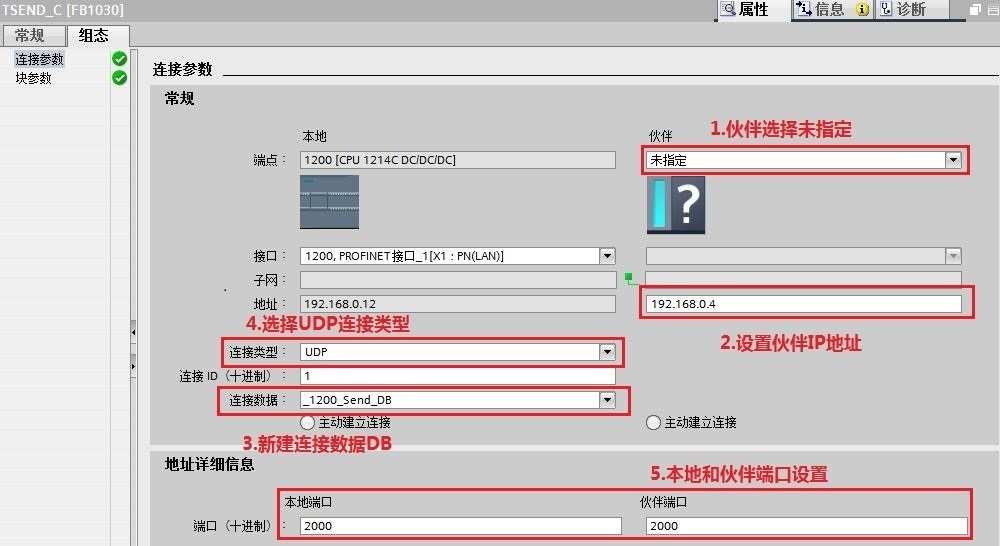
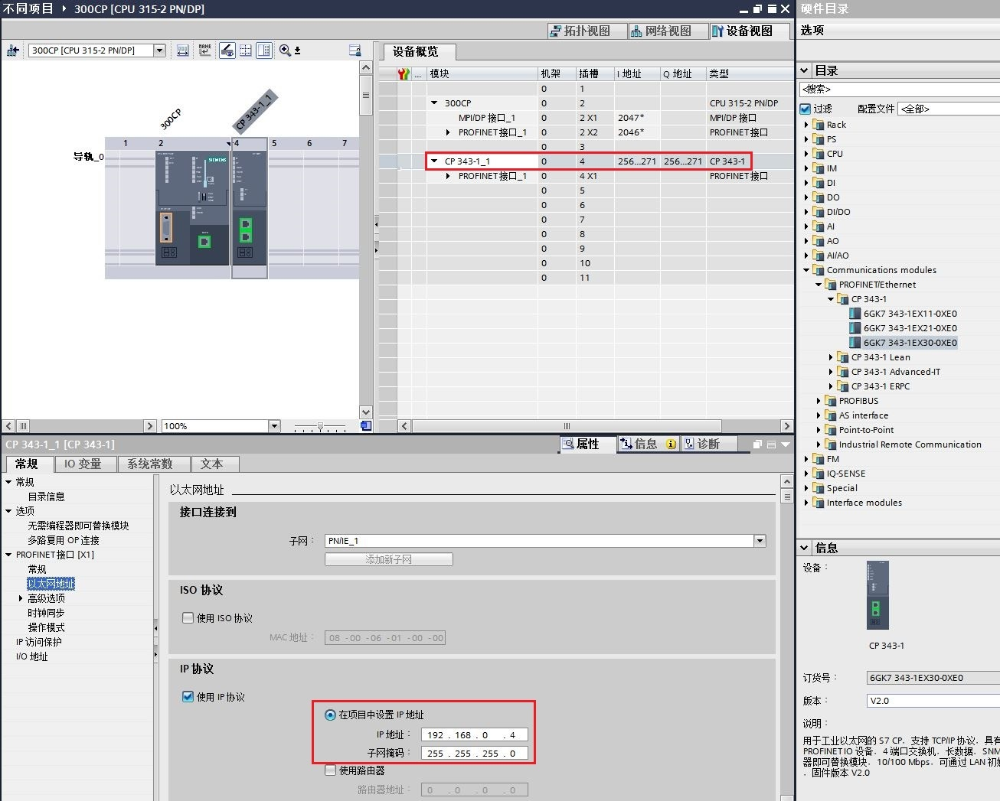
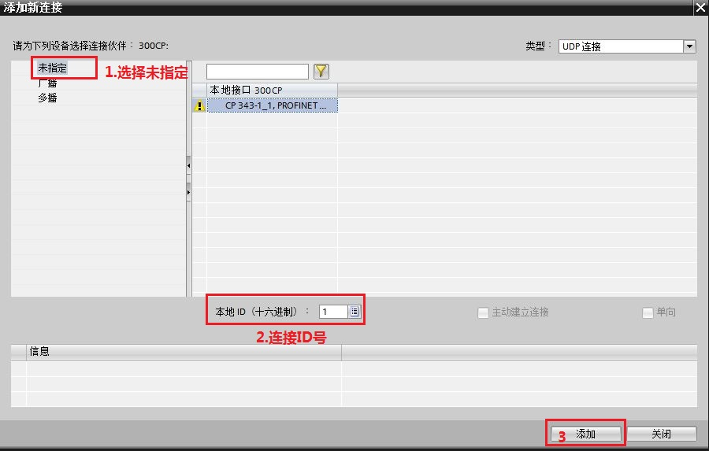
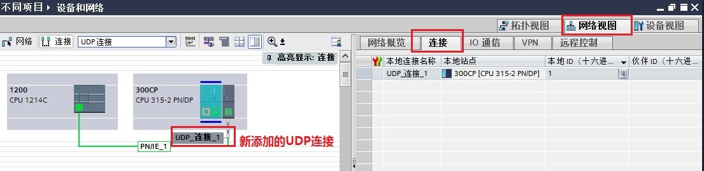
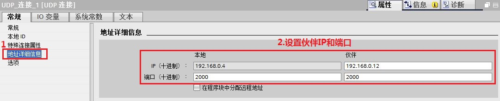

### S7-1200 CPU 与S7-300 CP TIA UDP通信

S7-1200 与 S7-300 CP 之间的以太网通信可以通过 UDP
协议来实现，使用的通信指令是在S7-1200 CPU
侧调用通信-开放式用户通信TSEND_C，TRCV_C指令或TCON，TDISCON，TUSEND，TURCV
指令,在 S7-300 CPU 侧调用 AG-SEND, AG-RECV 指令来实现。

此外对于伙伴是S7-400 CP也可以参考本文档。

### 硬件和软件需求及所完成的通信任务

**测试软/硬件：**

① S7-1214 DC/DC/DC V4.4

② S7-315-2PN/DP V2.6

③ S7-300 CP343-1 V2.0

④ STEP7 V16

**所完成的通信任务：**

① S7-1200 CPU将通讯数据区 DB4 块中的 10 个字节的数据发送到 S7-300
CPU的接收数据区 DB5 块中。

② S7-300 CPU将通讯数据区 DB5 块中的 10 个字节的数据发送到 S7-1200
CPU的接收数据区 DB4 块中。

### S7-1200 侧硬件组态、编程和连接参数的配置

该部分内容和 S7-1200 CPU 与S7-300 PN UDP通信-TIA不同项目-\>S7-1200
侧硬件组态、编程和连接参数的配置
章节基本一致，请参考[链接](../01-S7-300PN/02-Diff.html)。

不同地方在于使用TSEND_C设置的伙伴IP地址和端口号（如对方CP343-1 的
IP：192.168.0.4，端口号：2000），如图1所示。

{width="1000" height="546"}

图1. 通过 TSEND_C 配置伙伴IP地址和端口号

### S7-300CP 侧硬件组态、编程和连接参数的配置

**1.添加300CPU和CP343-1硬件并命名PLC**

然后进入 "项目视图"，在"项目树" 下双击
"添加新设备"，在对话框中选择所使用的 S7-300 CPU 添加到机架上，命名为
300CP，如图2所示。

{width="706" height="683"}

图2. 添加300 CPU设备

为了编程方便，使用 CPU 属性中定义的时钟位，定义方法如下：

在 "项目树" \> "300PN" \> "设备组态" 中，选中 CPU
，然后在下面的属性窗口中，"属性" \> "时钟存储器" 下时钟字节定义在
MB0，如图3所示。

时钟位使用 M0.5，以 1Hz 的速率自动激活发送任务。

{width="628" height="367"}

图3. 启动时钟存储器

**2.组态CP343-1并配以太网地址**

在 "设备视图"中点击 CP 上代表 PROFINET 通信口的绿色小方块，在下方会出现
PROFINET 接口的属性，在 "以太网地址" 下分配 IP 地址为
192.168.0.4，子网掩码为255.255.255.0，如图4所示。

{width="1306" height="1047"}

图4. 分配300CP IP 地址

**3.网络视图内组态UDP连接**

①点击设备和网络，在网络视图内在300CPU侧新建UDP连接，如图5所示。注意是在CPU上右键添加新连接，而不是CP上添加新连接。

{width="886" height="837"}

图5. 300CPU侧新建UDP连接

②选择未指定的伙伴，确认连接ID号，然后确定，如图6所示。注意本地接口选择CP343-1。

{width="900" height="573"}

图6. 新建未指定UDP连接

③添加完成后，在网络视图-连接内可以查看新建的连接。点击新建的UDP连接可进一步设置UDP连接参数，
如图7所示。

{width="1105" height="270"}

图7. 查看新建的UDP连接

④连接的常规-属性内，设置新建连接的本地ID和伙伴IP及端口，如图8-9所示。

{width="1079" height="238"}

图8.设置连接的本地ID

{width="1081" height="219"}

图9.设置连接的伙伴IP及端口号

**4.在 S7-300 中调用通信指令**

在OB1中，从"指令"\>"通信 "\>"通信处理器 "\>"SIMATIC NET
CP"下，调用"AG_SEND" 、"AG_RECV "通信指令。创建接收和发送数据块
DB5，发送10字节数组，接收10字节数组， 如图10所示。

{width="996" height="685"}

图10. 调用AG_SEND和AG_RECV指令

**指令管脚参数说明：**

  ---------------- ---------------- --------------------------------------------
  CALL "AG_SEND"                    // 调用 AG_SEND
  ACT 　           :=%M0.5          // 使用 1Hz 的时钟脉冲，上升沿激活发送任务
  ID               :=1              // 连接号，要与连接配置中一致
  LADDR            :=W#16#100       // CP 的地址，要与配置中一致见图8，块参数
  SEND             :="Data".usend   // 发送数据区
  LEN              :=10             // 发送数据的长度
  DONE             :=%M10.1         // 为1时，发送完成
  ERROR            :=%M10.2         // 为1时，有故障发生
  STATUS           :=%MW12          // 状态代码
  ---------------- ---------------- --------------------------------------------

  ----------------- --------------- -------------------------------------------
  CALL " AG_RECV"                   // 调用 AG_RECV
  ID                :=1             // 连接号，要与连接配置列表中一致，
  LADDR             :=W#16#100      // CP 的地址，要与配置中一致见图8，块参数
  RECV 　           :="Data".urcv   // 接收数据区
  NDR               :=%M20.0        // 为1时，接收到新数据
  ERROR             :=%M20.1        // 为1时，有故障发生
  STATUS            :=%MW22         // 状态代码
  LEN               :=%MW24         // 接收到的实际数据长度
  ----------------- --------------- -------------------------------------------

300CPU侧配置和编程完成，编译并存盘。

### 下载硬件组态及程序并监控通信结果

下载两个 CPU 中的所有硬件组态及程序，实现 两个 CPU
之间数据交换，监控结果如图11所示。

{width="1144" height="550"}

图11. 监控结果
