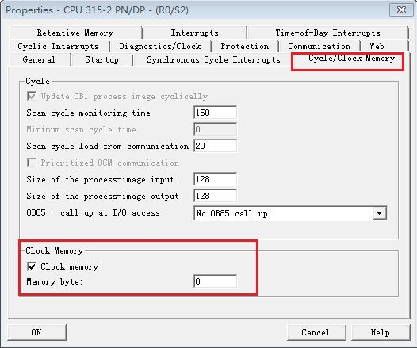

### S7-1200 CPU 与S7-300 CP STEP7 UDP通信

S7-1200 与 S7-300 CP 之间的以太网通信可以通过 UDP
协议来实现，使用的通信指令是在S7-1200 CPU
侧调用通信-开放式用户通信TSEND_C，TRCV_C指令或TCON，TDISCON，TUSEND，TURCV
指令,在 S7-300 CPU 侧调用 AG-SEND, AG-RECV 指令来实现。

此外对于伙伴是S7-400 CP也可以参考本文档。

### 硬件和软件需求及所完成的通信任务

**测试软/硬件：**

① S7-1214 DC/DC/DC V4.4

② S7-315-2PN/DP V2.6

③S7-300 CP343-1 V2.0

④STEP7 V16

⑤STEP7 V5.5 SP4

**所完成的通信任务：**

① S7-1200 CPU将通讯数据区 DB4 块中的 10 个字节的数据发送到 S7-300
CPU的接收数据区 DB5 块中。

② S7-300 CPU将通讯数据区 DB5 块中的 10 个字节的数据发送到 S7-1200
CPU的接收数据区 DB4 块中。

### S7-1200 侧硬件组态、编程和连接参数的配置

该部分内容和 S7-1200 CPU 与S7-300 CP UDP通信-TIA不同项目-\>S7-1200
侧硬件组态、编程和连接参数的配置章节一致，请参见[链接](01-TIA.html)。

### S7-300CP 侧硬件组态、编程和连接参数的配置

**1.添加300CPU和CP343-1硬件**

在硬件配置内添加300机架，在300机架内添加315-2PN/DP
CPU和CP343-1，如图1所示。

{width="779" height="712"}

图1. 添加300 CPU和CP343-1设备

为了编程方便，使用 CPU 属性中定义的时钟位，定义方法如下：

双击硬件配置机架内的CPU 315-2PN/DP ，进入CPU属性设置，选择Cycle/Clock
Memory，然后激活Clock memory时钟字节定义为 MB0，如图2所示。

时钟位使用 M0.5，以 1Hz 的速率自动激活发送任务。

{width="526" height="439"}

图2. 启动时钟存储器

**2.组态CP343-1并配以太网地址**

双击CP343-1设置CP IP地址，分配 IP 地址为
192.168.0.4，子网掩码为255.255.255.0，如图3所示。

{width="624" height="829"}

图3. 分配300CP IP 地址

**3.在Netpro内组态UDP连接**

①硬件配置完毕后，点击Netpro图标，如图1所示。进入Netpro组态UDP连接，如图4所示。

{width="547" height="399"}

图4. Netpro内新建UDP连接

②选择未指定的伙伴，然后确定，如图5所示。

{width="363" height="480"}

图5. 新建未指定UDP连接

③添加完成后，可进一步设置UDP连接参数， 如图6所示。

{width="473" height="355"}

图6. 查看新建的UDP连接

④连接的属性-地址内，设置新建连接的本地ID和伙伴IP及端口，如图7所示。

{width="475" height="357"}

图7.设置连接伙伴IP及端口号

⑤300侧新建UDP连接配置完毕，如图8所示。

{width="1094" height="535"}

图8.Netpro内新建的UDP连接

**4.在 S7-300 中调用通信指令**

打开OB1，在作出指令树内调用UDP通信指令， "库" \> "SIMATIC_NET_CP" \>
"CP300"下，调用 "AG_SEND" 、"AG_RECV" 指令。创建接收和发送数据块
DB5，发送10字节数组，接收10字节数组，如图9所示。

{width="787" height="966"}

图9. 调用AG_SEND和AG_RECV指令

**指令管脚参数说明：**

  ---------------- ---------------- --------------------------------------------
  CALL "AG_SEND"                    // 调用 AG_SEND
  ACT 　           :=%M0.5          // 使用 1Hz 的时钟脉冲，上升沿激活发送任务
  ID               :=1              // 连接号，要与连接配置中一致
  LADDR            :=W#16#100       // CP 的地址，要与配置中一致见图8，块参数
  SEND             :="Data".usend   // 发送数据区
  LEN              :=10             // 发送数据的长度
  DONE             :=%M10.1         // 为1时，发送完成
  ERROR            :=%M10.2         // 为1时，有故障发生
  STATUS           :=%MW12          // 状态代码
  ---------------- ---------------- --------------------------------------------

  ----------------- ---------------- -------------------------------------------
  CALL " AG_RECV"                    // 调用 AG_RECV
  ID                :=1              // 连接号，要与连接配置列表中一致，
  LADDR             :=W#16#100       // CP 的地址，要与配置中一致见图8，块参数
  RECV 　           :=="Data".urcv   // 接收数据区
  NDR               :=%M20.0         // 为1时，接收到新数据
  ERROR             :=%M20.1         // 为1时，有故障发生
  STATUS            :=%MW22          // 状态代码
  LEN               :=%MW24          // 接收到的实际数据长度
  ----------------- ---------------- -------------------------------------------

300CPU侧配置和编程完成，编译并存盘。

### 下载硬件组态及程序并监控通信结果

下载两个 CPU 中的所有硬件组态及程序，实现 两个 CPU
之间数据交换，监控结果如图10所示。

{width="1265" height="568"}

图10. 监控结果
